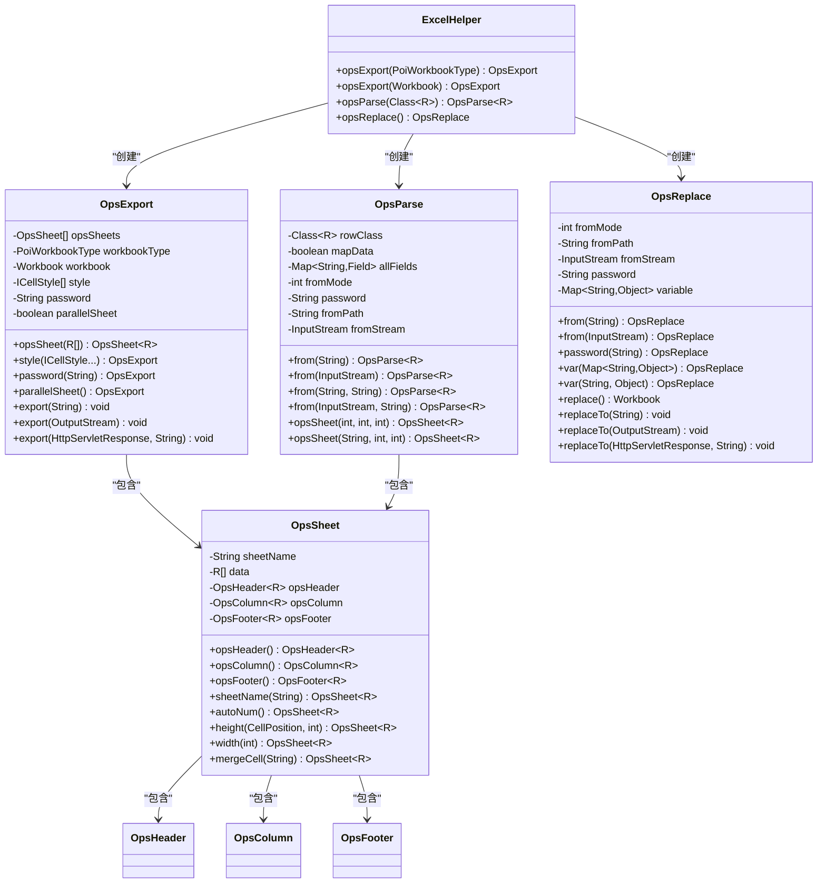
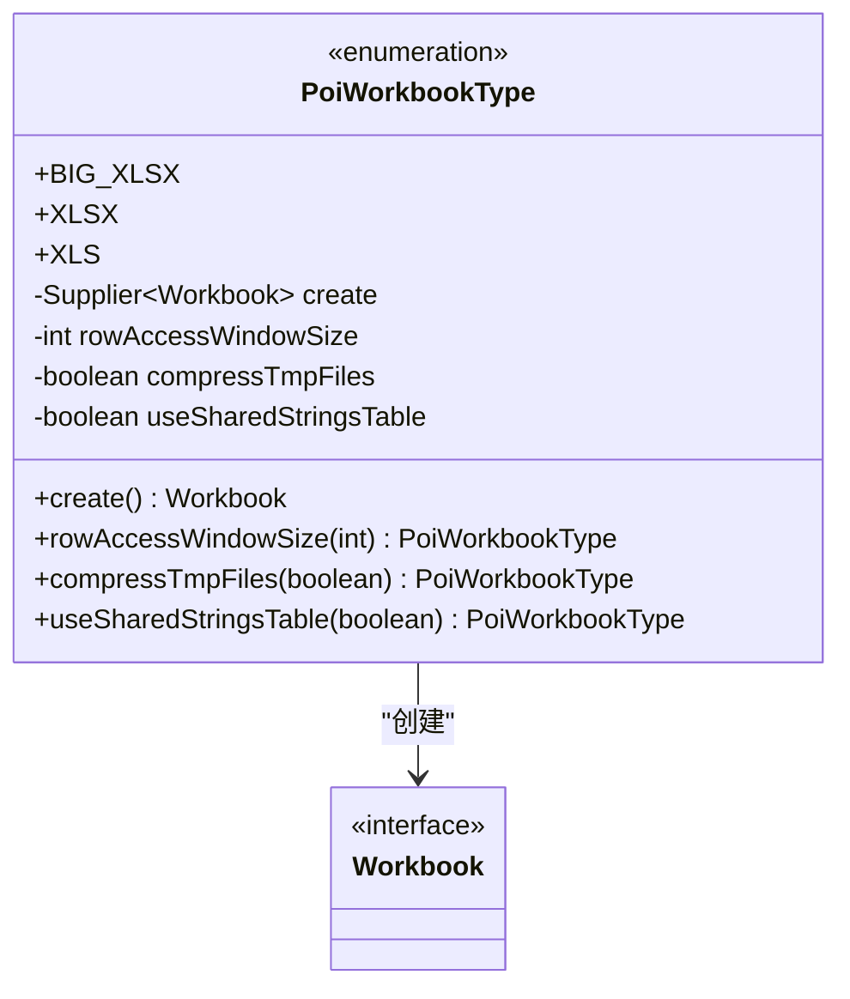
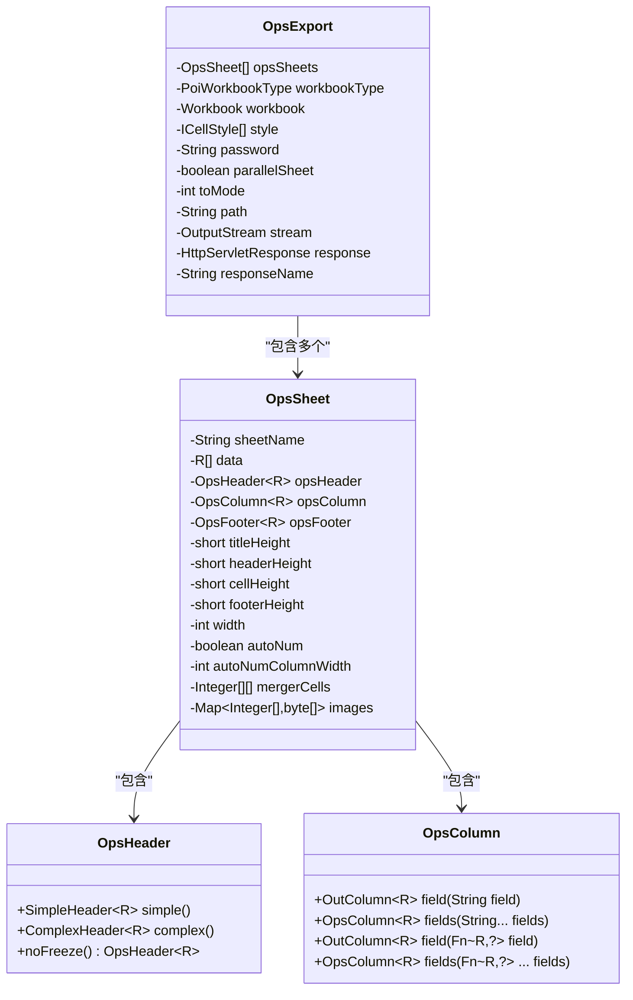
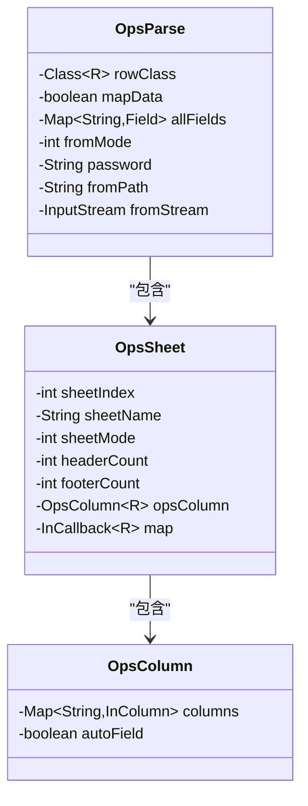
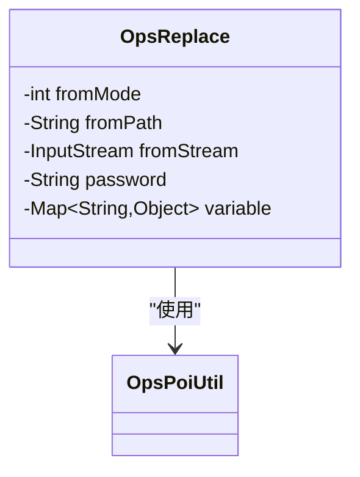

基于我对poi-excel项目的深入分析，我现在可以创建详尽的API参考文档。以下是我整理的内容：

<docs>
# poi-excel API参考文档

<cite>
**本文档中引用的文件**
- [ExcelHelper.java](file://src/main/java/com/github/stupdit1t/excel/core/ExcelHelper.java)
- [PoiWorkbookType.java](file://src/main/java/com/github/stupdit1t/excel/common/PoiWorkbookType.java)
- [OpsExport.java](file://src/main/java/com/github/stupdit1t/excel/core/export/OpsExport.java)
- [OpsParse.java](file://src/main/java/com/github/stupdit1t/excel/core/parse/OpsParse.java)
- [OpsReplace.java](file://src/main/java/com/github/stupdit1t/excel/core/replace/OpsReplace.java)
- [OpsSheet.java](file://src/main/java/com/github/stupdit1t/excel/core/export/OpsSheet.java)
- [OpsHeader.java](file://src/main/java/com/github/stupdit1t/excel/core/export/OpsHeader.java)
- [OpsColumn.java](file://src/main/java/com/github/stupdit1t/excel/core/export/OpsColumn.java)
- [OutColumn.java](file://src/main/java/com/github/stupdit1t/excel/core/export/OutColumn.java)
- [OpsSheet.java](file://src/main/java/com/github/stupdit1t/excel/core/parse/OpsSheet.java)
- [OpsColumn.java](file://src/main/java/com/github/stupdit1t/excel/core/parse/OpsColumn.java)
- [AbsParent.java](file://src/main/java/com/github/stupdit1t/excel/core/AbsParent.java)
- [OutCallback.java](file://src/main/java/com/github/stupdit1t/excel/callback/OutCallback.java)
- [InCallback.java](file://src/main/java/com/github/stupdit1t/excel/callback/InCallback.java)
- [ICellStyle.java](file://src/main/java/com/github/stupdit1t/excel/style/ICellStyle.java)
</cite>

## 目录
1. [简介](#简介)
2. [核心类架构](#核心类架构)
3. [ExcelHelper静态工厂方法](#excelhelper静态工厂方法)
4. [PoiWorkbookType枚举](#poiworkbooktype枚举)
5. [OpsExport导出操作类](#opsexport导出操作类)
6. [OpsParse解析操作类](#opsparse解析操作类)
7. [OpsReplace替换操作类](#opsreplace替换操作类)
8. [链式调用方法详解](#链式调用方法详解)
9. [回调接口](#回调接口)
10. [样式系统](#样式系统)
11. [使用示例](#使用示例)
12. [最佳实践](#最佳实践)

## 简介

poi-excel是一个基于Apache POI的Java Excel操作库，提供了简洁而强大的API来处理Excel文件的导入、导出和替换操作。该库采用链式调用设计，通过静态工厂方法和一系列专门的操作类，使开发者能够轻松地构建复杂的Excel处理流程。

## 核心类架构



**图表来源**
- [ExcelHelper.java](file://src/main/java/com/github/stupdit1t/excel/core/ExcelHelper.java#L1-L54)
- [OpsExport.java](file://src/main/java/com/github/stupdit1t/excel/core/export/OpsExport.java#L1-L200)
- [OpsParse.java](file://src/main/java/com/github/stupdit1t/excel/core/parse/OpsParse.java#L1-L145)
- [OpsReplace.java](file://src/main/java/com/github/stupdit1t/excel/core/replace/OpsReplace.java#L1-L168)

## ExcelHelper静态工厂方法

ExcelHelper是整个库的入口点，提供了四个静态工厂方法来创建不同类型的Excel操作实例。

### opsExport(PoiWorkbookType workbookType)

**方法签名：**
```java
public static OpsExport opsExport(PoiWorkbookType workbookType)
```

**参数说明：**
- `workbookType`: 指定工作簿类型，支持XLS、XLSX和BIG_XLSX三种格式

**返回类型：**
- `OpsExport`: 导出操作实例

**使用示例：**
```java
// 创建XLSX格式的导出实例
OpsExport export = ExcelHelper.opsExport(PoiWorkbookType.XLSX);

// 创建大数据格式的导出实例
OpsExport bigExport = ExcelHelper.opsExport(PoiWorkbookType.BIG_XLSX);
```

### opsExport(Workbook workbook)

**方法签名：**
```java
public static OpsExport opsExport(Workbook workbook)
```

**参数说明：**
- `workbook`: 已存在的Apache POI Workbook实例

**返回类型：**
- `OpsExport`: 导出操作实例

**使用示例：**
```java
// 使用已有的XSSFWorkbook
XSSFWorkbook workbook = new XSSFWorkbook();
OpsExport export = ExcelHelper.opsExport(workbook);
```

### opsParse(Class<R> rowClass)

**方法签名：**
```java
public static <R> OpsParse<R> opsParse(Class<R> rowClass)
```

**泛型参数：**
- `R`: 数据模型类，用于指定导入数据的类型

**参数说明：**
- `rowClass`: 数据模型的Class对象

**返回类型：**
- `OpsParse<R>`: 解析操作实例

**使用示例：**
```java
// 导入Student对象列表
OpsParse<Student> parse = ExcelHelper.opsParse(Student.class);

// 导入Map数据
OpsParse<Map<String, Object>> mapParse = ExcelHelper.opsParse(Map.class);
```

### opsReplace()

**方法签名：**
```java
public static OpsReplace opsReplace()
```

**返回类型：**
- `OpsReplace`: 替换操作实例

**使用示例：**
```java
// 创建变量替换实例
OpsReplace replace = ExcelHelper.opsReplace();
```

**章节来源**
- [ExcelHelper.java](file://src/main/java/com/github/stupdit1t/excel/core/ExcelHelper.java#L1-L54)

## PoiWorkbookType枚举

PoiWorkbookType枚举定义了支持的工作簿类型及其特性配置。

### 枚举值及特性



**图表来源**
- [PoiWorkbookType.java](file://src/main/java/com/github/stupdit1t/excel/common/PoiWorkbookType.java#L1-L107)

### BIG_XLSX

**描述：** 大数据工作簿，适用于处理超大Excel文件

**特性：**
- 速度较慢
- 解决VM内存不足问题
- 单sheet最大1048576行
- 内存行数默认200行

**适用场景：**
- 处理包含大量数据的Excel文件
- 内存受限环境下的大数据处理
- 需要流式处理的场景

### XLSX

**描述：** 标准Excel 2007+格式

**特性：**
- 速度较慢
- 单sheet最大1048576行
- 支持丰富的格式和功能

**适用场景：**
- 标准Excel格式需求
- 需要高级格式功能
- 中等规模数据处理

### XLS

**描述：** 旧版Excel 97-2003格式

**特性：**
- 速度较快
- 单sheet最大65535行
- 兼容性好

**适用场景：**
- 需要兼容旧版Excel的应用
- 小规模数据处理
- 性能要求较高的场景

### 配置方法

#### rowAccessWindowSize(int rowAccessWindowSize)

**方法签名：**
```java
public PoiWorkbookType rowAccessWindowSize(int rowAccessWindowSize)
```

**参数说明：**
- `rowAccessWindowSize`: 内存中保持的行数，默认200行

**返回类型：**
- `PoiWorkbookType`: 当前枚举实例

**使用示例：**
```java
PoiWorkbookType type = PoiWorkbookType.BIG_XLSX
    .rowAccessWindowSize(500); // 设置更大的内存行数
```

#### compressTmpFiles(boolean compressTmpFiles)

**方法签名：**
```java
public PoiWorkbookType compressTmpFiles(boolean compressTmpFiles)
```

**参数说明：**
- `compressTmpFiles`: 是否对临时文件使用gzip压缩，默认false

**返回类型：**
- `PoiWorkbookType`: 当前枚举实例

**使用示例：**
```java
PoiWorkbookType type = PoiWorkbookType.BIG_XLSX
    .compressTmpFiles(true); // 启用临时文件压缩
```

#### useSharedStringsTable(boolean useSharedStringsTable)

**方法签名：**
```java
public PoiWorkbookType useSharedStringsTable(boolean useSharedStringsTable)
```

**参数说明：**
- `useSharedStringsTable`: 是否使用共享字符串表，默认false

**返回类型：**
- `PoiWorkbookType`: 当前枚举实例

**使用示例：**
```java
PoiWorkbookType type = PoiWorkbookType.BIG_XLSX
    .useSharedStringsTable(true); // 启用共享字符串表
```

**章节来源**
- [PoiWorkbookType.java](file://src/main/java/com/github/stupdit1t/excel/common/PoiWorkbookType.java#L1-L107)

## OpsExport导出操作类

OpsExport是负责Excel导出的核心类，提供了完整的导出功能链式调用接口。

### 主要属性



**图表来源**
- [OpsExport.java](file://src/main/java/com/github/stupdit1t/excel/core/export/OpsExport.java#L1-L200)
- [OpsSheet.java](file://src/main/java/com/github/stupdit1t/excel/core/export/OpsSheet.java#L1-L199)

### 核心方法

#### opsSheet(List<R> data)

**方法签名：**
```java
public <R> OpsSheet<R> opsSheet(List<R> data)
```

**参数说明：**
- `data`: 要导出的数据列表

**返回类型：**
- `OpsSheet<R>`: 新创建的Sheet操作实例

**使用示例：**
```java
List<Student> students = getStudents();
OpsSheet<Student> sheet = export.opsSheet(students);
```

#### style(ICellStyle... styles)

**方法签名：**
```java
public OpsExport style(ICellStyle... styles)
```

**参数说明：**
- `styles`: 全局单元格样式数组

**返回类型：**
- `OpsExport`: 当前实例

**使用示例：**
```java
OpsExport export = ExcelHelper.opsExport(PoiWorkbookType.XLSX)
    .style(DefaultCellStyleEnum.values());
```

#### password(String password)

**方法签名：**
```java
public OpsExport password(String password)
```

**参数说明：**
- `password`: Excel文件密码

**返回类型：**
- `OpsExport`: 当前实例

**使用示例：**
```java
OpsExport export = ExcelHelper.opsExport(PoiWorkbookType.XLS)
    .password("secret");
```

#### parallelSheet()

**方法签名：**
```java
public OpsExport parallelSheet()
```

**返回类型：**
- `OpsExport`: 当前实例

**使用示例：**
```java
OpsExport export = ExcelHelper.opsExport(PoiWorkbookType.XLSX)
    .parallelSheet(); // 启用并行导出
```

#### export(String toPath)

**方法签名：**
```java
public void export(String toPath)
```

**参数说明：**
- `toPath`: 输出文件路径

**使用示例：**
```java
export.export("output.xlsx");
```

#### export(OutputStream toStream)

**方法签名：**
```java
public void export(OutputStream toStream)
```

**参数说明：**
- `toStream`: 输出流

**使用示例：**
```java
ByteArrayOutputStream outputStream = new ByteArrayOutputStream();
export.export(outputStream);
```

#### export(HttpServletResponse toResponse, String fileName)

**方法签名：**
```java
public void export(HttpServletResponse toResponse, String fileName)
```

**参数说明：**
- `toResponse`: HTTP响应对象
- `fileName`: 输出文件名

**使用示例：**
```java
export.export(response, "report.xlsx");
```

**章节来源**
- [OpsExport.java](file://src/main/java/com/github/stupdit1t/excel/core/export/OpsExport.java#L1-L339)

## OpsParse解析操作类

OpsParse是负责Excel数据解析的核心类，提供了灵活的数据导入功能。

### 主要属性



**图表来源**
- [OpsParse.java](file://src/main/java/com/github/stupdit1t/excel/core/parse/OpsParse.java#L1-L145)
- [OpsSheet.java](file://src/main/java/com/github/stupdit1t/excel/core/parse/OpsSheet.java#L1-L199)

### 核心方法

#### from(String path)

**方法签名：**
```java
public OpsParse<R> from(String path)
```

**参数说明：**
- `path`: Excel文件路径

**返回类型：**
- `OpsParse<R>`: 当前实例

**使用示例：**
```java
OpsParse<Student> parse = ExcelHelper.opsParse(Student.class)
    .from("students.xlsx");
```

#### from(InputStream inputStream)

**方法签名：**
```java
public OpsParse<R> from(InputStream inputStream)
```

**参数说明：**
- `inputStream`: Excel文件输入流

**返回类型：**
- `OpsParse<R>`: 当前实例

**使用示例：**
```java
try (InputStream inputStream = new FileInputStream("students.xlsx")) {
    OpsParse<Student> parse = ExcelHelper.opsParse(Student.class)
        .from(inputStream);
}
```

#### from(String path, String password)

**方法签名：**
```java
public OpsParse<R> from(String path, String password)
```

**参数说明：**
- `path`: Excel文件路径
- `password`: 文件密码

**返回类型：**
- `OpsParse<R>`: 当前实例

**使用示例：**
```java
OpsParse<Student> parse = ExcelHelper.opsParse(Student.class)
    .from("protected.xlsx", "password");
```

#### from(InputStream inputStream, String password)

**方法签名：**
```java
public OpsParse<R> from(InputStream inputStream, String password)
```

**参数说明：**
- `inputStream`: Excel文件输入流
- `password`: 文件密码

**返回类型：**
- `OpsParse<R>`: 当前实例

**使用示例：**
```java
try (InputStream inputStream = new FileInputStream("protected.xlsx")) {
    OpsParse<Student> parse = ExcelHelper.opsParse(Student.class)
        .from(inputStream, "password");
}
```

#### opsSheet(int sheetIndex, int headerCount, int footerCount)

**方法签名：**
```java
public OpsSheet<R> opsSheet(int sheetIndex, int headerCount, int footerCount)
```

**参数说明：**
- `sheetIndex`: Sheet索引（从0开始）
- `headerCount`: 表头行数
- `footerCount`: 尾部行数

**返回类型：**
- `OpsSheet<R>`: Sheet操作实例

**使用示例：**
```java
OpsSheet<Student> sheet = parse.opsSheet(0, 1, 0);
```

#### opsSheet(String sheetName, int headerCount, int footerCount)

**方法签名：**
```java
public OpsSheet<R> opsSheet(String sheetName, int headerCount, int footerCount)
```

**参数说明：**
- `sheetName`: Sheet名称
- `headerCount`: 表头行数
- `footerCount`: 尾部行数

**返回类型：**
- `OpsSheet<R>`: Sheet操作实例

**使用示例：**
```java
OpsSheet<Student> sheet = parse.opsSheet("学生信息", 1, 0);
```

**章节来源**
- [OpsParse.java](file://src/main/java/com/github/stupdit1t/excel/core/parse/OpsParse.java#L1-L145)

## OpsReplace替换操作类

OpsReplace是负责Excel模板变量替换的核心类，提供了便捷的模板处理功能。

### 主要属性



**图表来源**
- [OpsReplace.java](file://src/main/java/com/github/stupdit1t/excel/core/replace/OpsReplace.java#L1-L168)

### 核心方法

#### from(String path)

**方法签名：**
```java
public OpsReplace from(String path)
```

**参数说明：**
- `path`: 模板文件路径

**返回类型：**
- `OpsReplace`: 当前实例

**使用示例：**
```java
OpsReplace replace = ExcelHelper.opsReplace()
    .from("template.xlsx");
```

#### from(InputStream inputStream)

**方法签名：**
```java
public OpsReplace from(InputStream inputStream)
```

**参数说明：**
- `inputStream`: 模板文件输入流

**返回类型：**
- `OpsReplace`: 当前实例

**使用示例：**
```java
try (InputStream inputStream = new FileInputStream("template.xlsx")) {
    OpsReplace replace = ExcelHelper.opsReplace()
        .from(inputStream);
}
```

#### password(String password)

**方法签名：**
```java
public OpsReplace password(String password)
```

**参数说明：**
- `password`: 模板文件密码

**返回类型：**
- `OpsReplace`: 当前实例

**使用示例：**
```java
OpsReplace replace = ExcelHelper.opsReplace()
    .from("protected_template.xlsx")
    .password("secret");
```

#### var(Map<String, Object> variable)

**方法签名：**
```java
public OpsReplace var(Map<String, Object> variable)
```

**参数说明：**
- `variable`: 变量映射表

**返回类型：**
- `OpsReplace`: 当前实例

**使用示例：**
```java
Map<String, Object> vars = new HashMap<>();
vars.put("company", "ABC公司");
vars.put("date", new Date());

OpsReplace replace = ExcelHelper.opsReplace()
    .from("template.xlsx")
    .var(vars);
```

#### var(String key, Object value)

**方法签名：**
```java
public OpsReplace var(String key, Object value)
```

**参数说明：**
- `key`: 变量键名
- `value`: 变量值

**返回类型：**
- `OpsReplace`: 当前实例

**使用示例：**
```java
OpsReplace replace = ExcelHelper.opsReplace()
    .from("template.xlsx")
    .var("username", "张三")
    .var("age", 25);
```

#### replace()

**方法签名：**
```java
public Workbook replace()
```

**返回类型：**
- `Workbook`: 替换后的Apache POI Workbook实例

**使用示例：**
```java
Workbook workbook = replace.replace();
```

#### replaceTo(String path)

**方法签名：**
```java
public void replaceTo(String path)
```

**参数说明：**
- `path`: 输出文件路径

**使用示例：**
```java
replace.replaceTo("output.xlsx");
```

#### replaceTo(OutputStream out)

**方法签名：**
```java
public void replaceTo(OutputStream out)
```

**参数说明：**
- `out`: 输出流

**使用示例：**
```java
ByteArrayOutputStream outputStream = new ByteArrayOutputStream();
replace.replaceTo(outputStream);
```

#### replaceTo(HttpServletResponse response, String filename)

**方法签名：**
```java
public void replaceTo(HttpServletResponse response, String filename)
```

**参数说明：**
- `response`: HTTP响应对象
- `filename`: 输出文件名

**使用示例：**
```java
replace.replaceTo(response, "report.xlsx");
```

**章节来源**
- [OpsReplace.java](file://src/main/java/com/github/stupdit1t/excel/core/replace/OpsReplace.java#L1-L168)

## 链式调用方法详解

### OpsSheet链式调用方法

OpsSheet类提供了丰富的链式调用方法来配置Excel的各个部分。

#### opsHeader()

**方法签名：**
```java
public OpsHeader<R> opsHeader()
```

**返回类型：**
- `OpsHeader<R>`: 表头配置实例

**使用示例：**
```java
OpsSheet<Student> sheet = export.opsSheet(students);
sheet.opsHeader()
    .simple()
    .texts("姓名", "年龄", "成绩");
```

#### opsColumn()

**方法签名：**
```java
public OpsColumn<R> opsColumn()
```

**返回类型：**
- `OpsColumn<R>`: 数据列配置实例

**使用示例：**
```java
sheet.opsColumn()
    .fields("name", "age", "score");
```

#### opsFooter()

**方法签名：**
```java
public OpsFooter<R> opsFooter()
```

**返回类型：**
- `OpsFooter<R>`: 页脚配置实例

**使用示例：**
```java
sheet.opsFooter()
    .text("制表人: 张三")
    .text("日期: " + new Date());
```

#### sheetName(String sheetName)

**方法签名：**
```java
public OpsSheet<R> sheetName(String sheetName)
```

**参数说明：**
- `sheetName`: Sheet名称

**返回类型：**
- `OpsSheet<R>`: 当前实例

**使用示例：**
```java
sheet.sheetName("学生信息表");
```

#### autoNum()

**方法签名：**
```java
public OpsSheet<R> autoNum()
```

**返回类型：**
- `OpsSheet<R>`: 当前实例

**使用示例：**
```java
sheet.autoNum(); // 自动添加序号列
```

#### height(CellPosition cellPosition, int height)

**方法签名：**
```java
public OpsSheet<R> height(CellPosition cellPosition, int height)
```

**参数说明：**
- `cellPosition`: 单元格位置（TITLE, HEADER, CELL, FOOTER）
- `height`: 高度值

**返回类型：**
- `OpsSheet<R>`: 当前实例

**使用示例：**
```java
sheet.height(CellPosition.TITLE, 300)
    .height(CellPosition.HEADER, 250);
```

#### width(int width)

**方法签名：**
```java
public OpsSheet<R> width(int width)
```

**参数说明：**
- `width`: 列宽

**返回类型：**
- `OpsSheet<R>`: 当前实例

**使用示例：**
```java
sheet.width(2000); // 设置全局列宽
```

#### mergeCell(String location)

**方法签名：**
```java
public OpsSheet<R> mergeCell(String location)
```

**参数说明：**
- `location`: 合并区域，如"A1:B2"或"1,2,A,B"

**返回类型：**
- `OpsSheet<R>`: 当前实例

**使用示例：**
```java
sheet.mergeCell("A1:B2"); // 合并单元格
```

### OpsHeader链式调用方法

#### simple()

**方法签名：**
```java
public SimpleHeader<R> simple()
```

**返回类型：**
- `SimpleHeader<R>`: 简单表头配置实例

**使用示例：**
```java
sheet.opsHeader().simple()
    .title("学生信息统计")
    .texts("姓名", "年龄", "成绩");
```

#### complex()

**方法签名：**
```java
public ComplexHeader<R> complex()
```

**返回类型：**
- `ComplexHeader<R>`: 复杂表头配置实例

**使用示例：**
```java
sheet.opsHeader().complex()
    .text("基本信息", "A1:C1")
    .text("成绩信息", "D1:F1");
```

#### noFreeze()

**方法签名：**
```java
public OpsHeader<R> noFreeze()
```

**返回类型：**
- `OpsHeader<R>`: 当前实例

**使用示例：**
```java
sheet.opsHeader().noFreeze(); // 不冻结表头
```

### OpsColumn链式调用方法

#### field(String field)

**方法签名：**
```java
public OutColumn<R> field(String field)
```

**参数说明：**
- `field`: 字段名称

**返回类型：**
- `OutColumn<R>`: 列配置实例

**使用示例：**
```java
sheet.opsColumn().field("name")
    .width(1500)
    .align(HorizontalAlignment.CENTER);
```

#### fields(String... fields)

**方法签名：**
```java
public OpsColumn<R> fields(String... fields)
```

**参数说明：**
- `fields`: 字段名称数组

**返回类型：**
- `OpsColumn<R>`: 当前实例

**使用示例：**
```java
sheet.opsColumn().fields("name", "age", "score");
```

#### field(Fn<R,?> field)

**方法签名：**
```java
public OutColumn<R> field(Fn<R,?> field)
```

**参数说明：**
- `field`: 函数式字段引用

**返回类型：**
- `OutColumn<R>`: 列配置实例

**使用示例：**
```java
sheet.opsColumn().field(Student::getName);
```

### OutColumn链式调用方法

#### height(int height)

**方法签名：**
```java
public OutColumn<R> height(int height)
```

**参数说明：**
- `height`: 单元格高度

**返回类型：**
- `OutColumn<R>`: 当前实例

**使用示例：**
```java
column.height(250);
```

#### width(int width)

**方法签名：**
```java
public OutColumn<R> width(int width)
```

**参数说明：**
- `width`: 列宽

**返回类型：**
- `OutColumn<R>`: 当前实例

**使用示例：**
```java
column.width(2000);
```

#### align(HorizontalAlignment align)

**方法签名：**
```java
public OutColumn<R> align(HorizontalAlignment align)
```

**参数说明：**
- `align`: 水平对齐方式

**返回类型：**
- `OutColumn<R>`: 当前实例

**使用示例：**
```java
column.align(HorizontalAlignment.RIGHT);
```

#### color(IndexedColors color)

**方法签名：**
```java
public OutColumn<R> color(IndexedColors color)
```

**参数说明：**
- `color`: 字体颜色

**返回类型：**
- `OutColumn<R>`: 当前实例

**使用示例：**
```java
column.color(IndexedColors.RED);
```

#### backColor(IndexedColors backColor)

**方法签名：**
```java
public OutColumn<R> backColor(IndexedColors backColor)
```

**参数说明：**
- `backColor`: 背景颜色

**返回类型：**
- `OutColumn<R>`: 当前实例

**使用示例：**
```java
column.backColor(IndexedColors.YELLOW);
```

#### comment(String comment)

**方法签名：**
```java
public OutColumn<R> comment(String comment)
```

**参数说明：**
- `comment`: 批注内容

**返回类型：**
- `OutColumn<R>`: 当前实例

**使用示例：**
```java
column.comment("这是重要信息");
```

#### valign(VerticalAlignment valign)

**方法签名：**
```java
public OutColumn<R> valign(VerticalAlignment valign)
```

**参数说明：**
- `valign`: 垂直对齐方式

**返回类型：**
- `OutColumn<R>`: 当前实例

**使用示例：**
```java
column.valign(VerticalAlignment.CENTER);
```

#### pattern(String pattern)

**方法签名：**
```java
public OutColumn<R> pattern(String pattern)
```

**参数说明：**
- `pattern`: 数字格式化模式

**返回类型：**
- `OutColumn<R>`: 当前实例

**使用示例：**
```java
column.pattern("#,##0.00"); // 数值格式化
```

#### dropdown(String... dropDown)

**方法签名：**
```java
public OutColumn<R> dropdown(String... dropDown)
```

**参数说明：**
- `dropDown`: 下拉选项数组

**返回类型：**
- `OutColumn<R>`: 当前实例

**使用示例：**
```java
column.dropdown("男", "女");
```

#### verifyDate(String verifyDate)

**方法签名：**
```java
public OutColumn<R> verifyDate(String verifyDate)
```

**参数说明：**
- `verifyDate`: 日期范围验证，格式如"2018-08-09~2019-08-09"

**返回类型：**
- `OutColumn<R>`: 当前实例

**使用示例：**
```java
column.verifyDate("2020-01-01~2020-12-31");
```

#### verifyIntNum(String verifyIntNum)

**方法签名：**
```java
public OutColumn<R> verifyIntNum(String verifyIntNum)
```

**参数说明：**
- `verifyIntNum`: 整数范围验证，格式如"10~30"

**返回类型：**
- `OutColumn<R>`: 当前实例

**使用示例：**
```java
column.verifyIntNum("1~100");
```

#### verifyFloatNum(String verifyFloatNum)

**方法签名：**
```java
public OutColumn<R> verifyFloatNum(String verifyFloatNum)
```

**参数说明：**
- `verifyFloatNum`: 浮点数范围验证，格式如"10.0~30.0"

**返回类型：**
- `OutColumn<R>`: 当前实例

**使用示例：**
```java
column.verifyFloatNum("0.0~100.0");
```

#### verifyText(String verifyText)

**方法签名：**
```java
public OutColumn<R> verifyText(String verifyText)
```

**参数说明：**
- `verifyText`: 文本长度验证

**返回类型：**
- `OutColumn<R>`: 当前实例

**使用示例：**
```java
column.verifyText("1~50"); // 文本长度1-50字符
```

#### verifyCustom(String verifyCustom)

**方法签名：**
```java
public OutColumn<R> verifyCustom(String verifyCustom)
```

**参数说明：**
- `verifyCustom`: 自定义验证表达式

**返回类型：**
- `OutColumn<R>`: 当前实例

**使用示例：**
```java
column.verifyCustom("LEN(A1)>0"); // 自定义验证
```

#### outHandle(OutCallback<R> outHandle)

**方法签名：**
```java
public OutColumn<R> outHandle(OutCallback<R> outHandle)
```

**参数说明：**
- `outHandle`: 导出回调函数

**返回类型：**
- `OutColumn<R>`: 当前实例

**使用示例：**
```java
column.outHandle((value, row, style, rowIndex) -> {
    if (value instanceof Number) {
        return ((Number) value).doubleValue() * 1.1;
    }
    return value;
});
```

**章节来源**
- [OpsSheet.java](file://src/main/java/com/github/stupdit1t/excel/core/export/OpsSheet.java#L1-L289)
- [OpsHeader.java](file://src/main/java/com/github/stupdit1t/excel/core/export/OpsHeader.java#L1-L245)
- [OpsColumn.java](file://src/main/java/com/github/stupdit1t/excel/core/export/OpsColumn.java#L1-L96)
- [OutColumn.java](file://src/main/java/com/github/stupdit1t/excel/core/export/OutColumn.java#L1-L771)

## 回调接口

### OutCallback接口

OutCallback接口用于定义导出过程中的回调逻辑。

**接口定义：**
```java
@FunctionalInterface
public interface OutCallback<R> {
    Object callback(Object value, R row, OutColumn.Style style, int rowIndex);
}
```

**参数说明：**
- `value`: 当前单元格原始值
- `row`: 当前行数据对象
- `style`: 自定义单元格样式
- `rowIndex`: 数据行索引

**返回类型：**
- `Object`: 返回重置后的单元格值

**使用示例：**
```java
OutColumn<Student> column = sheet.opsColumn().field("score");
column.outHandle((value, student, style, rowIndex) -> {
    // 对分数进行特殊处理
    if (value instanceof Integer) {
        int score = (Integer) value;
        if (score >= 90) {
            style.color(IndexedColors.GREEN);
        } else if (score >= 60) {
            style.color(IndexedColors.BLACK);
        } else {
            style.color(IndexedColors.RED);
        }
        return score + "%";
    }
    return value;
});
```

### InCallback接口

InCallback接口用于定义导入过程中的回调逻辑。

**接口定义：**
```java
@FunctionalInterface
public interface InCallback<R> {
    void callback(R row, int rowNum) throws Exception;
}
```

**参数说明：**
- `row`: 当前数据对象
- `rowNum`: 行号（从0开始）

**返回类型：**
- `void`

**使用示例：**
```java
