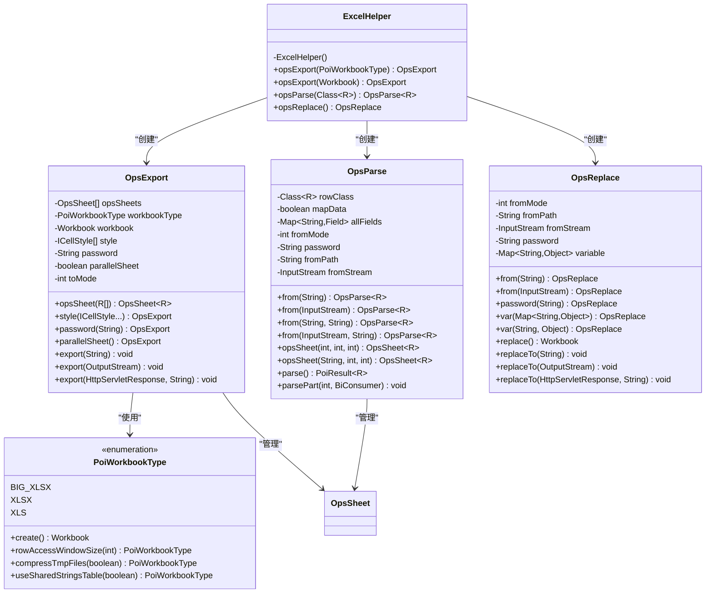
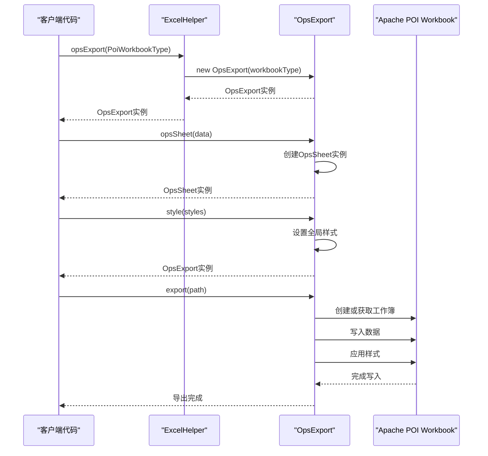
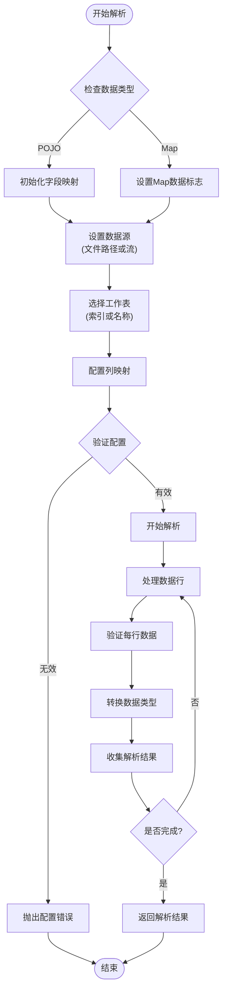
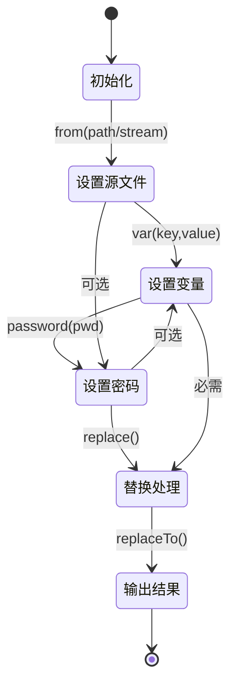
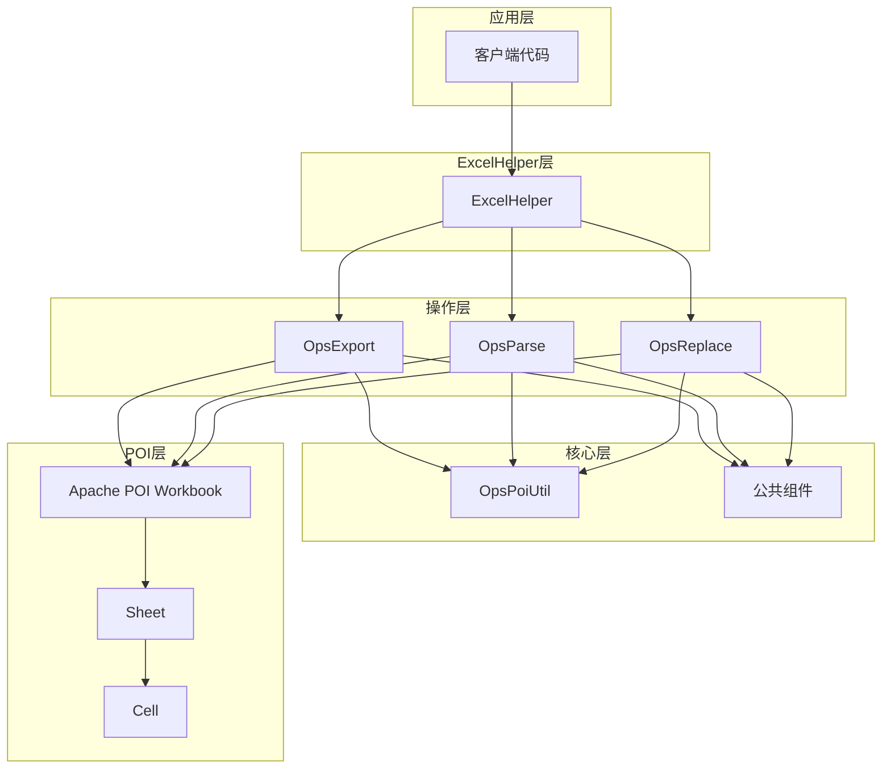

# ExcelHelper API 文档

<cite>
**本文档引用的文件**
- [ExcelHelper.java](file://src/main/java/com/github/stupdit1t/excel/core/ExcelHelper.java)
- [OpsExport.java](file://src/main/java/com/github/stupdit1t/excel/core/export/OpsExport.java)
- [OpsParse.java](file://src/main/java/com/github/stupdit1t/excel/core/parse/OpsParse.java)
- [OpsReplace.java](file://src/main/java/com/github/stupdit1t/excel/core/replace/OpsReplace.java)
- [PoiWorkbookType.java](file://src/main/java/com/github/stupdit1t/excel/common/PoiWorkbookType.java)
- [ExportClass.java](file://src/test/java/excel/export/ExportClass.java)
- [ParseBeanTest.java](file://src/test/java/excel/parse/ParseBeanTest.java)
</cite>

## 目录
1. [简介](#简介)
2. [类架构概览](#类架构概览)
3. [核心组件分析](#核心组件分析)
4. [详细方法分析](#详细方法分析)
5. [使用示例](#使用示例)
6. [依赖关系分析](#依赖关系分析)
7. [性能考虑](#性能考虑)
8. [故障排除指南](#故障排除指南)
9. [总结](#总结)

## 简介

ExcelHelper是一个静态工厂类，作为Apache POI Excel操作的统一入口点。它提供了简洁的API接口，用于创建和配置Excel的导出、导入和替换操作。该类采用单例设计模式，通过私有构造函数防止实例化，并提供三个核心静态方法：`opsExport`、`opsParse`和`opsReplace`，分别对应不同的Excel操作场景。

## 类架构概览

ExcelHelper作为整个Excel操作框架的核心入口，采用了工厂模式设计，负责创建和初始化各种操作类实例。其架构体现了清晰的职责分离和链式调用的设计理念。



**图表来源**
- [ExcelHelper.java](file://src/main/java/com/github/stupdit1t/excel/core/ExcelHelper.java#L1-L54)
- [OpsExport.java](file://src/main/java/com/github/stupdit1t/excel/core/export/OpsExport.java#L1-L199)
- [OpsParse.java](file://src/main/java/com/github/stupdit1t/excel/core/parse/OpsParse.java#L1-L144)
- [OpsReplace.java](file://src/main/java/com/github/stupdit1t/excel/core/replace/OpsReplace.java#L1-L167)
- [PoiWorkbookType.java](file://src/main/java/com/github/stupdit1t/excel/common/PoiWorkbookType.java#L1-L106)

## 核心组件分析

### ExcelHelper类设计

ExcelHelper采用严格的工具类设计，具有以下特征：

1. **私有构造函数**：防止外部实例化，确保类的静态特性
2. **final修饰**：防止子类继承，保持类的不可变性
3. **静态方法**：所有功能都通过静态方法提供
4. **工厂模式**：作为其他操作类的创建中心

```java
public final class ExcelHelper {
    private ExcelHelper() {
        // 私有构造函数，防止实例化
    }
    
    // 静态工厂方法
    public static OpsExport opsExport(PoiWorkbookType workbookType) {
        return new OpsExport(workbookType);
    }
    
    public static OpsExport opsExport(Workbook workbook) {
        return new OpsExport(workbook);
    }
    
    public static <R> OpsParse<R> opsParse(Class<R> rowClass) {
        return new OpsParse<>(rowClass);
    }
    
    public static OpsReplace opsReplace() {
        return new OpsReplace();
    }
}
```

**章节来源**
- [ExcelHelper.java](file://src/main/java/com/github/stupdit1t/excel/core/ExcelHelper.java#L1-L54)

### PoiWorkbookType枚举

PoiWorkbookType枚举定义了支持的工作簿类型，提供了灵活的配置选项：

- **BIG_XLSX**：大数据工作簿，适用于超大文件处理
- **XLSX**：标准Excel 2007+格式
- **XLS**：传统Excel 97-2003格式

每种类型都支持链式配置方法，允许动态调整内存使用策略和压缩选项。

**章节来源**
- [PoiWorkbookType.java](file://src/main/java/com/github/stupdit1t/excel/common/PoiWorkbookType.java#L1-L106)

## 详细方法分析

### opsExport 方法族

#### 方法签名1：基于PoiWorkbookType的导出

```java
public static OpsExport opsExport(PoiWorkbookType workbookType)
```

**参数说明**：
- `workbookType`：工作簿类型枚举，决定Excel格式和内存使用策略

**返回值**：
- `OpsExport`：导出操作的主控制器，支持链式调用配置

**使用场景**：
- 创建新的Excel工作簿进行导出
- 支持XLS、XLSX和大数据XLSX格式

#### 方法签名2：基于现有Workbook的导出

```java
public static OpsExport opsExport(Workbook workbook)
```

**参数说明**：
- `workbook`：现有的Apache POI Workbook实例

**返回值**：
- `OpsExport`：基于现有工作簿的导出配置

**使用场景**：
- 在已有工作簿基础上进行修改和导出
- 支持动态创建工作簿实例



**图表来源**
- [ExcelHelper.java](file://src/main/java/com/github/stupdit1t/excel/core/ExcelHelper.java#L20-L28)
- [OpsExport.java](file://src/main/java/com/github/stupdit1t/excel/core/export/OpsExport.java#L50-L70)

**章节来源**
- [ExcelHelper.java](file://src/main/java/com/github/stupdit1t/excel/core/ExcelHelper.java#L20-L28)
- [OpsExport.java](file://src/main/java/com/github/stupdit1t/excel/core/export/OpsExport.java#L50-L70)

### opsParse 方法

#### 方法签名

```java
public static <R> OpsParse<R> opsParse(Class<R> rowClass)
```

**参数说明**：
- `rowClass`：目标数据类型的Class对象，用于泛型类型安全

**返回值**：
- `OpsParse<R>`：解析操作的主控制器，支持链式调用配置

**使用场景**：
- 从Excel文件解析数据到Java对象
- 支持POJO和Map两种数据模型
- 提供灵活的列映射和数据验证功能



**图表来源**
- [OpsParse.java](file://src/main/java/com/github/stupdit1t/excel/core/parse/OpsParse.java#L30-L50)
- [OpsParse.java](file://src/main/java/com/github/stupdit1t/excel/core/parse/OpsParse.java#L80-L100)

**章节来源**
- [ExcelHelper.java](file://src/main/java/com/github/stupdit1t/excel/core/ExcelHelper.java#L30-L32)
- [OpsParse.java](file://src/main/java/com/github/stupdit1t/excel/core/parse/OpsParse.java#L30-L50)

### opsReplace 方法

#### 方法签名

```java
public static OpsReplace opsReplace()
```

**参数说明**：
- 无参数

**返回值**：
- `OpsReplace`：替换操作的主控制器

**使用场景**：
- 读取Excel模板并替换其中的占位符变量
- 支持复杂的文本替换和格式化
- 提供多种输出方式（文件、流、HTTP响应）



**图表来源**
- [OpsReplace.java](file://src/main/java/com/github/stupdit1t/excel/core/replace/OpsReplace.java#L20-L40)
- [OpsReplace.java](file://src/main/java/com/github/stupdit1t/excel/core/replace/OpsReplace.java#L80-L100)

**章节来源**
- [ExcelHelper.java](file://src/main/java/com/github/stupdit1t/excel/core/ExcelHelper.java#L34-L36)
- [OpsReplace.java](file://src/main/java/com/github/stupdit1t/excel/core/replace/OpsReplace.java#L20-L40)

## 使用示例

### 导出示例

以下展示了如何使用ExcelHelper进行各种类型的Excel导出：

```java
// 1. 基础导出示例
ExcelHelper.opsExport(PoiWorkbookType.XLS)
    .opsSheet(data)
        .autoNum()
        .opsHeader()
            .simple()
            .texts("序号", "项目名称", "所属区域", "省份", "市")
            .done()
        .opsColumn()
            .fields("projectName", "areaName", "province", "city")
            .done()
        .export("output.xls");

// 2. 复杂样式导出示例
ExcelHelper.opsExport(PoiWorkbookType.XLSX)
    .style(customStyle)
    .password("secret")
    .opsSheet(largeDataSet)
        .autoNum()
        .sheetName("数据报表")
        .opsHeader()
            .simple()
            .title("年度项目统计报告")
            .subtitle("2024年第一季度")
            .done()
        .opsColumn()
            .field("projectName").width(3000)
            .field("score").pattern("0.00%")
            .field("createTime").format("yyyy-MM-dd")
            .done()
        .export("report.xlsx");
```

### 解析示例

以下是不同场景下的Excel解析示例：

```java
// 1. 基础POJO解析
PoiResult<ProjectEvaluate> result = ExcelHelper.opsParse(ProjectEvaluate.class)
    .from("data.xlsx")
    .opsSheet(0, 1, 1)
    .opsColumn(true)
    .done()
    .parse();

// 2. 自定义列映射解析
PoiResult<ProjectEvaluate> result = ExcelHelper.opsParse(ProjectEvaluate.class)
    .from("data.xlsx", "password")
    .opsSheet("工作表1", 2, 0)
    .opsColumn()
    .field(Col.A, "projectName").notNull().trim()
    .field(Col.D, "city").map(cityMapping::get)
    .field(Col.H, ProjectEvaluate::getScore).type(double.class).scale(2)
    .done()
    .parse();

// 3. 分批处理大数据
ExcelHelper.opsParse(ProjectEvaluate.class)
    .from("large_data.xlsx")
    .opsSheet(0, 1, 1)
    .opsColumn(true).done()
    .parsePart(1000, (batchResult) -> {
        processBatch(batchResult.getData());
        if (batchResult.hasError()) {
            logErrors(batchResult.getErrorInfo());
        }
    });
```

### 替换示例

```java
// 1. 基础变量替换
Workbook workbook = ExcelHelper.opsReplace()
    .from("template.xlsx")
    .var("date", new Date())
    .var("user", currentUser)
    .var("amount", totalAmount)
    .replace();

// 2. 复杂模板替换
ExcelHelper.opsReplace()
    .from("report_template.xlsx", "template_password")
    .var("company", companyInfo)
    .var("period", "2024Q1")
    .var("totals", summaryData)
    .replaceTo("final_report.xlsx");

// 3. HTTP响应输出
ExcelHelper.opsReplace()
    .from(templateStream)
    .var(variables)
    .replaceTo(response, "report.xlsx");
```

**章节来源**
- [ExportClass.java](file://src/test/java/excel/export/ExportClass.java#L100-L150)
- [ParseBeanTest.java](file://src/test/java/excel/parse/ParseBeanTest.java#L20-L80)

## 依赖关系分析

ExcelHelper作为框架的核心入口，其依赖关系体现了清晰的分层架构：



**图表来源**
- [ExcelHelper.java](file://src/main/java/com/github/stupdit1t/excel/core/ExcelHelper.java#L1-L10)
- [OpsExport.java](file://src/main/java/com/github/stupdit1t/excel/core/export/OpsExport.java#L1-L20)

**章节来源**
- [ExcelHelper.java](file://src/main/java/com/github/stupdit1t/excel/core/ExcelHelper.java#L1-L10)

## 性能考虑

### 内存优化策略

1. **大数据处理**：PoiWorkbookType.BIG_XLSX支持流式处理，避免内存溢出
2. **并行导出**：支持多Sheet并行处理，提高大文件处理效率
3. **流式输出**：支持直接输出到HttpServletResponse，减少内存占用

### 最佳实践建议

1. **合理选择工作簿类型**：
   - 小数据集：使用XLSX
   - 大数据集：使用BIG_XLSX
   - 传统兼容：使用XLS

2. **批量处理策略**：
   - 对于大数据解析，使用`parsePart`方法进行分批处理
   - 合理设置批次大小，平衡内存使用和处理效率

3. **资源管理**：
   - 及时关闭输入流和输出流
   - 使用try-with-resources确保资源释放

## 故障排除指南

### 常见问题及解决方案

1. **内存不足错误**
   - 问题：处理大文件时出现OutOfMemoryError
   - 解决：切换到PoiWorkbookType.BIG_XLSX，调整rowAccessWindowSize参数

2. **文件格式不匹配**
   - 问题：XLS文件无法打开XLSX格式
   - 解决：确保使用正确的PoiWorkbookType

3. **列映射错误**
   - 问题：解析时字段映射失败
   - 解决：检查字段名称匹配，使用精确的列标识符

4. **权限问题**
   - 问题：加密文件无法读取
   - 解决：提供正确的密码参数

**章节来源**
- [PoiWorkbookType.java](file://src/main/java/com/github/stupdit1t/excel/common/PoiWorkbookType.java#L40-L60)

## 总结

ExcelHelper作为Apache POI Excel操作框架的核心入口，通过简洁而强大的API设计，为开发者提供了统一的Excel操作体验。其静态工厂模式设计确保了代码的可维护性和扩展性，同时通过链式调用语法大大简化了复杂的Excel操作流程。

主要特性包括：

1. **统一入口**：一个类提供三种核心操作（导出、导入、替换）
2. **类型安全**：泛型支持确保编译时类型检查
3. **链式调用**：流畅的API设计提升开发效率
4. **灵活配置**：丰富的配置选项适应不同业务需求
5. **性能优化**：针对大数据场景的专门优化

该框架特别适合需要频繁进行Excel操作的企业级应用，能够显著减少重复代码，提高开发效率和代码质量。