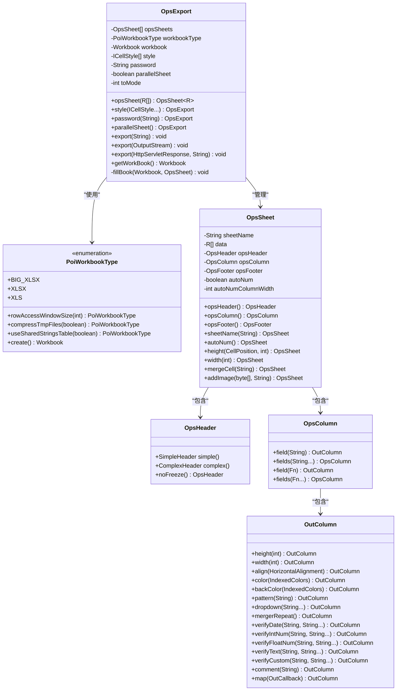
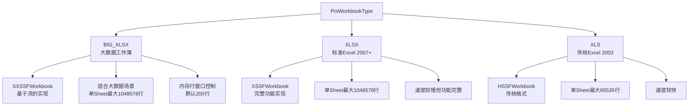
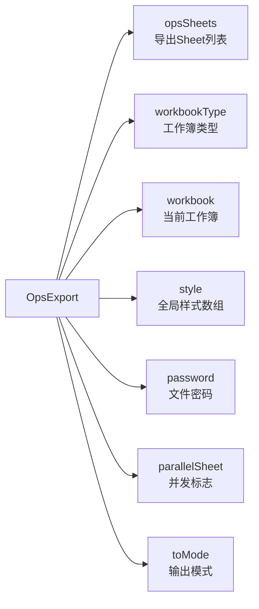
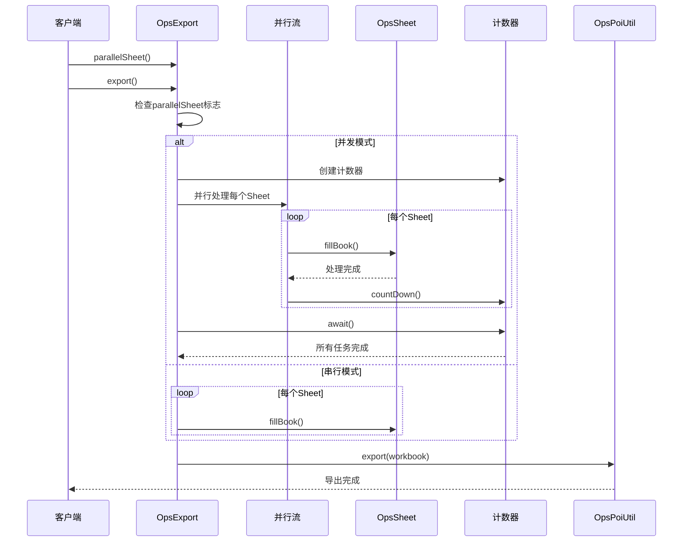

# OpsExport API 参考文档

<cite>
**本文档引用的文件**
- [PoiWorkbookType.java](file://src/main/java/com/github/stupdit1t/excel/common/PoiWorkbookType.java)
- [OpsExport.java](file://src/main/java/com/github/stupdit1t/excel/core/export/OpsExport.java)
- [OpsSheet.java](file://src/main/java/com/github/stupdit1t/excel/core/export/OpsSheet.java)
- [OpsHeader.java](file://src/main/java/com/github/stupdit1t/excel/core/export/OpsHeader.java)
- [OpsColumn.java](file://src/main/java/com/github/stupdit1t/excel/core/export/OpsColumn.java)
- [OutColumn.java](file://src/main/java/com/github/stupdit1t/excel/core/export/OutColumn.java)
- [OpsPoiUtil.java](file://src/main/java/com/github/stupdit1t/excel/core/OpsPoiUtil.java)
- [ExportRules.java](file://src/main/java/com/github/stupdit1t/excel/core/export/ExportRules.java)
</cite>

## 目录
1. [简介](#简介)
2. [核心架构](#核心架构)
3. [PoiWorkbookType 枚举详解](#poiworkbooktype-枚举详解)
4. [OpsExport 主类分析](#opsexport-主类分析)
5. [链式调用方法详解](#链式调用方法详解)
6. [导出模式详解](#导出模式详解)
7. [并发导出机制](#并发导出机制)
8. [使用示例](#使用示例)
9. [性能优化建议](#性能优化建议)
10. [故障排除指南](#故障排除指南)

## 简介

OpsExport 是 poi-excel 库的核心导出组件，采用流畅接口（Fluent Interface）设计模式，提供了强大而灵活的 Excel 导出功能。该类支持多种工作簿类型、复杂的表头设计、丰富的样式配置以及高效的并发导出机制。

## 核心架构



**图表来源**
- [OpsExport.java](file://src/main/java/com/github/stupdit1t/excel/core/export/OpsExport.java#L1-L339)
- [PoiWorkbookType.java](file://src/main/java/com/github/stupdit1t/excel/common/PoiWorkbookType.java#L1-L107)
- [OpsSheet.java](file://src/main/java/com/github/stupdit1t/excel/core/export/OpsSheet.java#L1-L289)
- [OpsHeader.java](file://src/main/java/com/github/stupdit1t/excel/core/export/OpsHeader.java#L1-L245)
- [OpsColumn.java](file://src/main/java/com/github/stupdit1t/excel/core/export/OpsColumn.java#L1-L96)
- [OutColumn.java](file://src/main/java/com/github/stupdit1t/excel/core/export/OutColumn.java#L1-L771)

## PoiWorkbookType 枚举详解

PoiWorkbookType 枚举定义了支持的工作簿类型及其特性，是 OpsExport 的核心配置选项。

### 枚举类型说明



**图表来源**
- [PoiWorkbookType.java](file://src/main/java/com/github/stupdit1t/excel/common/PoiWorkbookType.java#L10-L25)

### BIG_XLSX 特性详解

BIG_XLSX 是专门为大数据场景设计的工作簿类型，具有以下特点：

- **内存效率**：通过 SXSSFWorkbook 实现流式写入
- **行数限制**：单个 Sheet 最大支持 1,048,576 行
- **配置参数**：
  - `rowAccessWindowSize`：内存中保持的行数，默认 200 行
  - `compressTmpFiles`：是否压缩临时文件，默认 false
  - `useSharedStringsTable`：是否使用共享字符串表，默认 false

### 使用示例

```java
// 创建大数据工作簿
PoiWorkbookType bigXlsx = PoiWorkbookType.BIG_XLSX
    .rowAccessWindowSize(500)           // 设置内存行数为500
    .compressTmpFiles(true)            // 启用临时文件压缩
    .useSharedStringsTable(true);      // 启用共享字符串表

// 在 OpsExport 中使用
OpsExport export = new OpsExport(bigXlsx);
```

**章节来源**
- [PoiWorkbookType.java](file://src/main/java/com/github/stupdit1t/excel/common/PoiWorkbookType.java#L1-L107)

## OpsExport 主类分析

OpsExport 类是整个导出功能的核心，实现了 OpsFinish 接口，提供了完整的导出链式调用功能。

### 核心属性解析



**图表来源**
- [OpsExport.java](file://src/main/java/com/github/stupdit1t/excel/core/export/OpsExport.java#L20-L60)

### 构造函数设计

OpsExport 提供了两种构造方式：

1. **基于工作簿类型的构造**：
```java
public OpsExport(PoiWorkbookType workbookType)
```

2. **基于现有工作簿的构造**：
```java
public OpsExport(Workbook workbook)
```

这种设计允许开发者灵活选择工作簿的创建方式，既可以通过枚举预设配置，也可以使用自定义的工作簿实例。

**章节来源**
- [OpsExport.java](file://src/main/java/com/github/stupdit1t/excel/core/export/OpsExport.java#L1-L100)

## 链式调用方法详解

### opsSheet 方法

```java
public <R> OpsSheet<R> opsSheet(List<R> data)
```

**功能描述**：创建一个新的导出 Sheet，用于定义导出数据和相关配置。

**参数说明**：
- `data`：要导出的数据列表，泛型类型 R 表示数据对象类型

**返回值**：返回一个 OpsSheet 实例，支持进一步的链式配置

**使用示例**：
```java
List<Student> students = getStudentData();
OpsSheet<Student> studentSheet = export.opsSheet(students)
    .sheetName("学生信息表");
```

### style 方法

```java
public OpsExport style(ICellStyle... styles)
```

**功能描述**：设置全局单元格样式，影响所有 Sheet 的样式表现。

**参数说明**：
- `styles`：可变参数，传入一组 ICellStyle 实例

**返回值**：返回 OpsExport 本身，支持链式调用

**使用示例**：
```java
OpsExport export = new OpsExport(PoiWorkbookType.XLSX)
    .style(DefaultCellStyleEnum.TITLE, DefaultCellStyleEnum.HEADER);
```

### password 方法

```java
public OpsExport password(String password)
```

**功能描述**：为导出的 Excel 文件设置密码保护。

**参数说明**：
- `password`：密码字符串，仅支持 XLS 格式

**返回值**：返回 OpsExport 本身

**使用示例**：
```java
OpsExport export = new OpsExport(PoiWorkbookType.XLS)
    .password("secret123");
```

### parallelSheet 方法

```java
public OpsExport parallelSheet()
```

**功能描述**：启用并发导出功能，使用 ForkJoin 线程池并行处理多个 Sheet。

**返回值**：返回 OpsExport 本身

**使用示例**：
```java
OpsExport export = new OpsExport(PoiWorkbookType.XLSX)
    .parallelSheet();
```

**章节来源**
- [OpsExport.java](file://src/main/java/com/github/stupdit1t/excel/core/export/OpsExport.java#L70-L120)

## 导出模式详解

OpsExport 支持三种不同的导出模式，每种模式都有特定的使用场景和配置要求。

### 输出模式分类

```mermaid
flowchart TD
A[导出模式选择] --> B{toMode}
B --> |1| C[路径输出模式]
B --> |2| D[流输出模式]
B --> |3| E[Servlet响应模式]
C --> F[export(String toPath)]
D --> G[export(OutputStream toStream)]
E --> H[export(HttpServletResponse toResponse, String fileName)]
F --> I[文件保存到指定路径]
G --> J[输出到字节流]
H --> K[HTTP响应输出]
```

**图表来源**
- [OpsExport.java](file://src/main/java/com/github/stupdit1t/excel/core/export/OpsExport.java#L130-L180)

### 路径输出模式

**方法签名**：
```java
public void export(String toPath)
```

**功能描述**：将 Excel 文件导出到指定的本地文件系统路径。

**使用场景**：
- 批量处理任务
- 文件归档需求
- 离线导出操作

**注意事项**：
- 会覆盖目标路径的同名文件
- 需要确保目标目录存在且有写权限

### 流输出模式

**方法签名**：
```java
public void export(OutputStream toStream)
```

**功能描述**：将 Excel 文件内容输出到指定的输出流。

**使用场景**：
- 内存中处理
- 网络传输
- 动态内容生成

**注意事项**：
- 需要手动关闭输出流
- 适用于实时数据处理

### Servlet 响应模式

**方法签名**：
```java
public void export(HttpServletResponse toResponse, String fileName)
```

**功能描述**：将 Excel 文件作为 HTTP 响应输出，通常用于 Web 应用程序。

**使用场景**：
- Web 应用下载功能
- API 接口响应
- 用户交互式导出

**注意事项**：
- 自动设置正确的 Content-Type 和 Content-Disposition 头
- 支持文件名编码处理

**章节来源**
- [OpsExport.java](file://src/main/java/com/github/stupdit1t/excel/core/export/OpsExport.java#L130-L200)

## 并发导出机制

并发导出是 OpsExport 的一个重要特性，特别适用于需要处理多个 Sheet 的复杂导出场景。

### 并发机制原理



**图表来源**
- [OpsExport.java](file://src/main/java/com/github/stupdit1t/excel/core/export/OpsExport.java#L210-L240)

### 并发优势

1. **性能提升**：利用多核 CPU 并行处理多个 Sheet
2. **资源优化**：合理分配系统资源，避免单个任务阻塞
3. **用户体验**：减少用户等待时间，提高响应速度

### 使用场景

- 多报表导出
- 复杂业务数据整合
- 大规模数据分析结果导出

### 实现细节

并发导出使用 CountDownLatch 确保所有 Sheet 处理完成后才进行最终的文件输出：

```java
if (this.parallelSheet) {
    CountDownLatch count = new CountDownLatch(opsSheets.size());
    opsSheets.parallelStream().forEach(opsSheet -> {
        fillBook(workbook, opsSheet);
        count.countDown();
    });
    try {
        count.await();
    } catch (InterruptedException e) {
        e.printStackTrace();
    }
}
```

**章节来源**
- [OpsExport.java](file://src/main/java/com/github/stupdit1t/excel/core/export/OpsExport.java#L210-L240)

## 使用示例

### 基础导出示例

```java
// 创建基础导出实例
OpsExport export = new OpsExport(PoiWorkbookType.XLSX);

// 定义学生数据
List<Student> students = Arrays.asList(
    new Student("张三", 20, "计算机科学"),
    new Student("李四", 22, "软件工程")
);

// 配置第一个Sheet
OpsSheet<Student> studentSheet = export.opsSheet(students)
    .sheetName("学生信息")
    .autoNum()  // 添加序号列
    .opsHeader()
        .simple()
        .texts("姓名", "年龄", "专业")
    .opsColumn()
        .field("name").width(2000)
        .field("age").width(1500)
        .field("major").width(2500);

// 配置第二个Sheet
List<Project> projects = getProjectData();
OpsSheet<Project> projectSheet = export.opsSheet(projects)
    .sheetName("项目信息")
    .opsHeader()
        .complex()
        .text("项目名称", "A1:C1")
        .text("负责人", "D1:D1")
        .text("开始时间", "E1:E1")
        .text("结束时间", "F1:F1")
        .text("状态", "G1:G1");

// 执行导出
export.export("C:/exports/multi_sheet.xlsx");
```

### 大数据导出示例

```java
// 使用大数据工作簿类型
PoiWorkbookType bigXlsx = PoiWorkbookType.BIG_XLSX
    .rowAccessWindowSize(1000)  // 增加内存行数
    .compressTmpFiles(true);    // 启用压缩

OpsExport export = new OpsExport(bigXlsx)
    .parallelSheet();  // 启用并发导出

// 处理大量数据
List<LogEntry> logs = loadLargeDataset();

// 分成多个Sheet处理
for (int i = 0; i < 5; i++) {
    List<LogEntry> batch = logs.subList(i * 10000, Math.min((i + 1) * 10000, logs.size()));
    export.opsSheet(batch)
        .sheetName("日志_" + (i + 1))
        .opsHeader()
            .simple()
            .texts("时间", "级别", "消息", "来源");
}

export.export("C:/exports/large_dataset.xlsx");
```

### Web 应用导出示例

```java
@RequestMapping("/download/excel")
public void downloadExcel(HttpServletResponse response) {
    OpsExport export = new OpsExport(PoiWorkbookType.XLSX)
        .style(DefaultCellStyleEnum.TITLE, DefaultCellStyleEnum.HEADER);

    List<User> users = userService.getAllUsers();
    
    export.opsSheet(users)
        .sheetName("用户信息")
        .opsHeader()
            .simple()
            .title("用户管理系统 - 用户信息")
            .texts("用户名", "邮箱", "注册时间", "状态")
        .opsColumn()
            .field("username").width(3000)
            .field("email").width(4000)
            .field("registrationDate").pattern("yyyy-MM-dd HH:mm:ss")
            .field("status").dropdown("激活", "禁用", "待审核");

    // 设置响应头
    response.setContentType("application/vnd.openxmlformats-officedocument.spreadsheetml.sheet");
    response.setHeader("Content-Disposition", "attachment; filename=users.xlsx");
    
    // 导出到响应流
    export.export(response, "users.xlsx");
}
```

### 复杂样式导出示例

```java
OpsExport export = new OpsExport(PoiWorkbookType.XLSX)
    .password("secure123");  // 设置文件密码

List<Product> products = getProductData();

OpsSheet<Product> productSheet = export.opsSheet(products)
    .sheetName("产品信息")
    .opsHeader()
        .complex()
        .text("产品详情", "A1:E1")
        .text("基本信息", "A2:A2")
        .text("规格参数", "B2:D2")
        .text("库存信息", "E2:E2")
        .text("产品名称", "A3:A3")
        .text("类别", "B3:B3")
        .text("价格", "C3:C3")
        .text("单位", "D3:D3")
        .text("库存数量", "E3:E3")
        .text("最低库存", "F3:F3")
        .text("备注", "G3:G3");

productSheet.opsColumn()
    .field("productName")
        .width(4000)
        .align(HorizontalAlignment.LEFT)
        .color(IndexedColors.BLUE)
        .backColor(IndexedColors.YELLOW)
        .comment("产品的唯一标识名称")
    .field("category")
        .width(2500)
        .dropdown("电子产品", "家居用品", "服装", "食品")
    .field("price")
        .width(1500)
        .pattern("#,##0.00")
        .verifyFloatNum("0~999999.99@价格必须在合理范围内")
    .field("stockQuantity")
        .width(2000)
        .verifyIntNum("0~10000@库存数量应在合理范围内")
    .field("minStock")
        .width(2000)
        .mergerRepeat()  // 纵向合并相同值
    .field("remark")
        .width(3000)
        .wrapText();     // 启用自动换行

export.export("C:/exports/products_protected.xlsx");
```

## 性能优化建议

### 内存管理优化

1. **合理选择工作簿类型**：
   - 小数据集：使用 XLSX
   - 大数据集：使用 BIG_XLSX 并调整 `rowAccessWindowSize`
   - 传统格式：使用 XLS（注意行数限制）

2. **并发导出配置**：
   ```java
   // 根据CPU核心数调整并发策略
   int parallelism = Runtime.getRuntime().availableProcessors();
   OpsExport export = new OpsExport(PoiWorkbookType.XLSX)
       .parallelSheet();
   ```

3. **内存行数优化**：
   ```java
   PoiWorkbookType.BIG_XLSX
       .rowAccessWindowSize(500)  // 根据可用内存调整
       .compressTmpFiles(true);
   ```

### 数据处理优化

1. **批量处理**：避免一次性加载过多数据
2. **懒加载**：按需加载数据，减少内存占用
3. **流式处理**：对于超大数据集，考虑流式写入

### 样式优化

1. **样式复用**：避免重复创建样式对象
2. **缓存机制**：利用 OpsPoiUtil 内置的样式缓存
3. **最小化样式**：只设置必要的样式属性

## 故障排除指南

### 常见问题及解决方案

#### 1. 内存溢出 (OutOfMemoryError)

**症状**：导出大数据时出现内存不足异常

**解决方案**：
```java
// 使用大数据工作簿类型
PoiWorkbookType bigXlsx = PoiWorkbookType.BIG_XLSX
    .rowAccessWindowSize(200)  // 减少内存行数
    .compressTmpFiles(true);   // 启用压缩

OpsExport export = new OpsExport(bigXlsx);
```

#### 2. 导出速度过慢

**症状**：导出过程耗时过长

**解决方案**：
```java
// 启用并发导出
OpsExport export = new OpsExport(PoiWorkbookType.XLSX)
    .parallelSheet();

// 或者使用大数据工作簿
PoiWorkbookType.BIG_XLSX
    .rowAccessWindowSize(1000);  // 增加内存行数
```

#### 3. 样式不生效

**症状**：设置的单元格样式没有应用到导出文件

**解决方案**：
```java
// 确保样式正确传递
OpsExport export = new OpsExport(PoiWorkbookType.XLSX)
    .style(DefaultCellStyleEnum.TITLE, DefaultCellStyleEnum.HEADER);

// 或者在列级别单独设置样式
column.width(2000)
       .align(HorizontalAlignment.CENTER)
       .color(IndexedColors.RED);
```

#### 4. 并发导出异常

**症状**：并发模式下出现线程安全问题

**解决方案**：
```java
// 确保数据源线程安全
List<ThreadSafeData> threadSafeData = Collections.synchronizedList(new ArrayList<>());

// 或者使用线程安全的集合
List<ConcurrentData> concurrentData = new CopyOnWriteArrayList<>();
```

### 调试技巧

1. **启用日志记录**：
```java
// 在 pom.xml 中添加 log4j 配置
<dependency>
    <groupId>org.apache.logging.log4j</groupId>
    <artifactId>log4j-core</artifactId>
</dependency>
```

2. **监控内存使用**：
```java
// 导出前检查可用内存
long freeMemory = Runtime.getRuntime().freeMemory();
long totalMemory = Runtime.getRuntime().totalMemory();
System.out.println("可用内存: " + freeMemory / 1024 / 1024 + "MB");
```

3. **验证数据完整性**：
```java
// 在导出前验证数据
assert data != null;
assert !data.isEmpty();
assert data.stream().allMatch(Objects::nonNull);
```

**章节来源**
- [OpsPoiUtil.java](file://src/main/java/com/github/stupdit1t/excel/core/OpsPoiUtil.java#L200-L400)