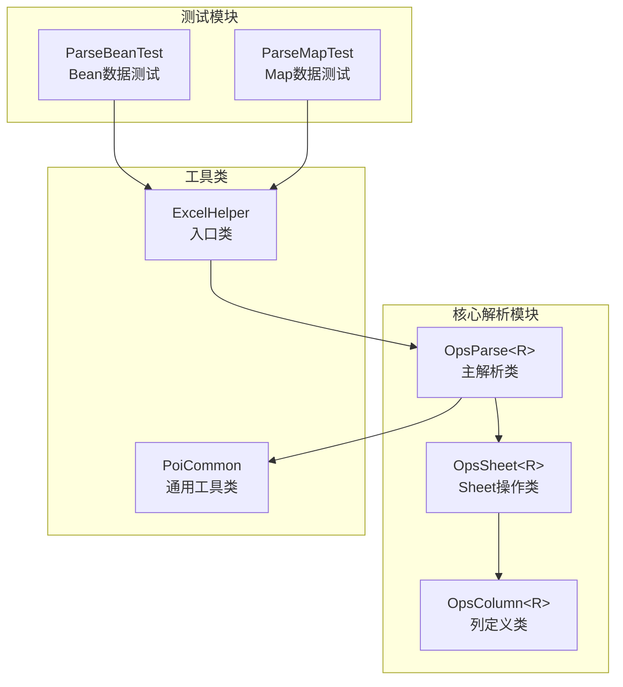
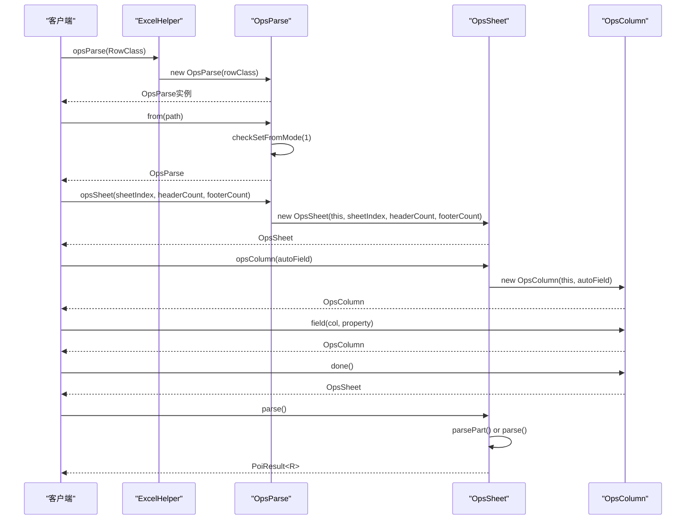
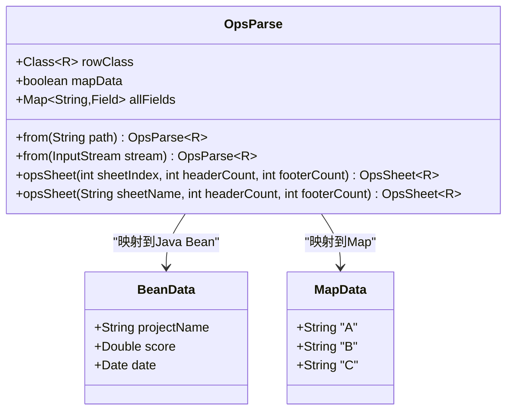
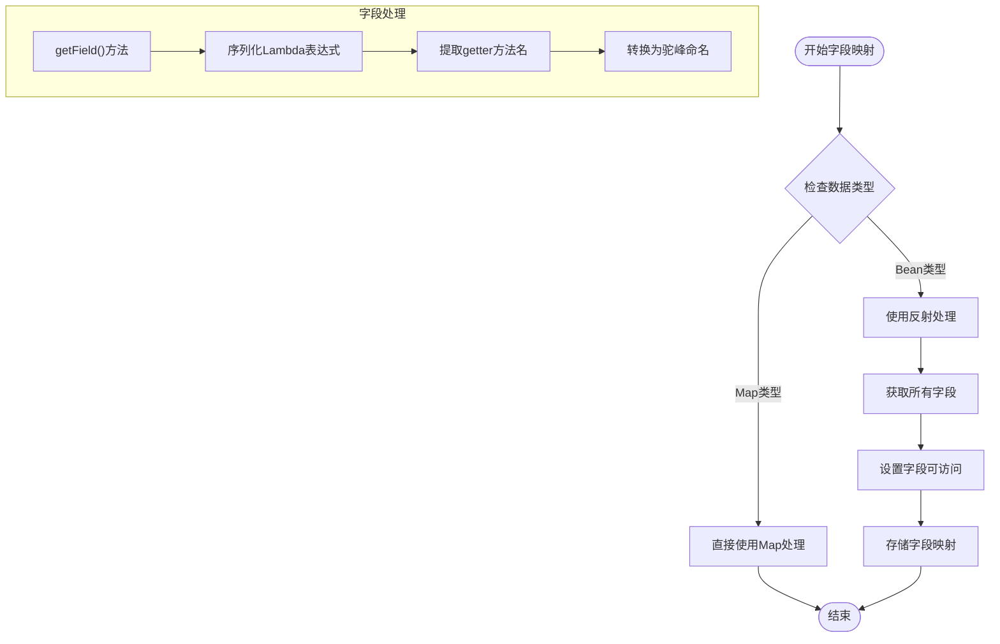
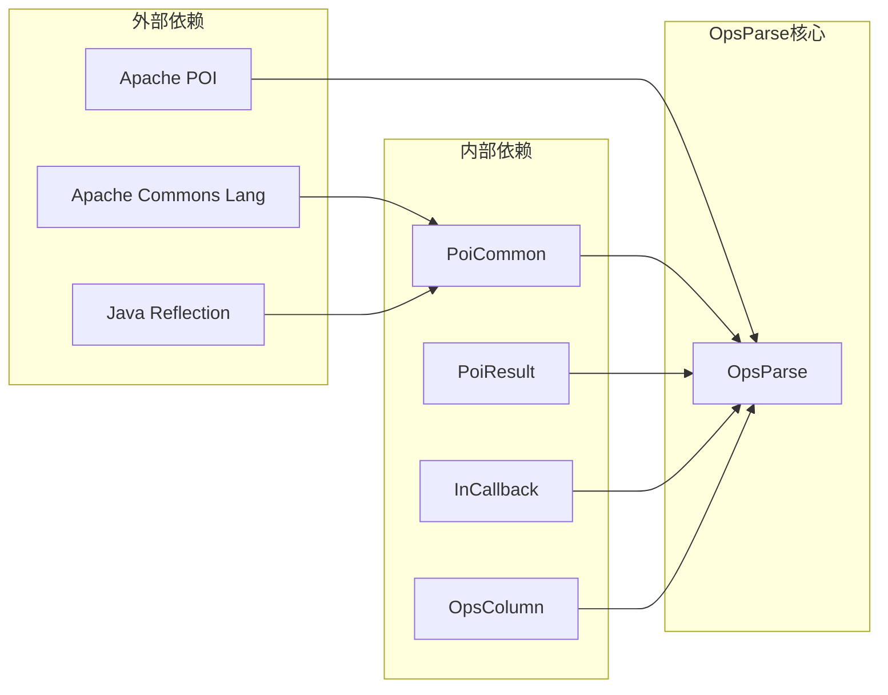

# OpsParse API 文档

<cite>
**本文档引用的文件**
- [OpsParse.java](file://src/main/java/com/github/stupdit1t/excel/core/parse/OpsParse.java)
- [PoiCommon.java](file://src/main/java/com/github/stupdit1t/excel/common/PoiCommon.java)
- [OpsSheet.java](file://src/main/java/com/github/stupdit1t/excel/core/parse/OpsSheet.java)
- [ParseBeanTest.java](file://src/test/java/excel/parse/ParseBeanTest.java)
- [ParseMapTest.java](file://src/test/java/excel/parse/ParseMapTest.java)
- [ExcelHelper.java](file://src/main/java/com/github/stupdit1t/excel/core/ExcelHelper.java)
</cite>

## 目录
1. [简介](#简介)
2. [项目结构](#项目结构)
3. [核心组件](#核心组件)
4. [架构概览](#架构概览)
5. [详细组件分析](#详细组件分析)
6. [依赖关系分析](#依赖关系分析)
7. [性能考虑](#性能考虑)
8. [故障排除指南](#故障排除指南)
9. [结论](#结论)

## 简介

OpsParse类是POI-Excel库中负责数据导入的核心组件，提供了强大的Excel文件解析功能。该类支持从文件路径或输入流读取Excel文件，并通过泛型机制实现灵活的对象映射。主要特性包括：

- 支持多种数据源（文件路径、输入流）
- 提供密码保护机制
- 支持通过索引或名称访问Sheet
- 灵活的表头和尾部行配置
- 强大的字段映射和验证功能
- 大数据量的分批处理能力

## 项目结构

OpsParse类位于`com.github.stupdit1t.excel.core.parse`包中，与相关组件形成清晰的层次结构：



**图表来源**
- [OpsParse.java](file://src/main/java/com/github/stupdit1t/excel/core/parse/OpsParse.java#L1-L145)
- [OpsSheet.java](file://src/main/java/com/github/stupdit1t/excel/core/parse/OpsSheet.java#L1-L228)
- [ExcelHelper.java](file://src/main/java/com/github/stupdit1t/excel/core/ExcelHelper.java#L1-L54)

## 核心组件

OpsParse类作为数据导入的核心，具有以下关键属性和方法：

### 主要属性

- **rowClass**: 泛型参数，指定目标数据类型
- **mapData**: 布尔值，标识是否为Map类型数据
- **allFields**: 字段映射，存储实体类的所有字段信息
- **fromMode**: 输入模式标识（1=路径，2=流）
- **password**: 可选的文件密码
- **fromPath**: 文件路径
- **fromStream**: 输入流

### 构造函数

```java
public OpsParse(Class<R> rowClass)
```

构造函数初始化核心属性，并通过PoiCommon工具类检测数据类型：
- 设置rowClass泛型参数
- 检查是否为Map类型数据
- 如果不是Map类型，则获取所有字段信息

**章节来源**
- [OpsParse.java](file://src/main/java/com/github/stupdit1t/excel/core/parse/OpsParse.java#L30-L45)

## 架构概览

OpsParse采用链式调用设计模式，提供流畅的API体验：



**图表来源**
- [ExcelHelper.java](file://src/main/java/com/github/stupdit1t/excel/core/ExcelHelper.java#L35-L40)
- [OpsParse.java](file://src/main/java/com/github/stupdit1t/excel/core/parse/OpsParse.java#L50-L100)
- [OpsSheet.java](file://src/main/java/com/github/stupdit1t/excel/core/parse/OpsSheet.java#L70-L120)

## 详细组件分析

### from方法重载

OpsParse提供了四种from方法重载，支持不同的数据源和安全选项：

#### 方法1：基本路径输入
```java
public OpsParse<R> from(String path)
```
- **参数**: `path` - Excel文件的本地路径
- **功能**: 设置文件路径作为数据源
- **限制**: 仅支持一种输入方式

#### 方法2：基本流输入
```java
public OpsParse<R> from(InputStream inputStream)
```
- **参数**: `inputStream` - Excel文件的输入流
- **功能**: 设置输入流作为数据源
- **应用场景**: 内存中的Excel文件处理

#### 方法3：带密码的路径输入
```java
public OpsParse<R> from(String path, String password)
```
- **参数**: 
  - `path`: 文件路径
  - `password`: 文件密码
- **功能**: 支持加密Excel文件的解密读取

#### 方法4：带密码的流输入
```java
public OpsParse<R> from(InputStream inputStream, String password)
```
- **参数**:
  - `inputStream`: 输入流
  - `password`: 文件密码
- **功能**: 支持加密内存流的解密读取

**章节来源**
- [OpsParse.java](file://src/main/java/com/github/stupdit1t/excel/core/parse/OpsParse.java#L50-L90)

### opsSheet方法重载

OpsParse提供两种opsSheet方法重载，支持灵活的Sheet选择：

#### 方法1：按索引选择Sheet
```java
public OpsSheet<R> opsSheet(int sheetIndex, int headerCount, int footerCount)
```
- **参数**:
  - `sheetIndex`: Sheet的索引位置（从0开始）
  - `headerCount`: 表头行数
  - `footerCount`: 尾部行数
- **功能**: 通过索引定位特定Sheet

#### 方法2：按名称选择Sheet
```java
public OpsSheet<R> opsSheet(String sheetName, int headerCount, int footerCount)
```
- **参数**:
  - `sheetName`: Sheet的名称
  - `headerCount`: 表头行数
  - `footerCount`: 尾部行数
- **功能**: 通过名称定位特定Sheet

**章节来源**
- [OpsParse.java](file://src/main/java/com/github/stupdit1t/excel/core/parse/OpsParse.java#L100-L120)

### 泛型参数rowClass的作用

rowClass泛型参数是OpsParse的核心特性，决定了数据处理的方式：



**图表来源**
- [OpsParse.java](file://src/main/java/com/github/stupdit1t/excel/core/parse/OpsParse.java#L15-L30)
- [PoiCommon.java](file://src/main/java/com/github/stupdit1t/excel/common/PoiCommon.java#L150-L170)

### mapData标志位的影响

mapData标志位控制数据处理流程的关键分支：

1. **当mapData=true**:
   - 使用Map类型处理数据
   - 不需要反射获取字段信息
   - 性能更高，适合大量数据处理

2. **当mapData=false**:
   - 使用Java Bean类型处理数据
   - 通过反射获取字段信息
   - 支持强类型验证和转换

**章节来源**
- [OpsParse.java](file://src/main/java/com/github/stupdit1t/excel/core/parse/OpsParse.java#L35-L45)
- [PoiCommon.java](file://src/main/java/com/github/stupdit1t/excel/common/PoiCommon.java#L150-L170)

### PoiCommon工具类的反射机制

PoiCommon类提供了强大的字段反射机制，支持复杂的字段映射：



**图表来源**
- [PoiCommon.java](file://src/main/java/com/github/stupdit1t/excel/common/PoiCommon.java#L150-L227)

**章节来源**
- [PoiCommon.java](file://src/main/java/com/github/stupdit1t/excel/common/PoiCommon.java#L150-L227)

### 数据导入示例

#### Bean数据导入示例

```java
// 自动映射列
PoiResult<ProjectEvaluate> result = ExcelHelper.opsParse(ProjectEvaluate.class)
    .from("data.xlsx")
    .opsSheet(0, 1, 1)  // 第一个Sheet，1行表头，1行尾部
    .opsColumn(true)    // 自动映射列
    .done()
    .parse();

// 手动指定列映射
PoiResult<ProjectEvaluate> result = ExcelHelper.opsParse(ProjectEvaluate.class)
    .from("data.xlsx")
    .opsSheet(0, 1, 0)
    .opsColumn()
    .field(Col.A, ProjectEvaluate::getProjectName)
    .field(Col.H, ProjectEvaluate::getScore)
    .done()
    .parse();
```

#### Map数据导入示例

```java
// 自动映射列到Map
PoiResult<HashMap> result = ExcelHelper.opsParse(HashMap.class)
    .from("data.xlsx")
    .opsSheet(0, 1, 0)
    .opsColumn(true)
    .field(Col.AS, "AS").defaultValue("")
    .done()
    .parse();

// 手动指定列映射到Map
PoiResult<HashMap> result = ExcelHelper.opsParse(HashMap.class)
    .from("data.xlsx")
    .opsSheet(0, 1, 0)
    .opsColumn()
    .field(Col.A, "name")
    .field(Col.H, "score")
    .done()
    .parse();
```

**章节来源**
- [ParseBeanTest.java](file://src/test/java/excel/parse/ParseBeanTest.java#L25-L140)
- [ParseMapTest.java](file://src/test/java/excel/parse/ParseMapTest.java#L25-L123)

## 依赖关系分析

OpsParse类的依赖关系体现了清晰的分层架构：



**图表来源**
- [OpsParse.java](file://src/main/java/com/github/stupdit1t/excel/core/parse/OpsParse.java#L1-L10)
- [PoiCommon.java](file://src/main/java/com/github/stupdit1t/excel/common/PoiCommon.java#L1-L15)

**章节来源**
- [OpsParse.java](file://src/main/java/com/github/stupdit1t/excel/core/parse/OpsParse.java#L1-L145)

## 性能考虑

OpsParse在设计时充分考虑了性能优化：

### 内存管理
- 使用流式处理避免大文件内存溢出
- 支持分批处理大数据集
- 及时释放资源

### 反射优化
- 缓存字段信息减少重复反射
- Map类型数据跳过反射过程
- 智能字段检测机制

### 并发处理
- 支持多线程环境下的安全使用
- 分批处理支持异步回调

## 故障排除指南

### 常见问题及解决方案

#### 1. 输入方式冲突
**问题**: 同时设置了路径和流输入
**解决方案**: 确保只使用一种输入方式

#### 2. Sheet选择错误
**问题**: Sheet索引超出范围或名称不存在
**解决方案**: 检查Sheet索引或名称的正确性

#### 3. 字段映射失败
**问题**: Bean字段与Excel列不匹配
**解决方案**: 使用手动映射或检查字段名称

#### 4. 密码错误
**问题**: 加密文件密码不正确
**解决方案**: 确认文件密码的准确性

**章节来源**
- [OpsParse.java](file://src/main/java/com/github/stupdit1t/excel/core/parse/OpsParse.java#L45-L55)

## 结论

OpsParse类是一个功能强大且设计精良的Excel数据导入组件，具有以下优势：

1. **灵活性**: 支持多种数据源和处理方式
2. **安全性**: 提供密码保护机制
3. **易用性**: 链式调用设计简化API使用
4. **性能**: 优化的反射机制和内存管理
5. **扩展性**: 清晰的架构便于功能扩展

该组件适用于各种Excel数据导入场景，从简单的数据迁移到复杂的企业级应用集成，都能提供稳定可靠的服务。