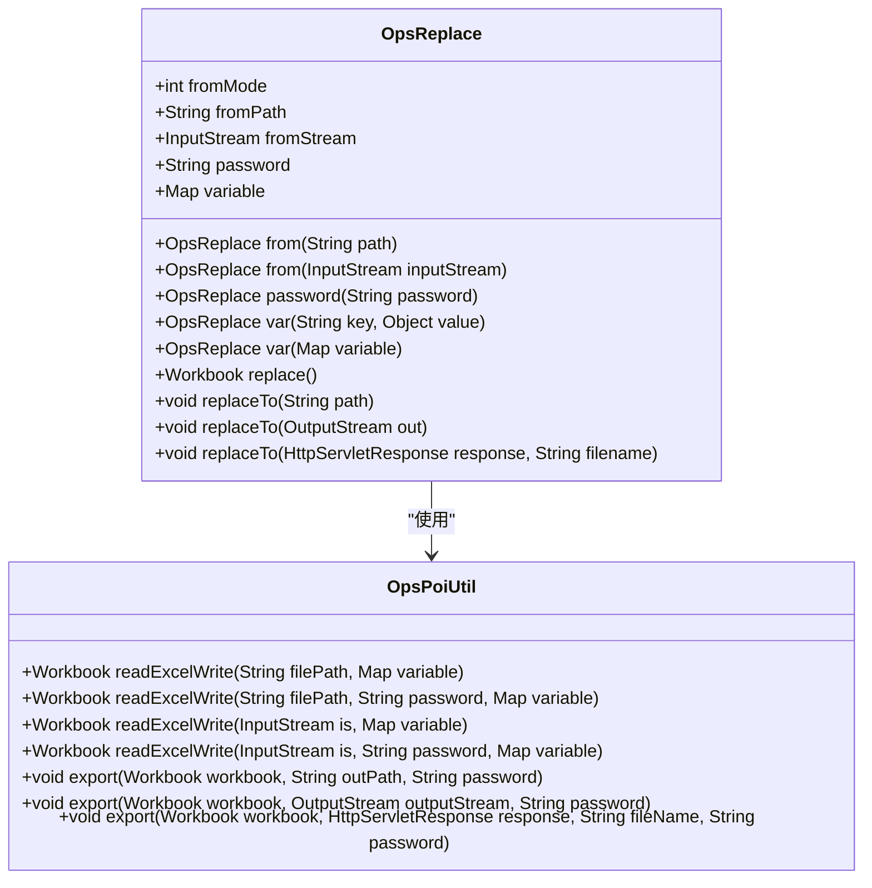

# OpsReplace API

<cite>
**本文档中引用的文件**  
- [OpsReplace.java](file://src/main/java/com/github/stupdit1t/excel/core/replace/OpsReplace.java)
- [OpsPoiUtil.java](file://src/main/java/com/github/stupdit1t/excel/core/OpsPoiUtil.java)
- [ReplaceClass.java](file://src/test/java/excel/replace/ReplaceClass.java)
</cite>

## 目录
1. [简介](#简介)
2. [核心功能概述](#核心功能概述)
3. [输入源设置（from方法）](#输入源设置from方法)
4. [加密文件支持（password方法）](#加密文件支持password方法)
5. [变量替换配置（var方法）](#变量替换配置var方法)
6. [替换执行与结果返回（replace方法）](#替换执行与结果返回replace方法)
7. [输出操作系列方法（replaceTo）](#输出操作系列方法replaceto)
8. [底层替换机制（OpsPoiUtil.readExcelWrite）](#底层替换机制opspoiutilreadexcelwrite)
9. [综合使用示例](#综合使用示例)
10. [类结构与数据流图](#类结构与数据流图)

## 简介
OpsReplace类是poi-excel库中用于实现Excel模板变量替换的核心组件。它提供了一种流畅的API风格，允许用户通过链式调用设置模板源、定义替换变量，并将结果输出到不同目标。该类特别适用于生成基于模板的动态Excel文件，如报表、合同、通知单等场景。其设计目标是简化Excel内容替换流程，同时支持文本和图片的混合替换。

## 核心功能概述
OpsReplace类的核心功能围绕模板引擎展开，通过读取预定义的Excel模板文件，识别并替换其中的占位符变量（格式为`${variable}`），最终生成新的Excel文件。该类支持从文件路径或输入流加载模板，可处理加密的Excel文件，并允许通过多种方式设置替换变量。替换完成后，结果可以以Workbook对象形式返回，或直接输出到文件、输出流或HTTP响应中。

## 输入源设置（from方法）
OpsReplace类提供了两个`from`方法重载，用于指定模板的输入源。这两个方法实现了互斥性控制，确保同一实例只能设置一种输入方式。

```java
public OpsReplace from(String path)
public OpsReplace from(InputStream inputStream)
```

- **文件路径输入**：通过`from(String path)`方法，用户可以直接传入模板文件的系统路径。该方法会将路径字符串保存在`fromPath`字段中，并将`fromMode`设置为1。
- **输入流输入**：通过`from(InputStream inputStream)`方法，用户可以传入一个`InputStream`对象，适用于从网络、内存或其他非文件系统来源读取模板。该方法会将流对象保存在`fromStream`字段中，并将`fromMode`设置为2。

两种输入方式通过`checkSetFromMode`私有方法进行状态检测，若尝试混合使用将抛出`UnsupportedOperationException`异常，确保了输入源的一致性和安全性。

**Section sources**
- [OpsReplace.java](file://src/main/java/com/github/stupdit1t/excel/core/replace/OpsReplace.java#L35-L54)

## 加密文件支持（password方法）
为了支持对加密Excel文件的模板替换，OpsReplace类提供了`password`方法，用于设置打开加密文件所需的密码。

```java
public OpsReplace password(String password)
```

该方法接收一个字符串参数作为密码，并将其存储在`password`字段中。当调用`replace`方法执行替换时，系统会检测`password`字段是否为空。若不为空，则在调用`OpsPoiUtil.readExcelWrite`时传入该密码，从而能够正确读取受保护的Excel文件。此功能依赖于Apache POI的加密解密机制，支持标准的Excel加密格式。

**Section sources**
- [OpsReplace.java](file://src/main/java/com/github/stupdit1t/excel/core/replace/OpsReplace.java#L65-L71)

## 变量替换配置（var方法）
OpsReplace类提供了两种`var`方法重载，用于设置需要替换的变量，内部通过`HashMap<String, Object>`存储所有变量。

```java
public OpsReplace var(String key, Object value)
public OpsReplace var(Map<String, Object> variable)
```

- **单个变量设置**：`var(String key, Object value)`方法允许逐个添加变量，将指定的键值对直接放入`variable`映射中。
- **批量变量设置**：`var(Map<String, Object> variable)`方法支持一次性传入一个完整的映射，通过`putAll`方法将其全部合并到内部变量映射中。

这种设计提供了极大的灵活性，用户可以根据需要选择逐个添加变量或批量导入。变量值可以是任意对象，系统在替换时会自动调用`String.valueOf()`进行转换。特别地，当值为`byte[]`类型时，系统会将其识别为图片数据并执行图片插入操作。

**Section sources**
- [OpsReplace.java](file://src/main/java/com/github/stupdit1t/excel/core/replace/OpsReplace.java#L75-L90)

## 替换执行与结果返回（replace方法）
`replace`方法是执行模板替换的核心入口，其设计意图是返回一个`Workbook`对象，为上层应用提供最大的灵活性。

```java
public Workbook replace()
```

该方法首先验证输入源是否已设置，然后根据`fromMode`判断是使用文件路径还是输入流来调用`OpsPoiUtil.readExcelWrite`。如果设置了密码，则传入密码参数。最终，该方法返回一个已执行完变量替换的`Workbook`实例。

返回`Workbook`对象的设计允许开发者在替换后进行进一步的自定义操作，如修改样式、添加数据、调整格式等，然后再决定如何输出。这种设计遵循了“分离关注点”的原则，将“替换”和“输出”两个职责分开，提高了API的可扩展性和复用性。

**Section sources**
- [OpsReplace.java](file://src/main/java/com/github/stupdit1t/excel/core/replace/OpsReplace.java#L92-L121)

## 输出操作系列方法（replaceTo）
为了简化常见的输出场景，OpsReplace类提供了三个`replaceTo`方法重载，封装了替换和输出的完整流程。

```java
public void replaceTo(String path)
public void replaceTo(OutputStream out)
public void replaceTo(HttpServletResponse response, String filename)
```

这三个方法的实现逻辑高度一致：首先调用`replace()`方法获取处理后的`Workbook`对象，然后调用`OpsPoiUtil.export`将其导出到指定目标。目标可以是：
- **文件路径**：将结果保存到指定的文件系统路径。
- **输出流**：将结果写入给定的`OutputStream`，适用于网络传输或内存操作。
- **HTTP响应**：将结果作为附件发送给客户端浏览器，常用于Web应用中的文件下载功能。

这些方法在导出时会检查是否设置了密码，如果设置了，则对输出文件进行加密保护。

**Section sources**
- [OpsReplace.java](file://src/main/java/com/github/stupdit1t/excel/core/replace/OpsReplace.java#L123-L148)

## 底层替换机制（OpsPoiUtil.readExcelWrite）
OpsReplace类的替换功能依赖于`OpsPoiUtil.readExcelWrite`方法实现底层逻辑。该方法遍历工作簿中的每个工作表和单元格，查找包含`${variable}`格式的字符串，并进行替换。

核心逻辑如下：
1. 遍历所有Sheet、Row和Cell。
2. 对于字符串类型的单元格值，检查是否包含`$`符号。
3. 遍历所有预设变量，查找匹配的`${key}`占位符。
4. 如果变量值是`byte[]`，则将其作为图片插入到单元格位置，并清除占位符。
5. 如果是普通值，则将其转换为字符串并替换占位符。
6. 支持公式替换，以`=`开头的字符串会被识别为公式。

该机制不仅支持文本替换，还支持图片插入，实现了富内容模板的填充能力。

**Section sources**
- [OpsPoiUtil.java](file://src/main/java/com/github/stupdit1t/excel/core/OpsPoiUtil.java#L1210-L1280)

## 综合使用示例
以下是一个包含文本和图片替换的综合使用示例，展示了OpsReplace的完整功能：

```java
ExcelHelper.opsReplace()
    .from("template.xlsx")                                    // 设置模板路径
    .var("projectName", "中青旅")                              // 文本变量
    .var("buildName", "管材生产")
    .var("sendDate", "2020-02-02")
    .var("reciveSb", "张三")
    .var("phone", "15594980303")
    .var("address", "陕西省xxxx")
    .var("company", imageBytes)                               // 图片变量（公司logo）
    .var("remark", remarkImageBytes)                          // 图片变量（备注图）
    .replaceTo("output.xlsx");                                // 输出到文件
```

此示例中，`imageBytes`和`remarkImageBytes`是通过`FileUtils.readFileToByteArray`读取的PNG图片字节数组。在模板中，`${company}`和`${remark}`占位符将被替换为对应的图片。

**Section sources**
- [ReplaceClass.java](file://src/test/java/excel/replace/ReplaceClass.java#L10-L26)

## 类结构与数据流图



**Diagram sources**
- [OpsReplace.java](file://src/main/java/com/github/stupdit1t/excel/core/replace/OpsReplace.java)
- [OpsPoiUtil.java](file://src/main/java/com/github/stupdit1t/excel/core/OpsPoiUtil.java)