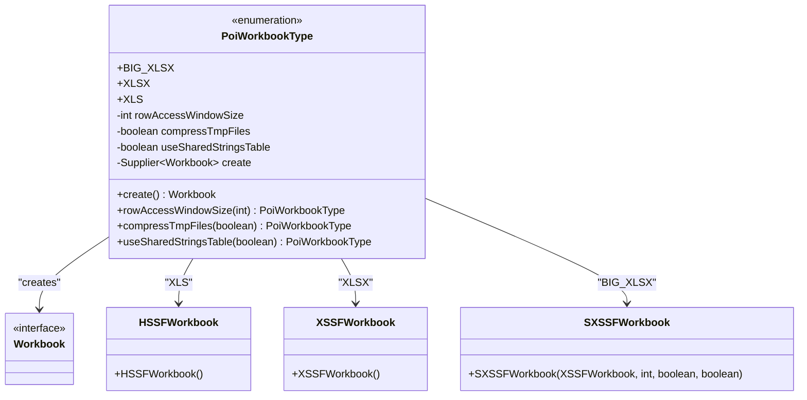
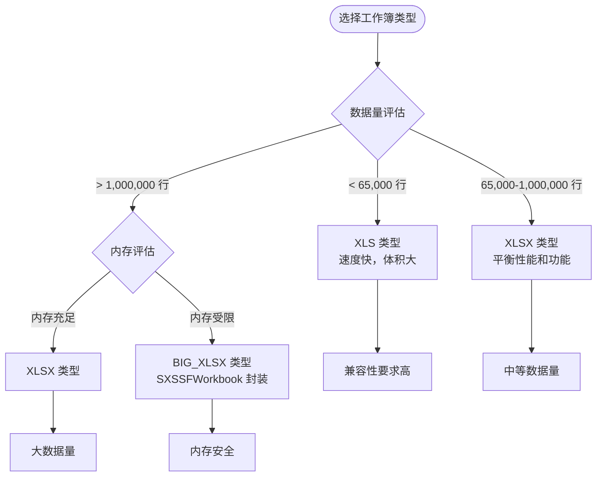
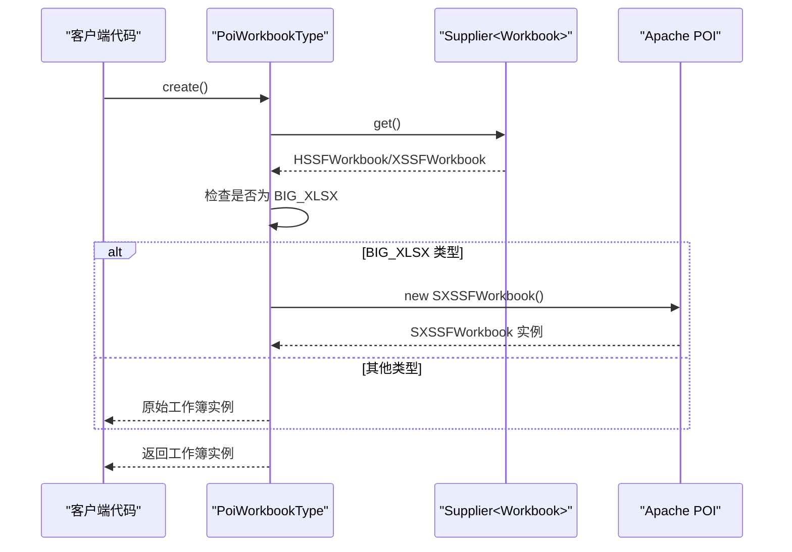
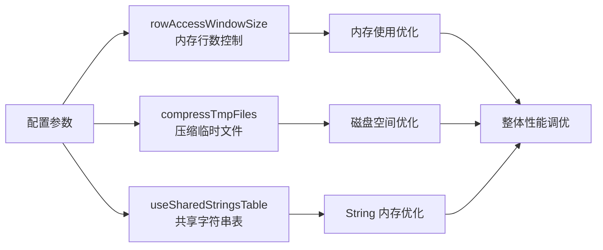
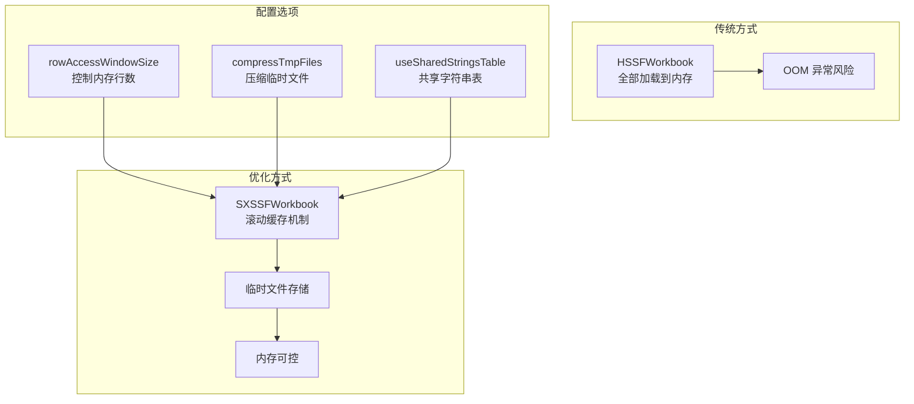
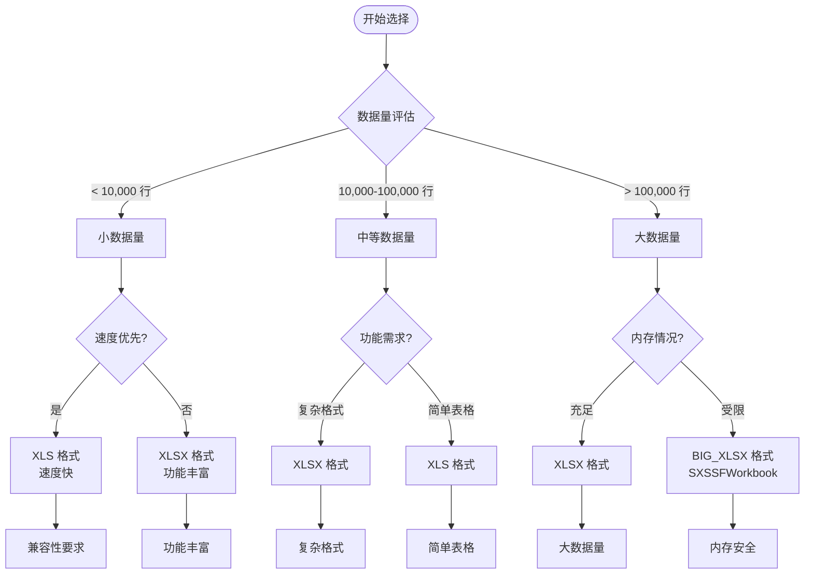

# PoiWorkbookType 枚举 API 文档

<cite>
**本文档引用的文件**
- [PoiWorkbookType.java](file://src/main/java/com/github/stupdit1t/excel/common/PoiWorkbookType.java)
- [ExcelHelper.java](file://src/main/java/com/github/stupdit1t/excel/core/ExcelHelper.java)
- [OpsExport.java](file://src/main/java/com/github/stupdit1t/excel/core/export/OpsExport.java)
- [OpsPoiUtil.java](file://src/main/java/com/github/stupdit1t/excel/core/OpsPoiUtil.java)
- [README.md](file://README.md)
- [README-export.md](file://README-export.md)
</cite>

## 目录
1. [简介](#简介)
2. [枚举类型概述](#枚举类型概述)
3. [工作簿类型详解](#工作簿类型详解)
4. [核心方法分析](#核心方法分析)
5. [配置参数详解](#配置参数详解)
6. [性能优化机制](#性能优化机制)
7. [使用场景指南](#使用场景指南)
8. [最佳实践建议](#最佳实践建议)
9. [故障排除](#故障排除)
10. [总结](#总结)

## 简介

PoiWorkbookType 是 poi-excel 项目中的核心枚举类型，用于定义 Excel 工作簿的不同格式类型。该枚举封装了 Apache POI 中的 HSSFWorkbook（XLS）、XSSFWorkbook（XLSX）和 SXSSFWorkbook（BIG_XLSX）三种工作簿类型，为开发者提供了统一的工作簿创建和管理接口。

通过 PoiWorkbookType 枚举，开发者可以轻松选择适合特定场景的工作簿类型，并利用其内置的配置参数来优化大数据导出时的性能表现。

## 枚举类型概述

PoiWorkbookType 枚举定义了三种主要的工作簿类型：



**图表来源**
- [PoiWorkbookType.java](file://src/main/java/com/github/stupdit1t/excel/common/PoiWorkbookType.java#L10-L107)

**章节来源**
- [PoiWorkbookType.java](file://src/main/java/com/github/stupdit1t/excel/common/PoiWorkbookType.java#L1-L107)

## 工作簿类型详解

### XLS 类型（03 Excel）

**特点：**
- 速度快，适合小数据量导出
- 单个 sheet 最大行数：65,535 行
- 文件体积较大
- 支持密码保护

**适用场景：**
- 数据量较小（通常小于 65,000 行）
- 需要兼容旧版 Excel 版本
- 对导出速度要求较高

### XLSX 类型（07 Excel）

**特点：**
- 速度较慢，但平衡了性能和功能
- 单个 sheet 最大行数：1,048,576 行
- 文件体积相对较小
- 支持丰富的格式和功能

**适用场景：**
- 中等数据量（几千到几十万行）
- 需要复杂格式和公式支持
- 对文件大小有一定要求

### BIG_XLSX 类型（大数据工作簿）

**特点：**
- 专门针对大数据量设计
- 速度最慢，但能解决内存不足问题
- 单个 sheet 最大行数：1,048,576 行
- 内部封装 SXSSFWorkbook 实现内存优化

**适用场景：**
- 大数据量导出（百万行以上）
- 内存受限环境
- 需要避免 OOM（Out of Memory）异常



**章节来源**
- [PoiWorkbookType.java](file://src/main/java/com/github/stupdit1t/excel/common/PoiWorkbookType.java#L12-L28)

## 核心方法分析

### create() 方法

`create()` 方法是 PoiWorkbookType 枚举的核心方法，负责根据不同的工作簿类型创建相应的 Apache POI 实例：

```java
public Workbook create() {
    Workbook workbook = create.get();
    if (this == PoiWorkbookType.BIG_XLSX) {
        workbook = new SXSSFWorkbook((XSSFWorkbook) workbook, this.rowAccessWindowSize, this.compressTmpFiles, this.useSharedStringsTable);
    }
    return workbook;
}
```

**实现机制：**

1. **基础创建工作簿**：使用 Supplier 接口创建基础工作簿实例
2. **特殊处理 BIG_XLSX**：对于 BIG_XLSX 类型，将其包装为 SXSSFWorkbook
3. **内存管理**：通过 SXSSFWorkbook 提供内存优化功能



**图表来源**
- [PoiWorkbookType.java](file://src/main/java/com/github/stupdit1t/excel/common/PoiWorkbookType.java#L47-L54)

**章节来源**
- [PoiWorkbookType.java](file://src/main/java/com/github/stupdit1t/excel/common/PoiWorkbookType.java#L47-L54)

## 配置参数详解

### rowAccessWindowSize 参数

**作用：** 控制内存中保持的行数，超过此数量时会将数据刷新到磁盘临时文件。

**默认值：** 200 行

**配置方法：**
```java
PoiWorkbookType.BIG_XLSX.rowAccessWindowSize(1000)
```

**性能影响：**
- 较小值（如 100）：内存占用少，但频繁 I/O 操作
- 较大值（如 1000）：内存占用较多，但减少 I/O 操作

### compressTmpFiles 参数

**作用：** 是否对临时文件使用 gzip 压缩

**默认值：** false

**配置方法：**
```java
PoiWorkbookType.BIG_XLSX.compressTmpFiles(true)
```

**性能影响：**
- true：节省磁盘空间，但增加 CPU 压力
- false：占用更多磁盘空间，但减少 CPU 使用

### useSharedStringsTable 参数

**作用：** 是否使用共享字符串表来优化内存使用

**默认值：** false

**配置方法：**
```java
PoiWorkbookType.BIG_XLSX.useSharedStringsTable(true)
```

**性能影响：**
- true：减少重复字符串的内存占用
- false：内存使用更直观，但可能浪费空间



**章节来源**
- [PoiWorkbookType.java](file://src/main/java/com/github/stupdit1t/excel/common/PoiWorkbookType.java#L30-L45)

## 性能优化机制

### BIG_XLSX 内部实现机制

BIG_XLSX 类型通过封装 SXSSFWorkbook 来实现内存优化：

```java
// 内部实现原理
if (this == PoiWorkbookType.BIG_XLSX) {
    workbook = new SXSSFWorkbook((XSSFWorkbook) workbook, this.rowAccessWindowSize, this.compressTmpFiles, this.useSharedStringsTable);
}
```

**SXSSFWorkbook 特性：**
1. **滚动缓存**：只保留指定数量的行在内存中
2. **临时文件**：超出缓存的行自动写入磁盘
3. **内存回收**：及时释放不再使用的内存
4. **透明操作**：对用户完全透明，无需手动管理

### 内存溢出解决方案



**图表来源**
- [PoiWorkbookType.java](file://src/main/java/com/github/stupdit1t/excel/common/PoiWorkbookType.java#L47-L54)

**章节来源**
- [PoiWorkbookType.java](file://src/main/java/com/github/stupdit1t/excel/common/PoiWorkbookType.java#L47-L54)

## 使用场景指南

### 选择决策流程



### 具体场景推荐

**场景 1：报表导出（几千行）**
```java
// 推荐使用 XLSX
ExcelHelper.opsExport(PoiWorkbookType.XLSX)
    .opsSheet(reportData)
    .opsHeader().simple().texts("日期", "销售额", "客户数").done()
    .opsColumn().fields("date", "amount", "customerCount").done()
    .export("report.xlsx");
```

**场景 2：大数据量导出（百万行）**
```java
// 推荐使用 BIG_XLSX 并优化配置
ExcelHelper.opsExport(PoiWorkbookType.BIG_XLSX
    .rowAccessWindowSize(500)
    .compressTmpFiles(true)
    .useSharedStringsTable(true))
    .opsSheet(largeData)
    .opsHeader().simple().texts("ID", "姓名", "邮箱").done()
    .opsColumn().fields("id", "name", "email").done()
    .export("large_data.xlsx");
```

**场景 3：兼容性要求高的场景**
```java
// 推荐使用 XLS
ExcelHelper.opsExport(PoiWorkbookType.XLS)
    .opsSheet(compatibilityData)
    .opsHeader().simple().texts("字段1", "字段2").done()
    .opsColumn().fields("field1", "field2").done()
    .export("compatibility.xls");
```

**章节来源**
- [README-export.md](file://README-export.md#L1-L26)
- [README-export.md](file://README-export.md#L28-L145)

## 最佳实践建议

### 配置参数调优

**大数据量场景（> 100,000 行）：**
```java
// 推荐配置
PoiWorkbookType.BIG_XLSX
    .rowAccessWindowSize(1000)      // 根据可用内存调整
    .compressTmpFiles(true)         // 节省磁盘空间
    .useSharedStringsTable(true);   // 减少重复字符串内存占用
```

**中等数据量场景（10,000-100,000 行）：**
```java
// 推荐配置
PoiWorkbookType.XLSX
    .rowAccessWindowSize(200)       // 默认值，平衡性能
    .compressTmpFiles(false)        // 不压缩，提高速度
    .useSharedStringsTable(false);  // 简单场景，不启用
```

**小数据量场景（< 10,000 行）：**
```java
// 推荐配置
PoiWorkbookType.XLS
    .rowAccessWindowSize(200)       // 不重要，因为数据量小
    .compressTmpFiles(false)        // 不重要
    .useSharedStringsTable(false);  // 不重要
```

### 性能监控指标

**监控要点：**
1. **内存使用率**：监控 JVM 堆内存使用情况
2. **磁盘 I/O**：观察临时文件的读写频率
3. **导出时间**：记录不同类型的工作簿导出耗时
4. **文件大小**：比较不同配置下的输出文件大小

**章节来源**
- [OpsPoiUtil.java](file://src/main/java/com/github/stupdit1t/excel/core/OpsPoiUtil.java#L70-L85)

## 故障排除

### 常见问题及解决方案

**问题 1：内存不足异常（OutOfMemoryError）**
- **原因**：大数据量使用 XLSX 格式
- **解决方案**：改用 BIG_XLSX 类型并调整 rowAccessWindowSize 参数
- **示例**：
```java
// 原始代码（可能导致 OOM）
ExcelHelper.opsExport(PoiWorkbookType.XLSX)

// 改进代码
ExcelHelper.opsExport(PoiWorkbookType.BIG_XLSX
    .rowAccessWindowSize(500))
```

**问题 2：导出速度过慢**
- **原因**：BIG_XLSX 类型默认配置过于保守
- **解决方案**：适当增大 rowAccessWindowSize 并禁用压缩
- **示例**：
```java
// 优化配置
ExcelHelper.opsExport(PoiWorkbookType.BIG_XLSX
    .rowAccessWindowSize(2000)
    .compressTmpFiles(false))
```

**问题 3：临时文件过多导致磁盘空间不足**
- **原因**：compressTmpFiles=false 且数据量巨大
- **解决方案**：定期清理临时文件或启用压缩
- **示例**：
```java
// 启用压缩
ExcelHelper.opsExport(PoiWorkbookType.BIG_XLSX
    .compressTmpFiles(true))
```

### 调试技巧

**启用日志记录：**
```java
// 添加日志配置
Logger logger = LogManager.getLogger(OpsPoiUtil.class);
logger.info("正在使用 {} 工作簿类型", workbookType);
```

**监控内存使用：**
```java
// 获取 JVM 内存信息
Runtime runtime = Runtime.getRuntime();
long maxMemory = runtime.maxMemory();
long totalMemory = runtime.totalMemory();
long freeMemory = runtime.freeMemory();
long usedMemory = totalMemory - freeMemory;
```

**章节来源**
- [OpsPoiUtil.java](file://src/main/java/com/github/stupdit1t/excel/core/OpsPoiUtil.java#L1-L50)

## 总结

PoiWorkbookType 枚举为 poi-excel 项目提供了灵活而强大的工作簿类型管理功能。通过合理选择和配置不同的工作簿类型，开发者可以在性能、功能和内存使用之间找到最佳平衡点。

**关键要点：**

1. **XLS 类型**：适用于小数据量和兼容性要求高的场景
2. **XLSX 类型**：提供良好的性能和功能平衡，适合大多数场景
3. **BIG_XLSX 类型**：专为大数据量设计，通过 SXSSFWorkbook 实现内存优化
4. **配置参数**：通过 rowAccessWindowSize、compressTmpFiles 和 useSharedStringsTable 参数实现精细化性能调优
5. **最佳实践**：根据数据量、内存限制和功能需求选择合适的工作簿类型和配置参数

通过深入理解 PoiWorkbookType 枚举的设计理念和实现机制，开发者可以更好地利用 poi-excel 库处理各种 Excel 导出场景，实现高效、稳定的 Excel 处理功能。