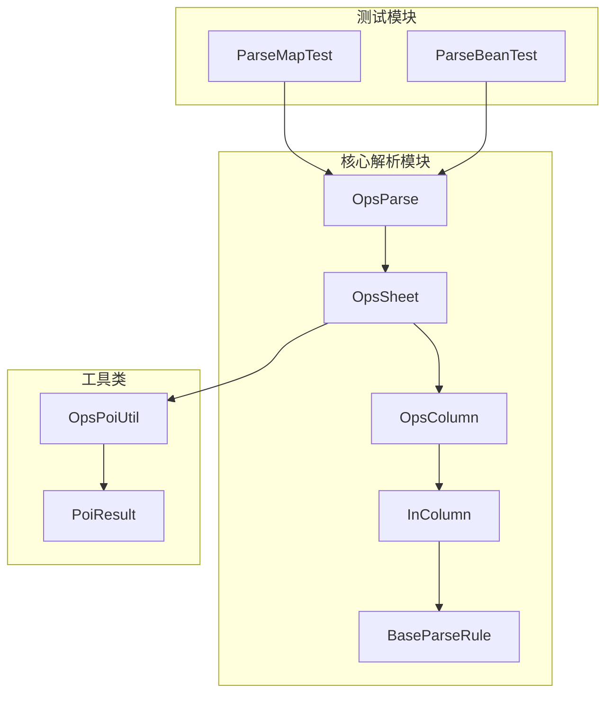
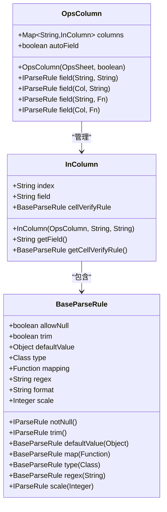
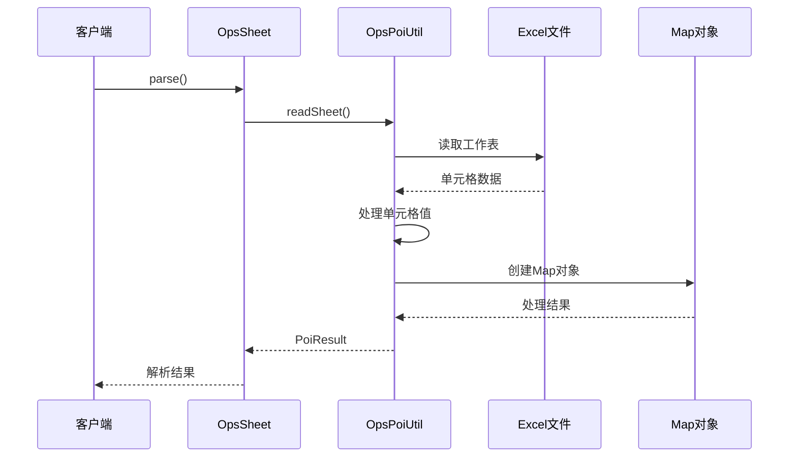
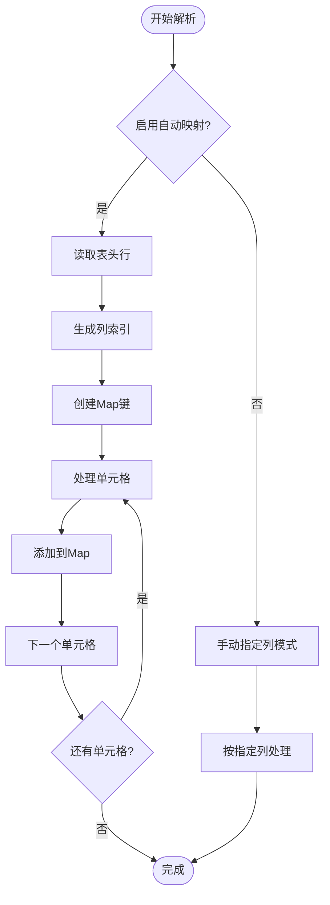
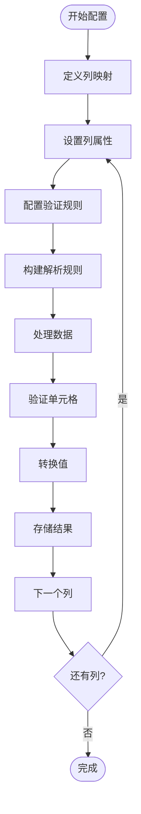
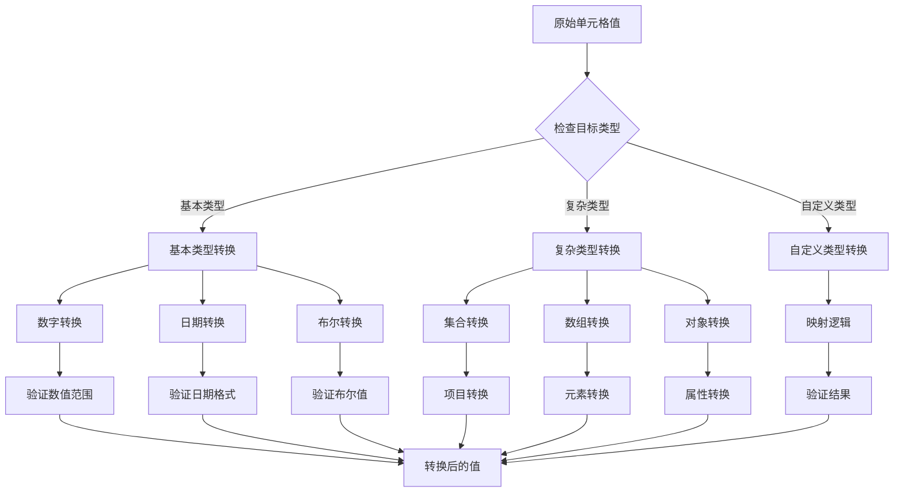
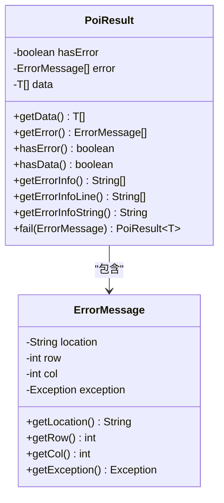
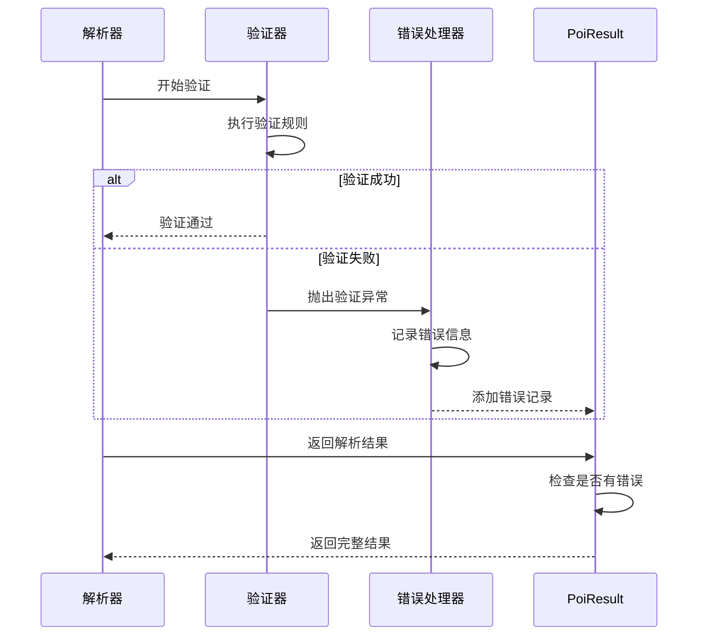

# Map数据导入

<cite>
**本文档引用的文件**
- [README-import.md](file://README-import.md)
- [ParseMapTest.java](file://src/test/java/excel/parse/ParseMapTest.java)
- [OpsColumn.java](file://src/main/java/com/github/stupdit1t/excel/core/parse/OpsColumn.java)
- [InColumn.java](file://src/main/java/com/github/stupdit1t/excel/core/parse/InColumn.java)
- [BaseParseRule.java](file://src/main/java/com/github/stupdit1t/excel/core/parse/BaseParseRule.java)
- [OpsSheet.java](file://src/main/java/com/github/stupdit1t/excel/core/parse/OpsSheet.java)
- [OpsPoiUtil.java](file://src/main/java/com/github/stupdit1t/excel/core/OpsPoiUtil.java)
- [PoiResult.java](file://src/main/java/com/github/stupdit1t/excel/common/PoiResult.java)
</cite>

## 目录
1. [简介](#简介)
2. [项目结构概览](#项目结构概览)
3. [核心组件分析](#核心组件分析)
4. [自动映射列机制](#自动映射列机制)
5. [手动指定列机制](#手动指定列机制)
6. [字段配置详解](#字段配置详解)
7. [类型转换与自定义映射](#类型转换与自定义映射)
8. [PoiResult处理流程](#poiresult处理流程)
9. [实际应用示例](#实际应用示例)
10. [性能考虑](#性能考虑)
11. [故障排除指南](#故障排除指南)
12. [总结](#总结)

## 简介

Map数据导入功能是poi-excel框架的核心特性之一，它提供了灵活而强大的Excel数据解析能力。该功能允许开发者将Excel表格中的数据直接转换为Java Map对象，支持自动映射和手动指定列两种模式，并提供丰富的字段验证和转换功能。

Map数据导入的主要特点：
- **灵活的数据映射**：支持自动列名映射和手动列指定
- **强大的字段验证**：提供多种验证规则和转换选项
- **类型安全**：支持类型转换和自定义映射逻辑
- **错误处理**：完善的错误收集和报告机制
- **高性能**：基于事件驱动的解析引擎

## 项目结构概览

poi-excel项目采用模块化的架构设计，核心解析功能集中在`core/parse`包中：



**图表来源**
- [OpsParse.java](file://src/main/java/com/github/stupdit1t/excel/core/parse/OpsParse.java)
- [OpsSheet.java](file://src/main/java/com/github/stupdit1t/excel/core/parse/OpsSheet.java)
- [OpsColumn.java](file://src/main/java/com/github/stupdit1t/excel/core/parse/OpsColumn.java)

## 核心组件分析

### OpsColumn - 列定义管理器

OpsColumn类是Map数据导入的核心组件，负责管理Excel列的定义和映射关系：



**图表来源**
- [OpsColumn.java](file://src/main/java/com/github/stupdit1t/excel/core/parse/OpsColumn.java#L15-L98)
- [InColumn.java](file://src/main/java/com/github/stupdit1t/excel/core/parse/InColumn.java#L10-L57)
- [BaseParseRule.java](file://src/main/java/com/github/stupdit1t/excel/core/parse/BaseParseRule.java#L15-L250)

### OpsPoiUtil - 底层解析引擎

OpsPoiUtil类提供了底层的Excel解析功能，支持多种数据类型的转换和处理：



**图表来源**
- [OpsSheet.java](file://src/main/java/com/github/stupdit1t/excel/core/parse/OpsSheet.java#L200-L227)
- [OpsPoiUtil.java](file://src/main/java/com/github/stupdit1t/excel/core/OpsPoiUtil.java#L957-L1100)

**章节来源**
- [OpsColumn.java](file://src/main/java/com/github/stupdit1t/excel/core/parse/OpsColumn.java#L1-L98)
- [InColumn.java](file://src/main/java/com/github/stupdit1t/excel/core/parse/InColumn.java#L1-L57)
- [BaseParseRule.java](file://src/main/java/com/github/stupdit1t/excel/core/parse/BaseParseRule.java#L1-L250)
- [OpsPoiUtil.java](file://src/main/java/com/github/stupdit1t/excel/core/OpsPoiUtil.java#L957-L1100)

## 自动映射列机制

自动映射列是Map数据导入最便捷的功能，它能够根据Excel表头自动建立列名与Map键的映射关系。

### 自动映射原理

当启用自动映射（`.opsColumn(true)`）时，系统会执行以下操作：

1. **列名识别**：读取Excel第一行作为列名
2. **索引生成**：将列名转换为对应的字母索引（A, B, C, ...）
3. **自动映射**：将列名直接作为Map的键
4. **动态扩展**：如果遇到新的列，自动添加到映射中

### 实现机制



**图表来源**
- [OpsColumn.java](file://src/main/java/com/github/stupdit1t/excel/core/parse/OpsColumn.java#L25-L40)
- [OpsPoiUtil.java](file://src/main/java/com/github/stupdit1t/excel/core/OpsPoiUtil.java#L1060-L1080)

### 使用示例

```java
// 自动映射列示例
PoiResult<HashMap> parse = ExcelHelper.opsParse(HashMap.class)
        .from("data.xlsx")
        .opsSheet(0, 1, 0)  // 从第1行开始，跳过表头
        .opsColumn(true)    // 启用自动映射
        .done()
        .parse();
```

在这种模式下，Excel的第一行被用作Map的键，后续行的数据被转换为Map对象。

**章节来源**
- [README-import.md](file://README-import.md#L1-L48)
- [ParseMapTest.java](file://src/test/java/excel/parse/ParseMapTest.java#L25-L42)

## 手动指定列机制

手动指定列模式提供了更精细的控制，允许开发者明确指定哪些列需要解析以及如何处理这些列。

### 手动指定列的优势

1. **精确控制**：可以只解析需要的列
2. **性能优化**：避免处理不必要的列
3. **灵活性**：支持复杂的列映射逻辑
4. **错误隔离**：单个列的错误不会影响其他列

### 实现原理



**图表来源**
- [OpsColumn.java](file://src/main/java/com/github/stupdit1t/excel/core/parse/OpsColumn.java#L42-L98)
- [BaseParseRule.java](file://src/main/java/com/github/stupdit1t/excel/core/parse/BaseParseRule.java#L150-L200)

### 使用示例

```java
// 手动指定列示例
PoiResult<HashMap> parse = ExcelHelper.opsParse(HashMap.class)
        .from("data.xlsx")
        .opsSheet(0, 1, 0)
        .opsColumn()  // 手动指定列
        .field(Col.A, "name")      // A列映射为"name"键
        .field(Col.B, "age")       // B列映射为"age"键
        .field(Col.C, "email")     // C列映射为"email"键
        .done()
        .parse();
```

**章节来源**
- [README-import.md](file://README-import.md#L49-L77)
- [ParseMapTest.java](file://src/test/java/excel/parse/ParseMapTest.java#L73-L108)

## 字段配置详解

字段配置是Map数据导入的核心功能，提供了丰富的验证和转换选项。

### 基础配置选项

#### 1. trim() - 去除空格
```java
.field(Col.A, "name").trim()
```
移除字段值两端的空白字符，常用于文本字段的预处理。

#### 2. notNull() - 非空验证
```java
.field(Col.B, "age").notNull()
```
确保字段值不能为空，否则会抛出验证异常。

#### 3. defaultValue() - 默认值
```java
.field(Col.C, "status").defaultValue("active")
```
当字段值为空时，使用指定的默认值替代。

#### 4. regex() - 正则表达式验证
```java
.field(Col.D, "phone").regex("^1[3-9]\\d{9}$")
```
使用正则表达式验证字段值的格式。

### 高级配置选项

#### 5. type() - 类型转换
```java
.field(Col.E, "price").type(Double.class).scale(2)
```
指定字段的目标类型，并进行相应的类型转换。

#### 6. scale() - 数值精度控制
```java
.field(Col.F, "amount").type(BigDecimal.class).scale(4)
```
设置数值类型的精度，常用于货币或科学计算场景。

#### 7. map() - 自定义映射
```java
.field(Col.G, "level").map(val -> {
    switch (val.toString().toLowerCase()) {
        case "high": return 3;
        case "medium": return 2;
        case "low": return 1;
        default: return 0;
    }
})
```
提供自定义的值映射逻辑，支持复杂的数据转换。

### 配置组合示例

```java
PoiResult<HashMap> parse = ExcelHelper.opsParse(HashMap.class)
        .from("data.xlsx")
        .opsSheet(0, 1, 0)
        .opsColumn()
        .field(Col.A, "name")
            .trim()
            .notNull()
            .defaultValue("无名氏")
            .regex("^[\\u4e00-\\u9fa5]{2,5}$")
        .field(Col.B, "age")
            .type(Integer.class)
            .notNull()
            .map(val -> {
                int age = Integer.parseInt(val.toString());
                if (age < 0 || age > 150) {
                    throw new PoiException("年龄范围无效");
                }
                return age;
            })
        .field(Col.C, "salary")
            .type(Double.class)
            .scale(2)
            .defaultValue(0.0)
        .done()
        .parse();
```

**章节来源**
- [README-import.md](file://README-import.md#L49-L77)
- [BaseParseRule.java](file://src/main/java/com/github/stupdit1t/excel/core/parse/BaseParseRule.java#L60-L150)

## 类型转换与自定义映射

类型转换和自定义映射是Map数据导入的强大功能，允许开发者对数据进行深度处理和转换。

### 类型转换机制



**图表来源**
- [BaseParseRule.java](file://src/main/java/com/github/stupdit1t/excel/core/parse/BaseParseRule.java#L120-L150)
- [OpsPoiUtil.java](file://src/main/java/com/github/stupdit1t/excel/core/OpsPoiUtil.java#L1060-L1100)

### 自定义映射实现

自定义映射通过`map()`方法实现，支持复杂的业务逻辑：

```java
// 地区映射示例
Map<String, Integer> regionMapping = new HashMap<>();
regionMapping.put("华东", 1);
regionMapping.put("华南", 2);
regionMapping.put("华北", 3);
regionMapping.put("华中", 4);
regionMapping.put("西南", 5);
regionMapping.put("西北", 6);
regionMapping.put("东北", 7);

.field(Col.H, "regionCode")
    .notNull()
    .map(regionMapping::get)
    .defaultValue(0)  // 未匹配的地区使用默认值
```

### 类型转换示例

```java
// 复杂类型转换示例
.field(Col.I, "tags")
    .type(List.class)
    .map(val -> {
        if (val == null || val.toString().isEmpty()) {
            return Collections.emptyList();
        }
        String[] tagArray = val.toString().split(",");
        return Arrays.stream(tagArray)
                .map(String::trim)
                .filter(s -> !s.isEmpty())
                .collect(Collectors.toList());
    })

.field(Col.J, "metadata")
    .type(Map.class)
    .map(val -> {
        if (val == null || val.toString().isEmpty()) {
            return Collections.emptyMap();
        }
        // 假设JSON格式存储
        ObjectMapper mapper = new ObjectMapper();
        return mapper.readValue(val.toString(), Map.class);
    })
```

**章节来源**
- [BaseParseRule.java](file://src/main/java/com/github/stupdit1t/excel/core/parse/BaseParseRule.java#L120-L150)
- [OpsPoiUtil.java](file://src/main/java/com/github/stupdit1t/excel/core/OpsPoiUtil.java#L1060-L1100)

## PoiResult处理流程

PoiResult是Map数据导入的结果容器，提供了完整的错误处理和数据访问功能。

### PoiResult结构



**图表来源**
- [PoiResult.java](file://src/main/java/com/github/stupdit1t/excel/common/PoiResult.java#L10-L159)

### 错误处理流程



**图表来源**
- [PoiResult.java](file://src/main/java/com/github/stupdit1t/excel/common/PoiResult.java#L50-L100)
- [OpsPoiUtil.java](file://src/main/java/com/github/stupdit1t/excel/core/OpsPoiUtil.java#L1080-L1120)

### 错误信息处理

PoiResult提供了多种错误信息格式化方法：

```java
// 获取简单的错误信息列表
List<String> errors = result.getErrorInfo();

// 获取行级别的错误信息
List<String> lineErrors = result.getErrorInfoLine();

// 获取格式化的错误信息字符串
String errorString = result.getErrorInfoString();

// 获取带分隔符的错误信息
String formattedErrors = result.getErrorInfoString("<br/>");
```

### 数据获取与处理

```java
// 检查是否有错误
if (result.hasError()) {
    System.out.println("解析过程中出现错误:");
    System.out.println(result.getErrorInfoString());
}

// 获取解析后的数据
List<HashMap> dataList = result.getData();
if (result.hasData()) {
    dataList.forEach(map -> {
        System.out.println("姓名: " + map.get("name"));
        System.out.println("年龄: " + map.get("age"));
        System.out.println("邮箱: " + map.get("email"));
    });
}
```

**章节来源**
- [PoiResult.java](file://src/main/java/com/github/stupdit1t/excel/common/PoiResult.java#L1-L159)
- [OpsPoiUtil.java](file://src/main/java/com/github/stupdit1t/excel/core/OpsPoiUtil.java#L1080-L1120)

## 实际应用示例

基于README-import.md中的示例，我将详细解释各种Map数据导入的应用场景。

### 示例1：快速转Map - 自动映射列

这是最简单的Map数据导入方式，适用于表头清晰且不需要特殊处理的场景。

```java
@Test
public void parseMap1() {
    name.set("快速转map，自动映射列");
    PoiResult<HashMap> parse = ExcelHelper.opsParse(HashMap.class)
            .from("src/test/java/excel/parse/excel/simpleExport.xlsx")
            .opsSheet(0, 1, 0)  // 从第1行开始，跳过表头
            .opsColumn(true)    // 启用自动映射列
            .done()
            .parse();
    
    if (parse.hasError()) {
        // 输出验证不通过的信息
        System.out.println(parse.getErrorInfoString());
    }
    
    // 打印解析的数据
    parse.getData().forEach(System.out::println);
}
```

**特点**：
- 自动使用Excel第一行作为Map的键
- 无需手动指定列映射关系
- 适合简单的数据导入场景

### 示例2：自动映射列后，指定列替换

在自动映射的基础上，对特定列进行额外的处理和转换。

```java
@Test
public void parseMap2() {
    name.set("快速转map，自动映射列，指定列替换");
    PoiResult<HashMap> parse = ExcelHelper.opsParse(HashMap.class)
            .from("src/test/java/excel/parse/excel/simpleExport.xlsx")
            .opsSheet(0, 1, 0)
            .opsColumn(true)
            .field(Col.H, "H列保留2位数")
                .type(Double.class)
                .scale(2)  // 保留2位小数
            .done()
            .parse();
    
    if (parse.hasError()) {
        // 输出验证不通过的信息
        System.out.println(parse.getErrorInfoString());
    }
    
    // 打印解析的数据
    parse.getData().forEach(System.out::println);
}
```

**特点**：
- 保留自动映射的整体优势
- 对特定列进行类型转换和精度控制
- 适用于需要格式化特定字段的场景

### 示例3：不自动映射，提取指定列

完全手动控制，只解析需要的列，并对每列进行详细的配置。

```java
@Test
public void parseMap3() {
    name.set("快速转map，不自动映射，提取指定列");
    PoiResult<HashMap> parse = ExcelHelper.opsParse(HashMap.class)
            .from("src/test/java/excel/parse/excel/simpleExport.xlsx")
            .opsSheet(0, 1, 0)
            .opsColumn()  // 手动指定列
            // 1.去除两边空格，2.不能为空，3.默认值，4.正则校验 
            .field(Col.A, "name")
                .trim()
                .notNull()
                .defaultValue("张三")
                .regex("中青旅\\d{1}")
            // 保留2位        
            .field(Col.H, "score")
                .scale(2)
            // 图片
            .field(Col.J, "img")
                .type(byte[].class)
            .done()
            .parse();
    
    if (parse.hasError()) {
        // 输出验证不通过的信息
        System.out.println(parse.getErrorInfoString());
    }
    
    // 打印解析的数据
    parse.getData().forEach(System.out::println);
}
```

**特点**：
- 完全手动控制，只解析需要的列
- 每列都有独立的验证和转换规则
- 适用于复杂的数据清洗和转换场景

### 示例4：大数据分批处理

对于大型Excel文件，支持分批处理以提高性能和减少内存占用。

```java
@Test
public void parseBean5() {
    name.set("大数据分批处理");
    ExcelHelper.opsParse(HashMap.class)
            .from("src/test/java/excel/parse/excel/simpleExport.xlsx")
            .opsSheet(0, 1, 1)
            .opsColumn(true).done()
            // 2个处理一次
            .parsePart(2, (result) -> {
                if (result.hasError()) {
                    // 输出验证不通过的信息
                    System.out.println(result.getErrorInfoString());
                }
                
                // 打印解析的数据
                System.out.println("数据行数:" + result.getData().size());
                result.getData().forEach(System.out::println);
            });
}
```

**特点**：
- 支持大数据量的分批处理
- 减少内存占用，提高处理效率
- 适用于处理大型Excel文件

**章节来源**
- [README-import.md](file://README-import.md#L1-L232)
- [ParseMapTest.java](file://src/test/java/excel/parse/ParseMapTest.java#L25-L108)

## 性能考虑

Map数据导入功能在设计时充分考虑了性能优化，特别是在处理大型Excel文件时。

### 性能优化策略

1. **事件驱动解析**：使用Apache POI的事件模型，避免一次性加载整个工作表到内存
2. **延迟加载**：只在需要时才解析和转换数据
3. **批量处理**：支持分批处理大数据集
4. **内存管理**：及时释放不再使用的资源

### 内存使用优化

```java
// 大数据分批处理示例
ExcelHelper.opsParse(HashMap.class)
    .from("large_file.xlsx")
    .opsSheet(0, 1, 0)
    .opsColumn(true)
    .parsePart(1000, (result) -> {
        // 处理一批数据
        processDataBatch(result.getData());
        
        // 及时清理内存
        result.getData().clear();
    });
```

### 性能监控

```java
// 性能监控示例
ThreadLocal<Long> time = new ThreadLocal<>();

@Before
public void before() {
    time.set(System.currentTimeMillis());
}

@After
public void after() {
    long diff = System.currentTimeMillis() - time.get();
    System.out.println("解析耗时: " + diff + "ms");
    time.remove();
}
```

## 故障排除指南

### 常见问题及解决方案

#### 1. 字段不存在异常
**问题**：`UnsupportedOperationException: 字段不存在!`
**原因**：在自动映射模式下，尝试访问不存在的字段
**解决方案**：检查Excel表头是否与预期一致，或切换到手动指定列模式

#### 2. 类型转换异常
**问题**：`PoiException: 类型转换失败`
**原因**：单元格值无法转换为目标类型
**解决方案**：使用`defaultValue()`设置默认值，或使用`map()`进行自定义转换

#### 3. 验证失败
**问题**：`PoiException: 格式不正确`
**原因**：字段值不符合指定的验证规则
**解决方案**：检查正则表达式、非空约束等验证规则

#### 4. 内存不足
**问题**：`OutOfMemoryError`
**原因**：处理大型文件时内存不足
**解决方案**：使用分批处理模式，或增加JVM堆内存大小

### 调试技巧

```java
// 启用详细日志
Logger logger = LogManager.getLogger(OpsPoiUtil.class);
logger.setLevel(Level.DEBUG);

// 检查解析结果
if (parse.hasError()) {
    // 输出详细的错误信息
    parse.getError().forEach(error -> {
        System.out.println("位置: " + error.getLocation());
        System.out.println("行号: " + error.getRow());
        System.out.println("列号: " + error.getCol());
        System.out.println("错误: " + error.getException().getMessage());
    });
}

// 检查数据完整性
parse.getData().forEach(map -> {
    System.out.println("数据行: " + map.size() + " 个字段");
    map.forEach((key, value) -> {
        System.out.println(key + ": " + value + " (" + (value != null ? value.getClass().getName() : "null") + ")");
    });
});
```

**章节来源**
- [OpsPoiUtil.java](file://src/main/java/com/github/stupdit1t/excel/core/OpsPoiUtil.java#L1080-L1120)
- [PoiResult.java](file://src/main/java/com/github/stupdit1t/excel/common/PoiResult.java#L50-L100)

## 总结

Map数据导入功能是poi-excel框架的重要组成部分，它提供了灵活而强大的Excel数据解析能力。通过本文档的详细介绍，我们可以看到：

### 主要优势

1. **灵活的映射机制**：支持自动映射和手动指定列两种模式
2. **丰富的验证功能**：提供多种字段验证和转换选项
3. **类型安全**：支持类型转换和自定义映射逻辑
4. **错误处理完善**：提供详细的错误信息和处理机制
5. **性能优化**：支持事件驱动解析和分批处理

### 最佳实践建议

1. **选择合适的映射模式**：根据数据复杂度选择自动映射或手动指定列
2. **合理使用验证规则**：在保证数据质量的前提下，避免过度严格的验证
3. **充分利用类型转换**：使用type()和map()方法进行复杂的数据转换
4. **注意性能优化**：对于大型文件，使用分批处理模式
5. **完善的错误处理**：始终检查解析结果的错误状态

### 适用场景

- **简单数据导入**：使用自动映射模式快速导入数据
- **数据清洗**：利用验证和转换功能进行数据清洗
- **复杂业务处理**：使用自定义映射处理复杂的业务逻辑
- **大数据处理**：使用分批处理模式处理大型Excel文件

Map数据导入功能为开发者提供了强大而灵活的Excel数据处理能力，是构建数据驱动应用的重要工具。通过合理使用其功能特性，可以大大提高数据处理的效率和准确性。