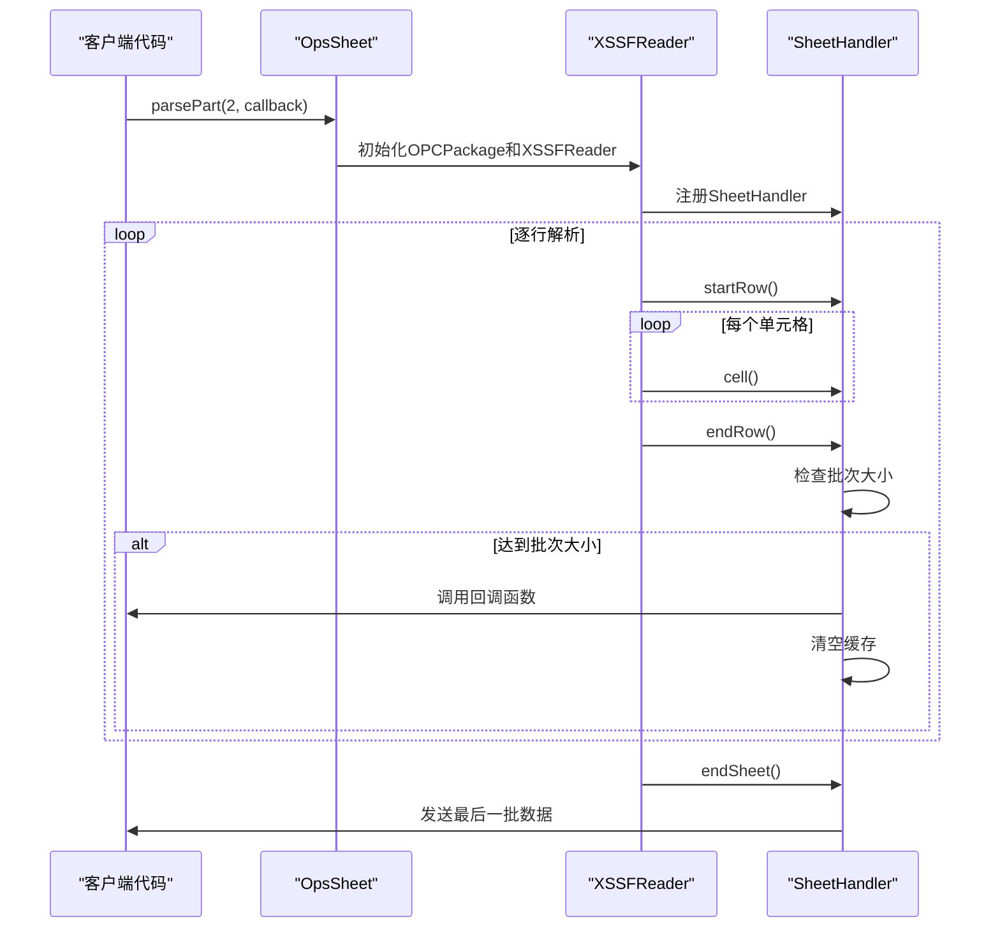
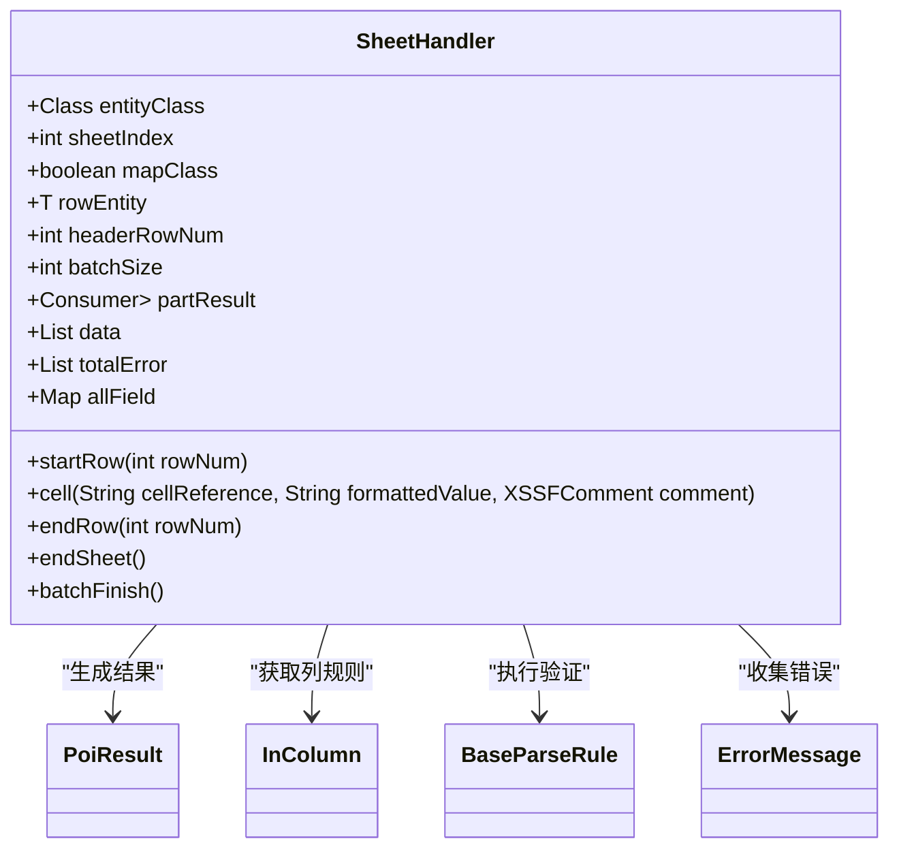
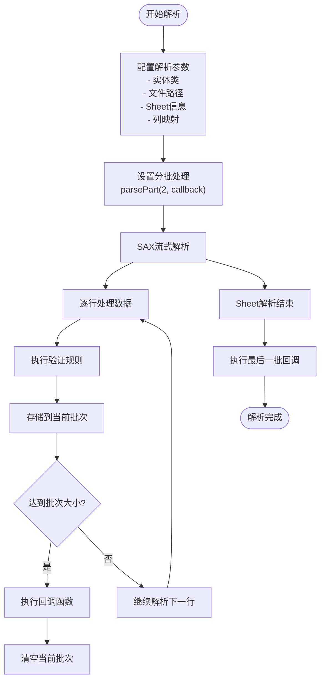
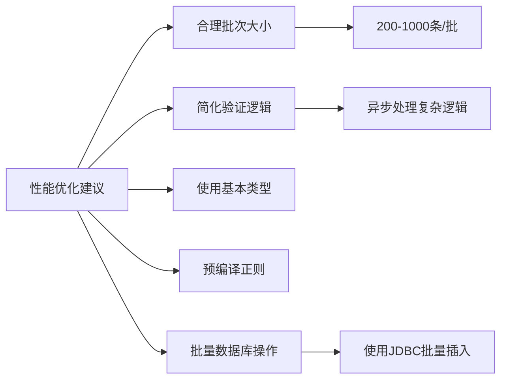

# 大数据分批处理

<cite>
**本文档中引用的文件**   
- [README-import.md](file://README-import.md#L195-L231)
- [SheetHandler.java](file://src/main/java/com/github/stupdit1t/excel/core/parse/SheetHandler.java#L0-L180)
- [OpsSheet.java](file://src/main/java/com/github/stupdit1t/excel/core/parse/OpsSheet.java#L130-L227)
- [PoiResult.java](file://src/main/java/com/github/stupdit1t/excel/common/PoiResult.java#L0-L158)
- [BaseParseRule.java](file://src/main/java/com/github/stupdit1t/excel/core/parse/BaseParseRule.java#L0-L249)
- [InColumn.java](file://src/main/java/com/github/stupdit1t/excel/core/parse/InColumn.java#L0-L56)
- [ExcelHelper.java](file://src/main/java/com/github/stupdit1t/excel/core/ExcelHelper.java#L0-L53)
- [OpsParse.java](file://src/main/java/com/github/stupdit1t/excel/core/parse/OpsParse.java#L0-L100)
- [ProjectEvaluate.java](file://src/test/java/excel/parse/data/ProjectEvaluate.java#L0-L162)
- [ParseBeanTest.java](file://src/test/java/excel/parse/ParseBeanTest.java#L120-L139)
</cite>

## 目录
1. [简介](#简介)
2. [核心设计原理](#核心设计原理)
3. [parsePart方法详解](#parsepart方法详解)
4. [SheetHandler类的作用](#sheethandler类的作用)
5. [使用示例分析](#使用示例分析)
6. [内存管理策略](#内存管理策略)
7. [性能优化建议](#性能优化建议)
8. [适用场景与阈值](#适用场景与阈值)

## 简介
在处理大型Excel文件时，传统的DOM解析方式会将整个文件加载到内存中，导致大数据量下出现OutOfMemoryError问题。本项目通过SAX解析器和流式读取机制解决了这一难题，实现了高效的大数据分批处理能力。该机制允许用户设置批次大小，并通过回调函数处理每一批次的数据，从而有效控制内存使用。

## 核心设计原理
大数据分批处理的核心在于采用事件驱动的SAX解析模式而非传统的DOM模式。SAX解析器逐行读取Excel文件，当遇到特定事件（如开始行、单元格数据、结束行）时触发相应的处理方法。这种方式避免了将整个工作表加载到内存，只需要维护当前行的数据状态。

该设计的关键优势包括：
- **内存效率**：仅在内存中保存当前处理的行数据和必要的元信息
- **可扩展性**：能够处理任意大小的Excel文件，不受JVM堆内存限制
- **实时处理**：数据一旦解析完成即可立即处理，无需等待整个文件读取完毕

**Section sources**
- [SheetHandler.java](file://src/main/java/com/github/stupdit1t/excel/core/parse/SheetHandler.java#L0-L180)
- [OpsSheet.java](file://src/main/java/com/github/stupdit1t/excel/core/parse/OpsSheet.java#L130-L227)

## parsePart方法详解
`parsePart`方法是实现大数据分批处理的核心API，定义在`OpsSheet`类中。该方法接受两个参数：批次大小和结果回调函数。



**Diagram sources**
- [OpsSheet.java](file://src/main/java/com/github/stupdit1t/excel/core/parse/OpsSheet.java#L130-L227)
- [SheetHandler.java](file://src/main/java/com/github/stupdit1t/excel/core/parse/SheetHandler.java#L0-L180)

**Section sources**
- [OpsSheet.java](file://src/main/java/com/github/stupdit1t/excel/core/parse/OpsSheet.java#L130-L227)

## SheetHandler类的作用
`SheetHandler`类实现了`XSSFSheetXMLHandler.SheetContentsHandler`接口，作为SAX解析器的事件处理器。它在流式解析过程中扮演着核心角色，负责处理各种解析事件。

主要功能包括：
- **startRow**：行开始事件处理，初始化新的实体对象
- **cell**：单元格数据处理，执行类型转换和验证规则
- **endRow**：行结束事件处理，收集错误信息并检查是否达到批次大小
- **batchFinish**：批次完成处理，清空缓存并通过回调返回结果



**Diagram sources**
- [SheetHandler.java](file://src/main/java/com/github/stupdit1t/excel/core/parse/SheetHandler.java#L0-L180)
- [PoiResult.java](file://src/main/java/com/github/stupdit1t/excel/common/PoiResult.java#L0-L158)
- [InColumn.java](file://src/main/java/com/github/stupdit1t/excel/core/parse/InColumn.java#L0-L56)
- [BaseParseRule.java](file://src/main/java/com/github/stupdit1t/excel/core/parse/BaseParseRule.java#L0-L249)

**Section sources**
- [SheetHandler.java](file://src/main/java/com/github/stupdit1t/excel/core/parse/SheetHandler.java#L0-L180)

## 使用示例分析
基于README-import.md中的parseBean5示例，我们可以看到如何配置和使用大数据分批处理功能。

```java
ExcelHelper.opsParse(ProjectEvaluate.class)
        .from("src/test/java/excel/parse/excel/simpleExport.xlsx")
        .opsSheet(0, 1, 1)
        .opsColumn(true).done()
        .parsePart(2, (result) -> {
            if (result.hasError()) {
                System.out.println(result.getErrorInfoString());
            }
            System.out.println("数据行数:" + result.getData().size());
            result.getData().forEach(System.out::println);
        });
```

在这个示例中：
- 批次大小设置为2，意味着每解析2行数据就会触发一次回调
- 回调函数接收`PoiResult<T>`对象，包含当前批次的数据和错误信息
- 通过`hasError()`方法检查是否有解析错误
- 使用`getErrorInfoString()`获取格式化的错误信息
- `getData()`返回当前批次的解析结果列表



**Diagram sources**
- [README-import.md](file://README-import.md#L195-L231)
- [ParseBeanTest.java](file://src/test/java/excel/parse/ParseBeanTest.java#L120-L139)
- [ProjectEvaluate.java](file://src/test/java/excel/parse/data/ProjectEvaluate.java#L0-L162)

**Section sources**
- [README-import.md](file://README-import.md#L195-L231)
- [ParseBeanTest.java](file://src/test/java/excel/parse/ParseBeanTest.java#L120-L139)

## 内存管理策略
本系统的内存管理策略基于流式处理和及时释放的原则。关键机制包括：

1. **批次缓存控制**：使用固定大小的列表存储当前批次的数据，在达到设定大小后立即通过回调传递给用户并清空
2. **错误信息管理**：为每批次维护独立的错误列表，在回调执行后清除，避免累积
3. **对象重用**：在行解析开始时创建新实体对象，解析完成后加入批次列表，由垃圾回收器管理生命周期
4. **资源及时释放**：在Sheet解析结束后确保所有资源被正确释放

这种策略确保了内存使用量与批次大小成正比，而不是与文件总行数相关，从而实现了恒定的内存占用。

**Section sources**
- [SheetHandler.java](file://src/main/java/com/github/stupdit1t/excel/core/parse/SheetHandler.java#L0-L180)
- [OpsSheet.java](file://src/main/java/com/github/stupdit1t/excel/core/parse/OpsSheet.java#L130-L227)

## 性能优化建议
为了获得最佳性能，建议遵循以下优化策略：

1. **合理设置批次大小**：根据可用内存和处理需求平衡批次大小。过小的批次会增加回调开销，过大的批次可能影响响应性。
2. **避免复杂验证逻辑**：在`map`回调中尽量减少耗时操作，可以考虑将复杂处理放入异步队列。
3. **使用基本数据类型**：优先使用基本数据类型而非包装类型，减少对象创建开销。
4. **预编译正则表达式**：如果使用正则验证，考虑缓存编译后的Pattern对象。
5. **批量数据库操作**：在回调中使用批量插入而非单条插入，显著提升数据库写入性能。



**Diagram sources**
- [BaseParseRule.java](file://src/main/java/com/github/stupdit1t/excel/core/parse/BaseParseRule.java#L0-L249)
- [SheetHandler.java](file://src/main/java/com/github/stupdit1t/excel/core/parse/SheetHandler.java#L0-L180)

## 适用场景与阈值
该大数据分批处理机制适用于以下场景：
- 处理超过10,000行的大型Excel文件
- 内存受限的运行环境
- 需要实时处理和反馈的场景
- 需要持续监控解析进度的场景

推荐的阈值参考：
- **小型文件**（<1万行）：可使用常规`parse()`方法
- **中型文件**（1-10万行）：建议使用分批处理，批次大小200-500
- **大型文件**（>10万行）：必须使用分批处理，批次大小100-1000
- **超大型文件**（>100万行）：建议批次大小500-1000，并结合异步处理

当单个Excel文件预计占用内存超过JVM堆空间的30%时，应优先考虑使用分批处理机制。

**Section sources**
- [README-import.md](file://README-import.md#L195-L231)
- [SheetHandler.java](file://src/main/java/com/github/stupdit1t/excel/core/parse/SheetHandler.java#L0-L180)
- [OpsSheet.java](file://src/main/java/com/github/stupdit1t/excel/core/parse/OpsSheet.java#L130-L227)