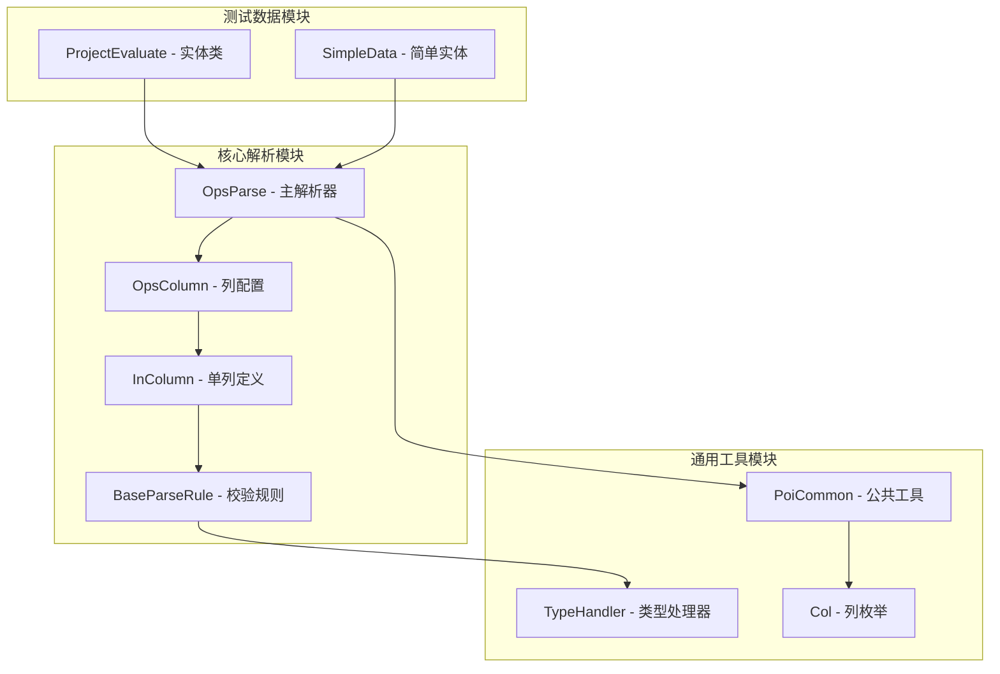
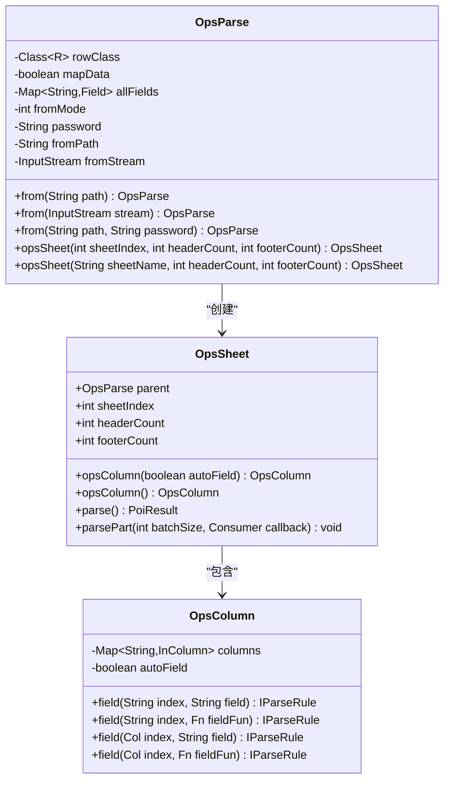
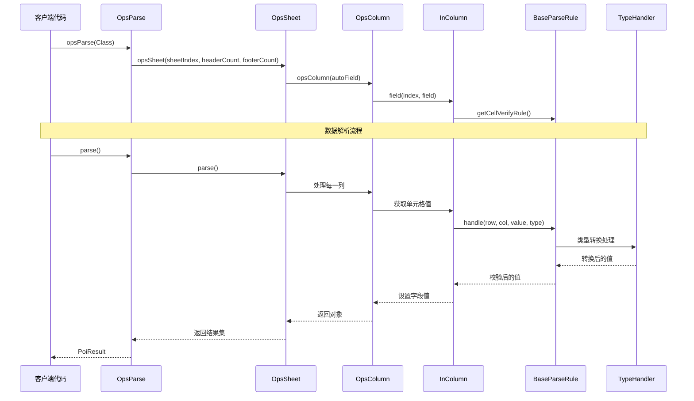
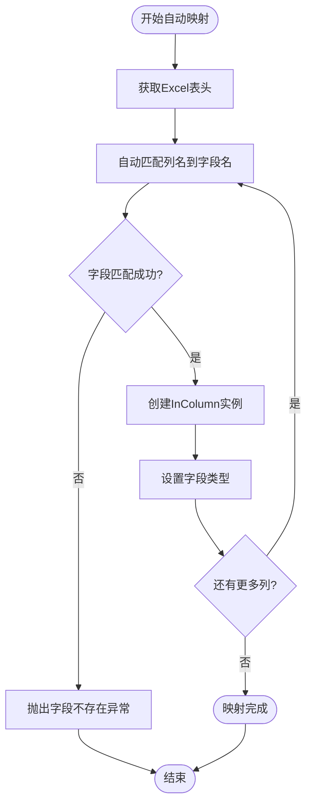
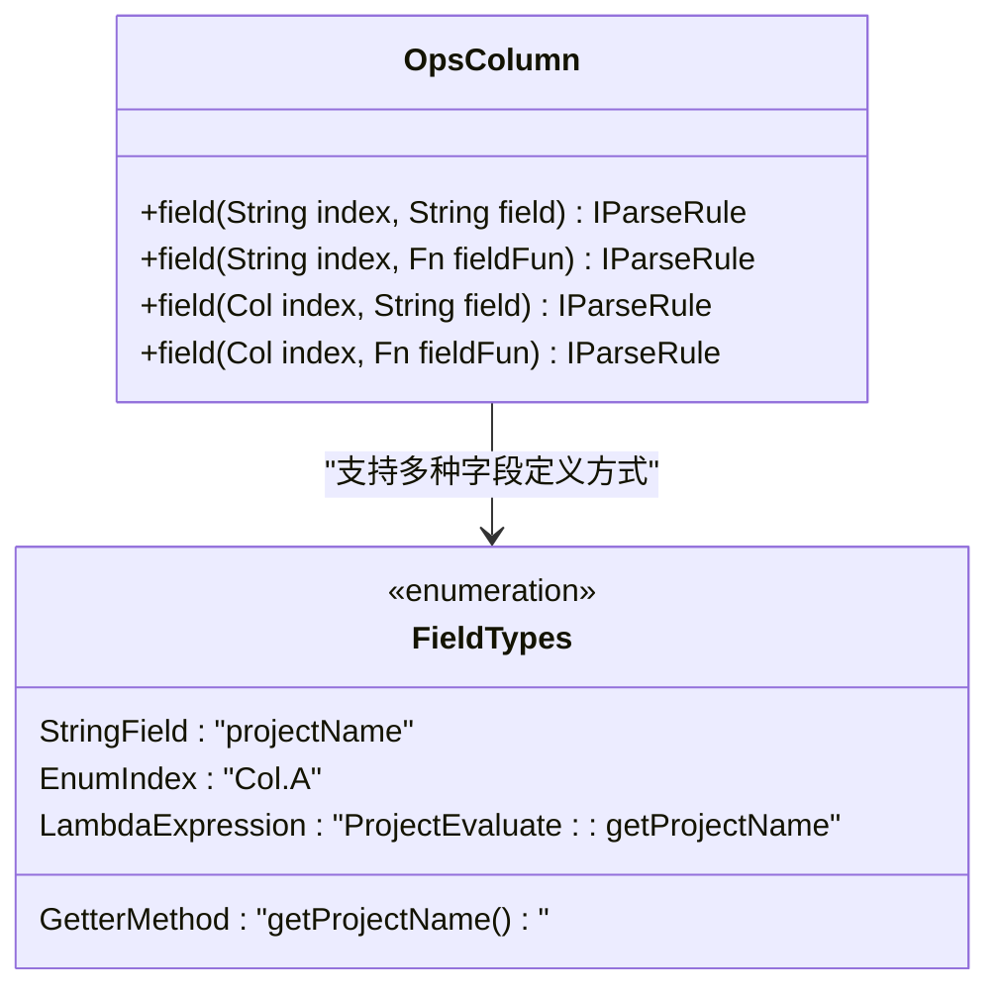
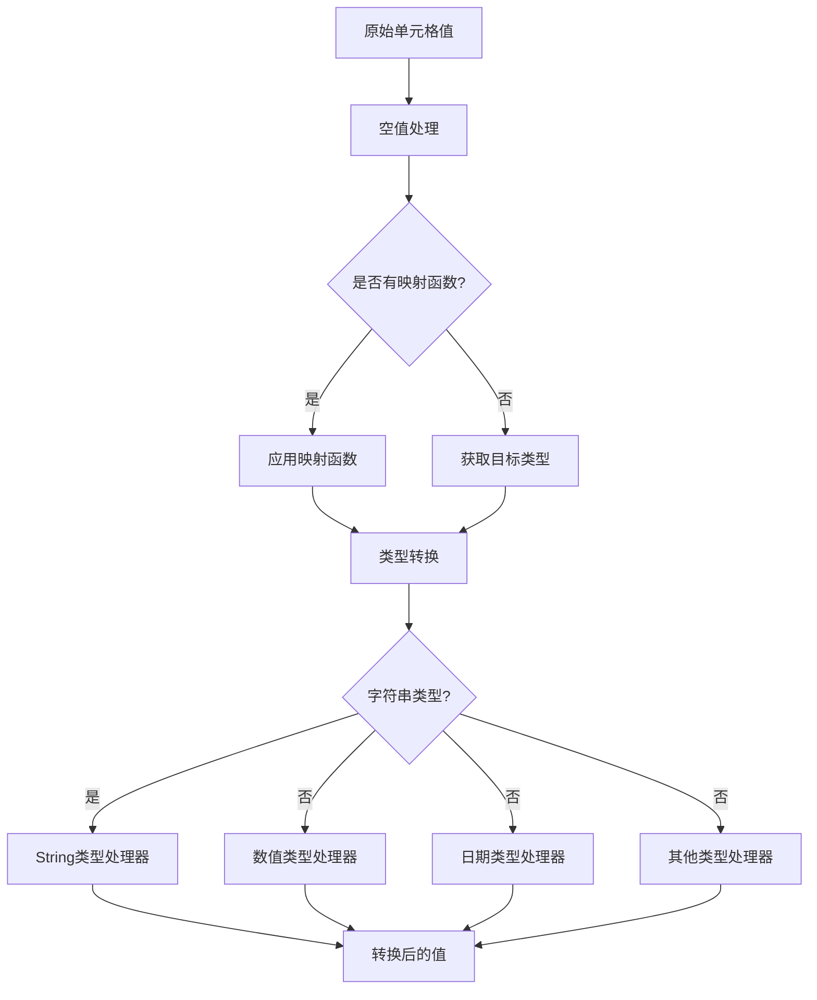

# 对象数据导入

<cite>
**本文档引用的文件**
- [README-import.md](file://README-import.md)
- [OpsParse.java](file://src/main/java/com/github/stupdit1t/excel/core/parse/OpsParse.java)
- [OpsColumn.java](file://src/main/java/com/github/stupdit1t/excel/core/parse/OpsColumn.java)
- [InColumn.java](file://src/main/java/com/github/stupdit1t/excel/core/parse/InColumn.java)
- [BaseParseRule.java](file://src/main/java/com/github/stupdit1t/excel/core/parse/BaseParseRule.java)
- [TypeHandler.java](file://src/main/java/com/github/stupdit1t/excel/common/TypeHandler.java)
- [PoiCommon.java](file://src/main/java/com/github/stupdit1t/excel/common/PoiCommon.java)
- [Col.java](file://src/main/java/com/github/stupdit1t/excel/common/Col.java)
- [ProjectEvaluate.java](file://src/test/java/excel/parse/data/ProjectEvaluate.java)
- [SimpleData.java](file://src/test/java/excel/parse/data/SimpleData.java)
- [ParseBeanTest.java](file://src/test/java/excel/parse/ParseBeanTest.java)
</cite>

## 目录
1. [简介](#简介)
2. [项目结构概览](#项目结构概览)
3. [核心组件分析](#核心组件分析)
4. [自动映射模式详解](#自动映射模式详解)
5. [手动映射模式详解](#手动映射模式详解)
6. [数据校验与转换机制](#数据校验与转换机制)
7. [实体类设计要求](#实体类设计要求)
8. [实际应用场景](#实际应用场景)
9. [性能优化考虑](#性能优化考虑)
10. [故障排除指南](#故障排除指南)
11. [总结](#总结)

## 简介

POI Excel库提供了一套强大的对象数据导入功能，能够将Excel表格中的数据自动解析为Java实体对象。该功能支持两种主要模式：自动映射模式和手动映射模式，提供了丰富的数据校验、类型转换和自定义逻辑处理能力。

通过链式调用API，开发者可以轻松实现从Excel文件到Java对象的完整数据转换流程，包括数据验证、格式转换、默认值处理和错误处理等关键功能。

## 项目结构概览



**图表来源**
- [OpsParse.java](file://src/main/java/com/github/stupdit1t/excel/core/parse/OpsParse.java#L1-L145)
- [OpsColumn.java](file://src/main/java/com/github/stupdit1t/excel/core/parse/OpsColumn.java#L1-L98)
- [InColumn.java](file://src/main/java/com/github/stupdit1t/excel/core/parse/InColumn.java#L1-L57)

## 核心组件分析

### OpsParse - 主解析器

OpsParse是整个导入流程的核心控制器，负责管理解析过程的状态和配置。



**图表来源**
- [OpsParse.java](file://src/main/java/com/github/stupdit1t/excel/core/parse/OpsParse.java#L15-L145)
- [OpsColumn.java](file://src/main/java/com/github/stupdit1t/excel/core/parse/OpsColumn.java#L20-L98)

### 数据流处理架构



**图表来源**
- [OpsParse.java](file://src/main/java/com/github/stupdit1t/excel/core/parse/OpsParse.java#L80-L145)
- [BaseParseRule.java](file://src/main/java/com/github/stupdit1t/excel/core/parse/BaseParseRule.java#L120-L250)

**章节来源**
- [OpsParse.java](file://src/main/java/com/github/stupdit1t/excel/core/parse/OpsParse.java#L1-L145)
- [OpsColumn.java](file://src/main/java/com/github/stupdit1t/excel/core/parse/OpsColumn.java#L1-L98)
- [InColumn.java](file://src/main/java/com/github/stupdit1t/excel/core/parse/InColumn.java#L1-L57)

## 自动映射模式详解

自动映射模式是最简单且最常用的方式，它会根据Excel表头的列名自动匹配Java对象的字段名。

### 基本自动映射

```java
// 自动映射列名到对象字段
PoiResult<ProjectEvaluate> parse = ExcelHelper.opsParse(ProjectEvaluate.class)
        .from("data.xlsx")
        .opsSheet(0, 1, 1)  // 第0个sheet，1行表头，1行尾部
        .opsColumn(true).done()  // 开启自动映射
        .parse();
```

### 自动映射的工作原理



**图表来源**
- [OpsColumn.java](file://src/main/java/com/github/stupdit1t/excel/core/parse/OpsColumn.java#L25-L40)

### 自动映射的匹配规则

自动映射模式遵循以下匹配规则：

1. **字段名匹配**：Excel表头的列名会尝试匹配Java对象的字段名
2. **大小写敏感**：匹配时区分大小写
3. **精确匹配**：要求完全匹配字段名
4. **字段存在性检查**：如果字段不存在，会抛出异常

**章节来源**
- [OpsColumn.java](file://src/main/java/com/github/stupdit1t/excel/core/parse/OpsColumn.java#L25-L40)
- [README-import.md](file://README-import.md#L1-L50)

## 手动映射模式详解

手动映射模式提供了更精细的控制，允许开发者明确指定Excel列与Java对象字段之间的映射关系。

### 基本手动映射

```java
// 手动指定列映射
PoiResult<ProjectEvaluate> parse = ExcelHelper.opsParse(ProjectEvaluate.class)
        .from("data.xlsx")
        .opsSheet(0, 1, 0)
        .opsColumn()  // 关闭自动映射
        .field(Col.A, ProjectEvaluate::getProjectName)  // A列映射到projectName
        .field(Col.H, ProjectEvaluate::getScore)        // H列映射到score
        .done()
        .parse();
```

### 手动映射的多种方式



**图表来源**
- [OpsColumn.java](file://src/main/java/com/github/stupdit1t/excel/core/parse/OpsColumn.java#L45-L85)

### Col枚举类详解

Col枚举提供了完整的Excel列索引支持，覆盖了从A到ZZ的所有列：

```java
// 使用Col枚举访问列
Col.A      // A列
Col.Z      // Z列  
Col.AA     // AA列
Col.BZ     // BZ列
Col.ZZ     // ZZ列
```

**章节来源**
- [OpsColumn.java](file://src/main/java/com/github/stupdit1t/excel/core/parse/OpsColumn.java#L45-L85)
- [Col.java](file://src/main/java/com/github/stupdit1t/excel/common/Col.java#L1-L35)

## 数据校验与转换机制

### 校验规则链式调用

BaseParseRule提供了丰富的数据校验和转换方法：

```java
// 组合多种校验规则
.field(Col.A, "projectName")
    .trim()              // 去除首尾空格
    .notNull()           // 不能为空
    .defaultValue("默认值")  // 设置默认值
    .regex("^[A-Za-z]+$") // 正则表达式校验
```

### 类型转换机制



**图表来源**
- [BaseParseRule.java](file://src/main/java/com/github/stupdit1t/excel/core/parse/BaseParseRule.java#L120-L200)

### 支持的类型转换

TypeHandler类提供了全面的类型转换支持：

| 类型 | 方法 | 说明 |
|------|------|------|
| String | stringValue() | 字符串转换，支持精度控制 |
| Integer | intValue() | 整数转换 |
| Double | doubleValue() | 双精度浮点数转换，支持精度 |
| Float | floatValue() | 单精度浮点数转换，支持精度 |
| BigDecimal | decimalValue() | 高精度十进制数转换 |
| Date | dateValue() | 日期转换，支持多种格式 |
| Boolean | boolValue() | 布尔值转换 |
| byte[] | imgValue() | 图片字节数组转换 |

### 自定义映射逻辑

```java
// 使用map方法实现自定义转换
Map<String, Integer> cityMapping = new HashMap<>();
cityMapping.put("北京", 1);
cityMapping.put("上海", 2);
cityMapping.put("广州", 3);

.field(Col.E, "cityKey")
    .notNull()
    .map(cityMapping::get)  // 城市名称映射到城市编码
```

**章节来源**
- [BaseParseRule.java](file://src/main/java/com/github/stupdit1t/excel/core/parse/BaseParseRule.java#L1-L250)
- [TypeHandler.java](file://src/main/java/com/github/stupdit1t/excel/common/TypeHandler.java#L1-L155)

## 实体类设计要求

### 必需的构造函数

Java实体类必须满足以下要求才能被正确解析：

1. **公共无参构造函数**：确保反射创建对象
2. **公共getter/setter方法**：用于读取和设置字段值
3. **Serializable接口**：支持序列化（可选）

### ProjectEvaluate实体类示例

```java
public class ProjectEvaluate implements Serializable {
    // 私有字段
    private String projectName;
    private byte[] img;
    private String areaName;
    private String province;
    private Integer cityKey;
    private String city;
    private String people;
    private String leader;
    private double score;
    private String avg;
    private Date createTime;

    // 公共getter/setter方法
    public String getProjectName() { return projectName; }
    public void setProjectName(String projectName) { this.projectName = projectName; }
    
    public byte[] getImg() { return img; }
    public void setImg(byte[] img) { this.img = img; }
    
    // ... 其他字段的getter/setter方法
    
    @Override
    public String toString() {
        return "ProjectEvaluate{" +
                "projectName='" + projectName + '\'' +
                ", img=" + (img != null ? img.length : null) +
                ", score=" + score +
                ", createTime=" + createTime +
                '}';
    }
}
```

### 字段命名规范

建议遵循以下命名规范以获得最佳的自动映射效果：

1. **驼峰命名法**：`projectName`而不是`project_name`
2. **语义清晰**：字段名应能准确描述其含义
3. **避免特殊字符**：不要使用空格、特殊符号等
4. **保持一致性**：在整个项目中保持命名风格一致

**章节来源**
- [ProjectEvaluate.java](file://src/test/java/excel/parse/data/ProjectEvaluate.java#L1-L163)
- [PoiCommon.java](file://src/main/java/com/github/stupdit1t/excel/common/PoiCommon.java#L50-L70)

## 实际应用场景

### 应用场景1：基础数据导入

```java
@Test
public void parseBean1() {
    name.set("自动映射列");
    PoiResult<ProjectEvaluate> parse = ExcelHelper.opsParse(ProjectEvaluate.class)
            .from("src/test/java/excel/parse/excel/simpleExport.xlsx")
            .opsSheet(0, 1, 1)
            .opsColumn(true).done()
            .parse();
    
    if (parse.hasError()) {
        System.out.println(parse.getErrorInfoString());
    }
    
    System.out.println("数据行数:" + parse.getData().size());
    parse.getData().forEach(System.out::println);
}
```

### 应用场景2：带数据校验的导入

```java
@Test
public void parseBean4() {
    name.set("提取指定列，校验, 转换");
    Map<String, Integer> cityMapping = new HashMap<>();
    cityMapping.put("西安", 1);
    cityMapping.put("北京", 2);

    PoiResult<ProjectEvaluate> parse = ExcelHelper.opsParse(ProjectEvaluate.class)
            .from("src/test/java/excel/parse/excel/simpleExport.xlsx")
            .opsSheet(0, 1, 1)
            .opsColumn()
            .field(Col.A, "projectName")
                .trim()
                .notNull()
                .defaultValue("未知项目")
                .regex("中青旅\\d{2}")
            .field(Col.D, ProjectEvaluate::getProvince)
            .field(Col.E, "cityKey")
                .notNull()
                .map(cityMapping::get)
            .done()
            .parse();
    
    if (parse.hasError()) {
        System.out.println(parse.getErrorInfoString());
    }
    parse.getData().forEach(System.out::println);
}
```

### 应用场景3：大数据分批处理

```java
@Test
public void parseBean5() {
    name.set("大数据分批处理");
    ExcelHelper.opsParse(ProjectEvaluate.class)
            .from("src/test/java/excel/parse/excel/simpleExport.xlsx")
            .opsSheet(0, 1, 1)
            .opsColumn(true).done()
            .parsePart(2, (result) -> {
                if (result.hasError()) {
                    System.out.println(result.getErrorInfoString());
                }
                
                System.out.println("数据行数:" + result.getData().size());
                result.getData().forEach(System.out::println);
            });
}
```

**章节来源**
- [ParseBeanTest.java](file://src/test/java/excel/parse/ParseBeanTest.java#L1-L140)
- [README-import.md](file://README-import.md#L80-L231)

## 性能优化考虑

### 内存管理

1. **批量处理**：对于大数据量，使用`parsePart()`方法进行分批处理
2. **及时释放资源**：处理完成后及时清理临时对象
3. **避免内存泄漏**：确保回调函数中不持有外部引用

### 处理效率优化

1. **选择合适的映射模式**：小数据量使用自动映射，大数据量使用手动映射
2. **合理设置表头行数**：避免过多的表头行影响解析速度
3. **预编译正则表达式**：对于复杂的正则校验，提前编译

### 并发处理

```java
// 并发处理多个Excel文件
ExecutorService executor = Executors.newFixedThreadPool(4);
List<CompletableFuture<PoiResult>> futures = new ArrayList<>();

files.forEach(file -> {
    CompletableFuture<PoiResult> future = CompletableFuture.supplyAsync(() -> {
        return ExcelHelper.opsParse(ProjectEvaluate.class)
                .from(file.getPath())
                .opsSheet(0, 1, 1)
                .opsColumn(true).done()
                .parse();
    }, executor);
    futures.add(future);
});

// 等待所有任务完成
CompletableFuture.allOf(futures.toArray(new CompletableFuture[0]))
    .thenRun(() -> {
        // 处理结果
    });
```

## 故障排除指南

### 常见错误及解决方案

#### 1. 字段不存在异常

**错误信息**：`字段不存在!`

**原因**：自动映射时找不到对应的字段

**解决方案**：
```java
// 使用手动映射明确指定字段
.field(Col.A, "projectName")  // 确保字段名正确
```

#### 2. 类型转换异常

**错误信息**：`无法转换类型`

**原因**：Excel单元格值与目标类型不兼容

**解决方案**：
```java
// 添加类型转换处理
.field(Col.H, ProjectEvaluate::getScore)
    .type(double.class)  // 明确指定类型
    .scale(2)           // 设置精度
```

#### 3. 格式不正确异常

**错误信息**：`格式不正确`

**原因**：数据不符合正则表达式或其他校验规则

**解决方案**：
```java
.field(Col.A, "projectName")
    .regex("^[A-Za-z0-9\u4e00-\u9fa5]+$")  // 修改正则表达式
```

### 调试技巧

1. **启用详细日志**：查看详细的解析过程
2. **分步调试**：逐步添加字段映射进行测试
3. **数据验证**：在Excel中手动验证数据格式
4. **异常捕获**：使用try-catch捕获并处理异常

### 错误信息格式

```java
// 错误信息输出格式
[A2]: 格式不正确
[B3]: 不能为空
[C4]: 类型转换失败
[D5]: 字段不存在
```

**章节来源**
- [BaseParseRule.java](file://src/main/java/com/github/stupdit1t/excel/core/parse/BaseParseRule.java#L150-L200)
- [README-import.md](file://README-import.md#L200-L231)

## 总结

POI Excel库的对象数据导入功能提供了强大而灵活的数据转换能力。通过自动映射和手动映射两种模式，开发者可以根据具体需求选择最适合的方案。

### 主要优势

1. **易用性**：简洁的链式API设计，易于理解和使用
2. **灵活性**：支持多种映射模式和丰富的校验选项
3. **扩展性**：支持自定义转换逻辑和复杂业务规则
4. **性能**：针对大数据量提供了分批处理机制
5. **可靠性**：完善的错误处理和数据验证机制

### 最佳实践建议

1. **合理选择映射模式**：根据数据复杂度选择自动或手动映射
2. **完善数据校验**：为每个字段添加适当的校验规则
3. **处理异常情况**：妥善处理各种异常和边界情况
4. **性能监控**：对大数据量处理进行性能监控和优化
5. **文档维护**：保持导入规则文档的更新和维护

通过掌握这些核心概念和使用技巧，开发者可以高效地实现Excel数据到Java对象的转换，满足各种业务场景的需求。