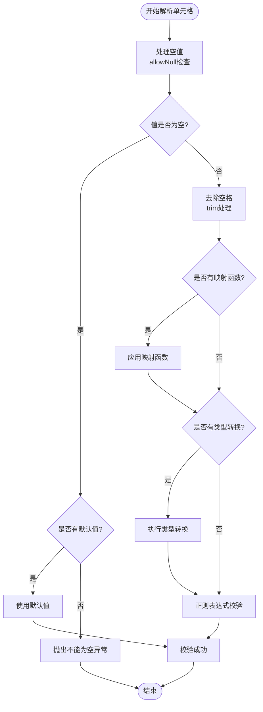

现在我已经收集了足够的信息来生成详细的文档。让我开始创建关于导入功能的详尽文档。

<docs>
# 导入功能详解

<cite>
**本文档引用的文件**
- [README-import.md](file://README-import.md)
- [ExcelHelper.java](file://src/main/java/com/github/stupdit1t/excel/core/ExcelHelper.java)
- [OpsParse.java](file://src/main/java/com/github/stupdit1t/excel/core/parse/OpsParse.java)
- [OpsSheet.java](file://src/main/java/com/github/stupdit1t/excel/core/parse/OpsSheet.java)
- [OpsColumn.java](file://src/main/java/com/github/stupdit1t/excel/core/parse/OpsColumn.java)
- [InColumn.java](file://src/main/java/com/github/stupdit1t/excel/core/parse/InColumn.java)
- [BaseParseRule.java](file://src/main/java/com/github/stupdit1t/excel/core/parse/BaseParseRule.java)
- [TypeHandler.java](file://src/main/java/com/github/stupdit1t/excel/common/TypeHandler.java)
- [PoiResult.java](file://src/main/java/com/github/stupdit1t/excel/common/PoiResult.java)
- [Col.java](file://src/main/java/com/github/stupdit1t/excel/common/Col.java)
- [DemoData.java](file://src/test/java/excel/parse/data/DemoData.java)
</cite>

## 目录
1. [简介](#简介)
2. [核心架构](#核心架构)
3. [ExcelHelper.opsParse() 方法详解](#excelhelperopsparse-方法详解)
4. [自动映射列模式](#自动映射列模式)
5. [手动指定列模式](#手动指定列模式)
6. [数据校验与转换](#数据校验与转换)
7. [类型转换机制](#类型转换机制)
8. [错误处理与PoiResult](#错误处理与poiresult)
9. [大数据分批处理](#大数据分批处理)
10. [最佳实践](#最佳实践)
11. [总结](#总结)

## 简介

POI-Excel框架提供了一套强大而灵活的Excel数据导入功能，通过`ExcelHelper.opsParse()`方法实现了从Excel文件中解析数据的完整流程。该功能支持两种核心模式：自动映射列和手动指定列，并提供了丰富的数据校验、类型转换和错误处理机制。

导入功能的核心优势在于：
- **灵活的数据映射**：支持自动字段映射和精确列指定
- **强大的数据校验**：内置多种验证规则和自定义校验逻辑
- **智能类型转换**：自动处理各种数据类型的转换
- **错误处理机制**：完善的错误捕获和报告系统
- **大数据处理能力**：支持分批处理避免内存溢出

## 核心架构

导入功能采用分层架构设计，主要组件包括：


**图表来源**
- [ExcelHelper.java](file://src/main/java/com/github/stupdit1t/excel/core/ExcelHelper.java#L1-L54)
- [OpsParse.java](file://src/main/java/com/github/stupdit1t/excel/core/parse/OpsParse.java#L1-L145)
- [OpsSheet.java](file://src/main/java/com/github/stupdit1t/excel/core/parse/OpsSheet.java#L1-L202)
- [OpsColumn.java](file://src/main/java/com/github/stupdit1t/excel/core/parse/OpsColumn.java#L1-L47)
- [InColumn.java](file://src/main/java/com/github/stupdit1t/excel/core/parse/InColumn.java#L1-L55)
- [BaseParseRule.java](file://src/main/java/com/github/stupdit1t/excel/core/parse/BaseParseRule.java#L1-L250)

## ExcelHelper.opsParse() 方法详解

`ExcelHelper.opsParse()`是导入功能的入口点，它创建了一个新的`OpsParse`实例来处理Excel文件的解析。

### 基本用法

```java
// 创建解析器
OpsParse<ProjectEvaluate> parser = ExcelHelper.opsParse(ProjectEvaluate.class);

// 设置数据源
parser.from("path/to/excel.xlsx");

// 配置工作表
OpsSheet<ProjectEvaluate> sheet = parser.opsSheet(0, 1, 1);

// 配置列映射
OpsColumn<ProjectEvaluate> column = sheet.opsColumn(true);

// 开始解析
PoiResult<ProjectEvaluate> result = parser.parse();
```

### 支持的数据源类型

1. **文件路径**：直接指定Excel文件的本地路径
2. **输入流**：从InputStream读取Excel数据
3. **带密码的文件**：支持加密的Excel文件
4. **混合模式**：同时支持上述所有模式

**章节来源**
- [ExcelHelper.java](file://src/main/java/com/github/stupdit1t/excel/core/ExcelHelper.java#L35-L54)
- [OpsParse.java](file://src/main/java/com/github/stupdit1t/excel/core/parse/OpsParse.java#L45-L100)

## 自动映射列模式

自动映射列模式是最简单也是最常用的导入方式，它会根据目标类的字段自动匹配Excel中的列。

### 工作原理

在自动映射模式下，系统会：
1. 获取目标类的所有字段
2. 按照字段顺序分配Excel列索引（A, B, C, D...）
3. 自动建立字段与列的映射关系

### 使用示例

```java
// 自动映射列
PoiResult<ProjectEvaluate> result = ExcelHelper.opsParse(ProjectEvaluate.class)
    .from("data.xlsx")
    .opsSheet(0, 1, 1)  // 第0个工作表，1行表头，1行尾部
    .opsColumn(true)    // 启用自动映射
    .done()             // 完成配置
    .parse();           // 执行解析
```

### 自动映射的优势

- **开发效率高**：无需手动配置每个字段的映射
- **维护成本低**：当Excel结构变化时，只需调整目标类即可
- **适合标准报表**：适用于结构相对固定的Excel文件

### 自动映射的限制

- **字段顺序依赖**：必须确保Excel列顺序与类字段顺序一致
- **缺乏灵活性**：无法处理复杂的列映射场景
- **字段类型约束**：需要目标类有对应的setter方法

**章节来源**
- [OpsColumn.java](file://src/main/java/com/github/stupdit1t/excel/core/parse/OpsColumn.java#L25-L47)
- [README-import.md](file://README-import.md#L1-L50)

## 手动指定列模式

手动指定列模式提供了最大的灵活性，允许开发者精确控制每个字段与Excel列的映射关系。

### 基本语法

```java
// 手动指定列
PoiResult<ProjectEvaluate> result = ExcelHelper.opsParse(ProjectEvaluate.class)
    .from("data.xlsx")
    .opsSheet(0, 1, 1)
    .opsColumn()                    // 不启用自动映射
    .field(Col.A, "projectName")    // A列映射到projectName字段
    .field(Col.B, "score")          // B列映射到score字段
    .done()
    .parse();
```

### Col枚举类

`Col`枚举类提供了完整的Excel列索引支持，包含从A到ZZ的所有列：

```java
public enum Col {
    A, B, C, D, E, F, G, H, I, J, K, L, M, N, O, P, Q, R, S, T, U, V, W, X, Y, Z,
    AA, AB, AC, AD, AE, AF, AG, AH, AI, AJ, AK, AL, AM, AN, AO, AP, AQ, AR, AS, AT, AU, AV, AW, AX, AY, AZ,
    // ... 更多列
}
```

### 手动指定列的优势

- **精确控制**：可以跳过不需要的列，重新排列列顺序
- **灵活映射**：支持将多个Excel列合并到一个字段
- **复杂场景**：适用于结构复杂的Excel文件
- **字段重命名**：可以在Excel列和目标字段之间进行映射

### 手动指定列的使用场景

1. **列顺序不固定**：Excel文件的列顺序可能发生变化
2. **需要跳过某些列**：只导入特定的字段
3. **列名不匹配**：Excel列名与目标字段名不同
4. **多列合并**：需要将多个Excel列的数据合并到一个字段

**章节来源**
- [Col.java](file://src/main/java/com/github/stupdit1t/excel/common/Col.java#L1-L35)
- [README-import.md](file://README-import.md#L51-L100)

## 数据校验与转换

数据校验与转换是导入功能的核心特性之一，提供了丰富的验证规则和转换选项。

### 校验规则



**图表来源**
- [BaseParseRule.java](file://src/main/java/com/github/stupdit1t/excel/core/parse/BaseParseRule.java#L180-L250)

### 核心校验方法

#### 1. notNull() - 非空校验
```java
.field(Col.A, "projectName").notNull()
```
确保单元格值不能为空，否则抛出异常。

#### 2. trim() - 去除空格
```java
.field(Col.B, "description").trim()
```
自动去除字符串两端的空白字符。

#### 3. defaultValue() - 默认值
```java
.field(Col.C, "status").defaultValue("待处理")
```
当单元格为空时使用指定的默认值。

#### 4. regex() - 正则校验
```java
.field(Col.D, "phone").regex("^1[3-9]\\d{9}$")
```
使用正则表达式验证单元格值的格式。

### 自定义映射逻辑

```java
.field(Col.E, "cityKey")
    .notNull()
    .map(cityMapping::get)  // 使用映射函数转换值
```

### 映射函数的使用场景

1. **枚举转换**：将字符串转换为枚举类型
2. **业务映射**：将Excel值映射到业务常量
3. **数据清洗**：对原始数据进行预处理
4. **异常处理**：在映射过程中抛出自定义异常

**章节来源**
- [BaseParseRule.java](file://src/main/java/com/github/stupdit1t/excel/core/parse/BaseParseRule.java#L60-L120)
- [README-import.md](file://README-import.md#L150-L200)

## 类型转换机制

POI-Excel框架提供了完整的类型转换机制，支持多种数据类型的自动转换。

### 支持的数据类型


**图表来源**
- [TypeHandler.java](file://src/main/java/com/github/stupdit1t/excel/common/TypeHandler.java#L1-L155)

### 类型转换流程


**图表来源**
- [BaseParseRule.java](file://src/main/java/com/github/stupdit1t/excel/core/parse/BaseParseRule.java#L180-L250)
- [TypeHandler.java](file://src/main/java/com/github/stupdit1t/excel/common/TypeHandler.java#L100-L155)

### 类型转换方法

#### 1. 基本类型转换
```java
// 整数类型
.field(Col.F, "age").type(Integer.class)

// 浮点类型
.field(Col.G, "price").type(Double.class).scale(2)

// 布尔类型
.field(Col.H, "active").type(Boolean.class)
```

#### 2. 数值精度控制
```java
// 设置小数位数
.field(Col.I, "amount").type(Double.class).scale(2)
```

#### 3. 日期时间处理
```java
// 日期格式化
.field(Col.J, "createTime")
    .type(Date.class)
    .format("yyyy-MM-dd HH:mm:ss")

// 日期自动识别
.field(Col.K, "birthday").type(Date.class)
```

#### 4. 特殊类型处理
```java
// 图片处理
.field(Col.L, "avatar").type(byte[].class)

// 大数值处理
.field(Col.M, "balance").type(BigDecimal.class).scale(4)
```

### 类型转换的最佳实践

1. **明确指定类型**：尽量为每个字段指定明确的类型
2. **合理设置精度**：对于货币等需要精度的字段设置scale
3. **统一日期格式**：使用一致的日期格式规范
4. **图片处理优化**：对于大图片考虑压缩或存储路径

**章节来源**
- [TypeHandler.java](file://src/main/java/com/github/stupdit1t/excel/common/TypeHandler.java#L1-L155)
- [BaseParseRule.java](file://src/main/java/com/github/stupdit1t/excel/core/parse/BaseParseRule.java#L200-L250)

## 错误处理与PoiResult

POI-Excel框架提供了完善的错误处理机制，通过`PoiResult`类来管理和报告解析过程中的错误。

### PoiResult结构


**图表来源**
- [PoiResult.java](file://src/main/java/com/github/stupdit1t/excel/common/PoiResult.java#L1-L159)

### 错误处理流程


**图表来源**
- [OpsSheet.java](file://src/main/java/com/github/stupdit1t/excel/core/parse/OpsSheet.java#L167-L202)

### 错误信息获取

#### 1. 基本错误信息
```java
PoiResult<ProjectEvaluate> result = parser.parse();
if (result.hasError()) {
    // 获取格式化的错误信息
    String errorInfo = result.getErrorInfoString();
    System.out.println(errorInfo);
}
```

#### 2. 行级别错误信息
```java
// 获取按行组织的错误信息
List<String> lineErrors = result.getErrorInfoLine();
lineErrors.forEach(System.out::println);
```

#### 3. 详细错误对象
```java
// 获取原始错误列表
List<ErrorMessage> errors = result.getError();
errors.forEach(error -> {
    System.out.println("位置: " + error.getLocation());
    System.out.println("异常: " + error.getException().getMessage());
});
```

### 错误类型分类

1. **格式错误**：数据格式不符合预期
2. **类型错误**：数据类型转换失败
3. **业务错误**：自定义业务规则违反
4. **系统错误**：文件读取或解析异常

### 错误处理策略

#### 1. 忽略错误
```java
// 继续处理，忽略错误
PoiResult<ProjectEvaluate> result = parser.parse();
// 即使有错误，仍然获取有效数据
List<ProjectEvaluate> validData = result.getData();
```

#### 2. 严格模式
```java
// 只有完全成功才返回数据
PoiResult<ProjectEvaluate> result = parser.parse();
if (result.hasError()) {
    // 处理错误，不使用数据
    return;
}
// 使用数据
processData(result.getData());
```

#### 3. 分级处理
```java
// 区分不同类型错误
PoiResult<ProjectEvaluate> result = parser.parse();
if (result.hasError()) {
    List<ErrorMessage> errors = result.getError();
    List<ErrorMessage> formatErrors = errors.stream()
        .filter(e -> e.getException() instanceof IllegalArgumentException)
        .collect(Collectors.toList());
    
    List<ErrorMessage> businessErrors = errors.stream()
        .filter(e -> e.getException() instanceof PoiException)
        .collect(Collectors.toList());
    
    // 分别处理不同类型的错误
    processFormatErrors(formatErrors);
    processBusinessErrors(businessErrors);
}
```

**章节来源**
- [PoiResult.java](file://src/main/java/com/github/stupdit1t/excel/common/PoiResult.java#L1-L159)
- [OpsSheet.java](file://src/main/java/com/github/stupdit1t/excel/core/parse/OpsSheet.java#L167-L202)

## 大数据分批处理

为了应对大型Excel文件可能导致的内存溢出问题，POI-Excel框架提供了分批处理机制。

### 分批处理原理


**图表来源**
- [OpsSheet.java](file://src/main/java/com/github/stupdit1t/excel/core/parse/OpsSheet.java#L143-L166)

### 使用示例

```java
// 大数据分批处理
ExcelHelper.opsParse(ProjectEvaluate.class)
    .from("large-data.xlsx")
    .opsSheet(0, 1, 1)
    .opsColumn(true)
    .parsePart(1000, (result) -> {
        if (result.hasError()) {
            System.out.println("批次错误: " + result.getErrorInfoString());
        }
        
        System.out.println("处理了 " + result.getData().size() + " 条数据");
        result.getData().forEach(System.out::println);
    });
```

### 分批处理的优势

1. **内存控制**：每次只处理固定数量的数据，避免内存溢出
2. **进度反馈**：可以实时监控处理进度
3. **错误隔离**：单个批次的错误不会影响其他批次
4. **性能优化**：减少单次处理的数据量，提高响应速度

### 分批大小的选择

- **小型文件**（<1000行）：使用默认的parse()方法
- **中型文件**（1000-10000行）：建议使用1000-2000行的批次大小
- **大型文件**（>10000行）：建议使用500-1000行的批次大小
- **超大型文件**（>100000行）：建议使用200-500行的批次大小

### 分批处理的最佳实践

1. **批量写入数据库**：将每批次的数据批量插入数据库
2. **进度监控**：显示处理进度百分比
3. **错误累积**：收集所有批次的错误信息
4. **资源释放**：及时释放批次处理后的内存

**章节来源**
- [OpsSheet.java](file://src/main/java/com/github/stupdit1t/excel/core/parse/OpsSheet.java#L143-L166)
- [README-import.md](file://README-import.md#L200-L232)

## 最佳实践

基于对POI-Excel框架的深入分析，以下是导入功能的最佳实践建议：

### 1. 选择合适的映射模式

**推荐使用自动映射的情况：**
- Excel文件结构稳定
- 目标类字段与Excel列一一对应
- 开发效率优先

**推荐使用手动映射的情况：**
- Excel文件结构经常变化
- 需要跳过某些列
- 字段名与Excel列名不一致
- 需要复杂的列映射逻辑

### 2. 合理设计数据校验规则

```java
// 推荐的校验链
.field(Col.A, "name")
    .trim()              // 去除空格
    .notNull()           // 非空校验
    .defaultValue("未知") // 默认值
    .regex("[\\u4e00-\\u9fa5]{2,10}") // 中文姓名格式
```

### 3. 类型转换的最佳实践

```java
// 数值类型
.field(Col.B, "score")
    .type(Double.class)
    .scale(2)           // 保留两位小数

// 日期类型
.field(Col.C, "createTime")
    .type(Date.class)
    .format("yyyy-MM-dd HH:mm:ss")

// 枚举类型
.field(Col.D, "status")
    .map(Status::fromCode) // 自定义映射函数
```

### 4. 错误处理策略

```java
// 分级处理策略
public void processExcelWithErrorHandling(String filePath) {
    PoiResult<DataModel> result = ExcelHelper.opsParse(DataModel.class)
        .from(filePath)
        .opsSheet(0, 1, 0)
        .opsColumn(true)
        .parse();
    
    if (result.hasError()) {
        // 记录错误日志
        logErrors(result.getError());
        
        // 过滤掉错误数据
        List<DataModel> validData = filterValidData(result.getData());
        
        // 处理有效数据
        processData(validData);
    } else {
        // 处理全部数据
        processData(result.getData());
    }
}
```

### 5. 性能优化建议

1. **合理使用缓存**：对于重复使用的映射函数，考虑缓存结果
2. **批量操作**：对于大量数据，使用批量插入数据库
3. **异步处理**：对于大型文件，考虑使用异步处理
4. **资源管理**：及时关闭文件流和释放资源

### 6. 代码组织建议

```java
// 建议的类结构
public class ExcelImportService {
    
    public PoiResult<ProjectEvaluate> importProjects(String filePath) {
        return ExcelHelper.opsParse(ProjectEvaluate.class)
            .from(filePath)
            .opsSheet(0, 1, 1)
            .opsColumn(true)
            .parse();
    }
    
    public void importLargeFile(String filePath) {
        ExcelHelper.opsParse(ProjectEvaluate.class)
            .from(filePath)
            .opsSheet(0, 1