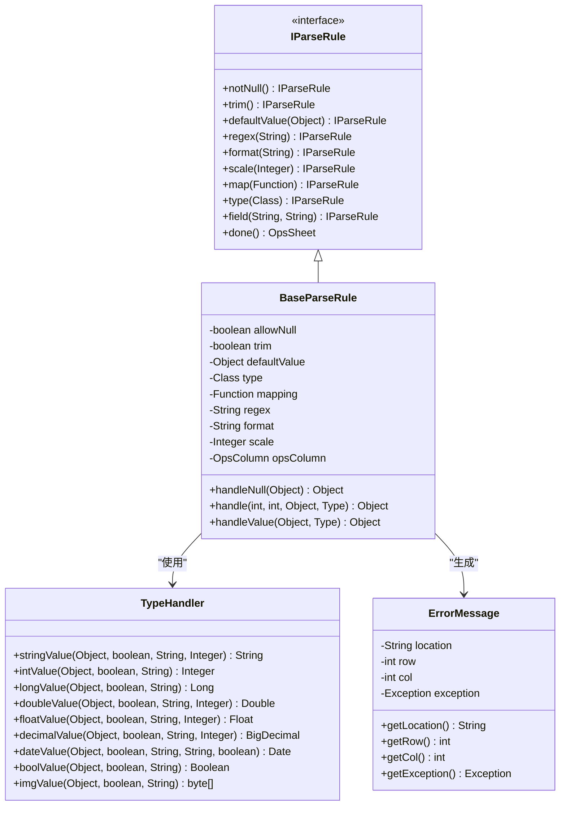
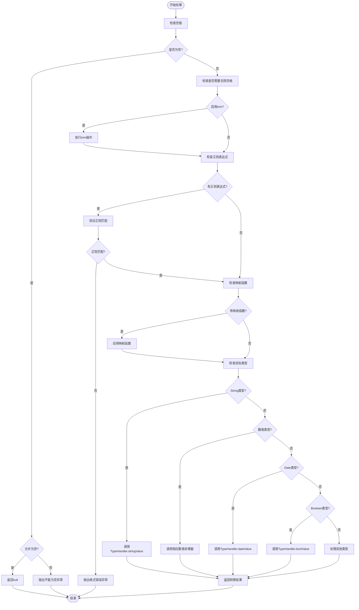
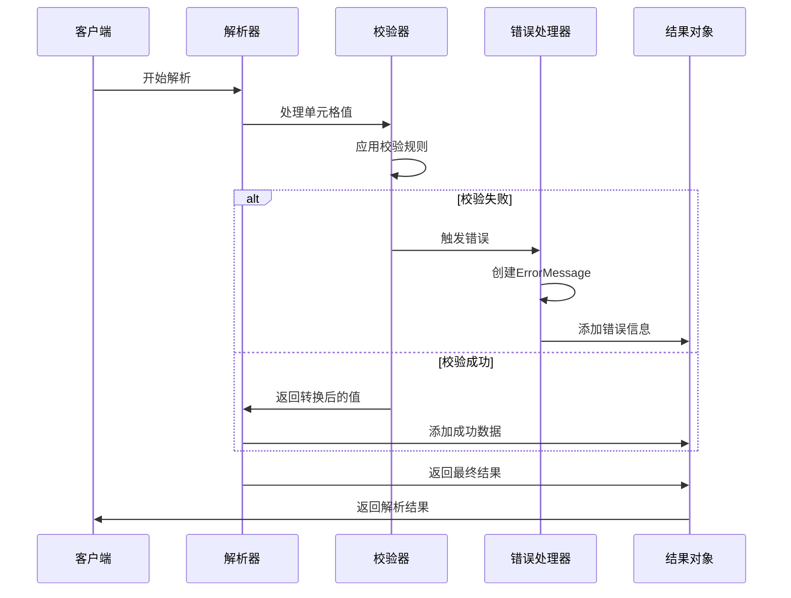

# 数据校验与转换

<cite>
**本文档引用的文件**
- [BaseParseRule.java](file://src/main/java/com/github/stupdit1t/excel/core/parse/BaseParseRule.java)
- [IParseRule.java](file://src/main/java/com/github/stupdit1t/excel/core/parse/IParseRule.java)
- [TypeHandler.java](file://src/main/java/com/github/stupdit1t/excel/common/TypeHandler.java)
- [ErrorMessage.java](file://src/main/java/com/github/stupdit1t/excel/common/ErrorMessage.java)
- [ParseBeanTest.java](file://src/test/java/excel/parse/ParseBeanTest.java)
- [ProjectEvaluate.java](file://src/test/java/excel/parse/data/ProjectEvaluate.java)
- [DemoData.java](file://src/test/java/excel/parse/data/DemoData.java)
- [InCallback.java](file://src/main/java/com/github/stupdit1t/excel/callback/InCallback.java)
</cite>

## 目录
1. [简介](#简介)
2. [核心架构概览](#核心架构概览)
3. [基础校验方法详解](#基础校验方法详解)
4. [类型转换机制](#类型转换机制)
5. [复杂映射与业务逻辑](#复杂映射与业务逻辑)
6. [错误处理与异常管理](#错误处理与异常管理)
7. [实际应用场景](#实际应用场景)
8. [性能优化建议](#性能优化建议)
9. [最佳实践指南](#最佳实践指南)
10. [总结](#总结)

## 简介

poi-excel 是一个功能强大的 Excel 数据导入导出工具库，其数据校验与转换系统是整个框架的核心组件之一。该系统提供了丰富的校验规则和转换方法，能够满足各种复杂的业务需求。本文档将深入解析 `.notNull()`、`.regex()`、`.type()`、`.scale()`、`.defaultValue()` 和 `.map()` 等关键方法的实现原理，以及它们在数据解析过程中的工作流程。

## 核心架构概览

poi-excel 的数据校验与转换系统采用链式调用的设计模式，通过 `BaseParseRule` 类作为核心处理器，实现了灵活而强大的数据验证和转换功能。



**图表来源**
- [BaseParseRule.java](file://src/main/java/com/github/stupdit1t/excel/core/parse/BaseParseRule.java#L1-L250)
- [IParseRule.java](file://src/main/java/com/github/stupdit1t/excel/core/parse/IParseRule.java#L1-L82)
- [TypeHandler.java](file://src/main/java/com/github/stupdit1t/excel/common/TypeHandler.java#L1-L155)

## 基础校验方法详解

### notNull() 方法

`notNull()` 方法用于确保字段值不能为空，这是最基础也是最重要的校验规则之一。

```java
@Override
public IParseRule<R> notNull() {
    this.allowNull = false;
    return this;
}
```

当调用此方法后，系统会将 `allowNull` 标志设置为 `false`。在数据处理过程中，如果遇到空值且不允许为空时，会抛出 `PoiException` 异常。

### trim() 方法

`trim()` 方法用于去除字符串两端的空白字符，确保数据的整洁性。

```java
@Override
public IParseRule<R> trim() {
    this.trim = true;
    return this;
}
```

启用此选项后，所有字符串类型的输入都会经过 `trim()` 处理，避免因多余空格导致的数据质量问题。

### defaultValue() 方法

`defaultValue()` 方法为字段提供默认值，在数据缺失时自动填充。

```java
@Override
public BaseParseRule<R> defaultValue(Object defaultValue) {
    this.defaultValue = defaultValue;
    return this;
}
```

当数据为空且未通过其他校验时，系统会返回预设的默认值，而不是抛出异常。

### regex() 方法

`regex()` 方法支持正则表达式验证，可以对字符串格式进行精确控制。

```java
@Override
public BaseParseRule<R> regex(String regex) {
    this.regex = regex;
    return this;
}
```

正则表达式在校验阶段会被应用到字符串值上，不符合格式要求的数据会触发验证失败。

### scale() 方法

`scale()` 方法专门用于数值类型的精度控制，特别是浮点数和十进制数。

```java
@Override
public IParseRule<R> scale(Integer scale) {
    this.scale = scale;
    return this;
}
```

该方法主要用于限制数值的小数位数，确保数据精度符合业务要求。

**章节来源**
- [BaseParseRule.java](file://src/main/java/com/github/stupdit1t/excel/core/parse/BaseParseRule.java#L63-L128)
- [IParseRule.java](file://src/main/java/com/github/stupdit1t/excel/core/parse/IParseRule.java#L1-L82)

## 类型转换机制

poi-excel 的类型转换系统通过 `TypeHandler` 类实现，它包含了各种数据类型的转换逻辑。转换过程遵循以下流程：



**图表来源**
- [BaseParseRule.java](file://src/main/java/com/github/stupdit1t/excel/core/parse/BaseParseRule.java#L180-L250)

### 核心类型处理器

`TypeHandler` 类提供了各种类型的数据转换方法：

#### 字符串处理
```java
public static String stringValue(Object cellValue, boolean trim, String regex, Integer precision) {
    String value;
    // 处理数值转为字符串，解决科学计数法问题
    if (cellValue instanceof Number) {
        value = NumberToTextConverter.toText(((Number) cellValue).doubleValue());
        if (precision != null) {
            return NumberUtils.toScaledBigDecimal(value, precision, RoundingMode.HALF_UP).toString();
        }
    } else {
        value = String.valueOf(cellValue);
    }
    if (trim) {
        value = value.trim();
    }
    if (regex != null && !Pattern.matches(regex, value)) {
        throw PoiException.error(PoiConstant.INCORRECT_FORMAT_STR);
    }
    return value;
}
```

#### 数值类型处理
```java
// 整数类型
public static Integer intValue(Object cellValue, boolean trim, String regex) {
    if (cellValue instanceof Integer) {
        return (Integer) cellValue;
    } else {
        String value = stringValue(cellValue, trim, regex, null);
        return NumberUtils.toInt(value);
    }
}

// 浮点数类型
public static Float floatValue(Object cellValue, boolean trim, String regex, Integer precision) {
    if (cellValue instanceof Float) {
        return (Float) cellValue;
    } else {
        String value = stringValue(cellValue, trim, regex, null);
        if (precision != null) {
            return NumberUtils.toScaledBigDecimal(value, precision, RoundingMode.HALF_UP).floatValue();
        } else {
            return NumberUtils.toFloat(value);
        }
    }
}
```

#### 日期类型处理
```java
public static Date dateValue(Object cellValue, boolean trim, String regex, String format, boolean is1904Date) throws Exception {
    if (cellValue instanceof Date) {
        Date date = (Date) cellValue;
        return StringUtils.isBlank(format) ? date : DateUtils.parseDate(DateFormatUtils.format(date, format), format);
    } else {
        String value = stringValue(cellValue, trim, regex, null);
        if (NumberUtils.isCreatable(value)) {
            BigDecimal sourceValue = new BigDecimal(value);
            long date = sourceValue.longValue();
            if (value.length() == 10) {
                date *= 1000;
            }
            if (date > 1000000000000L) {
                Date dateVal = new Date(date);
                return StringUtils.isBlank(format) ? dateVal : DateUtils.parseDate(DateFormatUtils.format(dateVal, format), format);
            } else {
                return DateUtil.getJavaDate(sourceValue.doubleValue(), is1904Date);
            }
        } else {
            return StringUtils.isBlank(format) ? DateUtils.parseDate(value, PoiConstant.FMT_DATE_TIME) : DateUtils.parseDate(value, format);
        }
    }
}
```

**章节来源**
- [TypeHandler.java](file://src/main/java/com/github/stupdit1t/excel/common/TypeHandler.java#L1-L155)
- [BaseParseRule.java](file://src/main/java/com/github/stupdit1t/excel/core/parse/BaseParseRule.java#L200-L250)

## 复杂映射与业务逻辑

### map() 方法详解

`.map()` 方法是 poi-excel 中最强大的功能之一，它允许开发者实现复杂的业务逻辑转换。该方法接受一个 `Function<Object, Object>` 类型的参数，可以在数据转换过程中执行任意的业务逻辑。

```java
@Override
public BaseParseRule<R> map(Function<Object, Object> mapping) {
    this.mapping = mapping;
    return this;
}
```

### 实际应用案例：城市名称到ID的映射

在 `ParseBeanTest.java` 中的 `parseBean4()` 方法展示了 `.map()` 的典型应用场景：

```java
@Test
public void parseBean4() {
    Map<String, Integer> cityMapping = new HashMap<>();
    cityMapping.put("西安", 1);
    cityMapping.put("北京", 2);

    PoiResult<ProjectEvaluate> parse = ExcelHelper.opsParse(ProjectEvaluate.class)
            .from("src/test/java/excel/parse/excel/simpleExport.xlsx")
            .opsSheet(0, 1, 1)
            .opsColumn()
            .field(Col.A, "projectName").trim().notNull().defaultValue("张三").regex("中青旅\\d{2}")
            .field(Col.D, ProjectEvaluate::getProvince)
            // 值映射转换，也可以异常处理校验等
            .field(Col.E, "cityKey").notNull().map(cityMapping::get)
            .done()
            .parse();
}
```

在这个例子中，`.map(cityMapping::get)` 实现了以下功能：
1. **值映射**：将城市名称（如"西安"）转换为对应的整数ID（如1）
2. **空值检查**：如果城市名称为空，则会触发 `notNull()` 校验
3. **异常处理**：如果城市名称不在映射表中，`cityMapping::get` 会返回 `null`，然后触发后续的校验逻辑

### 自定义异常处理

`.map()` 方法不仅限于简单的值映射，还可以用于实现复杂的业务校验逻辑。例如：

```java
// 自定义异常处理的映射函数
.field(Col.E, "cityKey").map(value -> {
    if (value == null) {
        throw new PoiException("城市名称不能为空");
    }
    Integer cityId = cityMapping.get(value.toString());
    if (cityId == null) {
        throw new PoiException("未知的城市名称: " + value);
    }
    return cityId;
})
```

这种模式允许开发者：
- 在转换过程中执行复杂的业务逻辑
- 抛出自定义异常以提供详细的错误信息
- 实现条件性的数据验证

### 类型转换与映射的组合

`.map()` 方法可以与 `.type()` 方法配合使用，实现更复杂的转换逻辑：

```java
// 先进行类型转换，再应用映射
.field(Col.E, "cityKey").type(String.class).map(cityMapping::get)
```

或者：

```java
// 使用自定义转换器
.field(Col.E, "cityKey").map(value -> {
    String strValue = value.toString();
    // 执行额外的业务逻辑
    return processCityName(strValue);
})
```

**章节来源**
- [ParseBeanTest.java](file://src/test/java/excel/parse/ParseBeanTest.java#L80-L100)
- [BaseParseRule.java](file://src/main/java/com/github/stupdit1t/excel/core/parse/BaseParseRule.java#L85-L90)

## 错误处理与异常管理

poi-excel 的错误处理系统设计得非常完善，能够提供详细的错误信息和定位。

### ErrorMessage 类

`ErrorMessage` 类负责封装所有的错误信息：

```java
public class ErrorMessage {
    private String location;
    private int row;
    private int col;
    private Exception exception;

    public ErrorMessage(String location, int row, int col, Exception exception) {
        this.location = location;
        this.row = row;
        this.col = col;
        this.exception = exception;
    }

    public ErrorMessage(Exception exception) {
        this.row = -1;
        this.col = -1;
        this.exception = exception;
    }
}
```

### 错误处理流程



**图表来源**
- [BaseParseRule.java](file://src/main/java/com/github/stupdit1t/excel/core/parse/BaseParseRule.java#L150-L200)
- [ErrorMessage.java](file://src/main/java/com/github/stupdit1t/excel/common/ErrorMessage.java#L1-L42)

### 常见异常类型

1. **不能为空异常** (`PoiConstant.NOT_EMPTY_STR`)
   ```java
   if (this.allowNull) {
       return null;
   } else {
       throw PoiException.error(PoiConstant.NOT_EMPTY_STR);
   }
   ```

2. **格式错误异常** (`PoiConstant.INCORRECT_FORMAT_STR`)
   ```java
   if (regex != null && !Pattern.matches(regex, value)) {
       throw PoiException.error(PoiConstant.INCORRECT_FORMAT_STR);
   }
   ```

3. **自定义业务异常**
   ```java
   if (cityId == null) {
       throw new PoiException("未知的城市名称: " + value);
   }
   ```

### 错误信息的获取和处理

解析结果对象提供了多种方式来获取错误信息：

```java
PoiResult<ProjectEvaluate> parse = ExcelHelper.opsParse(ProjectEvaluate.class).parse();
if (parse.hasError()) {
    // 获取所有错误信息
    List<ErrorMessage> errors = parse.getErrorInfo();
    
    // 获取格式化的错误信息字符串
    String errorString = parse.getErrorInfoString();
    
    // 获取特定行列的错误
    ErrorMessage error = parse.getErrorInfoLine(row, col);
}
```

**章节来源**
- [ErrorMessage.java](file://src/main/java/com/github/stupdit1t/excel/common/ErrorMessage.java#L1-L42)
- [BaseParseRule.java](file://src/main/java/com/github/stupdit1t/excel/core/parse/BaseParseRule.java#L150-L180)

## 实际应用场景

### 场景一：用户注册数据导入

```java
PoiResult<UserRegistration> result = ExcelHelper.opsParse(UserRegistration.class)
    .from("users.xlsx")
    .opsSheet(0, 1, 1)
    .opsColumn()
    .field("username", UserRegistration::setUsername)
        .notNull()
        .regex("^[a-zA-Z0-9_]{3,20}$")
        .trim()
    .field("email", UserRegistration::setEmail)
        .notNull()
        .regex("^[a-zA-Z0-9._%+-]+@[a-zA-Z0-9.-]+\\.[a-zA-Z]{2,}$")
    .field("age", UserRegistration::setAge)
        .type(Integer.class)
        .map(age -> {
            int ageValue = Integer.parseInt(age.toString());
            if (ageValue < 18 || ageValue > 120) {
                throw new PoiException("年龄必须在18-120岁之间");
            }
            return ageValue;
        })
    .field("registrationDate", UserRegistration::setRegistrationDate)
        .type(Date.class)
        .format("yyyy-MM-dd")
    .done()
    .parse();
```

### 场景二：财务报表数据处理

```java
PoiResult<FinancialReport> report = ExcelHelper.opsParse(FinancialReport.class)
    .from("financial_data.xlsx")
    .opsSheet(0, 1, 1)
    .opsColumn()
    .field("amount", FinancialReport::setAmount)
        .type(BigDecimal.class)
        .scale(2)
        .map(amount -> {
            BigDecimal amt = new BigDecimal(amount.toString());
            if (amt.compareTo(BigDecimal.ZERO) < 0) {
                throw new PoiException("金额不能为负数");
            }
            return amt;
        })
    .field("category", FinancialReport::setCategory)
        .map(category -> {
            String cat = category.toString().trim();
            return categoryMapping.getOrDefault(cat, "OTHER");
        })
    .field("currency", FinancialReport::setCurrency)
        .defaultValue("CNY")
    .done()
    .parse();
```

### 场景三：多语言数据转换

```java
PoiResult<ProductTranslation> translation = ExcelHelper.opsParse(ProductTranslation.class)
    .from("translations.xlsx")
    .opsSheet(0, 1, 1)
    .opsColumn()
    .field("productCode", ProductTranslation::setProductCode)
        .notNull()
        .regex("^P[0-9]{6}$")
    .field("productName_zh", ProductTranslation::setProductNameZh)
        .notNull()
    .field("productName_en", ProductTranslation::setProductNameEn)
        .map(name -> {
            if (StringUtils.isBlank(name.toString())) {
                // 如果英文名为空，使用拼音转换
                return pinyinConverter.convert(name.toString());
            }
            return name;
        })
    .field("language", ProductTranslation::setLanguage)
        .map(lang -> lang.toString().toUpperCase())
    .done()
    .parse();
```

## 性能优化建议

### 1. 合理使用缓存

对于频繁使用的映射关系，建议使用缓存机制：

```java
// 使用缓存优化映射性能
private static final Map<String, Integer> cityCache = new ConcurrentHashMap<>();

static {
    cityCache.put("北京", 1);
    cityCache.put("上海", 2);
    cityCache.put("广州", 3);
    cityCache.put("深圳", 4);
}

// 在映射函数中使用缓存
.field(Col.E, "cityKey").map(cityCache::get)
```

### 2. 避免重复计算

```java
// 错误的做法：每次调用都重新计算
.field("value", Bean::setValue).map(v -> {
    return expensiveCalculation(v); // 每次都会重新计算
})

// 正确的做法：提前计算并缓存
.field("value", Bean::setValue).map(v -> cachedCalculation.computeIfAbsent(v, this::expensiveCalculation))
```

### 3. 批量处理优化

```java
// 对于大批量数据，使用分批处理
ExcelHelper.opsParse(DataClass.class)
    .from("large_file.xlsx")
    .opsSheet(0, 1, 1)
    .opsColumn(true).done()
    .parsePart(1000, result -> {
        // 处理每批次的数据
        processDataBatch(result.getData());
        
        if (result.hasError()) {
            logErrors(result.getErrorInfo());
        }
    });
```

## 最佳实践指南

### 1. 校验规则的优先级

```java
// 推荐的校验顺序：先简单后复杂
.field("data", Bean::setData)
    .notNull()           // 第一步：检查是否为空
    .trim()              // 第二步：去除空格
    .regex(pattern)      // 第三步：正则验证
    .scale(2)           // 第四步：精度控制
    .map(transform)     // 第五步：复杂转换
```

### 2. 错误信息的友好性

```java
// 提供详细的错误信息
.field("email", Bean::setEmail)
    .notNull()
    .regex("^[a-zA-Z0-9._%+-]+@[a-zA-Z0-9.-]+\\.[a-zA-Z]{2,}$")
    .map(email -> {
        if (!isValidEmail(email.toString())) {
            throw new PoiException("邮箱格式不正确，请输入有效的邮箱地址");
        }
        return email;
    })
```

### 3. 类型安全的映射

```java
// 使用泛型确保类型安全
.field("id", Bean::setId)
    .type(Long.class)  // 明确指定类型
    .map(id -> {
        Long longId = Long.parseLong(id.toString());
        if (longId <= 0) {
            throw new PoiException("ID必须为正整数");
        }
        return longId;
    })
```

### 4. 组合使用多个校验方法

```java
// 组合使用多种校验方法
.field("price", Bean::setPrice)
    .notNull()
    .type(BigDecimal.class)
    .scale(2)
    .map(price -> {
        BigDecimal amount = new BigDecimal(price.toString());
        if (amount.compareTo(BigDecimal.ZERO) < 0) {
            throw new PoiException("价格不能为负数");
        }
        return amount;
    })
```

### 5. 处理特殊字符和编码

```java
// 处理特殊字符和编码问题
.field("description", Bean::setDescription)
    .trim()
    .map(desc -> {
        String cleaned = desc.toString()
            .replaceAll("[^\\x00-\\x7F]", "") // 移除非ASCII字符
            .replace("\r\n", " ")            // 替换换行符
            .replace("\n", " ");
        return StringUtils.abbreviate(cleaned, 1000); // 限制长度
    })
```

### 6. 日志记录和监控

```java
.field("data", Bean::setData)
    .map(data -> {
        try {
            Object processed = processData(data);
            logger.info("成功处理数据: {}", data);
            return processed;
        } catch (Exception e) {
            logger.error("处理数据失败: {}, 错误: {}", data, e.getMessage());
            throw new PoiException("数据处理失败: " + e.getMessage());
        }
    })
```

## 总结

poi-excel 的数据校验与转换系统是一个功能强大且灵活的框架，通过以下核心特性为开发者提供了全面的数据处理能力：

### 主要优势

1. **链式调用设计**：简洁直观的 API 设计，易于理解和使用
2. **丰富的校验方法**：提供了 `.notNull()`、`.regex()`、`.type()`、`.scale()`、`.defaultValue()` 等多种校验选项
3. **强大的映射功能**：`.map()` 方法支持复杂的业务逻辑和异常处理
4. **完善的错误处理**：详细的错误信息和定位，便于问题排查
5. **高性能处理**：支持批量处理和分批加载，适合大规模数据处理

### 核心设计理念

- **可扩展性**：通过接口设计支持自定义扩展
- **易用性**：流畅的 API 设计降低学习成本
- **可靠性**：完善的错误处理和异常管理机制
- **性能**：优化的处理流程和缓存机制

### 适用场景

该系统特别适用于以下场景：
- 大规模 Excel 数据导入
- 多种数据格式的统一处理
- 复杂的业务规则验证
- 多语言和多地区数据处理
- 实时数据校验和转换

通过合理运用这些功能，开发者可以构建出健壮、高效且易于维护的数据处理解决方案，满足各种复杂的业务需求。