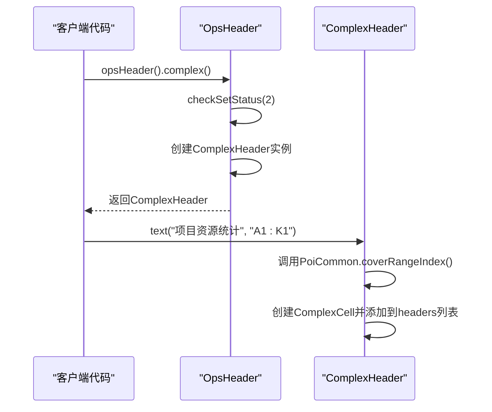
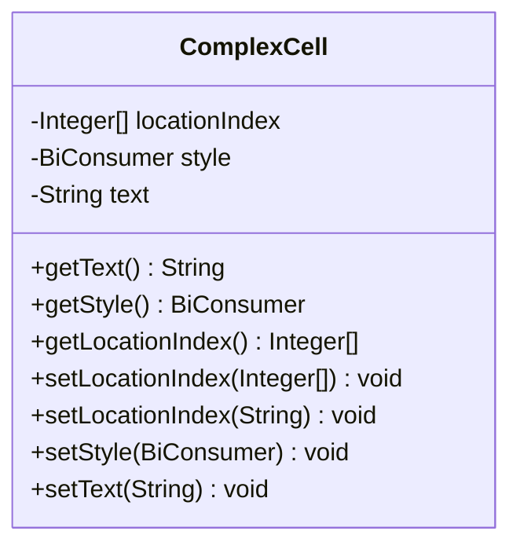
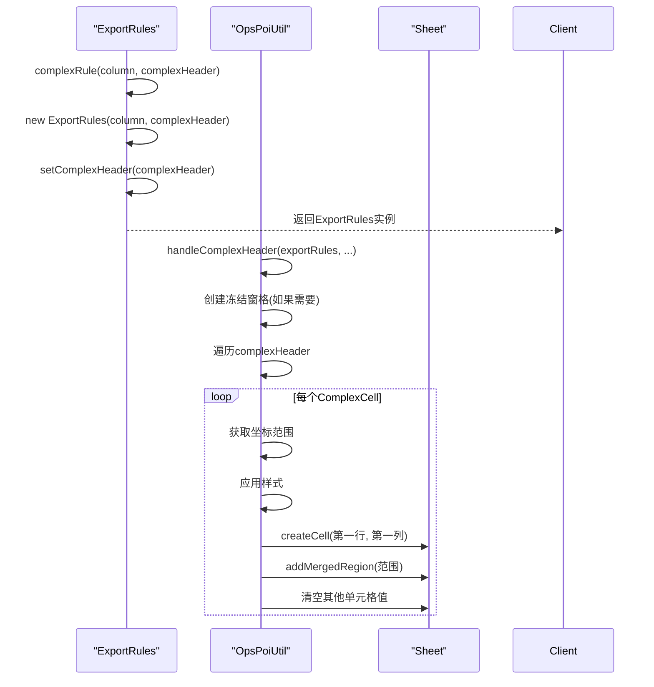
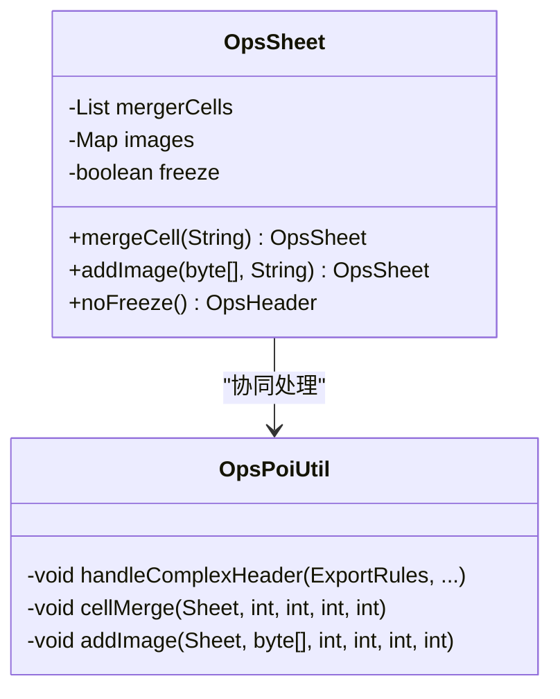

# 复杂表头导出

<cite>
**本文档引用的文件**  
- [README-export.md](file://README-export.md)
- [OpsHeader.java](file://src/main/java/com/github/stupdit1t/excel/core/export/OpsHeader.java)
- [ComplexCell.java](file://src/main/java/com/github/stupdit1t/excel/core/export/ComplexCell.java)
- [ExportRules.java](file://src/main/java/com/github/stupdit1t/excel/core/export/ExportRules.java)
- [OpsPoiUtil.java](file://src/main/java/com/github/stupdit1t/excel/core/OpsPoiUtil.java)
- [PoiCommon.java](file://src/main/java/com/github/stupdit1t/excel/common/PoiCommon.java)
- [PoiConstant.java](file://src/main/java/com/github/stupdit1t/excel/common/PoiConstant.java)
- [OpsSheet.java](file://src/main/java/com/github/stupdit1t/excel/core/export/OpsSheet.java)
</cite>

## 目录
1. [简介](#简介)
2. [复杂表头模式启用机制](#复杂表头模式启用机制)
3. [ComplexCell类设计与实现](#complexcell类设计与实现)
4. [坐标定位解析机制](#坐标定位解析机制)
5. [导出规则生成与渲染流程](#导出规则生成与渲染流程)
6. [高级功能集成](#高级功能集成)
7. [总结](#总结)

## 简介
本文档全面解析POI-Excel库中复杂表头导出功能的实现原理。基于`README-export.md`中的代码示例，深入分析`opsHeader().complex()`如何启用复杂表头模式，详细说明`ComplexCell`类如何表示跨行跨列的单元格，以及`text(String text, String location)`方法如何解析A1:K1、数字坐标和字母坐标等不同格式的定位信息。同时阐述`ExportRules.complexRule()`如何根据复杂表头定义生成导出规则，并与`OpsPoiUtil`协同完成单元格合并与渲染。最后结合源码分析样式冻结、自定义合并单元格和图片插入的集成方式。

## 复杂表头模式启用机制

`opsHeader().complex()`方法是启用复杂表头模式的核心入口。当调用此方法时，系统会创建`ComplexHeader`对象并设置相应的模式标志，从而开启复杂表头功能。

在`OpsHeader`类中，`complex()`方法通过`checkSetStatus(2)`确保复杂表头和简单表头不会同时设置，保证了配置的一致性。该方法创建`ComplexHeader`实例并返回，允许链式调用后续的`text()`方法来定义复杂的表头结构。



**图示来源**
- [OpsHeader.java](file://src/main/java/com/github/stupdit1t/excel/core/export/OpsHeader.java#L179-L229)

**本节来源**
- [OpsHeader.java](file://src/main/java/com/github/stupdit1t/excel/core/export/OpsHeader.java#L179-L229)
- [README-export.md](file://README-export.md#L150-L180)

## ComplexCell类设计与实现

`ComplexCell`类是复杂表头功能的核心数据结构，用于表示跨行跨列的单元格。该类封装了单元格的文本内容、位置信息和样式定义。

`ComplexCell`类包含三个主要属性：
- `locationIndex`: 表示单元格坐标的整数数组，格式为[起始行, 结束行, 起始列, 结束列]
- `style`: 单元格的样式定义，通过`BiConsumer<Font, CellStyle>`函数式接口实现
- `text`: 单元格显示的文本内容

该类提供了完整的getter和setter方法，支持通过数字坐标、字母坐标或Excel坐标格式设置位置信息。`setLocationIndex(String location)`方法会调用`PoiCommon.coverRangeIndex(location)`将字符串格式的坐标转换为整数数组。



**图示来源**
- [ComplexCell.java](file://src/main/java/com/github/stupdit1t/excel/core/export/ComplexCell.java#L10-L90)

**本节来源**
- [ComplexCell.java](file://src/main/java/com/github/stupdit1t/excel/core/export/ComplexCell.java#L10-L90)
- [OpsHeader.java](file://src/main/java/com/github/stupdit1t/excel/core/export/OpsHeader.java#L226-L243)

## 坐标定位解析机制

复杂表头支持三种坐标定位格式：Excel坐标（如A1:K1）、字母坐标（如"2,3,A,A"）和数字坐标（如1,1,1,4）。这些不同格式的坐标最终都会被统一转换为数字坐标数组。

`PoiCommon.coverRangeIndex(String location)`方法是坐标解析的核心。该方法首先检查输入字符串是否包含冒号":"，以判断是否为Excel坐标格式。如果是Excel坐标，使用`CellRangeAddress.valueOf(location)`进行解析；否则按逗号分割字符串，并将前两个元素（行号）减1转换为0基索引，后两个元素（列字母）通过`PoiConstant.cellRefNums`映射转换为数字。

`PoiConstant`类在静态初始化块中调用`PoiCommon.fillCellRefNums(2)`预填充A-ZZ的列字母到数字的映射关系，确保字母坐标的正确解析。

```mermaid
flowchart TD
Start([开始]) --> CheckFormat["检查坐标格式<br/>是否包含':'"]
CheckFormat --> |是| ParseExcel["使用CellRangeAddress<br/>解析Excel坐标"]
CheckFormat --> |否| SplitString["按','分割字符串"]
SplitString --> ConvertRow["前两个元素减1<br/>转换为0基索引"]
SplitString --> ConvertCol["后两个元素通过<br/>cellRefNums映射"]
ParseExcel --> End([返回Integer[4]])
ConvertRow --> End
ConvertCol --> End
```

**图示来源**
- [PoiCommon.java](file://src/main/java/com/github/stupdit1t/excel/common/PoiCommon.java#L36-L80)
- [PoiConstant.java](file://src/main/java/com/github/stupdit1t/excel/common/PoiConstant.java#L60-L76)

**本节来源**
- [PoiCommon.java](file://src/main/java/com/github/stupdit1t/excel/common/PoiCommon.java#L36-L80)
- [PoiConstant.java](file://src/main/java/com/github/stupdit1t/excel/common/PoiConstant.java#L60-L76)
- [ComplexCell.java](file://src/main/java/com/github/stupdit1t/excel/core/export/ComplexCell.java#L62-L70)

## 导出规则生成与渲染流程

复杂表头的导出规则通过`ExportRules.complexRule()`方法生成，并由`OpsPoiUtil.handleComplexHeader()`方法负责渲染。

`ExportRules.complexRule()`是一个静态工厂方法，接收列定义和复杂表头列表作为参数，创建`ExportRules`实例并调用`setComplexHeader()`方法设置复杂表头。在`setComplexHeader()`方法中，系统会遍历所有`ComplexCell`对象，更新最大行数和列数统计信息。

渲染过程在`OpsPoiUtil.handleComplexHeader()`方法中实现。该方法首先根据`freezeHeader`标志决定是否创建冻结窗格，然后遍历每个`ComplexCell`，根据其坐标范围创建合并单元格，并应用相应的样式。对于自定义样式的单元格，会创建新的`CellStyle`和`Font`对象，并通过`BiConsumer.accept()`方法应用样式。



**图示来源**
- [ExportRules.java](file://src/main/java/com/github/stupdit1t/excel/core/export/ExportRules.java#L161-L204)
- [OpsPoiUtil.java](file://src/main/java/com/github/stupdit1t/excel/core/OpsPoiUtil.java#L846-L950)

**本节来源**
- [ExportRules.java](file://src/main/java/com/github/stupdit1t/excel/core/export/ExportRules.java#L161-L204)
- [OpsPoiUtil.java](file://src/main/java/com/github/stupdit1t/excel/core/OpsPoiUtil.java#L846-L950)
- [README-export.md](file://README-export.md#L150-L180)

## 高级功能集成

复杂表头功能还集成了样式冻结、自定义合并单元格和图片插入等高级特性。

### 样式冻结
`noFreeze()`方法通过设置`OpsHeader`类的`freeze`字段为`false`来禁用表头冻结。在`handleComplexHeader()`方法中，只有当`exportRules.isFreezeHeader()`返回`true`时才会创建冻结窗格。

### 自定义合并单元格
`mergeCell(String location)`方法通过`PoiCommon.coverRangeIndex(location)`解析坐标，并将结果存储在`OpsSheet`的`mergerCells`列表中。这些自定义合并会在导出过程中被处理。

### 图片插入
`addImage(byte[] imageBytes, String location)`方法将图片数据和位置信息存储在`OpsSheet`的`images`映射中。在导出过程中，系统会遍历此映射，将图片插入到指定位置。



**图示来源**
- [OpsSheet.java](file://src/main/java/com/github/stupdit1t/excel/core/export/OpsSheet.java#L150-L180)
- [OpsPoiUtil.java](file://src/main/java/com/github/stupdit1t/excel/core/OpsPoiUtil.java#L950-L1000)

**本节来源**
- [OpsSheet.java](file://src/main/java/com/github/stupdit1t/excel/core/export/OpsSheet.java#L150-L180)
- [OpsPoiUtil.java](file://src/main/java/com/github/stupdit1t/excel/core/OpsPoiUtil.java#L950-L1000)
- [README-export.md](file://README-export.md#L160-L180)

## 总结
复杂表头导出功能通过`OpsHeader.complex()`方法启用，利用`ComplexCell`类表示跨行跨列的单元格，通过`PoiCommon.coverRangeIndex()`方法统一解析多种坐标格式。`ExportRules.complexRule()`生成导出规则，`OpsPoiUtil.handleComplexHeader()`负责最终的渲染。整个系统设计清晰，通过链式调用提供流畅的API体验，同时支持样式冻结、自定义合并和图片插入等高级功能，满足了复杂Excel报表的导出需求。