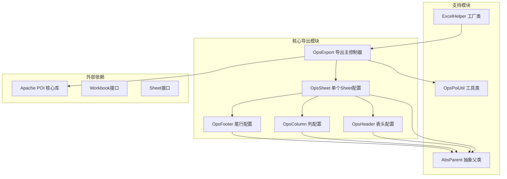
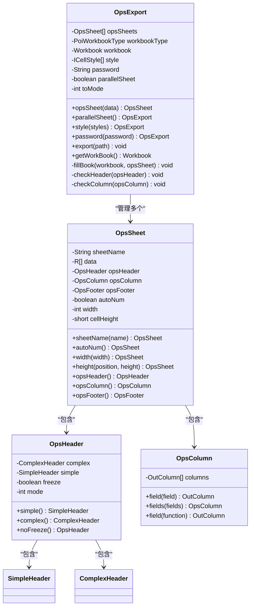
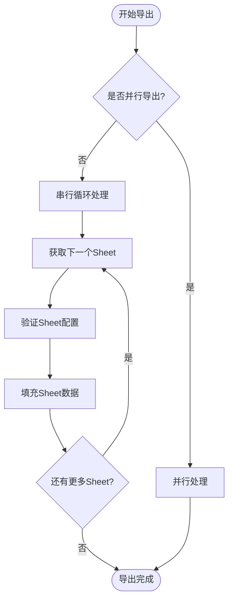
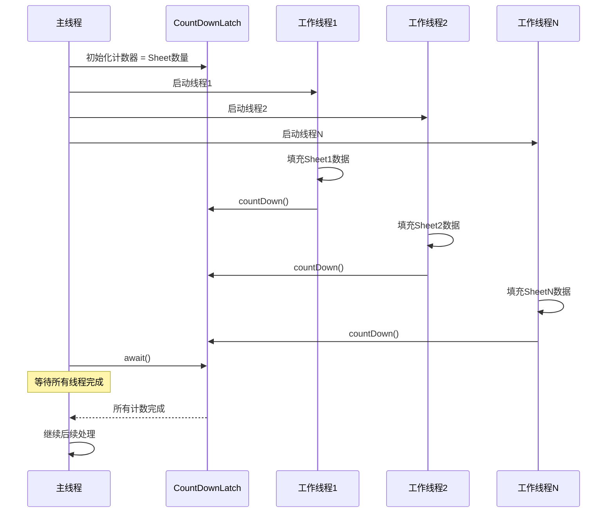
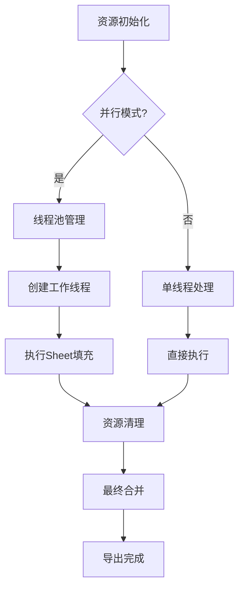

# 多Sheet导出功能深度解析

<cite>
**本文档引用的文件**
- [README-export.md](file://README-export.md)
- [OpsExport.java](file://src/main/java/com/github/stupdit1t/excel/core/export/OpsExport.java)
- [OpsSheet.java](file://src/main/java/com/github/stupdit1t/excel/core/export/OpsSheet.java)
- [OpsHeader.java](file://src/main/java/com/github/stupdit1t/excel/core/export/OpsHeader.java)
- [OpsColumn.java](file://src/main/java/com/github/stupdit1t/excel/core/export/OpsColumn.java)
- [OpsFooter.java](file://src/main/java/com/github/stupdit1t/excel/core/export/OpsFooter.java)
- [ExcelHelper.java](file://src/main/java/com/github/stupdit1t/excel/core/ExcelHelper.java)
- [ExportClass.java](file://src/test/java/excel/export/ExportClass.java)
- [ProjectEvaluate.java](file://src/test/java/excel/export/data/ProjectEvaluate.java)
- [OpsPoiUtil.java](file://src/main/java/com/github/stupdit1t/excel/core/OpsPoiUtil.java)
- [AbsParent.java](file://src/main/java/com/github/stupdit1t/excel/core/AbsParent.java)
</cite>

## 目录
1. [简介](#简介)
2. [项目架构概览](#项目架构概览)
3. [核心组件分析](#核心组件分析)
4. [多Sheet导出实现机制](#多Sheet导出实现机制)
5. [并行导出机制详解](#并行导出机制详解)
6. [线程安全与资源管理](#线程安全与资源管理)
7. [性能优化策略](#性能优化策略)
8. [使用示例与最佳实践](#使用示例与最佳实践)
9. [故障排除指南](#故障排除指南)
10. [总结](#总结)

## 简介

多Sheet导出功能是POI-Excel框架中的核心特性之一，它允许开发者在同一Excel文件中创建多个工作表，每个工作表可以独立配置数据、表头、列定义和样式。该功能特别适用于需要将不同类型或来源的数据组织到一个文件中的场景。

通过连续调用`opsSheet()`方法，开发者可以向同一个Workbook添加多个Sheet，每个OpsSheet实例都可以独立配置其导出参数。系统提供了两种导出模式：串行导出和并行导出，并通过CountDownLatch实现了线程同步控制。

## 项目架构概览

POI-Excel框架采用模块化设计，主要包含以下核心包：



**图表来源**
- [ExcelHelper.java](file://src/main/java/com/github/stupdit1t/excel/core/ExcelHelper.java#L1-L54)
- [OpsExport.java](file://src/main/java/com/github/stupdit1t/excel/core/export/OpsExport.java#L1-L50)
- [OpsSheet.java](file://src/main/java/com/github/stupdit1t/excel/core/export/OpsSheet.java#L1-L50)

## 核心组件分析

### OpsExport - 导出主控制器

OpsExport类是整个导出功能的核心控制器，负责协调多个Sheet的导出过程：



**图表来源**
- [OpsExport.java](file://src/main/java/com/github/stupdit1t/excel/core/export/OpsExport.java#L25-L120)
- [OpsSheet.java](file://src/main/java/com/github/stupdit1t/excel/core/export/OpsSheet.java#L20-L100)
- [OpsHeader.java](file://src/main/java/com/github/stupdit1t/excel/core/export/OpsHeader.java#L15-L50)

### OpsSheet - 单个Sheet配置

OpsSheet类负责管理单个工作表的所有配置信息，包括数据源、表头、列定义和样式设置：

**章节来源**
- [OpsSheet.java](file://src/main/java/com/github/stupdit1t/excel/core/export/OpsSheet.java#L1-L200)

### OpsHeader - 表头配置

OpsHeader类支持两种表头模式：
- **简单表头模式**：适用于常规的单层表头
- **复杂表头模式**：支持多层嵌套表头和单元格合并

**章节来源**
- [OpsHeader.java](file://src/main/java/com/github/stupdit1t/excel/core/export/OpsHeader.java#L1-L199)

### OpsColumn - 列配置

OpsColumn类负责定义数据列的映射关系和格式化规则：

**章节来源**
- [OpsColumn.java](file://src/main/java/com/github/stupdit1t/excel/core/export/OpsColumn.java#L1-L96)

## 多Sheet导出实现机制

### 串行导出流程

当不启用并行导出时，系统按照顺序依次处理每个Sheet：



**图表来源**
- [OpsExport.java](file://src/main/java/com/github/stupdit1t/excel/core/export/OpsExport.java#L220-L240)

### 并行导出流程

当启用并行导出时，系统使用CountDownLatch实现线程同步：



**图表来源**
- [OpsExport.java](file://src/main/java/com/github/stupdit1t/excel/core/export/OpsExport.java#L220-L240)

**章节来源**
- [OpsExport.java](file://src/main/java/com/github/stupdit1t/excel/core/export/OpsExport.java#L220-L240)

## 并行导出机制详解

### CountDownLatch同步机制

CountDownLatch是Java并发编程中的重要同步工具，在多Sheet导出中用于确保所有Sheet都成功导出后才继续执行：

```java
// 并行导出实现
if (this.parallelSheet) {
    CountDownLatch count = new CountDownLatch(opsSheets.size());
    opsSheets.parallelStream().forEach(opsSheet -> {
        fillBook(workbook, opsSheet);
        count.countDown(); // 每个线程完成时递减计数
    });
    try {
        count.await(); // 主线程等待所有工作线程完成
    } catch (InterruptedException e) {
        e.printStackTrace();
    }
}
```

### parallelSheet()方法实现

parallelSheet()方法是一个简单的标记设置方法，用于指示系统启用并行导出模式：

```java
/**
 * 并行导出sheet, 默认fork join线程池
 *
 * @return OpsExport
 */
public OpsExport parallelSheet() {
    this.parallelSheet = true;
    return this;
}
```

**章节来源**
- [OpsExport.java](file://src/main/java/com/github/stupdit1t/excel/core/export/OpsExport.java#L140-L150)

### 并行流的优势

1. **性能提升**：充分利用多核CPU优势
2. **资源隔离**：每个Sheet在独立线程中处理
3. **错误隔离**：单个Sheet的异常不会影响其他Sheet
4. **响应性**：主线程可以继续处理其他任务

## 线程安全与资源管理

### 线程安全策略

虽然Apache POI本身不是线程安全的，但POI-Excel框架通过以下策略确保线程安全：

1. **工作簿级别的隔离**：每个Sheet操作都在独立的工作簿实例上进行
2. **数据副本传递**：避免共享可变状态
3. **同步点控制**：使用CountDownLatch确保所有操作完成后再合并

### 资源管理策略



**图表来源**
- [OpsExport.java](file://src/main/java/com/github/stupdit1t/excel/core/export/OpsExport.java#L220-L240)

### 内存优化

对于大数据量场景，系统提供了Big XLSX格式支持：

```java
// 声明导出BIG XLSX
ExcelHelper.opsExport(PoiWorkbookType.BIG_XLSX)
    .opsSheet(bigData)
    .sheetName("1")
    .opsHeader().simple().texts("项目名称", "项目图", "所属区域", "省份", "市").done()
    .opsColumn().fields("projectName", "img", "areaName", "province", "city").done()
    .done()
    .export("src/test/java/excel/export/excel/bigData.xlsx");
```

**章节来源**
- [README-export.md](file://README-export.md#L290-L315)

## 性能优化策略

### 大数据量优化

1. **Big XLSX格式**：使用SXSSFWorkbook减少内存占用
2. **流式写入**：避免将整个文件加载到内存
3. **分批处理**：对超大数据集进行分批导出

### 并发优化

1. **线程池复用**：使用默认的ForkJoinPool
2. **最小化锁竞争**：每个Sheet独立处理
3. **异步完成通知**：使用CountDownLatch而非阻塞队列

### 内存使用监控

```java
// 内存使用示例
@Test
public void memoryOptimization() {
    // 大数据量测试
    List<ProjectEvaluate> bigData = new ArrayList<>();
    for (int i = 0; i < 100000; i++) {
        ProjectEvaluate obj = new ProjectEvaluate();
        // 填充数据...
        bigData.add(obj);
    }
    
    // 使用Big XLSX格式
    ExcelHelper.opsExport(PoiWorkbookType.BIG_XLSX)
        .opsSheet(bigData)
        .sheetName("大数据")
        .opsHeader().simple().texts("项目名称", "所属区域").done()
        .opsColumn().fields("projectName", "areaName").done()
        .done()
        .export("large_data.xlsx");
}
```

**章节来源**
- [ExportClass.java](file://src/test/java/excel/export/ExportClass.java#L60-L85)

## 使用示例与最佳实践

### 基础多Sheet导出示例

```java
// 多Sheet导出基础示例
ExcelHelper.opsExport(PoiWorkbookType.XLSX)
    // 启用并行导出
    .parallelSheet()
    // 第一个Sheet
    .opsSheet(mapData)
        .sheetName("用户信息")
        .opsHeader().simple().texts("姓名", "年龄").done()
        .opsColumn().fields("name", "age").done()
        .done()
    // 第二个Sheet
    .opsSheet(complexData)
        .sheetName("学生信息")
        .opsHeader().simple().texts("学生姓名", "班级", "学校", "家长").done()
        .opsColumn().fields("name", "classRoom.name", "classRoom.school.name", "moreInfo.parent.age").done()
        .done()
    // 第三个Sheet
    .opsSheet(bigData)
        .sheetName("项目评估")
        .opsHeader().simple().texts("项目名称", "所属区域", "省份", "城市").done()
        .opsColumn().fields("projectName", "areaName", "province", "city").done()
        .done()
    .export("multi_sheet_export.xlsx");
```

**章节来源**
- [README-export.md](file://README-export.md#L246-L273)

### 高级配置示例

```java
// 高级多Sheet配置示例
ExcelHelper.opsExport(PoiWorkbookType.XLSX)
    .parallelSheet()
    .opsSheet(data)
        .sheetName("基础数据")
        .autoNum() // 自动生成序号
        .width(15000) // 全局列宽
        .height(CellPosition.CELL, 300) // 单元格高度
        .opsHeader()
            .simple()
            .title("项目评估报告")
            .texts("序号", "项目名称", "所属区域", "省份", "市", "项目所属人", "项目领导人", "得分", "平均分", "创建时间")
            .done()
        .opsColumn()
            .fields("projectName", "areaName", "province", "city", "people", "leader", "scount", "avg", "createTime")
            .field("scount").pattern("#,##0").done()
            .field("avg").pattern("0.00%").done()
            .field("createTime").pattern("yyyy-MM-dd").done()
            .done()
        .opsFooter()
            .text("合计", "A1:H1")
            .text("=SUM(J3:J12)", "J3:J3")
            .text("=AVERAGE(K3:K12)", "K3:K3")
            .done()
        .done()
    .export("advanced_multi_sheet.xlsx");
```

**章节来源**
- [README-export.md](file://README-export.md#L40-L120)

### 最佳实践建议

1. **合理使用并行导出**：仅在Sheet数量较多或数据量较大时启用
2. **内存监控**：定期检查内存使用情况，避免OOM异常
3. **错误处理**：为每个Sheet提供独立的错误处理机制
4. **性能测试**：在生产环境中进行充分的性能测试

## 故障排除指南

### 常见问题及解决方案

#### 1. 并行导出无响应

**问题描述**：启用parallelSheet()后程序卡住不动

**可能原因**：
- CountDownLatch计数不匹配
- 线程池耗尽
- 死锁情况

**解决方案**：
```java
// 添加超时机制
try {
    if (!count.await(30, TimeUnit.SECONDS)) {
        throw new TimeoutException("并行导出超时");
    }
} catch (InterruptedException | TimeoutException e) {
    // 处理超时异常
}
```

#### 2. 内存溢出错误

**问题描述**：处理大数据量时出现OutOfMemoryError

**解决方案**：
```java
// 使用Big XLSX格式
ExcelHelper.opsExport(PoiWorkbookType.BIG_XLSX)
    .opsSheet(largeDataset)
    .sheetName("大数据")
    .opsHeader().simple().texts("数据项").done()
    .opsColumn().fields("dataField").done()
    .done()
    .export("large_data.xlsx");
```

#### 3. Sheet配置冲突

**问题描述**：多个Sheet之间存在配置冲突

**解决方案**：
```java
// 确保每个Sheet配置独立
.opsSheet(sheet1Data)
    .sheetName("Sheet1")
    .opsHeader().simple().texts("列1", "列2").done()
    .opsColumn().fields("field1", "field2").done()
    .done()

.opsSheet(sheet2Data)
    .sheetName("Sheet2")
    .opsHeader().simple().texts("列A", "列B").done()
    .opsColumn().fields("fieldA", "fieldB").done()
    .done()
```

**章节来源**
- [OpsExport.java](file://src/main/java/com/github/stupdit1t/excel/core/export/OpsExport.java#L220-L240)

## 总结

多Sheet导出功能是POI-Excel框架的重要特性，它通过以下关键机制实现了高效的数据导出：

1. **模块化设计**：清晰的职责分离，便于维护和扩展
2. **链式API**：流畅的编程接口，提高开发效率
3. **并行处理**：CountDownLatch实现的线程同步，显著提升性能
4. **资源管理**：合理的内存和线程管理策略
5. **灵活配置**：支持多种表头模式和样式定制

通过合理使用这些功能，开发者可以轻松实现复杂的多Sheet导出需求，同时保持良好的性能和可维护性。在实际应用中，建议根据具体场景选择合适的导出模式，并注意内存管理和错误处理，以确保系统的稳定运行。