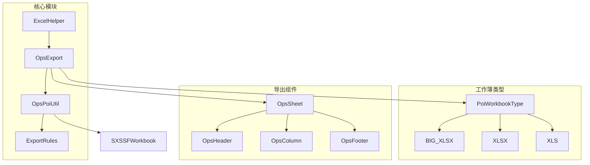
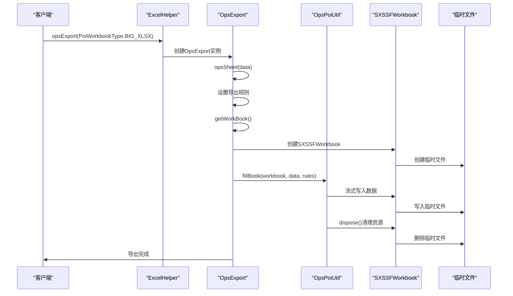
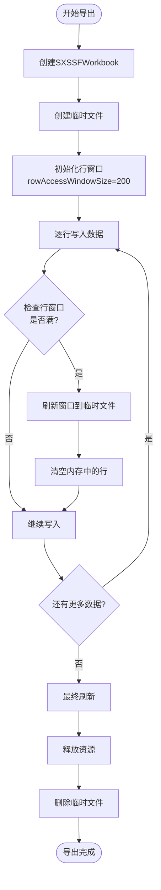
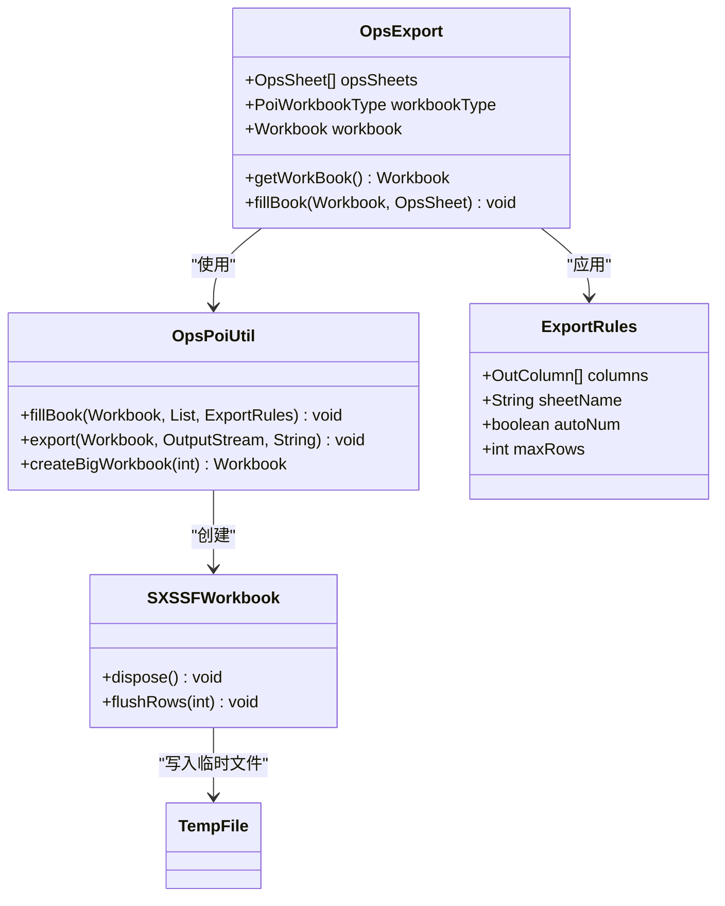
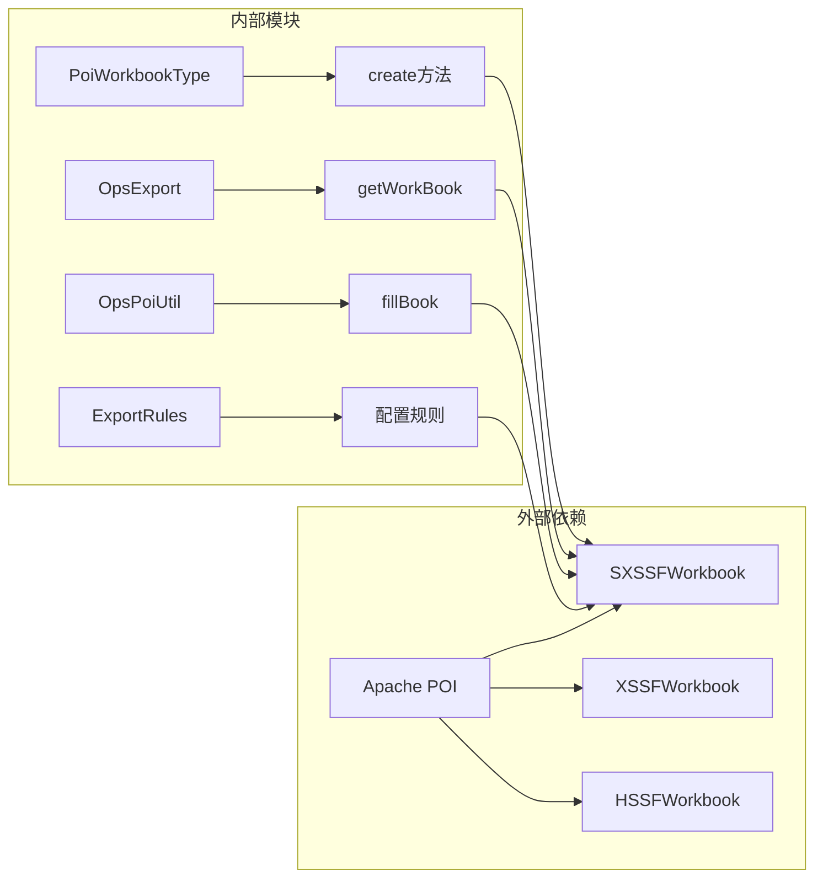

# 大数据导出功能文档

<cite>
**本文档引用的文件**
- [README-export.md](file://README-export.md)
- [PoiWorkbookType.java](file://src/main/java/com/github/stupdit1t/excel/common/PoiWorkbookType.java)
- [OpsExport.java](file://src/main/java/com/github/stupdit1t/excel/core/export/OpsExport.java)
- [OpsPoiUtil.java](file://src/main/java/com/github/stupdit1t/excel/core/OpsPoiUtil.java)
- [MemorySimulation.java](file://src/test/java/excel/MemorySimulation.java)
- [MemorySimulation2.java](file://src/test/java/excel/MemorySimulation2.java)
</cite>

## 目录
1. [简介](#简介)
2. [项目结构](#项目结构)
3. [核心组件](#核心组件)
4. [架构概览](#架构概览)
5. [详细组件分析](#详细组件分析)
6. [依赖关系分析](#依赖关系分析)
7. [性能考虑](#性能考虑)
8. [故障排除指南](#故障排除指南)
9. [结论](#结论)

## 简介

本项目是一个基于Apache POI的Excel导出工具，专门针对大数据量场景设计，解决了传统Excel导出过程中常见的内存溢出（OOM）问题。通过采用Apache POI的SXSSFWorkbook实现，该工具能够将大量数据写入临时文件，从而显著降低内存占用。

大数据导出功能的核心优势：
- **内存优化**：通过流式写入机制，避免一次性加载所有数据到内存
- **临时文件管理**：自动创建和管理临时文件，确保数据持久化
- **性能调优**：提供多种配置选项，允许用户根据需求调整性能参数
- **兼容性**：支持多种Excel格式，包括XLSX和XLS

## 项目结构



**图表来源**
- [OpsExport.java](file://src/main/java/com/github/stupdit1t/excel/core/export/OpsExport.java#L1-L50)
- [PoiWorkbookType.java](file://src/main/java/com/github/stupdit1t/excel/common/PoiWorkbookType.java#L1-L30)

**章节来源**
- [README-export.md](file://README-export.md#L1-L50)
- [OpsExport.java](file://src/main/java/com/github/stupdit1t/excel/core/export/OpsExport.java#L1-L100)

## 核心组件

### PoiWorkbookType枚举

PoiWorkbookType是整个大数据导出功能的核心配置类，定义了不同的工作簿类型：

```java
public enum PoiWorkbookType {
    /**
     * 大数据工作簿
     * 速度慢, 可以解决VM内存不够用问题, 单sheet最大1048576行
     */
    BIG_XLSX(XSSFWorkbook::new),

    /**
     * 07 EXCEL
     * 速度慢, 单sheet最大1048576行
     */
    XLSX(XSSFWorkbook::new),

    /**
     * 03 Excel
     * 速度较快, 单sheet最大65535行
     */
    XLS(HSSFWorkbook::new);
}
```

### BIG_XLSX配置参数

当选择BIG_XLSX类型时，系统会自动创建SXSSFWorkbook实例，并支持以下配置参数：

- **rowAccessWindowSize**：内存中保持的行数，默认200行
- **compressTmpFiles**：是否对临时文件使用gzip压缩，默认false
- **useSharedStringsTable**：是否使用共享字符串表，默认false

**章节来源**
- [PoiWorkbookType.java](file://src/main/java/com/github/stupdit1t/excel/common/PoiWorkbookType.java#L1-L107)

## 架构概览



**图表来源**
- [OpsExport.java](file://src/main/java/com/github/stupdit1t/excel/core/export/OpsExport.java#L210-L250)
- [OpsPoiUtil.java](file://src/main/java/com/github/stupdit1t/excel/core/OpsPoiUtil.java#L200-L230)

## 详细组件分析

### BIG_XLSX工作原理

#### 1. SXSSFWorkbook实现机制

当使用PoiWorkbookType.BIG_XLSX时，系统会自动创建SXSSFWorkbook实例：

```java
public Workbook create() {
    Workbook workbook = create.get();
    if (this == PoiWorkbookType.BIG_XLSX) {
        workbook = new SXSSFWorkbook((XSSFWorkbook) workbook, this.rowAccessWindowSize, this.compressTmpFiles, this.useSharedStringsTable);
    }
    return workbook;
}
```

#### 2. 流式写入工作机制



**图表来源**
- [OpsPoiUtil.java](file://src/main/java/com/github/stupdit1t/excel/core/OpsPoiUtil.java#L200-L250)

#### 3. 临时文件管理

系统在SXSSFWorkbook写入过程中会自动创建临时文件来存储超出内存限制的数据：

```java
public static void export(Workbook workbook, OutputStream outputStream, String password) {
    try (
            Workbook wb = workbook;
            OutputStream out = outputStream
    ) {
        wb.write(out);
        if (wb instanceof SXSSFWorkbook) {
            // 将此workbook对应的临时文件删除
            ((SXSSFWorkbook) wb).dispose();
        }
    } catch (IOException e) {
        LOG.error(e);
    }
}
```

**章节来源**
- [OpsPoiUtil.java](file://src/main/java/com/github/stupdit1t/excel/core/OpsPoiUtil.java#L194-L228)

### 性能调优配置

#### 1. 行窗口大小配置

```java
// 设置内存行数
public PoiWorkbookType rowAccessWindowSize(int rowAccessWindowSize) {
    this.rowAccessWindowSize = rowAccessWindowSize;
    return this;
}
```

推荐配置：
- **小数据集（<10万行）**：rowAccessWindowSize=100
- **中等数据集（10万-100万行）**：rowAccessWindowSize=200
- **大数据集（>100万行）**：rowAccessWindowSize=500

#### 2. 压缩配置

```java
// 压缩临时文件
public PoiWorkbookType compressTmpFiles(boolean compressTmpFiles) {
    this.compressTmpFiles = compressTmpFiles;
    return this;
}
```

启用压缩可以减少磁盘空间占用，但会增加CPU使用率。

#### 3. 共享字符串表配置

```java
// 使用共享字符串表
public PoiWorkbookType useSharedStringsTable(boolean useSharedStringsTable) {
    this.useSharedStringsTable = useSharedStringsTable;
    return this;
}
```

对于包含大量重复字符串的数据，启用共享字符串表可以显著减少内存使用。

**章节来源**
- [PoiWorkbookType.java](file://src/main/java/com/github/stupdit1t/excel/common/PoiWorkbookType.java#L70-L107)

### 数据处理流程



**图表来源**
- [OpsExport.java](file://src/main/java/com/github/stupdit1t/excel/core/export/OpsExport.java#L210-L280)
- [OpsPoiUtil.java](file://src/main/java/com/github/stupdit1t/excel/core/OpsPoiUtil.java#L100-L150)

**章节来源**
- [OpsExport.java](file://src/main/java/com/github/stupdit1t/excel/core/export/OpsExport.java#L210-L339)
- [OpsPoiUtil.java](file://src/main/java/com/github/stupdit1t/excel/core/OpsPoiUtil.java#L100-L200)

## 依赖关系分析



**图表来源**
- [PoiWorkbookType.java](file://src/main/java/com/github/stupdit1t/excel/common/PoiWorkbookType.java#L54-L65)
- [OpsExport.java](file://src/main/java/com/github/stupdit1t/excel/core/export/OpsExport.java#L210-L220)

**章节来源**
- [PoiWorkbookType.java](file://src/main/java/com/github/stupdit1t/excel/common/PoiWorkbookType.java#L1-L107)
- [OpsExport.java](file://src/main/java/com/github/stupdit1t/excel/core/export/OpsExport.java#L1-L50)

## 性能考虑

### 内存使用优化策略

1. **行窗口大小调优**
   - 较小的窗口（100行）：内存占用最小，但磁盘I/O频繁
   - 较大的窗口（500行）：内存占用适中，磁盘I/O较少

2. **临时文件管理**
   - 系统会在导出完成后自动清理临时文件
   - 可以通过dispose()方法手动释放资源

3. **并发处理**
   - 支持并行导出多个sheet
   - 使用ForkJoinPool线程池提高效率

### 推荐配置

```java
// 大数据导出示例
ExcelHelper.opsExport(PoiWorkbookType.BIG_XLSX)
    .rowAccessWindowSize(200)           // 内存行数
    .compressTmpFiles(true)             // 压缩临时文件
    .useSharedStringsTable(true)        // 使用共享字符串表
    .opsSheet(bigData)
    .sheetName("大数据导出")
    .opsHeader().simple().texts(headers).done()
    .opsColumn().fields(fields).done()
    .done()
    .export("big_data_export.xlsx");
```

## 故障排除指南

### 常见问题及解决方案

#### 1. 内存溢出问题

**症状**：程序运行时出现OutOfMemoryError
**原因**：未使用BIG_XLSX类型或行窗口设置过小
**解决方案**：
```java
// 使用BIG_XLSX类型
ExcelHelper.opsExport(PoiWorkbookType.BIG_XLSX)
    .rowAccessWindowSize(500)  // 增加行窗口大小
    .opsSheet(data).done()
    .export(path);
```

#### 2. 导出速度慢

**症状**：大数据导出耗时过长
**原因**：磁盘I/O瓶颈或配置不当
**解决方案**：
- 减少rowAccessWindowSize
- 启用临时文件压缩
- 使用并行导出

#### 3. 磁盘空间不足

**症状**：临时文件占用过多磁盘空间
**原因**：临时文件未及时清理
**解决方案**：
- 确保系统有足够的磁盘空间
- 定期清理临时文件目录

**章节来源**
- [OpsPoiUtil.java](file://src/main/java/com/github/stupdit1t/excel/core/OpsPoiUtil.java#L194-L228)

## 结论

本项目通过Apache POI的SXSSFWorkbook实现了高效的大数据Excel导出功能，成功解决了传统方法中的内存溢出问题。主要特点包括：

1. **内存优化**：通过流式写入和临时文件管理，显著降低内存占用
2. **灵活配置**：提供多种参数配置，适应不同规模的数据导出需求
3. **自动资源管理**：系统自动创建和清理临时文件，简化开发复杂度
4. **高性能**：支持并行导出和多种优化策略，保证导出效率

该解决方案特别适用于需要处理百万级别数据的业务场景，为大数据时代的Excel导出需求提供了可靠的解决方案。