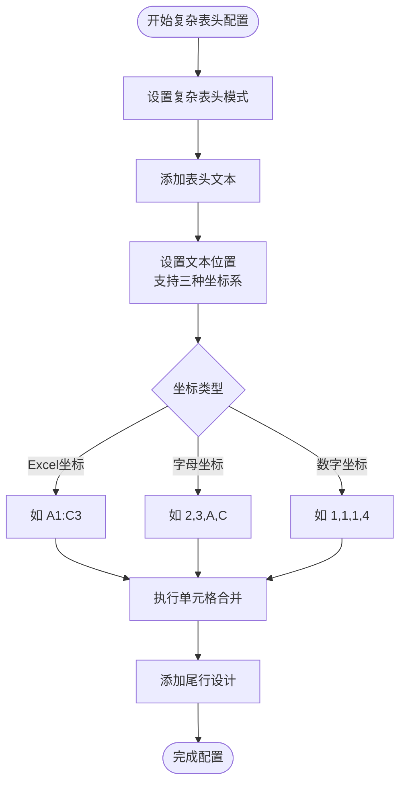

# 导出功能详解

<cite>
**本文档引用的文件**
- [README-export.md](file://README-export.md)
- [ExcelHelper.java](file://src/main/java/com/github/stupdit1t/excel/core/ExcelHelper.java)
- [OpsExport.java](file://src/main/java/com/github/stupdit1t/excel/core/export/OpsExport.java)
- [OpsSheet.java](file://src/main/java/com/github/stupdit1t/excel/core/export/OpsSheet.java)
- [OpsHeader.java](file://src/main/java/com/github/stupdit1t/excel/core/export/OpsHeader.java)
- [OpsColumn.java](file://src/main/java/com/github/stupdit1t/excel/core/export/OpsColumn.java)
- [OutColumn.java](file://src/main/java/com/github/stupdit1t/excel/core/export/OutColumn.java)
- [OutCallback.java](file://src/main/java/com/github/stupdit1t/excel/callback/OutCallback.java)
- [ICellStyle.java](file://src/main/java/com/github/stupdit1t/excel/style/ICellStyle.java)
- [PoiWorkbookType.java](file://src/main/java/com/github/stupdit1t/excel/common/PoiWorkbookType.java)
- [ExportClass.java](file://src/test/java/excel/export/ExportClass.java)
</cite>

## 目录
1. [简介](#简介)
2. [核心架构](#核心架构)
3. [ExcelHelper.opsExport()入口点](#excelhelperopsexport入口点)
4. [简单导出功能](#简单导出功能)
5. [复杂表头导出](#复杂表头导出)
6. [多Sheet导出](#多Sheet导出)
7. [大数据导出(BIG_XLSX)](#大数据导出big_xlsx)
8. [模板导出](#模板导出)
9. [构建器组件协同工作](#构建器组件协同工作)
10. [样式系统](#样式系统)
11. [单元格回调机制](#单元格回调机制)
12. [性能优化策略](#性能优化策略)
13. [故障排除指南](#故障排除指南)
14. [总结](#总结)

## 简介

POI Excel导出功能是一个功能强大且灵活的Excel导出框架，提供了多种导出模式和高级功能。该框架通过链式调用的方式简化了复杂的Excel导出操作，支持简单导出、复杂表头、多Sheet导出、大数据导出以及模板导出等多种场景。

核心特性包括：
- **多种工作簿类型支持**：XLS、XLSX、BIG_XLSX
- **灵活的表头设计**：简单表头和复杂表头模式
- **强大的样式系统**：全局样式和单元格级别样式
- **高性能导出**：并行导出和大数据处理
- **丰富的数据验证**：下拉列表、格式验证等
- **模板支持**：基于现有模板的变量替换

## 核心架构

POI Excel导出功能采用分层架构设计，主要包含以下核心组件：


**图表来源**
- [ExcelHelper.java](file://src/main/java/com/github/stupdit1t/excel/core/ExcelHelper.java#L1-L54)
- [OpsExport.java](file://src/main/java/com/github/stupdit1t/excel/core/export/OpsExport.java#L1-L199)
- [OpsSheet.java](file://src/main/java/com/github/stupdit1t/excel/core/export/OpsSheet.java#L1-L199)

## ExcelHelper.opsExport()入口点

`ExcelHelper.opsExport()`是整个导出功能的入口点，提供了两种重载形式：

### 基础入口点

```java
public static OpsExport opsExport(PoiWorkbookType workbookType) {
    return new OpsExport(workbookType);
}
```

### 高级入口点

```java
public static OpsExport opsExport(Workbook workbook) {
    return new OpsExport(workbook);
}
```

**章节来源**
- [ExcelHelper.java](file://src/main/java/com/github/stupdit1t/excel/core/ExcelHelper.java#L20-L35)

## 简单导出功能

简单导出是最基础的导出模式，适用于结构简单的数据导出场景。

### 实现原理

简单导出通过`OpsHeader.simple()`和`OpsColumn.fields()`两个核心组件实现：


**图表来源**
- [OpsExport.java](file://src/main/java/com/github/stupdit1t/excel/core/export/OpsExport.java#L60-L70)
- [OpsSheet.java](file://src/main/java/com/github/stupdit1t/excel/core/export/OpsSheet.java#L50-L60)

### 关键配置参数

1. **PoiWorkbookType选择**：
   - `XLS`：速度快，单Sheet最大65535行
   - `XLSX`：速度较慢，单Sheet最大1048576行
   - `BIG_XLSX`：大数据专用，可解决内存不足问题

2. **.autoNum()**：自动生成序号列
3. **.parallelSheet()**：启用并行导出（多Sheet场景）

### 实际代码示例

```java
ExcelHelper.opsExport(PoiWorkbookType.XLSX)
    .opsSheet(data)
    .opsHeader().simple().texts("项目名称", "项目图", "所属区域", "省份", "市", "项目所属人", "项目领导人", "得分", "平均分", "创建时间").done()
    .opsColumn().fields("projectName", "img", "areaName", "province", "city", "people", "leader", "scount", "avg", "createTime").done()
    .done()
    .export("src/test/java/excel/export/excel/simpleExport.xlsx");
```

**章节来源**
- [README-export.md](file://README-export.md#L10-L25)
- [ExportClass.java](file://src/test/java/excel/export/ExportClass.java#L100-L120)

## 复杂表头导出

复杂表头支持多级表头和单元格合并，适用于需要层次化展示数据的场景。

### 实现原理

复杂表头通过`OpsHeader.complex()`和`ComplexCell`实现：



**图表来源**
- [OpsHeader.java](file://src/main/java/com/github/stupdit1t/excel/core/export/OpsHeader.java#L100-L150)

### 坐标系统详解

1. **Excel坐标系**：如"A1:C3"，标准Excel单元格引用
2. **字母坐标系**：如"2,3,A,C"，行起始、行结束、列起始、列结束
3. **数字坐标系**：如"1,1,1,4"，行列索引

### 实际代码示例

```java
ExcelHelper.opsExport(PoiWorkbookType.XLSX)
    .opsSheet(data)
        .autoNum()
        .opsHeader()
            .complex()
                .text("项目资源统计", "A1:K1")
                .text("基本信息", 1,1,1,4)
                .text("项目名称", "3,3,B,B")
                .text("所属区域", "3,3,C,C")
                .text("省份", "3,3,D,D")
                .text("市", "3,3,E,E")
                .done()
            .opsColumn()
                .fields("projectName", "areaName", "province", "city", "people", "leader", "scount", "avg", "img", "createTime")
                .done()
            .opsFooter()
                .text("=SUM(H4:H13)", "D1:K2")
                .done()
            .mergeCell("F4:G13")
            .addImage(imageParseBytes(new File("path/to/image.jpg")), "F4:G13")
            .done()
        .export("src/test/java/excel/export/excel/complexExport.xlsx");
```

**章节来源**
- [README-export.md](file://README-export.md#L80-L120)

## 多Sheet导出

多Sheet导出支持同时导出多个工作表，特别适合报表汇总场景。

### 实现原理


**图表来源**
- [OpsExport.java](file://src/main/java/com/github/stupdit1t/excel/core/export/OpsExport.java#L120-L130)

### 关键特性

1. **并行导出**：`.parallelSheet()`启用多线程导出
2. **独立配置**：每个Sheet可以有独立的表头、列定义和样式
3. **统一输出**：所有Sheet导出到同一个文件

### 实际代码示例

```java
ExcelHelper.opsExport(PoiWorkbookType.XLSX)
    .parallelSheet()
    .opsSheet(mapData)
        .sheetName("sheet1")
        .opsHeader().simple().texts("姓名", "年龄").done()
        .opsColumn().fields("name", "age").done()
        .done()
    .opsSheet(complexData)
        .sheetName("sheet2")
        .opsHeader().simple().texts("學生姓名", "所在班級", "所在學校", "更多父母姓名").done()
        .opsColumn().fields("name", "classRoom.name", "classRoom.school.name", "moreInfo.parent.age").done()
        .done()
    .opsSheet(bigData)
        .sheetName("sheet3")
        .opsHeader().simple().texts("项目名称", "项目图", "所属区域", "省份", "市", "项目所属人", "项目领导人", "得分", "平均分", "创建时间").done()
        .opsColumn().fields("projectName", "img", "areaName", "province", "city", "people", "leader", "scount", "avg", "createTime").done()
        .done()
    .export("src/test/java/excel/export/excel/mulSheet.xlsx");
```

**章节来源**
- [README-export.md](file://README-export.md#L200-L220)

## 大数据导出(BIG_XLSX)

大数据导出专门针对超大容量数据的导出需求，解决了内存不足的问题。

### 实现原理


**图表来源**
- [PoiWorkbookType.java](file://src/main/java/com/github/stupdit1t/excel/common/PoiWorkbookType.java#L20-L50)

### 性能优化配置

1. **行窗口大小**：控制内存中保持的行数，默认200行
2. **临时文件压缩**：减少磁盘空间占用
3. **共享字符串表**：优化字符串存储

### 实际代码示例

```java
ExcelHelper.opsExport(PoiWorkbookType.BIG_XLSX)
    .opsSheet(bigData)
    .sheetName("1")
    .opsHeader().simple().texts("项目名称", "项目图", "所属区域", "省份", "市", "项目所属人", "项目领导人", "得分", "平均分", "创建时间").done()
    .opsColumn().fields("projectName", "img", "areaName", "province", "city", "people", "leader", "scount", "avg", "createTime").done()
    .done()
    .export("src/test/java/excel/export/excel/bigData.xlsx");
```

**章节来源**
- [README-export.md](file://README-export.md#L230-L240)
- [PoiWorkbookType.java](file://src/main/java/com/github/stupdit1t/excel/common/PoiWorkbookType.java#L30-L50)

## 模板导出

模板导出允许基于现有Excel模板进行变量替换和数据填充。

### 实现原理

模板导出通过`OpsReplace`类实现，支持变量占位符替换：


### 数据验证机制

1. **文本验证**：`verifyText("11~11", "请输入11位的手机号码！")`
2. **日期验证**：`verifyDate("2000-01-01~3000-12-31")`
3. **数值验证**：`verifyIntNum("10~30")` 和 `verifyFloatNum("10.0~30.0")`
4. **自定义验证**：`verifyCustom("VALUE(F3:F6000)", "月齡格式：如1年2个月则输入14")`

### 实际代码示例

```java
ExcelHelper.opsExport(PoiWorkbookType.XLSX)
    .opsSheet(Collections.emptyList())
        .opsHeader().simple().texts("宝宝姓名", "手机号码", "宝宝生日", "月龄", "宝宝性别", "来源渠道", "备注").done()
        .opsColumn()
            .field("宝宝姓名").done()
            .field("手机号码").verifyText("11~11", "请输入11位的手机号码！").done()
            .field("宝宝生日").pattern("yyyy-MM-dd").verifyDate("2000-01-01~3000-12-31").done()
            .field("月龄").width(4).verifyCustom("VALUE(F3:F6000)", "月齡格式：如1年2个月则输入14").done()
            .field("宝宝性别").dropdown("男", "女").done()
            .field("来源渠道").width(12).dropdown("品推", "市场").done()
            .field("备注").done()
            .done()
        .done()
    .export("src/test/java/excel/export/excel/templateExport.xlsx");
```

**章节来源**
- [README-export.md](file://README-export.md#L130-L170)

## 构建器组件协同工作

导出功能的各个组件通过构建器模式协同工作，形成完整的导出流程。

### 组件协作流程


**图表来源**
- [OpsExport.java](file://src/main/java/com/github/stupdit1t/excel/core/export/OpsExport.java#L60-L70)
- [OpsSheet.java](file://src/main/java/com/github/stupdit1t/excel/core/export/OpsSheet.java#L50-L80)

### 关键构建器组件

1. **OpsHeader**：表头定义组件
   - `simple()`：简单表头模式
   - `complex()`：复杂表头模式
   - `noFreeze()`：禁用表头冻结

2. **OpsColumn**：数据列定义组件
   - `field()`：单字段定义
   - `fields()`：批量字段定义
   - 支持级联属性访问（如`classRoom.name`）

3. **OpsFooter**：尾行设计组件
   - `text()`：普通文本
   - `formula()`：公式计算
   - 支持坐标合并

**章节来源**
- [OpsHeader.java](file://src/main/java/com/github/stupdit1t/excel/core/export/OpsHeader.java#L40-L80)
- [OpsColumn.java](file://src/main/java/com/github/stupdit1t/excel/core/export/OpsColumn.java#L20-L60)

## 样式系统

POI Excel导出功能提供了强大的样式系统，支持全局样式和单元格级别样式。

### 样式接口设计


**图表来源**
- [ICellStyle.java](file://src/main/java/com/github/stupdit1t/excel/style/ICellStyle.java#L1-L57)
- [OutColumn.java](file://src/main/java/com/github/stupdit1t/excel/core/export/OutColumn.java#L50-L100)

### 全局样式配置

```java
ICellStyle titleStyle = new ICellStyle() {
    @Override
    public CellPosition getPosition() {
        return CellPosition.TITLE;
    }
    
    @Override
    public void handleStyle(Font font, CellStyle cellStyle) {
        font.setFontHeightInPoints((short) 20);
        font.setColor(IndexedColors.RED.index);
        cellStyle.setAlignment(HorizontalAlignment.LEFT);
    }
};

ExcelHelper.opsExport(PoiWorkbookType.XLSX)
    .style(titleStyle)
    .opsSheet(data)
    .opsHeader().simple().title("我是大标题").done()
    .done();
```

### 单元格级别样式

```java
.opsColumn()
    .field("city")
    .wrapText()
    .dropdown("北京", "西安", "上海", "广州")
    .mergerRepeat()
    .height(500)
    .comment("城市选择下拉框内容哦")
    .width(6000)
    .map((val, row, style, rowIndex) -> {
        if (val.equals("北京")) {
            style.setBackColor(IndexedColors.YELLOW);
            style.setHeight(900);
            style.setComment("北京搞红色");
            return "=J" + index + "+K" + index;
        }
        return val;
    })
    .done()
```

**章节来源**
- [README-export.md](file://README-export.md#L40-L80)
- [ICellStyle.java](file://src/main/java/com/github/stupdit1t/excel/style/ICellStyle.java#L10-L40)

## 单元格回调机制

单元格回调机制允许对每个单元格的值进行动态处理和样式定制。

### 回调接口设计


**图表来源**
- [OutCallback.java](file://src/main/java/com/github/stupdit1t/excel/callback/OutCallback.java#L1-L26)
- [OutColumn.java](file://src/main/java/com/github/stupdit1t/excel/core/export/OutColumn.java#L50-L100)

### 回调函数参数详解

1. **value**：当前单元格的原始值
2. **row**：当前行的数据对象
3. **style**：可修改的单元格样式对象
4. **rowIndex**：数据行索引（从0开始）

### 实际应用场景

```java
.map((val, row, style, rowIndex) -> {
    // 条件样式设置
    if (val.equals("北京")) {
        style.setBackColor(IndexedColors.YELLOW);
        style.setHeight(900);
        style.setComment("北京搞红色");
        // 返回公式值
        int index = rowIndex + 1;
        return "=J" + index + "+K" + index;
    }
    // 返回处理后的值
    return val;
})
```

**章节来源**
- [OutCallback.java](file://src/main/java/com/github/stupdit1t/excel/callback/OutCallback.java#L15-L25)
- [README-export.md](file://README-export.md#L60-L80)

## 性能优化策略

POI Excel导出功能提供了多种性能优化策略，确保在大数据量场景下的高效运行。

### 内存优化策略

1. **BIG_XLSX类型**：使用SXSSFWorkbook实现流式写入
2. **行窗口控制**：通过`rowAccessWindowSize`控制内存中保持的行数
3. **临时文件压缩**：减少磁盘空间占用
4. **共享字符串表**：优化字符串存储效率

### 并行处理策略

```java
// 多线程导出多个Sheet
ExcelHelper.opsExport(PoiWorkbookType.XLSX)
    .parallelSheet()  // 启用并行导出
    .opsSheet(data1)
    .opsSheet(data2)
    .opsSheet(data3)
    .export("multi-sheet.xlsx");
```

### 输出模式优化


**章节来源**
- [OpsExport.java](file://src/main/java/com/github/stupdit1t/excel/core/export/OpsExport.java#L120-L140)
- [PoiWorkbookType.java](file://src/main/java/com/github/stupdit1t/excel/common/PoiWorkbookType.java#L40-L80)

## 故障排除指南

### 常见问题及解决方案

1. **内存溢出错误**
   - 问题：`OutOfMemoryError`出现在大数据导出时
   - 解决方案：使用`BIG_XLSX`类型并调整`rowAccessWindowSize`

2. **表头冻结异常**
   - 问题：复杂表头冻结导致布局错乱
   - 解决方案：使用`.noFreeze()`禁用表头冻结

3. **样式不生效**
   - 问题：自定义样式没有应用到单元格
   - 解决方案：检查`ICellStyle`实现的`getPosition()`返回值

4. **公式计算失败**
   - 问题：尾行公式无法正确计算
   - 解决方案：确保公式语法正确，使用绝对引用（如`$A$1`）

### 调试技巧

1. **启用日志**：添加时间戳记录各阶段耗时
2. **分步验证**：逐步添加配置验证每部分功能
3. **内存监控**：监控JVM内存使用情况
4. **文件检查**：及时检查生成的Excel文件完整性

**章节来源**
- [ExportClass.java](file://src/test/java/excel/export/ExportClass.java#L80-L100)

## 总结

POI Excel导出功能是一个功能完备、性能优异的Excel导出框架。通过链式调用的设计模式，它将复杂的Excel导出操作简化为直观的API调用。主要优势包括：

1. **功能丰富**：支持简单导出、复杂表头、多Sheet、大数据和模板导出
2. **性能优异**：提供内存优化和并行处理能力
3. **易于使用**：清晰的API设计和丰富的配置选项
4. **扩展性强**：支持自定义样式和回调机制

该框架特别适合企业级应用中的报表导出需求，能够满足各种复杂的业务场景。通过合理选择工作簿类型、配置性能参数和使用适当的导出模式，可以实现高效、稳定的Excel导出功能。