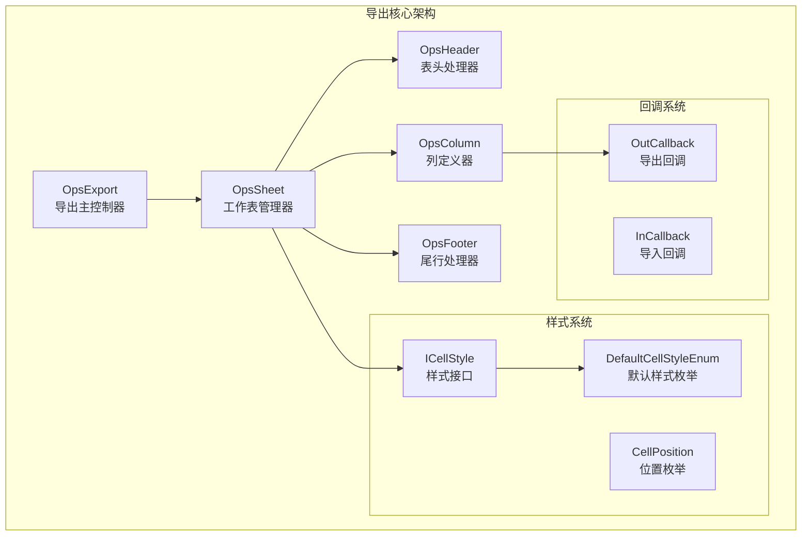
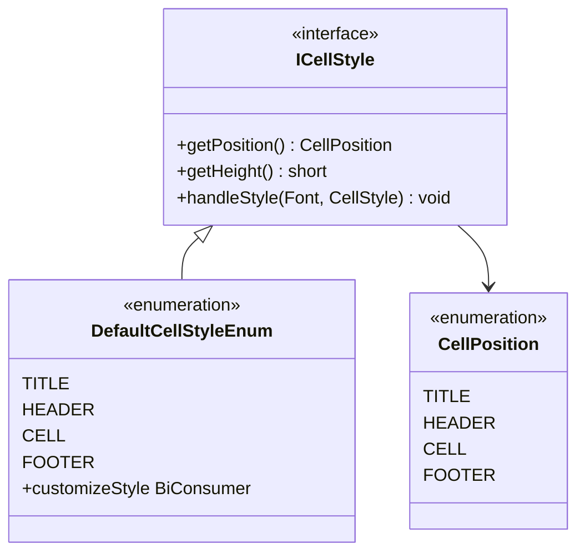
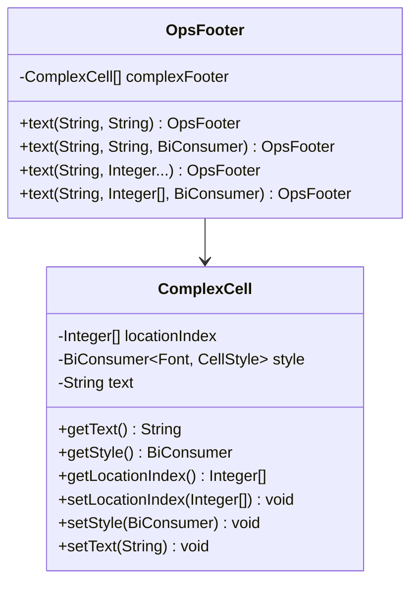

# 导出高级功能

<cite>
**本文档引用的文件**
- [ICellStyle.java](file://src/main/java/com/github/stupdit1t/excel/style/ICellStyle.java)
- [OutCallback.java](file://src/main/java/com/github/stupdit1t/excel/callback/OutCallback.java)
- [OpsFooter.java](file://src/main/java/com/github/stupdit1t/excel/core/export/OpsFooter.java)
- [OpsExport.java](file://src/main/java/com/github/stupdit1t/excel/core/export/OpsExport.java)
- [OpsSheet.java](file://src/main/java/com/github/stupdit1t/excel/core/export/OpsSheet.java)
- [OutColumn.java](file://src/main/java/com/github/stupdit1t/excel/core/export/OutColumn.java)
- [ComplexCell.java](file://src/main/java/com/github/stupdit1t/excel/core/export/ComplexCell.java)
- [DefaultCellStyleEnum.java](file://src/main/java/com/github/stupdit1t/excel/style/DefaultCellStyleEnum.java)
- [ExportClass.java](file://src/test/java/excel/export/ExportClass.java)
- [README-export.md](file://README-export.md)
</cite>

## 目录
1. [简介](#简介)
2. [项目架构概览](#项目架构概览)
3. [ICellStyle接口详解](#icellstyle接口详解)
4. [OpsFooter类高级功能](#opsfooter类高级功能)
5. [OutCallback回调机制](#outcallback回调机制)
6. [复杂布局功能](#复杂布局功能)
7. [高级样式定制](#高级样式定制)
8. [实际应用案例](#实际应用案例)
9. [性能优化建议](#性能优化建议)
10. [故障排除指南](#故障排除指南)

## 简介

poi-excel是一个基于Apache POI的Java工具库，专门用于简化Excel表格的处理操作。该库提供了强大的导出功能，支持通过实现ICellStyle接口来自定义单元格样式，通过OpsFooter类添加合计行和公式，以及通过OutCallback在导出过程中动态修改单元格值。

本文档将深入讲解这些高级功能的实现原理和使用方法，帮助开发者充分利用poi-excel的强大能力。

## 项目架构概览

poi-excel的导出功能采用了模块化的架构设计，主要包含以下几个核心组件：



**图表来源**
- [OpsExport.java](file://src/main/java/com/github/stupdit1t/excel/core/export/OpsExport.java#L1-L50)
- [OpsSheet.java](file://src/main/java/com/github/stupdit1t/excel/core/export/OpsSheet.java#L1-L50)
- [ICellStyle.java](file://src/main/java/com/github/stupdit1t/excel/style/ICellStyle.java#L1-L30)

## ICellStyle接口详解

ICellStyle接口是poi-excel样式系统的核心，它允许开发者通过实现该接口来自定义不同类型的单元格样式。

### 接口定义

```java
public interface ICellStyle {
    CellPosition getPosition();
    default short getHeight() { return -1; }
    void handleStyle(Font font, CellStyle cellStyle);
}
```

### 样式位置枚举

ICellStyle支持四种不同的样式位置：



**图表来源**
- [ICellStyle.java](file://src/main/java/com/github/stupdit1t/excel/style/ICellStyle.java#L10-L25)
- [DefaultCellStyleEnum.java](file://src/main/java/com/github/stupdit1t/excel/style/DefaultCellStyleEnum.java#L10-L30)

### 实现自定义样式

开发者可以通过实现ICellStyle接口来创建自定义样式：

```java
// 创建自定义标题样式
ICellStyle titleStyle = new ICellStyle() {
    @Override
    public CellPosition getPosition() {
        return CellPosition.TITLE;
    }
    
    @Override
    public void handleStyle(Font font, CellStyle cellStyle) {
        font.setFontHeightInPoints((short) 20);
        font.setColor(IndexedColors.RED.index);
        cellStyle.setAlignment(HorizontalAlignment.LEFT);
    }
};
```

### 默认样式系统

系统提供了四种预定义的默认样式：

1. **TITLE样式**：用于大标题，15号加粗字体，居中对齐
2. **HEADER样式**：用于表头，白色字体，灰色背景，带边框
3. **CELL样式**：用于数据单元格，标准字体，带边框
4. **FOOTER样式**：用于尾行，标准字体，带边框

**章节来源**
- [ICellStyle.java](file://src/main/java/com/github/stupdit1t/excel/style/ICellStyle.java#L1-L57)
- [DefaultCellStyleEnum.java](file://src/main/java/com/github/stupdit1t/excel/style/DefaultCellStyleEnum.java#L1-L114)

## OpsFooter类高级功能

OpsFooter类提供了强大的尾行设计功能，支持在数据末尾添加合计行、公式和自定义内容。

### 基本功能架构



**图表来源**
- [OpsFooter.java](file://src/main/java/com/github/stupdit1t/excel/core/export/OpsFooter.java#L1-L50)
- [ComplexCell.java](file://src/main/java/com/github/stupdit1t/excel/core/export/ComplexCell.java#L1-L50)

### 添加合计行和公式

OpsFooter支持多种方式添加合计行和公式：

```java
// 添加合计行
.opsFooter()
    .text("合计", "A1:H1")  // 合并单元格
    .text("=SUM(J3:J10)", "J3:J3")  // 求和公式
    .text("=AVERAGE(K3:K10)", "K3:K3")  // 平均值公式
    .text("作者:625", 0, 0, 8, 8)  // 自定义文本
    .done()
.done()
```

### 复杂尾行设计

支持复杂坐标系统和自定义样式：

```java
.opsFooter()
    .text("=SUM(H4:H13)", "D1:K2")  // Excel坐标格式
    .text("=SUM(H4:H13)", 0, 1, 3, 10)  // 数字坐标格式
    .text("作者信息", (font, style) -> {
        font.setColor(IndexedColors.GRAY.index);
        style.setFillForegroundColor(IndexedColors.LIGHT_GRAY.index);
    })
    .done()
.done()
```

**章节来源**
- [OpsFooter.java](file://src/main/java/com/github/stupdit1t/excel/core/export/OpsFooter.java#L1-L83)
- [README-export.md](file://README-export.md#L150-L180)

## OutCallback回调机制

OutCallback是poi-excel导出过程中的核心回调机制，允许在导出时动态修改单元格值、设置样式属性。

### 回调接口定义

```java
@FunctionalInterface
public interface OutCallback<R> {
    Object callback(Object value, R row, OutColumn.Style style, int rowIndex);
}
```

### 回调参数详解

- **value**：当前单元格的原始值
- **row**：当前数据行对象
- **style**：可修改的单元格样式对象
- **rowIndex**：当前行索引（从0开始）

### 动态样式修改

```java
.field("city")
    .map((val, row, style, rowIndex) -> {
        // 条件判断修改样式
        if (val.equals("北京")) {
            style.setBackColor(IndexedColors.YELLOW);
            style.setHeight(900);
            style.setComment("北京搞红色");
            
            // 返回公式值
            int index = rowIndex + 1;
            return "=J" + index + "+K" + index;
        }
        return val;
    })
.done()
```

### 高级回调应用

```java
.field("score")
    .map((val, row, style, rowIndex) -> {
        Double score = Double.parseDouble(val.toString());
        
        // 根据分数设置不同样式
        if (score >= 90) {
            style.setBackColor(IndexedColors.GREEN);
            style.setColor(IndexedColors.WHITE);
        } else if (score >= 60) {
            style.setBackColor(IndexedColors.YELLOW);
        } else {
            style.setBackColor(IndexedColors.RED);
            style.setColor(IndexedColors.WHITE);
        }
        
        // 添加条件格式提示
        style.setComment(score >= 90 ? "优秀" : 
                        score >= 60 ? "及格" : "不及格");
        
        return val;
    })
.done()
```

**章节来源**
- [OutCallback.java](file://src/main/java/com/github/stupdit1t/excel/callback/OutCallback.java#L1-L26)
- [OutColumn.java](file://src/main/java/com/github/stupdit1t/excel/core/export/OutColumn.java#L1-L100)

## 复杂布局功能

poi-excel提供了丰富的复杂布局功能，包括单元格合并、图片插入、自定义高度和宽度等。

### 单元格合并

```java
// 合并单元格
.mergeCell("F4:G13")
.mergeCell(5, 3, 6, 12)  // 数字坐标格式
```

### 图片插入

```java
// 插入图片到指定区域
.addImage(imageParseBytes(new File("path/to/image.jpg")), "F4:G13")
.addImage(imageParseBytes(new File("path/to/image.png")), 5, 3, 6, 12)
```

### 高度和宽度控制

```java
// 设置全局高度
.height(CellPosition.CELL, 300)
.height(CellPosition.HEADER, 200)
.height(CellPosition.TITLE, 400)

// 设置全局宽度
.width(100000)

// 设置列特定高度和宽度
.field("city")
    .height(500)
    .width(6000)
    .done()
```

### 复杂布局示例

```java
ExcelHelper.opsExport(PoiWorkbookType.XLSX)
    .opsSheet(data)
        .autoNum()
        .opsHeader()
            .complex()
                .text("项目资源统计", "A1:K1")
                .text("基本信息", 1,1,1,4)
                .text("项目名称", "3,3,B,B")
                .text("所属区域", "3,3,C,C")
                .done()
            .opsColumn()
                .fields("projectName", "areaName", "province", "city")
                .done()
            .opsFooter()
                .text("=SUM(H4:H13)", "D1:K2")
                .done()
        .mergeCell("F4:G13")
        .addImage(imageParseBytes(new File("image.jpg")), "F4:G13")
        .done()
    .export("complex_layout.xlsx");
```

**章节来源**
- [OpsSheet.java](file://src/main/java/com/github/stupdit1t/excel/core/export/OpsSheet.java#L1-L100)
- [README-export.md](file://README-export.md#L180-L200)

## 高级样式定制

poi-excel提供了多层次的样式定制功能，从全局样式到列级别样式，再到单元格级别的动态样式。

### 全局样式定制

```java
// 创建自定义全局样式
ICellStyle customStyle = new ICellStyle() {
    @Override
    public CellPosition getPosition() {
        return CellPosition.CELL;
    }
    
    @Override
    public void handleStyle(Font font, CellStyle cellStyle) {
        font.setFontName("Arial");
        font.setFontHeightInPoints((short) 10);
        font.setBold(true);
        
        cellStyle.setAlignment(HorizontalAlignment.CENTER);
        cellStyle.setVerticalAlignment(VerticalAlignment.CENTER);
        
        // 设置边框
        cellStyle.setBorderRight(BorderStyle.THIN);
        cellStyle.setBorderLeft(BorderStyle.THIN);
        cellStyle.setBorderTop(BorderStyle.THIN);
        cellStyle.setBorderBottom(BorderStyle.THIN);
        
        // 设置背景色
        cellStyle.setFillForegroundColor(IndexedColors.LIGHT_BLUE.index);
        cellStyle.setFillPattern(FillPatternType.SOLID_FOREGROUND);
    }
};

// 应用全局样式
ExcelHelper.opsExport(PoiWorkbookType.XLSX)
    .style(customStyle)
    .opsSheet(data)
    .done()
    .export("styled_export.xlsx");
```

### 列级别样式定制

```java
.opsColumn()
    .field("amount")
        .backColor(IndexedColors.YELLOW)
        .color(IndexedColors.RED)
        .align(HorizontalAlignment.RIGHT)
        .valign(VerticalAlignment.CENTER)
        .pattern("#,##0.00")
        .done()
    .field("status")
        .dropdown("Active", "Inactive", "Pending")
        .comment("请选择状态")
        .done()
    .field("date")
        .pattern("yyyy-MM-dd")
        .align(HorizontalAlignment.CENTER)
        .done()
    .done()
```

### 条件样式应用

```java
.field("priority")
    .map((val, row, style, rowIndex) -> {
        switch (val.toString()) {
            case "High":
                style.setBackColor(IndexedColors.RED);
                style.setColor(IndexedColors.WHITE);
                break;
            case "Medium":
                style.setBackColor(IndexedColors.YELLOW);
                break;
            case "Low":
                style.setBackColor(IndexedColors.GREEN);
                break;
        }
        return val;
    })
    .done()
```

**章节来源**
- [OpsExport.java](file://src/main/java/com/github/stupdit1t/excel/core/export/OpsExport.java#L80-L120)
- [OutColumn.java](file://src/main/java/com/github/stupdit1t/excel/core/export/OutColumn.java#L50-L150)

## 实际应用案例

### 案例一：财务报表导出

```java
public void exportFinancialReport(List<FinancialRecord> records) {
    ExcelHelper.opsExport(PoiWorkbookType.XLSX)
        .opsSheet(records)
            .sheetName("财务报表")
            .autoNum()
            .height(CellPosition.CELL, 300)
            .width(12000)
            
            .opsHeader()
                .simple()
                .title("年度财务报表")
                .texts("序号", "日期", "收入", "支出", "余额", "备注")
                .done()
            
            .opsColumn()
                .fields("recordDate", "income", "expense", "balance", "remark")
                
                .field("income")
                    .pattern("#,##0.00")
                    .backColor(IndexedColors.LIGHT_GREEN)
                    .align(HorizontalAlignment.RIGHT)
                    .done()
                
                .field("expense")
                    .pattern("#,##0.00")
                    .backColor(IndexedColors.LIGHT_RED)
                    .align(HorizontalAlignment.RIGHT)
                    .done()
                
                .field("balance")
                    .pattern("#,##0.00")
                    .map((val, row, style, rowIndex) -> {
                        Double balance = Double.parseDouble(val.toString());
                        if (balance < 0) {
                            style.setBackColor(IndexedColors.LIGHT_YELLOW);
                            style.setColor(IndexedColors.RED);
                        }
                        return val;
                    })
                    .done()
                
                .done()
            
            .opsFooter()
                .text("总计", "A1:E1")
                .text("=SUM(C3:C" + (records.size() + 2) + ")", "C3:C3")
                .text("=SUM(D3:D" + (records.size() + 2) + ")", "D3:D3")
                .text("=SUM(E3:E" + (records.size() + 2) + ")", "E3:E3")
                .text("制表人: " + getCurrentUser(), 0, 0, 8, 8)
                .done()
            
            .done()
        .export("financial_report.xlsx");
}
```

### 案例二：销售数据分析

```java
public void exportSalesAnalysis(List<SalesData> salesData) {
    ExcelHelper.opsExport(PoiWorkbookType.XLSX)
        .opsSheet(salesData)
            .sheetName("销售分析")
            .autoNum()
            .height(CellPosition.CELL, 250)
            .width(15000)
            
            .opsHeader()
                .complex()
                .text("销售数据分析报告", "A1:G1")
                .text("基本信息", 1,1,1,3)
                .text("销售数据", 1,4,1,6)
                .text("产品名称", "2,2,A,A")
                .text("销售人员", "2,2,B,B")
                .text("销售日期", "2,2,C,C")
                .text("销售额", "2,2,D,D")
                .text("销售数量", "2,2,E,E")
                .text("客户类型", "2,2,F,F")
                .text("销售渠道", "2,2,G,G")
                .done()
            
            .opsColumn()
                .fields("productName", "salesPerson", "saleDate", "amount", "quantity", "customerType", "channel")
                
                .field("amount")
                    .pattern("#,##0.00")
                    .backColor(IndexedColors.LIGHT_BLUE)
                    .map((val, row, style, rowIndex) -> {
                        Double amount = Double.parseDouble(val.toString());
                        if (amount > 10000) {
                            style.setBackColor(IndexedColors.LIGHT_GREEN);
                            style.setComment("大额订单");
                        }
                        return val;
                    })
                    .done()
                
                .field("saleDate")
                    .pattern("yyyy-MM-dd")
                    .align(HorizontalAlignment.CENTER)
                    .done()
                
                .field("channel")
                    .dropdown("线上", "线下", "电话", "其他")
                    .done()
                
                .done()
            
            .opsFooter()
                .text("销售总额", "A1:F1")
                .text("=SUM(D3:D" + (salesData.size() + 2) + ")", "D3:D3")
                .text("销售数量", "A1:F1")
                .text("=SUM(E3:E" + (salesData.size() + 2) + ")", "E3:E3")
                .done()
            
            .mergeCell("A1:G1")  // 合并标题
            .addImage(getCompanyLogo(), "A1:B2")  // 添加公司logo
            .done()
        .export("sales_analysis.xlsx");
}
```

**章节来源**
- [ExportClass.java](file://src/test/java/excel/export/ExportClass.java#L100-L200)
- [README-export.md](file://README-export.md#L50-L150)

## 性能优化建议

### 大数据导出优化

对于大数据量的导出，推荐使用BIG_XLSX格式：

```java
// 大数据导出配置
ExcelHelper.opsExport(PoiWorkbookType.BIG_XLSX)
    .opsSheet(largeDataSet)
        .sheetName("大数据导出")
        .opsHeader().simple().texts(headers).done()
        .opsColumn().fields(fields).done()
        .done()
    .export("large_data.xlsx");
```

### 内存优化策略

1. **合理使用并行导出**：
```java
ExcelHelper.opsExport(PoiWorkbookType.XLSX)
    .parallelSheet()  // 启用并行导出
    .opsSheet(data1).done()
    .opsSheet(data2).done()
    .done()
    .export("multi_sheet.xlsx");
```

2. **控制样式复杂度**：
```java
// 避免在OutCallback中频繁创建新样式对象
.field("dynamicField")
    .map((val, row, style, rowIndex) -> {
        // 缓存样式对象
        if (cachedStyle == null) {
            cachedStyle = createStyle();
        }
        style.apply(cachedStyle);
        return val;
    })
    .done()
```

### 导出速度优化

```java
// 优化导出配置
ExcelHelper.opsExport(PoiWorkbookType.XLSX)
    .opsSheet(data)
        // 减少不必要的样式计算
        .style(DefaultCellStyleEnum.CELL)
        
        // 合理设置高度和宽度
        .height(CellPosition.CELL, 200)
        .width(8000)
        
        // 避免过度使用复杂公式
        .opsFooter()
            .text("合计", "A1:B1")
            .text("=COUNT(A3:A1000)", "B3:B3")  // 使用简单公式
            .done()
        
        .done()
    .export("optimized_export.xlsx");
```

## 故障排除指南

### 常见问题及解决方案

#### 1. 样式不生效

**问题**：自定义样式没有应用到单元格

**解决方案**：
```java
// 确保正确实现ICellStyle接口
ICellStyle customStyle = new ICellStyle() {
    @Override
    public CellPosition getPosition() {
        return CellPosition.CELL;  // 必须返回正确的位置
    }
    
    @Override
    public void handleStyle(Font font, CellStyle cellStyle) {
        // 确保调用了font和cellStyle的方法
        font.setFontHeightInPoints((short) 12);
        cellStyle.setAlignment(HorizontalAlignment.CENTER);
    }
};
```

#### 2. OutCallback未触发

**问题**：OutCallback的map方法没有被调用

**解决方案**：
```java
// 确保在field()之后调用map()
.field("fieldName")
    .map((val, row, style, rowIndex) -> {
        // 回调逻辑
        return val;
    })
    .done()  // 必须调用done()结束链式调用
```

#### 3. 复杂布局错误

**问题**：mergeCell或addImage方法报错

**解决方案**：
```java
// 使用正确的坐标格式
.mergeCell("A1:B2")  // Excel坐标格式
.mergeCell(0, 0, 1, 1)  // 数字坐标格式（行,列,行,列）
```

#### 4. 内存溢出

**问题**：处理大数据时出现OutOfMemoryError

**解决方案**：
```java
// 使用BIG_XLSX格式
ExcelHelper.opsExport(PoiWorkbookType.BIG_XLSX)
    .opsSheet(largeData)
        // 分批处理数据
        .opsColumn()
            .fields("field1", "field2", "field3")
            .field("largeField")
                .map((val, row, style, rowIndex) -> {
                    // 对大数据进行预处理
                    if (val instanceof String && ((String) val).length() > 1000) {
                        return ((String) val).substring(0, 1000);
                    }
                    return val;
                })
                .done()
            .done()
        .done()
    .export("large_data.xlsx");
```

### 调试技巧

1. **启用日志记录**：
```java
// 在开发环境中启用详细日志
System.setProperty("poi-excel.debug", "true");
```

2. **验证样式应用**：
```java
// 测试样式是否正确应用
ICellStyle testStyle = new ICellStyle() {
    @Override
    public CellPosition getPosition() { return CellPosition.CELL; }
    @Override
    public void handleStyle(Font font, CellStyle cellStyle) {
        font.setColor(IndexedColors.RED.index);  // 使用明显颜色测试
    }
};
```

3. **检查回调参数**：
```java
.field("testField")
    .map((val, row, style, rowIndex) -> {
        System.out.println("Row: " + rowIndex + ", Value: " + val);
        System.out.println("Style: " + style);
        return val;
    })
    .done()
```

通过以上详细的分析和示例，开发者可以充分利用poi-excel的高级导出功能，创建专业、美观且功能强大的Excel报表。这些功能不仅提高了开发效率，还确保了最终用户获得优质的体验。