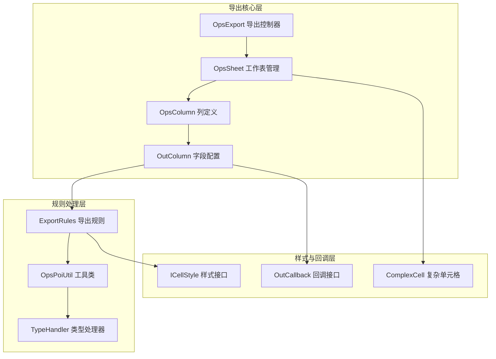
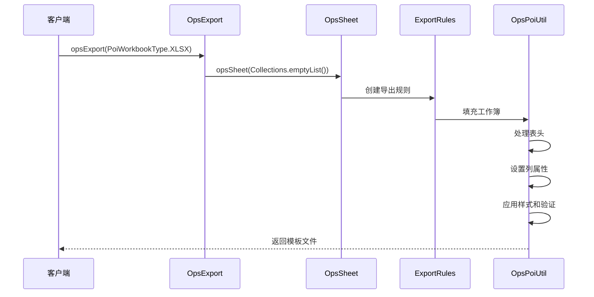
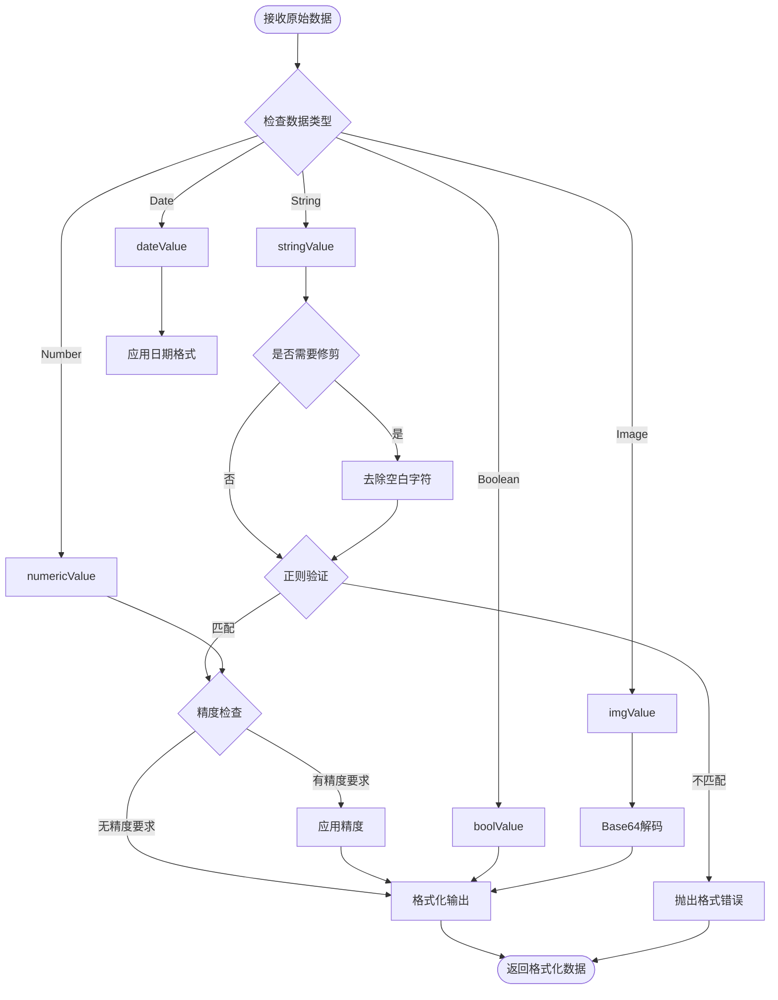

# 模板导出功能详细实现机制

<cite>
**本文档引用的文件**
- [README-export.md](file://README-export.md)
- [OpsExport.java](file://src/main/java/com/github/stupdit1t/excel/core/export/OpsExport.java)
- [OpsSheet.java](file://src/main/java/com/github/stupdit1t/excel/core/export/OpsSheet.java)
- [OpsColumn.java](file://src/main/java/com/github/stupdit1t/excel/core/export/OpsColumn.java)
- [OutColumn.java](file://src/main/java/com/github/stupdit1t/excel/core/export/OutColumn.java)
- [ExportRules.java](file://src/main/java/com/github/stupdit1t/excel/core/export/ExportRules.java)
- [OpsPoiUtil.java](file://src/main/java/com/github/stupdit1t/excel/core/OpsPoiUtil.java)
- [TypeHandler.java](file://src/main/java/com/github/stupdit1t/excel/common/TypeHandler.java)
- [Student.java](file://src/test/java/excel/export/data/Student.java)
</cite>

## 目录
1. [简介](#简介)
2. [项目架构概览](#项目架构概览)
3. [核心组件分析](#核心组件分析)
4. [模板导出实现机制](#模板导出实现机制)
5. [字段配置与验证规则](#字段配置与验证规则)
6. [数据类型转换机制](#数据类型转换机制)
7. [样式与格式化处理](#样式与格式化处理)
8. [性能优化考虑](#性能优化考虑)
9. [故障排除指南](#故障排除指南)
10. [总结](#总结)

## 简介

POI-Excel模板导出功能是一个强大的Excel生成框架，专门设计用于创建可直接用于数据录入的Excel模板。该功能的核心特性包括：

- **空数据集导出**：通过`opsSheet(Collections.emptyList())`创建空数据集的导出实例
- **丰富的字段验证**：支持文本、日期、整数、浮点数等多种验证规则
- **下拉框配置**：为字段提供预定义的选择项
- **单元格格式化**：支持多种日期、数字格式
- **批注功能**：为字段添加说明性批注
- **样式定制**：灵活的单元格样式和格式设置

## 项目架构概览

模板导出功能采用分层架构设计，主要包含以下核心模块：



**图表来源**
- [OpsExport.java](file://src/main/java/com/github/stupdit1t/excel/core/export/OpsExport.java#L1-L50)
- [OpsSheet.java](file://src/main/java/com/github/stupdit1t/excel/core/export/OpsSheet.java#L1-L50)
- [OutColumn.java](file://src/main/java/com/github/stupdit1t/excel/core/export/OutColumn.java#L1-L50)

## 核心组件分析

### OpsExport - 导出控制器

`OpsExport`类是整个导出功能的入口点，负责协调各个组件的工作：

```java
public class OpsExport implements OpsFinish {
    // 工作簿类型
    PoiWorkbookType workbookType;
    
    // 全局样式数组
    ICellStyle[] style = DefaultCellStyleEnum.values();
    
    // 密码保护
    String password;
    
    // 并行导出标志
    boolean parallelSheet = false;
    
    // 输出模式
    int toMode;
    
    // 数据集合
    List<OpsSheet<?>> opsSheets;
}
```

**节点来源**
- [OpsExport.java](file://src/main/java/com/github/stupdit1t/excel/core/export/OpsExport.java#L20-L80)

### OpsSheet - 工作表管理器

`OpsSheet`类管理单个工作表的所有配置：

```java
public class OpsSheet<R> extends AbsParent<OpsExport> {
    // 表头和单元格高度
    short titleHeight = -1;
    short headerHeight = -1;
    short cellHeight = -1;
    short footerHeight = -1;
    
    // 自动编号和列宽
    boolean autoNum;
    int autoNumColumnWidth = -1;
    
    // 数据和配置
    List<R> data;
    OpsHeader<R> opsHeader;
    OpsColumn<R> opsColumn;
    OpsFooter<R> opsFooter;
}
```

**节点来源**
- [OpsSheet.java](file://src/main/java/com/github/stupdit1t/excel/core/export/OpsSheet.java#L20-L80)

### OutColumn - 字段配置类

`OutColumn`类是模板导出的核心配置类，提供了丰富的字段配置选项：

```java
public class OutColumn<R> extends AbsParent<OpsSheet<R>> {
    // 字段名称
    final String field;
    
    // 验证规则
    String verifyDate;
    String verifyIntNum;
    String verifyFloatNum;
    String verifyText;
    String verifyCustom;
    
    // 下拉框和批注
    String[] dropdown;
    String comment;
    
    // 样式配置
    Style style = new Style();
    
    // 输出处理回调
    OutCallback<R> outHandle;
}
```

**节点来源**
- [OutColumn.java](file://src/main/java/com/github/stupdit1t/excel/core/export/OutColumn.java#L20-L100)

## 模板导出实现机制

### 空数据集导出

模板导出的一个重要特性是能够创建空数据集的Excel模板。这通过以下方式实现：

```java
// 创建空数据集的导出实例
ExcelHelper.opsExport(PoiWorkbookType.XLSX)
    .opsSheet(Collections.emptyList())
    .opsHeader().simple().texts("宝宝姓名", "手机号码", "宝宝生日", "月龄", "宝宝性别", "来源渠道", "备注").done()
    .opsColumn()
        .field("宝宝姓名").done()
        .field("手机号码").verifyText("11~11", "请输入11位的手机号码！").done()
        .field("宝宝生日").pattern("yyyy-MM-dd").verifyDate("2000-01-01~3000-12-31").done()
        .field("月龄").width(4).verifyCustom("VALUE(F3:F6000)", "月齡格式：如1年2个月则输入14").done()
        .field("宝宝性别").dropdown("男", "女").done()
        .field("来源渠道").width(12).dropdown("品推", "市场").done()
        .field("备注").done()
        .done()
    .done()
.export("template.xlsx");
```

这种实现机制的关键在于：

1. **空数据处理**：系统能够识别空数据集并跳过实际数据填充
2. **字段保留**：所有配置的字段仍然会被创建，但不包含实际数据
3. **验证规则应用**：即使没有数据，验证规则仍然会被应用到单元格

### 导出流程控制



**图表来源**
- [OpsExport.java](file://src/main/java/com/github/stupdit1t/excel/core/export/OpsExport.java#L200-L280)
- [OpsPoiUtil.java](file://src/main/java/com/github/stupdit1t/excel/core/OpsPoiUtil.java#L280-L350)

**节点来源**
- [README-export.md](file://README-export.md#L200-L250)
- [OpsExport.java](file://src/main/java/com/github/stupdit1t/excel/core/export/OpsExport.java#L150-L200)

## 字段配置与验证规则

### 验证规则配置

`OutColumn`类提供了多种验证规则的配置方法：

```java
// 文本长度验证
.field("手机号码")
.verifyText("11~11", "请输入11位的手机号码！")
.done()

// 日期范围验证
.field("宝宝生日")
.pattern("yyyy-MM-dd")
.verifyDate("2000-01-01~3000-12-31")
.done()

// 自定义公式验证
.field("月龄")
.verifyCustom("VALUE(F3:F6000)", "月龄格式：如1年2个月则输入14")
.done()
```

### 下拉框配置

下拉框功能通过`dropdown()`方法实现：

```java
// 基础下拉框
.field("宝宝性别")
.dropdown("男", "女")
.done()

// 集合形式下拉框
.field("来源渠道")
.dropdown(Arrays.asList("品推", "市场"))
.done()
```

### 批注功能

每个字段都可以添加批注说明：

```java
.field("宝宝性别")
.dropdown("男", "女")
.comment("请选择宝宝的性别")
.done()
```

### 样式配置

字段样式通过链式调用进行配置：

```java
.field("宝宝生日")
.pattern("yyyy-MM-dd")
.align(HorizontalAlignment.LEFT)
.valign(VerticalAlignment.CENTER)
.backColor(IndexedColors.YELLOW)
.color(IndexedColors.GOLD)
.done()
```

**节点来源**
- [OutColumn.java](file://src/main/java/com/github/stupdit1t/excel/core/export/OutColumn.java#L150-L300)
- [README-export.md](file://README-export.md#L200-L280)

## 数据类型转换机制

### TypeHandler - 类型处理器

`TypeHandler`类负责处理各种数据类型的转换：

```java
public class TypeHandler {
    // 基本类型转换
    public static String stringValue(Object cellValue, boolean trim, String regex, Integer precision);
    public static Integer intValue(Object cellValue, boolean trim, String regex);
    public static Double doubleValue(Object cellValue, boolean trim, String regex, Integer precision);
    public static Date dateValue(Object cellValue, boolean trim, String regex, String format, boolean is1904Date);
    public static Boolean boolValue(Object cellValue, boolean trim, String regex);
    
    // 特殊类型处理
    public static BigDecimal decimalValue(Object cellValue, boolean trim, String regex, Integer precision);
    public static byte[] imgValue(Object cellValue, boolean trim, String regex);
}
```

### 类型转换流程



**图表来源**
- [TypeHandler.java](file://src/main/java/com/github/stupdit1t/excel/common/TypeHandler.java#L50-L150)

**节点来源**
- [TypeHandler.java](file://src/main/java/com/github/stupdit1t/excel/common/TypeHandler.java#L1-L155)

## 样式与格式化处理

### 样式配置系统

`OutColumn.Style`类提供了完整的样式配置功能：

```java
public static class Style implements Cloneable {
    // 基本样式属性
    int width = -1;
    int height = -1;
    HorizontalAlignment align;
    VerticalAlignment valign;
    IndexedColors color;
    IndexedColors backColor;
    String pattern;
    Boolean wrapText;
    String comment;
    
    // 样式缓存键生成
    public String getStyleCacheKey() {
        // 生成唯一的样式标识符
    }
}
```

### 全局样式处理

系统支持全局样式和局部样式的组合：

```java
// 自定义全局样式
ICellStyle titleStyle = new ICellStyle() {
    @Override
    public CellPosition getPosition() {
        return CellPosition.TITLE;
    }
    
    @Override
    public void handleStyle(Font font, CellStyle cellStyle) {
        font.setFontHeightInPoints((short) 20);
        font.setColor(IndexedColors.RED.index);
        cellStyle.setAlignment(HorizontalAlignment.LEFT);
    }
};

// 应用全局样式
ExcelHelper.opsExport(PoiWorkbookType.XLSX)
    .style(titleStyle)
    .opsSheet(data)
    .opsHeader().simple().texts("标题").done()
    .opsColumn().fields("field1", "field2").done()
    .done()
.export("styled_template.xlsx");
```

**节点来源**
- [OutColumn.java](file://src/main/java/com/github/stupdit1t/excel/core/export/OutColumn.java#L400-L550)
- [OpsExport.java](file://src/main/java/com/github/stupdit1t/excel/core/export/OpsExport.java#L100-L150)

## 性能优化考虑

### 并行导出支持

系统支持多工作表的并行导出：

```java
ExcelHelper.opsExport(PoiWorkbookType.XLSX)
    .parallelSheet()  // 启用并行导出
    .opsSheet(sheet1Data)
    .sheetName("Sheet1")
    .opsHeader().simple().texts("标题1").done()
    .opsColumn().fields("field1").done()
    .done()
    .opsSheet(sheet2Data)
    .sheetName("Sheet2")
    .opsHeader().simple().texts("标题2").done()
    .opsColumn().fields("field2").done()
    .done()
.export("multi_sheet.xlsx");
```

### 大数据处理

对于大数据量的导出，系统提供了专门的处理机制：

```java
// 使用SXSSFWorkbook处理大数据
ExcelHelper.opsExport(PoiWorkbookType.BIG_XLSX)
    .opsSheet(largeData)
    .opsHeader().simple().texts("大数据导出").done()
    .opsColumn().fields("largeField").done()
    .done()
.export("big_data.xlsx");
```

### 内存优化策略

1. **样式缓存**：避免重复创建相同的样式对象
2. **字段信息缓存**：缓存类的字段信息以提高反射性能
3. **临时文件清理**：及时清理SXSSFWorkbook产生的临时文件

**节点来源**
- [OpsExport.java](file://src/main/java/com/github/stupdit1t/excel/core/export/OpsExport.java#L200-L250)
- [OpsPoiUtil.java](file://src/main/java/com/github/stupdit1t/excel/core/OpsPoiUtil.java#L300-L400)

## 故障排除指南

### 常见问题及解决方案

1. **验证规则冲突**
   ```java
   // 错误：同一列定义多个验证规则
   .field("age")
   .verifyIntNum("1~100")
   .verifyText("2~5")  // 抛出UnsupportedOperationException
   
   // 正确：使用单一验证规则
   .field("age")
   .verifyIntNum("1~100", "年龄必须在1-100之间")
   .done()
   ```

2. **样式配置问题**
   ```java
   // 确保样式设置在done()之前
   .field("name")
   .width(2000)  // 正确
   .done()
   ```

3. **数据类型转换异常**
   ```java
   // 确保数据格式正确
   .field("price")
   .pattern("#,##0.00")  // 正确的数字格式
   .done()
   ```

### 调试技巧

1. **启用日志记录**：通过Log4j查看详细的导出过程
2. **检查样式缓存**：验证样式是否正确应用
3. **验证字段映射**：确保字段名称与数据模型匹配

**节点来源**
- [OutColumn.java](file://src/main/java/com/github/stupdit1t/excel/core/export/OutColumn.java#L200-L250)
- [OpsPoiUtil.java](file://src/main/java/com/github/stupdit1t/excel/core/OpsPoiUtil.java#L100-L200)

## 总结

POI-Excel模板导出功能通过精心设计的架构和丰富的配置选项，为用户提供了强大而灵活的Excel模板生成功能。其主要优势包括：

1. **灵活的空数据集支持**：通过`Collections.emptyList()`创建纯模板
2. **丰富的验证规则**：支持多种数据类型的验证和格式化
3. **强大的样式系统**：提供细粒度的样式控制能力
4. **高性能设计**：支持并行导出和大数据处理
5. **易于使用的API**：流畅的链式调用语法

该功能特别适用于需要创建标准化数据录入模板的场景，如表单设计、数据采集、报表生成等应用场景。通过合理配置字段验证、样式和格式，可以创建既美观又实用的Excel模板，大大提高数据录入的准确性和效率。