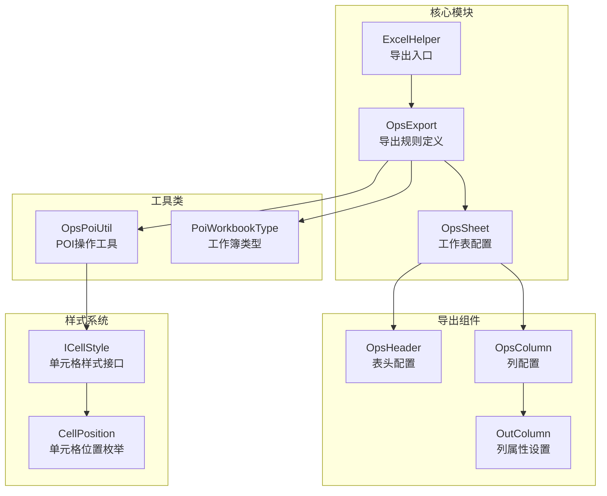
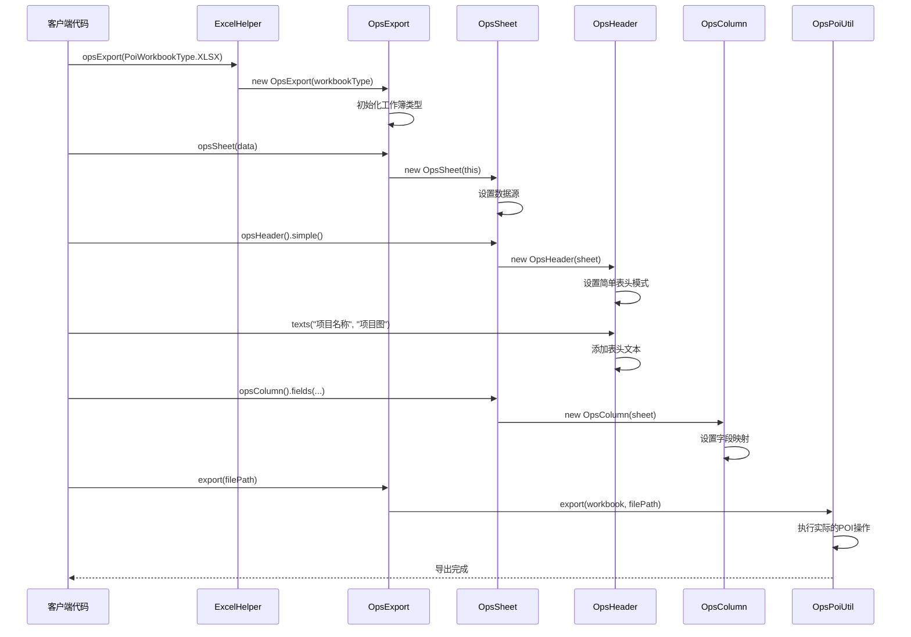
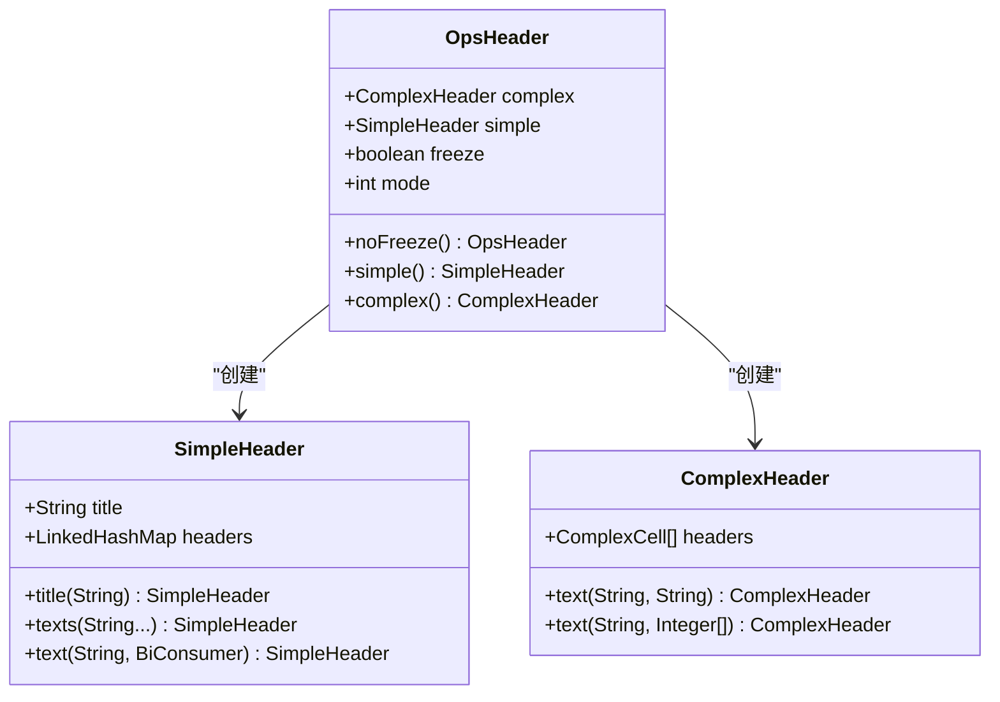
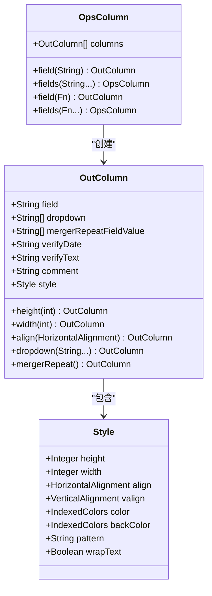
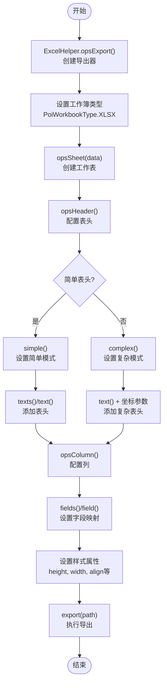

# 简单导出功能详细文档

<cite>
**本文档引用的文件**
- [README-export.md](file://README-export.md)
- [ExcelHelper.java](file://src/main/java/com/github/stupdit1t/excel/core/ExcelHelper.java)
- [OpsExport.java](file://src/main/java/com/github/stupdit1t/excel/core/export/OpsExport.java)
- [OpsSheet.java](file://src/main/java/com/github/stupdit1t/excel/core/export/OpsSheet.java)
- [OpsHeader.java](file://src/main/java/com/github/stupdit1t/excel/core/export/OpsHeader.java)
- [OpsColumn.java](file://src/main/java/com/github/stupdit1t/excel/core/export/OpsColumn.java)
- [OutColumn.java](file://src/main/java/com/github/stupdit1t/excel/core/export/OutColumn.java)
- [OpsPoiUtil.java](file://src/main/java/com/github/stupdit1t/excel/core/OpsPoiUtil.java)
- [PoiWorkbookType.java](file://src/main/java/com/github/stupdit1t/excel/common/PoiWorkbookType.java)
- [ProjectEvaluate.java](file://src/test/java/excel/export/data/ProjectEvaluate.java)
</cite>

## 目录
1. [简介](#简介)
2. [项目结构概览](#项目结构概览)
3. [核心组件分析](#核心组件分析)
4. [架构概览](#架构概览)
5. [详细组件分析](#详细组件分析)
6. [链式调用机制](#链式调用机制)
7. [高级功能详解](#高级功能详解)
8. [性能考虑](#性能考虑)
9. [故障排除指南](#故障排除指南)
10. [结论](#结论)

## 简介

POI Excel导出功能是一个基于Apache POI的强大Excel处理库，提供了简洁而强大的链式API来实现复杂的Excel导出需求。该系统通过`ExcelHelper.opsExport()`方法启动导出流程，支持多种Excel格式（XLS、XLSX、BIG_XLSX），并提供了丰富的配置选项来满足不同场景的需求。

核心设计理念是通过流畅的API链式调用来简化Excel导出的复杂性，开发者可以通过简单的几行代码就完成复杂的表格设计、样式设置和数据导出。

## 项目结构概览

该项目采用模块化的架构设计，主要分为以下几个核心模块：



**图表来源**
- [ExcelHelper.java](file://src/main/java/com/github/stupdit1t/excel/core/ExcelHelper.java#L1-L54)
- [OpsExport.java](file://src/main/java/com/github/stupdit1t/excel/core/export/OpsExport.java#L1-L50)
- [OpsSheet.java](file://src/main/java/com/github/stupdit1t/excel/core/export/OpsSheet.java#L1-L50)

## 核心组件分析

### ExcelHelper - 导出入口点

`ExcelHelper`类作为整个导出系统的入口点，提供了静态工厂方法来创建不同的操作实例：

```java
// 基础导出入口
public static OpsExport opsExport(PoiWorkbookType workbookType) {
    return new OpsExport(workbookType);
}

// 工作簿直接导出
public static OpsExport opsExport(Workbook workbook) {
    return new OpsExport(workbook);
}
```

该类采用了单例模式的设计思想，所有方法都是静态的，确保了线程安全和资源的有效利用。

**章节来源**
- [ExcelHelper.java](file://src/main/java/com/github/stupdit1t/excel/core/ExcelHelper.java#L1-L54)

### OpsExport - 导出规则定义

`OpsExport`类是整个导出流程的核心控制器，负责管理工作簿类型、样式设置、密码保护和并行导出等功能：

```java
public class OpsExport implements OpsFinish {
    // 工作簿类型
    PoiWorkbookType workbookType;
    
    // 全局样式数组
    ICellStyle[] style = DefaultCellStyleEnum.values();
    
    // 密码保护
    String password;
    
    // 并行导出开关
    boolean parallelSheet = false;
    
    // 输出模式控制
    int toMode;
}
```

该类实现了`OpsFinish`接口，提供了统一的导出出口点，支持多种输出方式：
- 文件路径输出
- 流输出
- HTTP响应输出

**章节来源**
- [OpsExport.java](file://src/main/java/com/github/stupdit1t/excel/core/export/OpsExport.java#L1-L200)

## 架构概览

系统采用分层架构设计，每一层都有明确的职责分工：



**图表来源**
- [ExcelHelper.java](file://src/main/java/com/github/stupdit1t/excel/core/ExcelHelper.java#L20-L30)
- [OpsExport.java](file://src/main/java/com/github/stupdit1t/excel/core/export/OpsExport.java#L60-L80)
- [OpsSheet.java](file://src/main/java/com/github/stupdit1t/excel/core/export/OpsSheet.java#L50-L70)

## 详细组件分析

### OpsSheet - 工作表配置

`OpsSheet`类负责单个工作表的所有配置，包括数据源、样式设置、合并单元格等：

```java
public class OpsSheet<R> extends AbsParent<OpsExport> {
    // 高度设置
    short titleHeight = -1;
    short headerHeight = -1;
    short cellHeight = -1;
    short footerHeight = -1;
    
    // 列宽设置
    int width = -1;
    
    // 自动序号功能
    boolean autoNum;
    int autoNumColumnWidth = -1;
    
    // 数据源
    List<R> data;
    
    // 导出组件
    OpsHeader<R> opsHeader;
    OpsColumn<R> opsColumn;
    OpsFooter<R> opsFooter;
}
```

该类提供了丰富的配置选项：
- **高度定制**：支持标题、表头、单元格、尾行的独立高度设置
- **列宽控制**：全局列宽和自动序号列宽的独立设置
- **自动功能**：自动生成序号列的功能
- **样式继承**：从父级`OpsExport`继承全局样式

**章节来源**
- [OpsSheet.java](file://src/main/java/com/github/stupdit1t/excel/core/export/OpsSheet.java#L1-L200)

### OpsHeader - 表头配置

`OpsHeader`类支持两种表头模式：简单表头和复杂表头，提供了灵活的表头设计能力：



**图表来源**
- [OpsHeader.java](file://src/main/java/com/github/stupdit1t/excel/core/export/OpsHeader.java#L1-L100)

#### 简单表头机制

简单表头适用于大多数常规场景，通过`SimpleHeader`类实现：

```java
// 大标题设置
.header().simple().title("我是大标题")

// 副标题批量设置
.header().simple().texts("项目名称", "项目图", "所属区域")

// 个性化样式设置
.header().simple().text("项目名称", (font, style) -> {
    font.setColor(IndexedColors.RED.index);
    style.setVerticalAlignment(VerticalAlignment.TOP);
})
```

#### 复杂表头机制

复杂表头支持多级表头和单元格合并，通过`ComplexHeader`类实现：

```java
// Excel坐标格式
.header().complex().text("项目资源统计", "A1:K1")

// 字母坐标格式  
.header().complex().text("序号", "2,3,A,A")

// 数字坐标格式
.header().complex().text("基本信息", 1,1,1,4)
```

**章节来源**
- [OpsHeader.java](file://src/main/java/com/github/stupdit1t/excel/core/export/OpsHeader.java#L1-L199)

### OpsColumn & OutColumn - 数据字段映射

`OpsColumn`和`OutColumn`类共同构成了数据字段映射和列属性设置的完整体系：



**图表来源**
- [OpsColumn.java](file://src/main/java/com/github/stupdit1t/excel/core/export/OpsColumn.java#L1-L96)
- [OutColumn.java](file://src/main/java/com/github/stupdit1t/excel/core/export/OutColumn.java#L1-L100)

#### 字段映射机制

字段映射支持多种方式：

```java
// 基础字段映射
.column().fields("projectName", "areaName", "province")

// 方法引用映射
.column().fields(ProjectEvaluate::getProjectName, 
                 ProjectEvaluate::getAreaName)

// 级联对象映射
.column().fields("student.name", "student.classRoom.name", 
                 "student.classRoom.school.name")
```

#### 列属性设置

每个列都可以进行精细的属性设置：

```java
.column().field("city")
    .wrapText()           // 超出宽度换行
    .dropdown("北京", "西安")  // 下拉框
    .mergerRepeat()       // 相同内容合并
    .height(500)          // 行高设置
    .comment("城市选择")    // 批注
    .width(6000)          // 列宽设置
```

**章节来源**
- [OpsColumn.java](file://src/main/java/com/github/stupdit1t/excel/core/export/OpsColumn.java#L1-L96)
- [OutColumn.java](file://src/main/java/com/github/stupdit1t/excel/core/export/OutColumn.java#L1-L199)

## 链式调用机制

系统采用了经典的建造者模式和链式调用设计，使得API使用起来非常直观和流畅：



**图表来源**
- [README-export.md](file://README-export.md#L1-L50)
- [ExcelHelper.java](file://src/main/java/com/github/stupdit1t/excel/core/ExcelHelper.java#L20-L30)

### 链式调用的优势

1. **可读性强**：代码结构清晰，逻辑层次分明
2. **易于维护**：每个步骤都独立且职责单一
3. **错误早发现**：链式调用可以在编译期或早期运行时发现问题
4. **扩展性好**：新的配置项可以很容易地添加到链中

### 实际使用示例

基于README中的示例，完整的链式调用过程如下：

```java
ExcelHelper.opsExport(PoiWorkbookType.XLSX)
    .opsSheet(data)                                    // 1. 创建工作表
    .opsHeader().simple().texts("项目名称", "项目图")      // 2. 配置表头
    .opsColumn().fields("projectName", "img")          // 3. 设置字段映射
    .done()                                            // 4. 完成配置
    .export("output.xlsx");                            // 5. 执行导出
```

## 高级功能详解

### 全局样式设置

系统提供了强大的全局样式设置功能，支持自定义样式接口：

```java
// 自定义全局样式
ICellStyle titleStyle = new ICellStyle() {
    @Override
    public CellPosition getPosition() {
        return CellPosition.TITLE;  // 标题样式
    }
    
    @Override
    public void handleStyle(Font font, CellStyle cellStyle) {
        font.setFontHeightInPoints((short) 20);
        font.setColor(IndexedColors.RED.index);
        cellStyle.setAlignment(HorizontalAlignment.LEFT);
    }
};

// 应用全局样式
ExcelHelper.opsExport(PoiWorkbookType.XLSX)
    .style(titleStyle)  // 应用自定义样式
    .opsSheet(data)
    .done()
    .export("styled.xlsx");
```

### 密码保护功能

支持对导出的Excel文件进行密码保护（仅限XLS格式）：

```java
ExcelHelper.opsExport(PoiWorkbookType.XLS)
    .password("123456")  // 设置密码
    .opsSheet(data)
    .done()
    .export("protected.xls");
```

### 并行导出功能

对于多工作表场景，系统支持并行导出以提高性能：

```java
ExcelHelper.opsExport(PoiWorkbookType.XLSX)
    .parallelSheet()  // 启用并行导出
    .opsSheet(sheet1Data)
        .sheetName("Sheet1")
        .opsHeader().simple().texts("姓名", "年龄").done()
        .opsColumn().fields("name", "age").done()
        .done()
    .opsSheet(sheet2Data)
        .sheetName("Sheet2")
        .opsHeader().simple().texts("项目", "状态").done()
        .opsColumn().fields("project", "status").done()
        .done()
    .export("multi-sheet.xlsx");
```

### 大数据导出优化

针对大数据量场景，系统提供了专门的优化方案：

```java
// 使用BIG_XLSX格式避免内存溢出
ExcelHelper.opsExport(PoiWorkbookType.BIG_XLSX)
    .opsSheet(largeData)
    .sheetName("大数据")
    .opsHeader().simple().texts("数据项", "数值").done()
    .opsColumn().fields("item", "value").done()
    .done()
    .export("large-data.xlsx");
```

**章节来源**
- [OpsExport.java](file://src/main/java/com/github/stupdit1t/excel/core/export/OpsExport.java#L100-L150)
- [PoiWorkbookType.java](file://src/main/java/com/github/stupdit1t/excel/common/PoiWorkbookType.java#L1-L106)

## 性能考虑

### 内存管理策略

系统针对不同场景提供了多种内存管理策略：

1. **标准模式**：适用于中小数据量，使用内存中的完整工作簿
2. **流式模式**：适用于大数据量，使用SXSSFWorkbook减少内存占用
3. **并行处理**：多工作表场景下使用并行流提高效率

### 性能优化建议

1. **合理选择工作簿类型**：
   - 小于65535行：使用XLS格式
   - 大于65535行：使用XLSX格式
   - 特大数据：使用BIG_XLSX格式

2. **样式优化**：
   - 避免过多的样式重复定义
   - 合理使用全局样式而非逐个设置

3. **并发控制**：
   - 对于大量工作表，启用并行导出
   - 控制并发线程数量避免系统过载

## 故障排除指南

### 常见问题及解决方案

1. **内存溢出问题**
   ```java
   // 问题：大数据导出时出现OutOfMemoryError
   // 解决：使用BIG_XLSX格式
   ExcelHelper.opsExport(PoiWorkbookType.BIG_XLSX)
   ```

2. **样式设置无效**
   ```java
   // 问题：自定义样式没有生效
   // 解决：确保正确实现ICellStyle接口
   ICellStyle customStyle = new ICellStyle() {
       @Override
       public CellPosition getPosition() { return CellPosition.CELL; }
       @Override
       public void handleStyle(Font font, CellStyle cellStyle) {
           // 正确实现样式设置逻辑
       }
   };
   ```

3. **密码保护失效**
   ```java
   // 问题：设置了密码但文件仍然可编辑
   // 解决：注意密码保护仅支持XLS格式
   ExcelHelper.opsExport(PoiWorkbookType.XLS)  // 必须使用XLS格式
   ```

### 调试技巧

1. **启用日志记录**：通过Log4j查看详细的导出过程
2. **分步验证**：逐步添加配置项，确认每一步的效果
3. **使用简单示例**：从最简单的配置开始，逐步增加复杂度

**章节来源**
- [OpsPoiUtil.java](file://src/main/java/com/github/stupdit1t/excel/core/OpsPoiUtil.java#L1-L100)

## 结论

POI Excel导出功能通过精心设计的架构和流畅的API，为开发者提供了一个强大而易用的Excel处理解决方案。其核心优势包括：

1. **简洁的API设计**：通过链式调用大大简化了复杂的Excel操作
2. **灵活的配置选项**：支持从简单到复杂的各种场景需求
3. **优秀的性能表现**：针对不同数据量提供了相应的优化策略
4. **完善的错误处理**：提供了丰富的异常信息和调试支持

该系统特别适合需要频繁进行Excel导出操作的企业级应用，能够显著提高开发效率和代码质量。通过合理的使用这些功能，开发者可以轻松应对各种复杂的Excel导出需求，从简单的数据展示到复杂的报表生成。