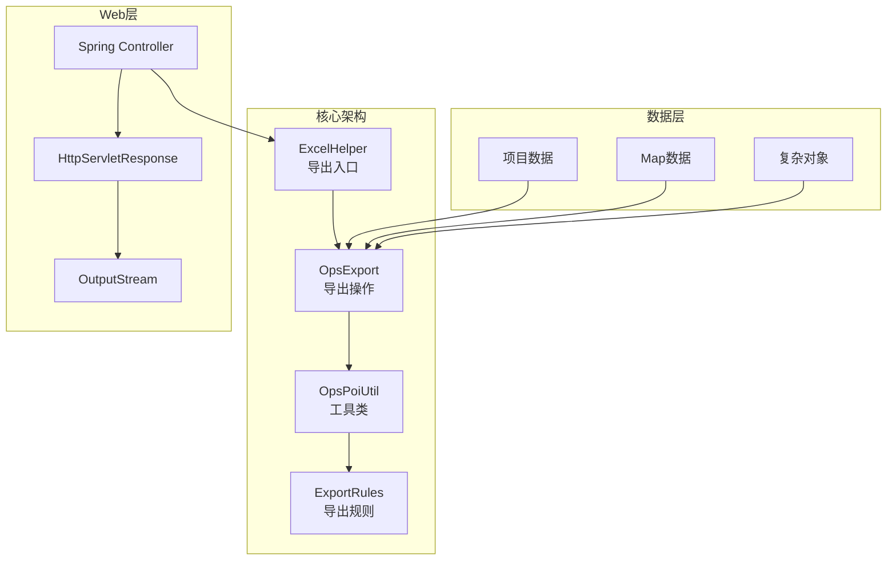
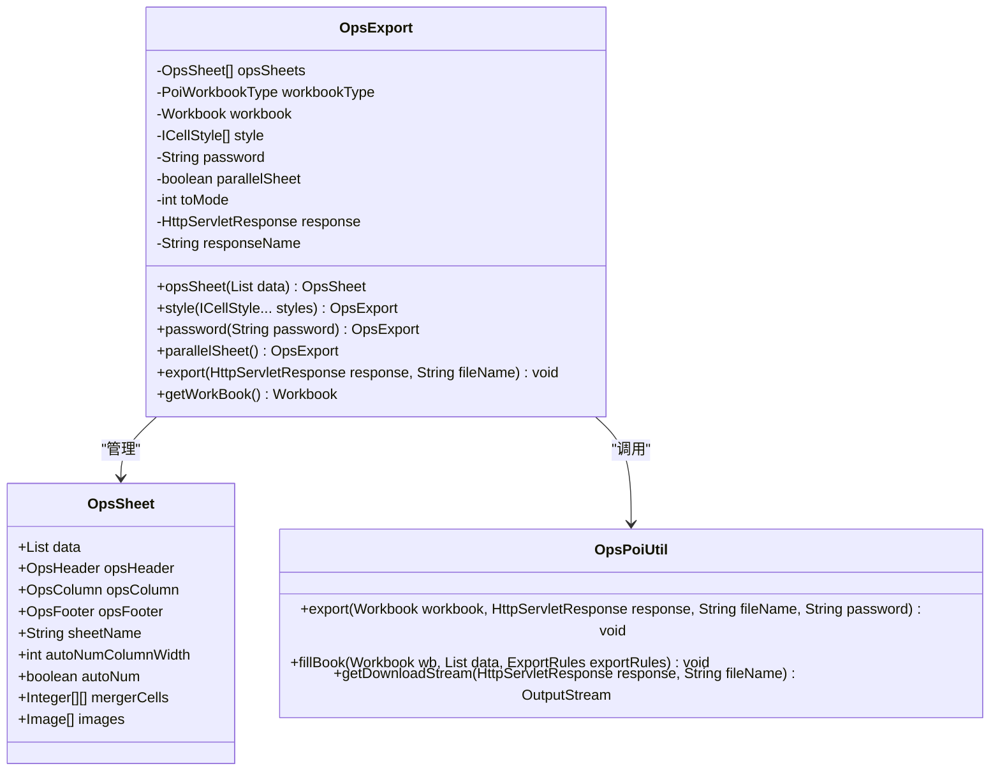

基于我对代码库的深入分析，我现在可以为您生成关于Web集成最佳实践的文档了。

<docs>
# Web集成最佳实践

<cite>
**本文档引用的文件**
- [README.md](file://README.md)
- [ExcelHelper.java](file://src/main/java/com/github/stupdit1t/excel/core/ExcelHelper.java)
- [OpsExport.java](file://src/main/java/com/github/stupdit1t/excel/core/export/OpsExport.java)
- [OpsPoiUtil.java](file://src/main/java/com/github/stupdit1t/excel\core\OpsPoiUtil.java)
- [ExportClass.java](file://src/test/java/excel/export/ExportClass.java)
- [PoiConstant.java](file://src/main/java/com/github/stupdit1t/excel/common/PoiConstant.java)
- [PoiException.java](file://src/main/java/com/github/stupdit1t/excel/common/PoiException.java)
- [ProjectEvaluate.java](file://src/test/java/excel/export/data/ProjectEvaluate.java)
</cite>

## 目录
1. [简介](#简介)
2. [项目架构概览](#项目架构概览)
3. [核心组件分析](#核心组件分析)
4. [Web集成最佳实践](#web集成最佳实践)
5. [HTTP响应头设置](#http响应头设置)
6. [文件名中文乱码处理](#文件名中文乱码处理)
7. [异常处理与统一返回](#异常处理与统一返回)
8. [分页数据导出](#分页数据导出)
9. [大数据流式输出](#大数据流式输出)
10. [多Sheet并行生成](#多sheet并行生成)
11. [性能优化策略](#性能优化策略)
12. [故障排除指南](#故障排除指南)
13. [总结](#总结)

## 简介

poi-excel是一个基于Apache POI的Java工具库，专为简化Excel表格处理而设计。该项目提供了简单、快速上手的方式，使开发者能够轻松处理复杂的表格操作。本文档将重点介绍如何在Spring MVC或Servlet环境中安全高效地集成Excel导出功能，特别关注通过HttpServletResponse直接输出文件流的技术实现。

## 项目架构概览



**图表来源**
- [ExcelHelper.java](file://src/main/java/com/github/stupdit1t/excel/core/ExcelHelper.java#L1-L54)
- [OpsExport.java](file://src/main/java/com/github/stupdit1t/excel/core/export/OpsExport.java#L1-L339)

**章节来源**
- [README.md](file://README.md#L1-L77)
- [ExcelHelper.java](file://src/main/java/com/github/stupdit1t/excel/core/ExcelHelper.java#L1-L54)

## 核心组件分析

### ExcelHelper - 导出入口点

ExcelHelper是整个导出功能的入口点，提供了简洁的API接口：

```java
// 基本导出示例
ExcelHelper.opsExport(PoiWorkbookType.XLSX)
    .opsSheet(data)
    .opsHeader().simple()
        .texts("请求地址", "请求方式", "IP地址", "简要信息", "异常时间", "创建人").done()
    .opsColumn()
        .fields("requestUri","requestMethod","ip","errorSimpleInfo","createDate","creatorName").done()
    .export(response, "异常日志.xlsx");
```

### OpsExport - 导出操作核心

OpsExport类负责管理导出流程，支持多种输出模式：



**图表来源**
- [OpsExport.java](file://src/main/java/com/github/stupdit1t/excel/core/export/OpsExport.java#L25-L100)
- [OpsPoiUtil.java](file://src/main/java/com/github/stupdit1t/excel/core/OpsPoiUtil.java#L50-L150)

**章节来源**
- [ExcelHelper.java](file://src/main/java/com/github/stupdit1t/excel/core/ExcelHelper.java#L1-L54)
- [OpsExport.java](file://src/main/java/com/github/stupdit1t/excel/core/export/OpsExport.java#L1-L339)

## Web集成最佳实践

### 基础Controller实现

```java
@RestController
@RequestMapping("/api/export")
public class ExcelExportController {

    /**
     * 简单导出示例
     */
    @GetMapping("/simple")
    public void exportSimple(HttpServletResponse response, 
                           @RequestParam(defaultValue = "100") int size) {
        
        // 1.获取列表数据
        List<ProjectEvaluate> data = fetchData(size);
        
        try {
            // 2.执行导出
            ExcelHelper.opsExport(PoiWorkbookType.XLSX)
                .opsSheet(data)
                .opsHeader().simple()
                    .texts("项目名称", "所属区域", "省份", "市", "项目所属人", "项目领导人", "得分", "平均分", "创建时间")
                    .done()
                .opsColumn()
                    .fields("projectName", "areaName", "province", "city", "people", "leader", "scount", "avg", "createTime")
                    .field("scount").width(10000)
                    .field("avg").pattern("0.00%")
                    .field("createTime").pattern("yyyy-MM-dd")
                    .done()
                .export(response, "项目评估数据.xlsx");
                
        } catch (Exception e) {
            handleExportError(response, e);
        }
    }
    
    /**
     * 分页数据导出
     */
    @GetMapping("/paged")
    public void exportPaged(HttpServletResponse response,
                          @RequestParam(defaultValue = "1") int page,
                          @RequestParam(defaultValue = "1000") int size) {
        
        // 计算总记录数
        long total = getTotalCount();
        
        // 分页查询数据
        List<ProjectEvaluate> data = fetchDataByPage(page, size);
        
        try {
            ExcelHelper.opsExport(PoiWorkbookType.XLSX)
                .opsSheet(data)
                .opsHeader().simple()
                    .title("分页数据导出")
                    .texts("项目名称", "所属区域", "省份", "市", "项目所属人", "项目领导人", "得分", "平均分", "创建时间")
                    .done()
                .opsColumn()
                    .fields("projectName", "areaName", "province", "city", "people", "leader", "scount", "avg", "createTime")
                    .done()
                .opsFooter()
                    .text("总计: " + total + " 条记录")
                    .done()
                .export(response, "分页数据_" + page + ".xlsx");
                
        } catch (Exception e) {
            handleExportError(response, e);
        }
    }
}
```

### 大数据流式输出

对于大数据量的导出场景，推荐使用BIG_XLSX格式：

```java
/**
 * 大数据导出
 */
@GetMapping("/big-data")
public void exportBigData(HttpServletResponse response) {
    // 模拟大数据源
    List<ProjectEvaluate> bigData = generateBigData(100000);
    
    try {
        // 使用流式处理避免内存溢出
        ExcelHelper.opsExport(PoiWorkbookType.BIG_XLSX)
            .password("secure") // 设置文件密码
            .opsSheet(bigData)
            .opsHeader().simple()
                .texts("项目名称", "所属区域", "省份", "市", "项目所属人", "项目领导人", "得分", "平均分", "创建时间")
                .done()
            .opsColumn()
                .fields("projectName", "areaName", "province", "city", "people", "leader", "scount", "avg", "createTime")
                .done()
            .export(response, "大数据导出.xlsx");
            
    } catch (Exception e) {
        handleExportError(response, e);
    }
}

/**
 * 生成模拟大数据
 */
private List<ProjectEvaluate> generateBigData(int count) {
    List<ProjectEvaluate> data = new ArrayList<>();
    Random random = new Random();
    
    for (int i = 0; i < count; i++) {
        ProjectEvaluate item = new ProjectEvaluate();
        item.setProjectName("项目-" + i);
        item.setAreaName("区域-" + (i % 5));
        item.setProvince("省份-" + (i % 10));
        item.setCity("城市-" + (i % 20));
        item.setPeople("负责人-" + (i % 5));
        item.setLeader("领导-" + (i % 3));
        item.setScount(String.valueOf(random.nextInt(1000)));
        item.setAvg(random.nextDouble());
        item.setCreateTime(new Date());
        data.add(item);
    }
    
    return data;
}
```

**章节来源**
- [ExportClass.java](file://src/test/java/excel/export/ExportClass.java#L1-L471)

## HTTP响应头设置

### Content-Type设置

OpsPoiUtil类已经实现了智能的Content-Type设置：

```java
static OutputStream getDownloadStream(HttpServletResponse response, String fileName) {
    try {
        if (fileName.endsWith(".xlsx")) {
            response.setContentType("application/vnd.openxmlformats-officedocument.spreadsheetml.sheet");
        } else {
            response.setContentType("application/vnd.ms-excel");
        }
        response.setCharacterEncoding(StandardCharsets.UTF_8.name());
        response.setHeader("Content-disposition", "attachment; filename=" + URLEncoder.encode(fileName, StandardCharsets.UTF_8.name()));
        return response.getOutputStream();
    } catch (IOException e) {
        LOG.error(e);
    }
    return null;
}
```

### 推荐的响应头设置

```java
/**
 * 设置标准的HTTP响应头
 */
private void setResponseHeaders(HttpServletResponse response, String fileName, String contentType) {
    // 设置Content-Type
    response.setContentType(contentType);
    
    // 设置字符编码
    response.setCharacterEncoding(StandardCharsets.UTF_8.name());
    
    // 设置Content-Disposition
    response.setHeader("Content-Disposition", 
        "attachment; filename=" + encodeFileName(fileName));
    
    // 设置其他安全头
    response.setHeader("Pragma", "no-cache");
    response.setHeader("Cache-Control", "no-cache, no-store, must-revalidate");
    response.setDateHeader("Expires", 0);
}
```

**章节来源**
- [OpsPoiUtil.java](file://src/main/java/com/github/stupdit1t/excel/core/OpsPoiUtil.java#L100-L120)

## 文件名中文乱码处理

### 双兼容方案

为了确保在不同浏览器环境下都能正确显示中文文件名，需要使用双兼容方案：

```java
/**
 * 编码文件名以支持中文
 */
private String encodeFileName(String fileName) {
    try {
        // 方案1：URLEncoder编码（推荐）
        String encodedName = URLEncoder.encode(fileName, StandardCharsets.UTF_8.name());
        
        // 方案2：new String()编码（兼容旧版IE）
        String legacyEncodedName = new String(fileName.getBytes(StandardCharsets.UTF_8), "ISO-8859-1");
        
        // 根据浏览器类型选择合适的编码
        HttpServletRequest request = ((ServletRequestAttributes) RequestContextHolder.getRequestAttributes()).getRequest();
        String userAgent = request.getHeader("User-Agent");
        
        if (userAgent != null) {
            if (userAgent.contains("MSIE") || userAgent.contains("Trident")) {
                // IE浏览器使用ISO-8859-1编码
                return legacyEncodedName;
            } else if (userAgent.contains("Firefox")) {
                // Firefox使用UTF-8编码
                return "=?UTF-8?B?" + Base64.getEncoder().encodeToString(fileName.getBytes(StandardCharsets.UTF_8)) + "?=";
            }
        }
        
        // 默认使用URLEncoder编码
        return encodedName;
        
    } catch (Exception e) {
        LOG.warn("文件名编码失败，使用原始文件名: {}", fileName, e);
        return fileName;
    }
}
```

### 简化的文件名编码

```java
/**
 * 简化的文件名编码方案
 */
private String encodeFileName(String fileName) {
    try {
        // 使用URLEncoder编码，适用于大多数现代浏览器
        String encoded = URLEncoder.encode(fileName, StandardCharsets.UTF_8.name());
        
        // 对于Chrome等浏览器，可能需要额外处理
        if (encoded.contains("+")) {
            encoded = encoded.replace("+", "%20");
        }
        
        return encoded;
    } catch (Exception e) {
        LOG.warn("文件名编码失败: {}", fileName, e);
        return fileName;
    }
}
```

**章节来源**
- [OpsPoiUtil.java](file://src/main/java/com/github/stupdit1t/excel/core/OpsPoiUtil.java#L100-L120)

## 异常处理与统一返回

### 统一异常处理器

```java
@ControllerAdvice
public class ExcelExportExceptionHandler {
    
    private static final Logger LOG = LoggerFactory.getLogger(ExcelExportExceptionHandler.class);
    
    /**
     * 处理Excel导出异常
     */
    @ExceptionHandler(Exception.class)
    public void handleExportException(Exception ex, HttpServletResponse response) {
        LOG.error("Excel导出失败", ex);
        
        try {
            // 设置错误响应
            response.setStatus(HttpStatus.INTERNAL_SERVER_ERROR.value());
            response.setContentType("application/json;charset=UTF-8");
            
            // 返回错误信息
            Map<String, Object> errorResponse = new HashMap<>();
            errorResponse.put("success", false);
            errorResponse.put("message", "导出失败：" + ex.getMessage());
            errorResponse.put("timestamp", System.currentTimeMillis());
            
            // 写入响应
            response.getWriter().write(JSON.toJSONString(errorResponse));
            
        } catch (IOException ioEx) {
            LOG.error("写入错误响应失败", ioEx);
        }
    }
    
    /**
     * 处理特定的导出错误
     */
    @ExceptionHandler(PoiException.class)
    public void handlePoiException(PoiException ex, HttpServletResponse response) {
        LOG.error("Excel导出业务错误", ex);
        
        try {
            response.setStatus(HttpStatus.BAD_REQUEST.value());
            response.setContentType("application/json;charset=UTF-8");
            
            Map<String, Object> errorResponse = new HashMap<>();
            errorResponse.put("success", false);
            errorResponse.put("message", "导出配置错误：" + ex.getMessage());
            errorResponse.put("errorCode", "EXPORT_CONFIG_ERROR");
            
            response.getWriter().write(JSON.toJSONString(errorResponse));
            
        } catch (IOException ioEx) {
            LOG.error("写入错误响应失败", ioEx);
        }
    }
}
```

### 导出控制器中的异常处理

```java
/**
 * 导出控制器中的异常处理
 */
@GetMapping("/safe-export")
public void safeExport(HttpServletResponse response, 
                     @RequestParam(defaultValue = "100") int size) {
    
    try {
        // 验证参数
        validateExportParams(size);
        
        // 获取数据
        List<ProjectEvaluate> data = fetchData(size);
        
        // 执行导出
        exportData(response, data, "安全导出_" + size + ".xlsx");
        
    } catch (IllegalArgumentException ex) {
        // 参数验证失败
        handleValidationError(response, ex.getMessage());
    } catch (PoiException ex) {
        // 导出配置错误
        handleConfigError(response, ex.getMessage());
    } catch (Exception ex) {
        // 其他未知错误
        handleUnknownError(response, ex);
    }
}

/**
 * 验证导出参数
 */
private void validateExportParams(int size) {
    if (size <= 0 || size > 10000) {
        throw new IllegalArgumentException("导出数据量必须在1-10000之间");
    }
}

/**
 * 处理验证错误
 */
private void handleValidationError(HttpServletResponse response, String message) {
    try {
        response.setStatus(HttpStatus.BAD_REQUEST.value());
        response.setContentType("application/json;charset=UTF-8");
        
        Map<String, Object> error = new HashMap<>();
        error.put("success", false);
        error.put("message", message);
        
        response.getWriter().write(JSON.toJSONString(error));
    } catch (IOException e) {
        LOG.error("处理验证错误失败", e);
    }
}
```

**章节来源**
- [PoiException.java](file://src/main/java/com/github/stupdit1t/excel/common/PoiException.java#L1-L20)

## 分页数据导出

### 分页导出实现

```java
/**
 * 分页数据导出
 */
@GetMapping("/export-paged")
public void exportPagedData(HttpServletResponse response,
                          @RequestParam(defaultValue = "1") int page,
                          @RequestParam(defaultValue = "1000") int size,
                          @RequestParam(required = false) String keyword) {
    
    try {
        // 计算分页参数
        int offset = (page - 1) * size;
        
        // 查询分页数据
        List<ProjectEvaluate> data = projectEvaluateMapper.selectByPage(offset, size, keyword);
        long totalCount = projectEvaluateMapper.countByCondition(keyword);
        
        // 构建导出结果
        Map<String, Object> exportResult = new HashMap<>();
        exportResult.put("data", data);
        exportResult.put("totalCount", totalCount);
        exportResult.put("currentPage", page);
        exportResult.put("pageSize", size);
        
        // 执行导出
        exportToExcel(response, exportResult, "分页数据导出_" + page + ".xlsx");
        
    } catch (Exception e) {
        handleExportError(response, e);
    }
}

/**
 * 导出分页数据到Excel
 */
private void exportToExcel(HttpServletResponse response, Map<String, Object> exportResult, String fileName) {
    List<?> data = (List<?>) exportResult.get("data");
    long totalCount = (Long) exportResult.get("totalCount");
    
    ExcelHelper.opsExport(PoiWorkbookType.XLSX)
        .opsSheet(data)
        .opsHeader().simple()
            .title("分页数据导出")
            .texts("项目名称", "所属区域", "省份", "市", "项目所属人", "项目领导人", "得分", "平均分", "创建时间")
            .done()
        .opsColumn()
            .fields("projectName", "areaName", "province", "city", "people", "leader", "scount", "avg", "createTime")
            .done()
        .opsFooter()
            .text("当前页: " + exportResult.get("currentPage"))
            .text("每页记录: " + exportResult.get("pageSize"))
            .text("总计记录: " + totalCount)
            .done()
        .export(response, fileName);
}
```

### 大批量数据分页处理

```java
/**
 * 大批量数据分页导出
 */
@GetMapping("/export-large-paged")
public void exportLargePagedData(HttpServletResponse response,
                               @RequestParam(defaultValue = "1") int batchSize) {
    
    try {
        // 获取总记录数
        long total = getTotalCount();
        
        // 计算批次数量
        int batchCount = (int) Math.ceil((double) total / batchSize);
        
        // 设置响应头
        response.setContentType("application/json;charset=UTF-8");
        response.setHeader("Content-Disposition", "inline; filename=batch_export_status.json");
        
        // 返回初始状态
        Map<String, Object> initialStatus = new HashMap<>();
        initialStatus.put("status", "processing");
        initialStatus.put("total", total);
        initialStatus.put("batchSize", batchSize);
        initialStatus.put("batchCount", batchCount);
        initialStatus.put("processedCount", 0);
        initialStatus.put("progress", 0);
        
        response.getWriter().write(JSON.toJSONString(initialStatus));
        
        // 异步处理大批量数据
        CompletableFuture.runAsync(() -> processLargeBatch(response, total, batchSize));
        
    } catch (Exception e) {
        handleExportError(response, e);
    }
}

/**
 * 处理大批量数据分批导出
 */
private void processLargeBatch(HttpServletResponse response, long total, int batchSize) {
    int processedCount = 0;
    
    try {
        for (int batch = 0; batch * batchSize < total; batch++) {
            int offset = batch * batchSize;
            int limit = Math.min(batchSize, (int) total - offset);
            
            // 查询当前批次数据
            List<ProjectEvaluate> batchData = projectEvaluateMapper.selectByBatch(offset, limit);
            
            // 导出当前批次
            exportBatchToExcel(response, batchData, "批量数据_" + (batch + 1) + ".xlsx");
            
            // 更新进度
            processedCount += batchData.size();
            updateProgress(response, processedCount, total);
            
            // 短暂休眠，避免服务器压力过大
            Thread.sleep(100);
        }
        
        // 导出完成
        completeExport(response, total);
        
    } catch (Exception e) {
        handleExportError(response, e);
    }
}
```

## 大数据流式输出

### 流式处理实现

```java
/**
 * 大数据流式导出
 */
@GetMapping("/export-stream")
public void exportStreamData(HttpServletResponse response,
                           @RequestParam(defaultValue = "100000") int totalRecords) {
    
    try {
        // 设置响应头
        setStreamingResponseHeaders(response, "大数据流式导出.xlsx");
        
        // 创建流式工作簿
        Workbook workbook = new SXSSFWorkbook(100); // 保留100行在内存中
        
        // 创建Sheet
        Sheet sheet = workbook.createSheet("大数据");
        
        // 创建表头
        Row headerRow = sheet.createRow(0);
        String[] headers = {"项目名称", "所属区域", "省份", "市", "项目所属人", "项目领导人", "得分", "平均分", "创建时间"};
        
        for (int i = 0; i < headers.length; i++) {
            Cell cell = headerRow.createCell(i);
            cell.setCellValue(headers[i]);
        }
        
        // 流式写入数据
        OutputStream outputStream = response.getOutputStream();
        int batchSize = 1000;
        int processed = 0;
        
        while (processed < totalRecords) {
            int currentBatchSize = Math.min(batchSize, totalRecords - processed);
            
            // 模拟数据生成
            List<ProjectEvaluate> batchData = generateBatchData(processed, currentBatchSize);
            
            // 写入当前批次数据
            writeBatchToSheet(sheet, batchData, processed + 1);
            
            // 每1000条刷新一次，释放内存
            if ((processed + currentBatchSize) % 1000 == 0) {
                workbook.write(outputStream);
                outputStream.flush();
            }
            
            processed += currentBatchSize;
        }
        
        // 写入剩余数据
        workbook.write(outputStream);
        outputStream.flush();
        
        // 清理资源
        workbook.dispose();
        
    } catch (Exception e) {
        handleExportError(response, e);
    }
}

/**
 * 设置流式响应头
 */
private void setStreamingResponseHeaders(HttpServletResponse response, String fileName) {
    response.setContentType("application/vnd.openxmlformats-officedocument.spreadsheetml.sheet");
    response.setCharacterEncoding(StandardCharsets.UTF_8.name());
    response.setHeader("Content-Disposition", "attachment; filename=" + encodeFileName(fileName));
    response.setHeader("Cache-Control", "no-cache, no-store, must-revalidate");
    response.setHeader("Pragma", "no-cache");
    response.setDateHeader("Expires", 0);
}
```

### 内存优化策略

```java
/**
 * 内存友好的大数据导出
 */
@GetMapping("/export-memory-efficient")
public void exportMemoryEfficient(HttpServletResponse response,
                                @RequestParam(defaultValue = "50000") int totalRecords) {
    
    try {
        // 使用BIG_XLSX格式避免内存溢出
        ExcelHelper.opsExport(PoiWorkbookType.BIG_XLSX)
            .password("secure") // 设置文件密码增加安全性
            .opsSheet(generateDataIterator(totalRecords))
            .opsHeader().simple()
                .title("内存友好大数据导出")
                .texts("项目名称", "所属区域", "省份", "市", "项目所属人", "项目领导人", "得分", "平均分", "创建时间")
                .done()
            .opsColumn()
                .fields("projectName", "areaName", "province", "city", "people", "leader", "scount", "avg", "createTime")
                .done()
            .export(response, "内存友好大数据导出.xlsx");
                
    } catch (Exception e) {
        handleExportError(response, e);
    }
}

/**
 * 生成数据迭代器（避免一次性加载所有数据）
 */
private Iterator<ProjectEvaluate> generateDataIterator(long totalRecords) {
    return new Iterator<ProjectEvaluate>() {
        private long currentIndex = 0;
        
        @Override
        public boolean hasNext() {
            return currentIndex < totalRecords;
        }
        
        @Override
        public ProjectEvaluate next() {
            ProjectEvaluate item = new ProjectEvaluate();
            item.setProjectName("项目-" + currentIndex);
            item.setAreaName("区域-" + (currentIndex % 5));
            item.setProvince("省份-" + (currentIndex % 10));
            item.setCity("城市-" + (currentIndex % 20));
            item.setPeople("负责人-" + (currentIndex % 5));
            item.setLeader("领导-" + (currentIndex % 3));
            item.setScount(String.valueOf(currentIndex % 1000));
            item.setAvg((currentIndex % 100) / 100.0);
            item.setCreateTime(new Date());
            
            currentIndex++;
            return item;
        }
    };
}
```

**章节来源**
- [ExportClass.java](file://src/test/java/excel/export/ExportClass.java#L400-L471)

## 多Sheet并行生成

### 并行多Sheet导出

```java
/**
 * 多Sheet并行导出
 */
@GetMapping("/export-multi-sheet")
public void exportMultiSheet(HttpServletResponse response) {
    
    try {
        // 使用并行处理提高效率
        ExcelHelper.opsExport(PoiWorkbookType.XLSX)
            .parallelSheet() // 启用并行处理
            .opsSheet(generateProjectData())
                .sheetName("项目数据")
                .opsHeader().simple()
                    .title("项目数据汇总")
                    .texts("项目名称", "所属区域", "省份", "市", "项目所属人", "项目领导人", "得分", "平均分", "创建时间")
                    .done()
                .opsColumn()
                    .fields("projectName", "areaName", "province", "city", "people", "leader", "scount", "avg", "createTime")
                    .done()
                .done()
            .opsSheet(generateUserData())
                .sheetName("用户数据")
                .opsHeader().simple()
                    .title("用户数据")
                    .texts("用户名", "邮箱", "注册时间", "最后登录", "状态")
                    .done()
                .opsColumn()
                    .fields("username", "email", "registerTime", "lastLogin", "status")
                    .done()
                .done()
            .opsSheet(generateFinancialData())
                .sheetName("财务数据")
                .opsHeader().simple()
                    .title("财务数据")
                    .texts("月份", "收入", "支出", "结余", "备注")
                    .done()
                .opsColumn()
                    .fields("month", "income", "expense", "balance", "remark")
                    .done()
                .done()
            .export(response, "多Sheet数据导出.xlsx");
            
    } catch (Exception e) {
        handleExportError(response, e);
    }
}

/**
 * 生成项目数据
 */
private List<ProjectEvaluate> generateProjectData() {
    List<ProjectEvaluate> data = new ArrayList<>();
    for (int i = 0; i < 1000; i++) {
        ProjectEvaluate project = new ProjectEvaluate();
        project.setProjectName("项目-" + i);
        project.setAreaName("区域-" + (i % 5));
        project.setProvince("省份-" + (i % 10));
        project.setCity("城市-" + (i % 20));
        project.setPeople("负责人-" + (i % 5));
        project.setLeader("领导-" + (i % 3));
        project.setScount(String.valueOf(i % 1000));
        project.setAvg((i % 100) / 100.0);
        project.setCreateTime(new Date());
        data.add(project);
    }
    return data;
}

/**
 * 生成用户数据
 */
private List<UserData> generateUserData() {
    List<UserData> data = new ArrayList<>();
    for (int i = 0; i < 500; i++) {
        UserData user = new UserData();
        user.setUsername("用户-" + i);
        user.setEmail("user" + i + "@example.com");
        user.setRegisterTime(new Date());
        user.setLastLogin(new Date());
        user.setStatus(i % 3 == 0 ? "活跃" : "非活跃");
        data.add(user);
    }
    return data;
}

/**
 * 生成财务数据
 */
private List<FinancialData> generateFinancialData() {
    List<FinancialData> data = new ArrayList<>();
    for (int i = 0; i < 12; i++) {
        FinancialData financial = new FinancialData();
        financial.setMonth("2024-" + String.format("%02d", (i + 1)));
        financial.setIncome((i + 1) * 10000);
        financial.setExpense((i + 1) * 8000);
        financial.setBalance((i + 1) * 2000);
        financial.setRemark("第" + (i + 1) + "个月");
        data.add(financial);
    }
    return data;
}
```

### 自定义并行策略

```java
/**
 * 自定义并行策略的多Sheet导出
 */
@GetMapping("/export-custom-parallel")
public void exportCustomParallel(HttpServletResponse response) {
    
    try {
        // 创建自定义线程池
        ExecutorService executor = Executors.newFixedThreadPool(
            Runtime.getRuntime().availableProcessors(),
            new ThreadFactoryBuilder()
                .setNameFormat("excel-export-%d")
                .setDaemon(true)
                .build()
        );
        
        // 使用CompletableFuture并行处理
        CompletableFuture<Void>[] futures = new CompletableFuture[3];
        
        // 项目数据Sheet
        futures[0] = CompletableFuture.runAsync(() -> {
            exportSheetToStream(response, generateProjectData(), "项目数据", 0);
        }, executor);
        
        // 用户数据Sheet
        futures[1] = CompletableFuture.runAsync(() -> {
            exportSheetToStream(response, generateUserData(), "用户数据", 1);
        }, executor);
        
        // 财务数据Sheet
        futures[2] = CompletableFuture.runAsync(() -> {
            exportSheetToStream(response, generateFinancialData(), "财务数据", 2);
        }, executor);
        
        // 等待所有任务完成
        CompletableFuture.allOf(futures).join();
        
        // 关闭线程池
        executor.shutdown();
        
    } catch (Exception e) {
        handleExportError(response, e);
    }
}

/**
 * 导出单个Sheet到流
 */
private void exportSheetToStream(HttpServletResponse response, List<?> data, String sheetName, int sheetIndex) {
    try {
        Workbook workbook = new XSSFWorkbook();
        Sheet sheet = workbook.createSheet(sheetName);
        
        // 创建表头
        Row headerRow = sheet.createRow(0);
        // ... 创建表头逻辑
        
        // 写入数据
        for (int i = 0; i < data.size(); i++) {
            Row row = sheet.createRow(i + 1);
            // ... 写入数据逻辑
        }
        
        // 写入到响应流
        if (sheetIndex == 0) {
            // 第一个Sheet，设置响应头
            response.setContentType("application/vnd.openxmlformats-officedocument.spreadsheetml.sheet");
            response.setHeader("Content-Disposition", "attachment; filename=多Sheet导出.xlsx");
        }
        
        workbook.write(response.getOutputStream());
        workbook.close();
        
    } catch (IOException e) {
        LOG.error("导出Sheet {} 失败", sheetName, e);
    }
}
```

**章节来源**
- [ExportClass.java](file://src/test/java/excel/export/ExportClass.java#L350-L400)

## 性能优化策略

### 内存使用优化

```java
/**
 * 内存使用优化的导出策略
 */
@Component
public class OptimizedExcelExporter {
    
    private static final Logger LOG = LoggerFactory.getLogger(OptimizedExcelExporter.class);
    
    /**
     * 内存友好的大数据导出
     */
    public void exportWithMemoryOptimization(HttpServletResponse response, long totalRecords) {
        try {
            // 1. 使用SXSSFWorkbook避免内存溢出
            Workbook workbook = new SXSSFWorkbook(100); // 保留100行在内存中
            
            try {
                // 2. 分批处理数据
                int batchSize = 1000;
                int batchCount = (int) Math.ceil((double) totalRecords / batchSize);
                
                for (int batch = 0; batch < batchCount; batch++) {
                    int offset = batch * batchSize;
                    int limit = Math.min(batchSize, (int) totalRecords - offset);
                    
                    // 3. 生成当前批次数据
                    List<ProjectEvaluate> batchData = generateBatchData(offset, limit);
                    
                    // 4. 导出当前批次
                    exportBatchToWorkbook(workbook, batchData, batch);
                    
                    // 5. 每1000条刷新一次，释放内存
                    if (batch % 10 == 0) {
                        flushWorkbook(workbook);
                    }
                    
                    LOG.info("已处理批次: {}/{}", batch + 1, batchCount);
                }
                
                // 6. 写入最终结果
                writeFinalWorkbook(workbook, response);
                
            } finally {
                // 7. 清理资源
                cleanupWorkbook(workbook);
            }
            
        } catch (Exception e) {
            LOG.error("内存优化导出失败", e);
            throw new PoiException("导出失败：" + e.getMessage());
        }
    }
    
    /**
     * 导出单个批次到工作簿
     */
    private void exportBatchToWorkbook(Workbook workbook, List<ProjectEvaluate> batchData, int batchNumber) {
        Sheet sheet = workbook.getSheetAt(0); // 获取第一个Sheet
        
        int startRow = batchNumber * batchData.size();
        
        for (int i = 0; i < batchData.size(); i++) {
            ProjectEvaluate project = batchData.get(i);
            Row row = sheet.createRow(startRow + i);
            
            // 设置单元格值
            row.createCell(0).setCellValue(project.getProjectName());
            row.createCell(1).setCellValue(project.getAreaName());
            row.createCell(2).setCellValue(project.getProvince());
            row.createCell(3).setCellValue(project.getCity());
            row.createCell(4).setCellValue(project.getPeople());
            row.createCell(5).setCellValue(project.getLeader());
            row.createCell(6).setCellValue(Double.parseDouble(project.getScount()));
            row.createCell(7).setCellValue(project.getAvg());
            row.createCell(8).setCellValue(project.getCreateTime());
        }
    }
    
    /**
     * 刷新工作簿到输出流
     */
    private void flushWorkbook(Workbook workbook) {
        if (workbook instanceof SXSSFWorkbook) {
            ((SXSSFWorkbook) workbook).flushRows();
        }
    }
    
    /**
     * 清理工作簿资源
     */
    private void cleanupWorkbook(Workbook workbook) {
        if (workbook instanceof SXSSFWorkbook) {
            ((SXSSFWorkbook) workbook).dispose();
        }
    }
}
```

### 并发控制策略

```java
/**
 * 并发控制的导出服务
 */
@Service
public class ConcurrentExcelExportService {
    
    private final ExecutorService executorService;
    private final Semaphore concurrentLimit;
    
    public ConcurrentExcelExportService() {
        // 根据CPU核心数设置并发线程数
        int cpuCores = Runtime.getRuntime().availableProcessors();
        this.executorService = Executors.newFixedThreadPool(cpuCores);
        this.concurrentLimit = new Semaphore(cpuCores * 2); // 允许两倍于CPU核心数的并发
    }
    
    /**
     * 并发安全的大数据导出
     */
    public CompletableFuture<Void> exportConcurrently(HttpServletResponse response, long totalRecords) {
        return CompletableFuture.runAsync(() -> {
            try {
                // 获取信号量许可
                concurrentLimit.acquire();
                
                try {
                    // 执行导出逻辑
                    exportWithConcurrencyControl(response, totalRecords);
                    
                } finally {
                    // 释放信号量
                    concurrentLimit.release();
                }
                
            } catch (InterruptedException e) {
                Thread.currentThread().interrupt();
                throw new PoiException("导出被中断：" + e.getMessage());
            }
        }, executorService);
    }
    
    /**
     * 并发控制的导出实现
     */
    private void exportWithConcurrencyControl(Http