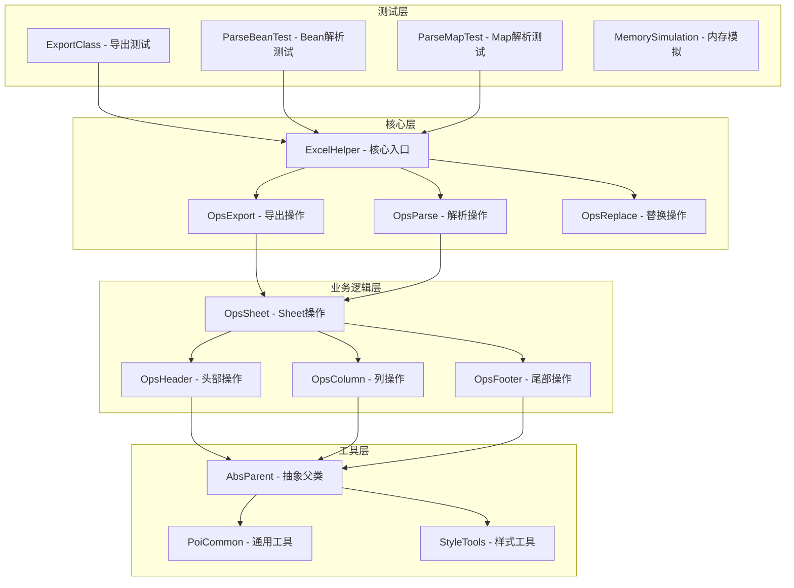
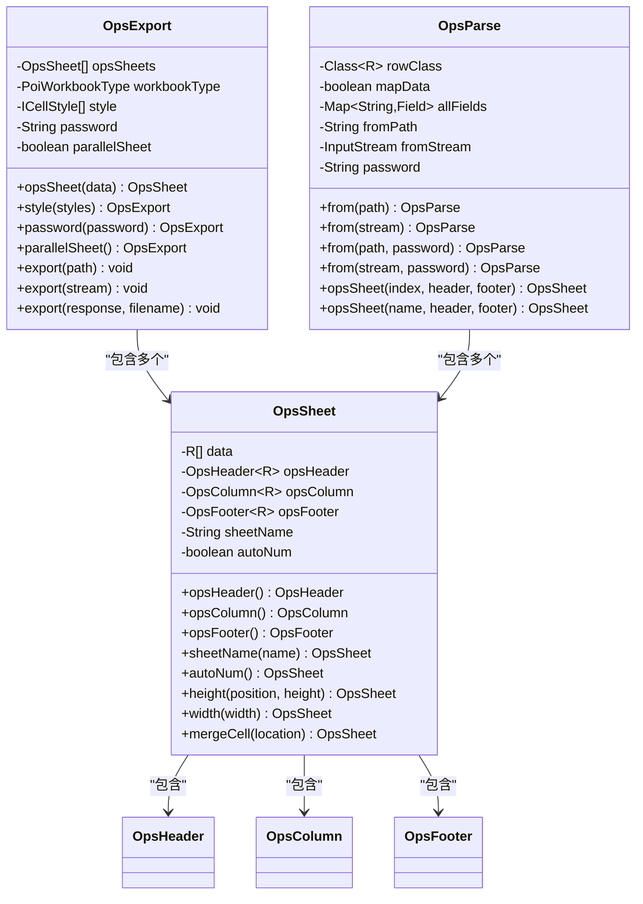
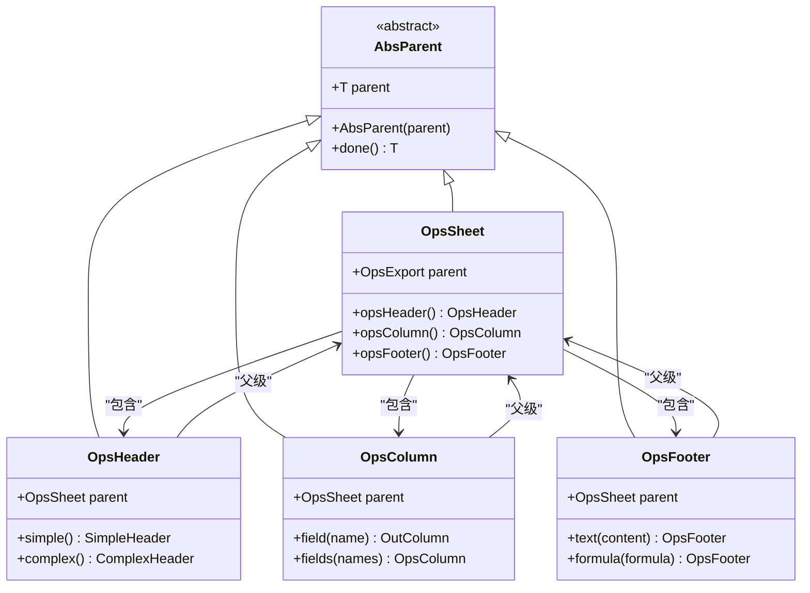
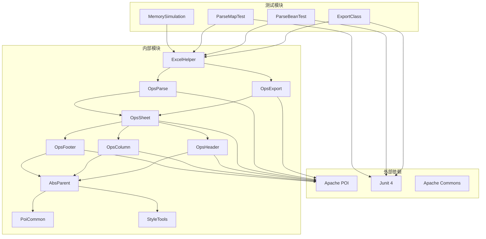

# 代码组织与分层封装

<cite>
**本文档引用的文件**
- [ExportClass.java](file://src/test/java/excel/export/ExportClass.java)
- [ParseBeanTest.java](file://src/test/java/excel/parse/ParseBeanTest.java)
- [ParseMapTest.java](file://src/test/java/excel/parse/ParseMapTest.java)
- [ExcelHelper.java](file://src/main/java/com/github/stupdit1t/excel/core/ExcelHelper.java)
- [OpsExport.java](file://src/main/java/com/github/stupdit1t/excel/core/export/OpsExport.java)
- [OpsParse.java](file://src/main/java/com/github/stupdit1t/excel/core/parse/OpsParse.java)
- [OpsSheet.java](file://src/main/java/com/github/stupdit1t/excel/core/export/OpsSheet.java)
- [OpsHeader.java](file://src/main/java/com/github/stupdit1t/excel/core/export/OpsHeader.java)
- [OpsColumn.java](file://src/main/java/com/github/stupdit1t/excel/core/export/OpsColumn.java)
- [AbsParent.java](file://src/main/java/com/github/stupdit1t/excel/core/AbsParent.java)
- [ProjectEvaluate.java](file://src/test/java/excel/export/data/ProjectEvaluate.java)
- [Student.java](file://src/test/java/excel/export/data/Student.java)
- [MemorySimulation.java](file://src/test/java/excel/MemorySimulation.java)
</cite>

## 目录
1. [引言](#引言)
2. [项目结构概览](#项目结构概览)
3. [核心组件分析](#核心组件分析)
4. [架构设计模式](#架构设计模式)
5. [详细组件分析](#详细组件分析)
6. [依赖关系分析](#依赖关系分析)
7. [性能考虑](#性能考虑)
8. [故障排除指南](#故障排除指南)
9. [结论](#结论)

## 引言

本文档深入分析了POI Excel库的代码组织与分层封装设计，重点探讨了三个测试类（ExportClass、ParseBeanTest、ParseMapTest）的结构设计模式。通过对这些测试类的研究，我们能够提炼出高内聚低耦合的代码组织模式，展示如何将配置参数与操作执行分离，并通过独立方法封装不同测试场景的优势。

该库采用了经典的链式调用模式（Fluent Interface），结合工厂模式和建造者模式，实现了高度可配置的Excel操作接口。这种设计不仅提升了代码的可读性和可维护性，还为不同的业务场景提供了灵活的扩展能力。

## 项目结构概览

POI Excel库采用分层架构设计，主要分为以下几个层次：



**图表来源**
- [ExcelHelper.java](file://src/main/java/com/github/stupdit1t/excel/core/ExcelHelper.java#L1-L52)
- [OpsExport.java](file://src/main/java/com/github/stupdit1t/excel/core/export/OpsExport.java#L1-L50)
- [OpsParse.java](file://src/main/java/com/github/stupdit1t/excel/core/parse/OpsParse.java#L1-L50)

**章节来源**
- [ExportClass.java](file://src/test/java/excel/export/ExportClass.java#L1-L50)
- [ParseBeanTest.java](file://src/test/java/excel/parse/ParseBeanTest.java#L1-L50)
- [ParseMapTest.java](file://src/test/java/excel/parse/ParseMapTest.java#L1-L50)

## 核心组件分析

### ExcelHelper - 核心入口类

ExcelHelper类采用了工厂模式，提供统一的入口点来创建不同类型的Excel操作实例：

```java
public final class ExcelHelper {
    public static OpsExport opsExport(PoiWorkbookType workbookType) {
        return new OpsExport(workbookType);
    }
    
    public static <R> OpsParse<R> opsParse(Class<R> rowClass) {
        return new OpsParse<>(rowClass);
    }
    
    public static OpsReplace opsReplace() {
        return new OpsReplace();
    }
}
```

这种设计模式的优势：
- **单一职责原则**：每个静态方法负责创建特定类型的实例
- **类型安全**：编译时就能确保返回正确的类型
- **简化调用**：用户无需关心具体实现类的创建细节

### OpsExport 和 OpsParse - 操作类

这两个类是整个架构的核心，分别负责导出和解析功能：



**图表来源**
- [OpsExport.java](file://src/main/java/com/github/stupdit1t/excel/core/export/OpsExport.java#L25-L100)
- [OpsParse.java](file://src/main/java/com/github/stupdit1t/excel/core/parse/OpsParse.java#L10-L80)
- [OpsSheet.java](file://src/main/java/com/github/stupdit1t/excel/core/export/OpsSheet.java#L20-L100)

**章节来源**
- [ExcelHelper.java](file://src/main/java/com/github/stupdit1t/excel/core/ExcelHelper.java#L1-L52)
- [OpsExport.java](file://src/main/java/com/github/stupdit1t/excel/core/export/OpsExport.java#L1-L100)
- [OpsParse.java](file://src/main/java/com/github/stupdit1t/excel/core/parse/OpsParse.java#L1-L100)

## 架构设计模式

### 链式调用模式（Fluent Interface）

整个架构大量使用了链式调用模式，使得API调用更加直观和流畅：

```java
// 导出示例
ExcelHelper.opsExport(PoiWorkbookType.XLSX)
    .opsSheet(data)
        .autoNum()
        .opsHeader()
            .simple()
            .texts("序号", "项目名称", "项目图", "所属区域")
            .done()
        .opsColumn()
            .fields("projectName", "img", "areaName", "province")
            .field("avg").pattern("0.00%")
            .done()
        .export("output.xlsx");

// 解析示例
ExcelHelper.opsParse(ProjectEvaluate.class)
    .from("input.xlsx")
    .opsSheet(0, 1, 1)
    .opsColumn(true)
        .field(Col.H, ProjectEvaluate::getScore).type(double.class).scale(2)
        .done()
    .parse();
```

### 父子关系模式（Parent-Child Relationship）

所有操作类都继承自AbsParent抽象类，形成了清晰的父子关系：



**图表来源**
- [AbsParent.java](file://src/main/java/com/github/stupdit1t/excel/core/AbsParent.java#L1-L33)
- [OpsSheet.java](file://src/main/java/com/github/stupdit1t/excel/core/export/OpsSheet.java#L20-L80)
- [OpsHeader.java](file://src/main/java/com/github/stupdit1t/excel/core/export/OpsHeader.java#L15-L50)

### 配置与执行分离模式

每个操作类都遵循配置与执行分离的原则：

1. **配置阶段**：设置各种属性和行为
2. **执行阶段**：最终调用export或parse方法

这种设计的好处：
- **灵活性**：可以在执行前动态调整配置
- **可读性**：配置和执行逻辑清晰分离
- **可维护性**：修改配置不影响执行逻辑

**章节来源**
- [OpsSheet.java](file://src/main/java/com/github/stupdit1t/excel/core/export/OpsSheet.java#L1-L100)
- [OpsHeader.java](file://src/main/java/com/github/stupdit1t/excel/core/export/OpsHeader.java#L1-L100)
- [OpsColumn.java](file://src/main/java/com/github/stupdit1t/excel/core/export/OpsColumn.java#L1-L96)

## 详细组件分析

### ExportClass - 导出测试类分析

ExportClass展示了完整的导出功能测试，包含了多种复杂的导出场景：

#### 测试数据初始化模式

```java
// 数据初始化块
{
    // 1.单sheet数据填充
    for (int i = 0; i < 10; i++) {
        ProjectEvaluate obj = new ProjectEvaluate();
        obj.setProjectName("中青旅" + i);
        obj.setAreaName("华东长三角");
        obj.setProvince("陕西省");
        // ... 设置其他属性
        data.add(obj);
    }
    
    // 2.复杂对象数据
    for (int i = 0; i < 5; i++) {
        Student stu = new Student();
        stu.setClassRoom(new ClassRoom("六班"));
        Map<String, Object> moreInfo = new HashMap<>();
        moreInfo.put("parent", new Parent("張無忌"));
        stu.setMoreInfo(moreInfo);
        stu.setName("张三");
        complexData.add(stu);
    }
}
```

这种初始化模式的优势：
- **集中管理**：所有测试数据都在一个地方初始化
- **可扩展性**：可以轻松添加新的测试数据类型
- **一致性**：确保所有测试场景使用一致的数据格式

#### 独立方法封装不同测试场景

ExportClass为每种导出场景都提供了独立的方法：

```java
@Test
public void simpleExport() throws FileNotFoundException {
    name.set("simpleExport");
    ExcelHelper.opsExport(PoiWorkbookType.XLS)
        .opsSheet(data)
            .autoNum()
            .opsHeader()
                .simple()
                .texts("序号", "项目名称", "项目图", "所属区域", "省份", "市")
                .done()
            .opsColumn()
                .fields("projectName", "img", "areaName", "province", "city")
                .done()
            .export("src/test/java/excel/export/excel/simpleExport.xls");
}

@Test
public void complexExport() {
    name.set("complexExport");
    ExcelHelper.opsExport(PoiWorkbookType.XLSX)
        .opsSheet(data)
            .autoNum()
            .mergeCell("F4:G13")
            .addImage(imageParseBytes(new File("image.jpg")), "F4:G13")
        .opsHeader()
            .complex()
                .text("项目资源统计", "A1:K1")
                .text("基本信息", 1, 1, 1, 4)
                .text("项目名称", "3,3,B,B")
                .done()
        .export("src/test/java/excel/export/excel/complexExport.xlsx");
}
```

这种方法的优势：
- **单一职责**：每个方法只负责一个特定的测试场景
- **易于维护**：修改某个场景不会影响其他场景
- **便于调试**：可以单独运行某个测试场景进行调试

#### 性能监控模块化设计

ExportClass使用ThreadLocal实现了统一的性能监控机制：

```java
ThreadLocal<Long> time = new ThreadLocal<>();
ThreadLocal<String> name = new ThreadLocal<>();

@Before
public void before() {
    time.set(System.currentTimeMillis());
}

@After
public void after() {
    long diff = System.currentTimeMillis() - time.get();
    System.out.println("[ " + name.get() + " ] 耗时: " + diff);
    time.remove();
    name.remove();
}
```

这种设计的优势：
- **线程安全**：避免多线程环境下的数据污染
- **自动化**：无需手动记录时间，减少出错可能性
- **统一格式**：所有测试场景使用相同的输出格式

**章节来源**
- [ExportClass.java](file://src/test/java/excel/export/ExportClass.java#L1-L471)

### ParseBeanTest 和 ParseMapTest 分析

这两个测试类展示了解析功能的不同使用场景，体现了同样的设计模式：

#### 统一的性能监控机制

```java
// ParseBeanTest
ThreadLocal<Long> time = new ThreadLocal<>();
ThreadLocal<String> name = new ThreadLocal<>();

@Before
public void before() {
    time.set(System.currentTimeMillis());
}

@After
public void after() {
    long diff = System.currentTimeMillis() - time.get();
    System.out.println("[ " + name.get() + " ] 耗时: " + diff);
    time.remove();
    name.remove();
}

// ParseMapTest
ThreadLocal<Long> time = new ThreadLocal<>();
ThreadLocal<String> name = new ThreadLocal<>();
```

这种设计的一致性：
- **代码复用**：避免重复实现相同的功能
- **维护便利**：只需修改一处即可更新所有测试类的行为
- **标准化**：所有测试类都遵循相同的性能监控规范

#### 多样化的测试场景

ParseBeanTest展示了Bean解析的各种场景：

```java
@Test
public void parseBean1() {
    name.set("自动映射列");
    PoiResult<ProjectEvaluate> parse = ExcelHelper.opsParse(ProjectEvaluate.class)
        .from("input.xlsx")
        .opsSheet(0, 1, 1)
        .opsColumn(true).done()
        .parse();
    // 处理结果...
}

@Test
public void parseBean4() {
    name.set("提取指定列，校验, 转换");
    Map<String, Integer> cityMapping = new HashMap<>();
    cityMapping.put("西安", 1);
    cityMapping.put("北京", 2);
    
    PoiResult<ProjectEvaluate> parse = ExcelHelper.opsParse(ProjectEvaluate.class)
        .from("input.xlsx")
        .opsSheet(0, 1, 1)
        .opsColumn()
        .field(Col.A, "projectName").trim().notNull().defaultValue("张三").regex("中青旅\\d{2}")
        .field(Col.E, "cityKey").notNull().map(cityMapping::get)
        .done()
        .parse();
}
```

ParseMapTest展示了Map解析的场景：

```java
@Test
public void parseMap1() {
    name.set("快速转map，自动映射列");
    PoiResult<HashMap> parse = ExcelHelper.opsParse(HashMap.class)
        .from("input.xls")
        .opsSheet(0, 1, 0)
        .opsColumn(true)
        .field(Col.AS, "AS").defaultValue("").map((val) -> {
            if (val == null) {
                throw PoiException.error("单元格不能为空!");
            }
            return val;
        })
        .done()
        .parse();
}
```

**章节来源**
- [ParseBeanTest.java](file://src/test/java/excel/parse/ParseBeanTest.java#L1-L140)
- [ParseMapTest.java](file://src/test/java/excel/parse/ParseMapTest.java#L1-L123)

## 依赖关系分析

### 核心依赖关系图



**图表来源**
- [ExcelHelper.java](file://src/main/java/com/github/stupdit1t/excel/core/ExcelHelper.java#L1-L10)
- [OpsExport.java](file://src/main/java/com/github/stupdit1t/excel/core/export/OpsExport.java#L1-L20)
- [OpsParse.java](file://src/main/java/com/github/stupdit1t/excel/core/parse/OpsParse.java#L1-L15)

### 循环依赖检测

通过分析依赖关系图，我们可以确认系统中不存在循环依赖：

1. **测试层** → **核心层**：单向依赖，测试类依赖核心API
2. **核心层** → **业务逻辑层**：单向依赖，核心类依赖具体的操作实现
3. **业务逻辑层** → **工具层**：单向依赖，业务逻辑依赖通用工具

这种设计确保了系统的稳定性和可维护性。

**章节来源**
- [AbsParent.java](file://src/main/java/com/github/stupdit1t/excel/core/AbsParent.java#L1-L33)
- [OpsSheet.java](file://src/main/java/com/github/stupdit1t/excel/core/export/OpsSheet.java#L1-L50)

## 性能考虑

### 内存优化策略

系统采用了多种内存优化策略：

1. **SXSSFWorkbook支持**：对于大数据量导出，系统支持SXSSFWorkbook以减少内存占用
2. **流式处理**：解析大文件时采用流式处理，避免一次性加载到内存
3. **并行处理**：支持多sheet并行导出，提高处理效率

### 性能监控机制

所有测试类都集成了统一的性能监控机制：

```java
// 性能监控实现
@Before
public void before() {
    time.set(System.currentTimeMillis());
}

@After
public void after() {
    long diff = System.currentTimeMillis() - time.get();
    System.out.println("[ " + name.get() + " ] 耗时: " + diff);
    time.remove();
    name.remove();
}
```

这种设计的优势：
- **实时监控**：可以实时了解每个测试场景的执行时间
- **问题定位**：快速定位性能瓶颈
- **基准测试**：为性能优化提供数据支持

### 大数据处理优化

ExportClass中的bigData测试展示了大数据处理的优化策略：

```java
@Test
public void bigData() {
    name.set("bigData 大数据类型");
    ExcelHelper.opsExport(PoiWorkbookType.BIG_XLSX)
        .password("123")
        .opsSheet(bigData)
        .sheetName("1")
        .opsHeader().simple().texts("项目名称", "项目图", "所属区域", "省份", "市").done()
        .opsColumn().fields("projectName", "img", "areaName", "province", "city").done()
        .export("src/test/java/excel/export/excel/bigData.xlsx");
}
```

**章节来源**
- [ExportClass.java](file://src/test/java/excel/export/ExportClass.java#L430-L450)
- [MemorySimulation.java](file://src/test/java/excel/MemorySimulation.java#L1-L93)

## 故障排除指南

### 常见问题及解决方案

1. **内存溢出问题**
   - 使用SXSSFWorkbook处理大数据
   - 合理设置内存阈值
   - 采用流式处理方式

2. **性能问题**
   - 使用并行处理多sheet
   - 优化样式设置
   - 减少不必要的样式计算

3. **配置错误**
   - 检查表头和列的对应关系
   - 验证数据类型匹配
   - 确认文件格式正确

### 调试技巧

1. **启用详细日志**：在测试类中添加详细的日志输出
2. **使用断点调试**：在关键节点设置断点
3. **性能分析**：利用内置的性能监控功能

**章节来源**
- [ExportClass.java](file://src/test/java/excel/export/ExportClass.java#L60-L80)
- [ParseBeanTest.java](file://src/test/java/excel/parse/ParseBeanTest.java#L20-L40)

## 结论

通过对POI Excel库的深入分析，我们可以看到其在代码组织和分层封装方面的优秀设计：

### 主要优势

1. **高内聚低耦合**：每个模块职责明确，模块间依赖关系清晰
2. **链式调用模式**：API设计直观易用，提升了开发体验
3. **配置与执行分离**：使系统具有良好的灵活性和可扩展性
4. **统一的性能监控**：为系统优化提供了有力支持
5. **多样化的测试场景**：覆盖了各种实际应用场景

### 设计模式的应用

- **工厂模式**：ExcelHelper类提供了统一的创建入口
- **建造者模式**：OpsExport和OpsParse类实现了复杂的对象构建
- **链式调用模式**：提供了流畅的API体验
- **模板方法模式**：AbsParent类定义了标准的操作流程

### 最佳实践总结

1. **模块化设计**：将相关功能组织到独立的模块中
2. **统一接口**：为相似功能提供一致的API
3. **性能优先**：在设计时充分考虑性能因素
4. **测试驱动**：通过全面的测试确保代码质量
5. **文档完善**：提供清晰的使用说明和最佳实践

这种设计模式不仅适用于Excel处理，也为其他类似的工具库设计提供了宝贵的参考价值。通过学习和应用这些设计原则，开发者可以构建出更加健壮、可维护和高性能的软件系统。