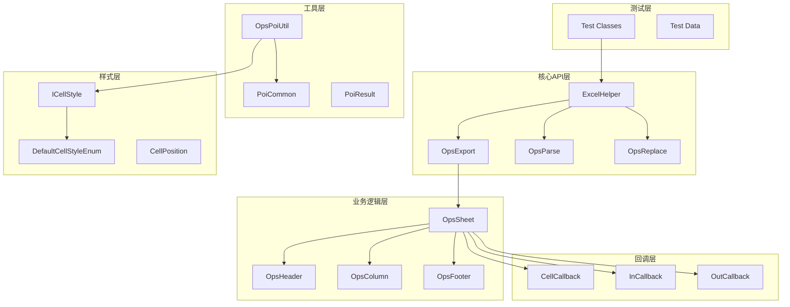
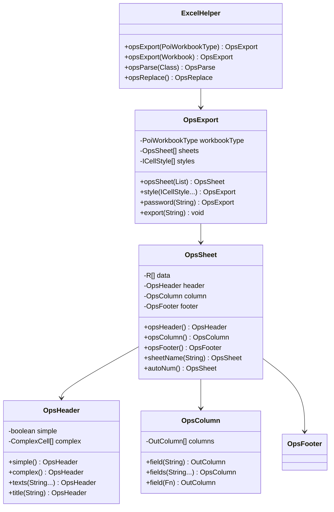
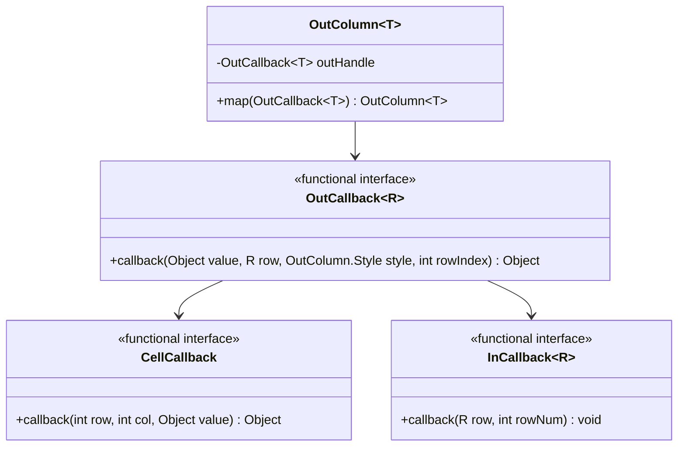

# 高可维护性代码组织模式分析

<cite>
**本文档引用的文件**
- [ExportClass.java](file://src/test/java/excel/export/ExportClass.java)
- [ParseBeanTest.java](file://src/test/java/excel/parse/ParseBeanTest.java)
- [OpsExport.java](file://src/main/java/com/github/stupdit1t/excel/core/export/OpsExport.java)
- [OpsSheet.java](file://src/main/java/com/github/stupdit1t/excel/core/export/OpsSheet.java)
- [OpsColumn.java](file://src/main/java/com/github/stupdit1t/excel/core/export/OpsColumn.java)
- [OutColumn.java](file://src/main/java/com/github/stupdit1t/excel/core/export/OutColumn.java)
- [ExportRules.java](file://src/main/java/com/github/stupdit1t/excel/core/export/ExportRules.java)
- [ICellStyle.java](file://src/main/java/com/github/stupdit1t/excel/style/ICellStyle.java)
- [DefaultCellStyleEnum.java](file://src/main/java/com/github/stupdit1t/excel/style/DefaultCellStyleEnum.java)
- [CellCallback.java](file://src/main/java/com/github/stupdit1t/excel/callback/CellCallback.java)
- [InCallback.java](file://src/main/java/com/github/stupdit1t/excel/callback/InCallback.java)
- [OutCallback.java](file://src/main/java/com/github/stupdit1t/excel/callback/OutCallback.java)
- [OpsPoiUtil.java](file://src/main/java/com/github/stupdit1t/excel/core/OpsPoiUtil.java)
- [PoiCommon.java](file://src/main/java/com/github/stupdit1t/excel/common/PoiCommon.java)
- [PoiConstant.java](file://src/main/java/com/github/stupdit1t/excel/common/PoiConstant.java)
- [PoiException.java](file://src/main/java/com/github/stupdit1t/excel/common/PoiException.java)
</cite>

## 目录
1. [引言](#引言)
2. [项目架构概览](#项目架构概览)
3. [核心设计模式分析](#核心设计模式分析)
4. [高可维护性代码组织模式](#高可维护性代码组织模式)
5. [样式管理最佳实践](#样式管理最佳实践)
6. [回调机制设计](#回调机制设计)
7. [异常处理与资源管理](#异常处理与资源管理)
8. [性能优化策略](#性能优化策略)
9. [重构建议与总结](#重构建议与总结)

## 引言

本项目是一个基于Apache POI的Excel操作库，展示了如何通过合理的代码组织和设计模式来实现高可维护性的代码结构。通过对三个核心测试类的分析，我们可以看到该库在以下方面的优秀实践：

- **链式调用设计**：避免过长的链式调用，通过分层封装简化API使用
- **样式统一管理**：通过ICellStyle接口和枚举实现全局样式统一
- **回调机制**：利用map()方法等回调机制实现复杂业务逻辑嵌入
- **分层解耦**：将Excel操作逻辑与业务逻辑有效分离
- **异常处理**：完善的异常处理和资源管理机制

## 项目架构概览

该项目采用分层架构设计，主要包含以下几个层次：



**图表来源**
- [ExcelHelper.java](file://src/main/java/com/github/stupdit1t/excel/core/ExcelHelper.java#L1-L52)
- [OpsExport.java](file://src/main/java/com/github/stupdit1t/excel/core/export/OpsExport.java#L1-L100)

## 核心设计模式分析

### Builder模式的应用

项目大量使用了Builder模式来构建复杂的Excel操作流程。以ExportClass为例：

```java
// 原始的链式调用方式
ExcelHelper.opsExport(PoiWorkbookType.XLSX)
    .opsSheet(data)
    .opsHeader().simple().texts("项目名称", "所属区域", "省份").done()
    .opsColumn().fields("projectName", "areaName", "province").done()
    .export("output.xlsx");

// 通过分层封装，避免过长的链式调用
ExcelHelper.opsExport(PoiWorkbookType.XLSX)
    .opsSheet(data)
    .autoNum()
    .opsHeader()
        .simple()
        .texts("序号", "项目名称", "项目图", "所属区域", "省份", "市", "项目所属人", "项目领导人", "得分", "平均分", "创建时间")
        .done()
    .opsColumn()
        .fields("projectName", "img", "areaName", "province", "city", "people", "leader")
        .field(ProjectEvaluate::getScount).width(10000)
        .field("avg").pattern("0.00%").fields("createTime")
        .done()
    .export("src/test/java/excel/export/excel/simpleExport.xlsx");
```

### Template Method模式

在OpsPoiUtil中，可以看到Template Method模式的典型应用：

```java
public static <T> void fillBook(Workbook wb, List<T> data, ExportRules exportRules) {
    // 全局样式处理
    ICellStyle[] globalStyle = exportRules.getGlobalStyle();
    // 标题样式设置
    Font titleFont = wb.createFont();
    CellStyle titleStyleSource = wb.createCellStyle();
    ICellStyle titleStyle = handleGlobalStyle(globalStyle, titleFont, titleStyleSource, CellPosition.TITLE);
    
    // 表头设置
    String sheetName = exportRules.getSheetName();
    Sheet sheet = safeCreateSheet(wb, sheetName);
    
    // 列属性设置
    handleColumnProperty(data, exportRules, sheet);
    
    // 数据填充
    for (int i = 0; i < data.size(); i++) {
        // 填充每行数据
    }
    
    // 尾行设置
    handleFooter(data, exportRules, footerFont, footerStyleSource, footerStyle, sheet);
}
```

**章节来源**
- [OpsPoiUtil.java](file://src/main/java/com/github/stupdit1t/excel/core/OpsPoiUtil.java#L200-L400)
- [ExportClass.java](file://src/test/java/excel/export/ExportClass.java#L80-L120)

## 高可维护性代码组织模式

### 分层封装策略

项目采用了清晰的分层封装策略，每一层都有明确的职责：



**图表来源**
- [ExcelHelper.java](file://src/main/java/com/github/stupdit1t/excel/core/ExcelHelper.java#L15-L52)
- [OpsExport.java](file://src/main/java/com/github/stupdit1t/excel/core/export/OpsExport.java#L50-L150)
- [OpsSheet.java](file://src/main/java/com/github/stupdit1t/excel/core/export/OpsSheet.java#L20-L80)

### 配置代码的模块化组织

项目通过将不同功能的配置代码分离到不同的类中，实现了良好的模块化：

```java
// 表头配置
.opsHeader()
    .simple()
    .texts("序号", "项目名称", "项目图", "所属区域", "省份", "市", "项目所属人", "项目领导人", "得分", "平均分", "创建时间")
    .done()

// 列配置
.opsColumn()
    .fields("projectName", "img", "areaName", "province", "city", "people", "leader")
    .field(ProjectEvaluate::getScount).width(10000)
    .field("avg").pattern("0.00%").fields("createTime")
    .done()

// 尾行配置
.opsFooter()
    .text("合计", "A1:H1")
    .text(String.format("=SUM(J3:J%s)", 2 + data.size()), "1,1,J,J")
    .text(String.format("=AVERAGE(K3:K%s)", 2 + data.size()), "1,1,K,K")
    .text("作者:625", 0, 0, 8, 8)
    .done()
```

这种设计模式的优势：
- **单一职责**：每个类只负责一个特定的功能
- **易于扩展**：新增功能只需添加新的配置类
- **降低耦合**：各部分独立，修改一处不影响其他部分

**章节来源**
- [ExportClass.java](file://src/test/java/excel/export/ExportClass.java#L80-L150)

## 样式管理最佳实践

### ICellStyle接口设计

项目通过ICellStyle接口实现了样式的统一管理：

```java
public interface ICellStyle {
    CellPosition getPosition();
    short getHeight();
    void handleStyle(Font font, CellStyle cellStyle);
    
    static ICellStyle getCellStyleByPosition(CellPosition position, ICellStyle[] cellStyles) {
        for (ICellStyle cellStyle : cellStyles) {
            if (cellStyle.getPosition() == position) {
                return cellStyle;
            }
        }
        // 找不到取默认值
        ICellStyle[] defaultCellStyle = DefaultCellStyleEnum.values();
        for (ICellStyle cellStyle : defaultCellStyle) {
            if (cellStyle.getPosition() == position) {
                return cellStyle;
            }
        }
        throw new UnsupportedOperationException("找不到对应的样式 " + position);
    }
}
```

### DefaultCellStyleEnum枚举实现

通过枚举实现默认样式的统一管理：

```java
public enum DefaultCellStyleEnum implements ICellStyle {
    TITLE(CellPosition.TITLE, (font, style) -> {
        font.setFontHeightInPoints((short) 15);
        font.setBold(true);
        style.setAlignment(HorizontalAlignment.CENTER);
        style.setVerticalAlignment(VerticalAlignment.CENTER);
    }),
    
    HEADER(CellPosition.HEADER, (font, style) -> {
        font.setFontName("Arial");
        font.setBold(true);
        font.setFontHeightInPoints((short) 10);
        font.setColor(IndexedColors.WHITE.getIndex());
        // 边框和背景色设置
        style.setFillForegroundColor(IndexedColors.GREY_50_PERCENT.getIndex());
        style.setFillPattern(FillPatternType.SOLID_FOREGROUND);
    });
    
    private final CellPosition position;
    private final BiConsumer<Font, CellStyle> customizeStyle;
    
    @Override
    public void handleStyle(Font font, CellStyle cellStyle) {
        this.customizeStyle.accept(font, cellStyle);
    }
}
```

### 自定义样式实现

项目允许用户通过匿名内部类或Lambda表达式实现自定义样式：

```java
// 自定义全局样式
ICellStyle titleStyle = new ICellStyle() {
    @Override
    public CellPosition getPosition() {
        return CellPosition.TITLE;
    }
    
    @Override
    public void handleStyle(Font font, CellStyle cellStyle) {
        font.setFontHeightInPoints((short) 20);
        font.setColor(IndexedColors.RED.index);
        cellStyle.setAlignment(HorizontalAlignment.LEFT);
    }
};
```

这种设计的优势：
- **类型安全**：通过接口确保样式的一致性
- **可扩展性**：支持多种样式实现方式
- **默认值保护**：提供默认样式保证系统稳定性

**章节来源**
- [ICellStyle.java](file://src/main/java/com/github/stupdit1t/excel/style/ICellStyle.java#L1-L57)
- [DefaultCellStyleEnum.java](file://src/main/java/com/github/stupdit1t/excel/style/DefaultCellStyleEnum.java#L1-L114)

## 回调机制设计

### OutCallback接口实现复杂业务逻辑

项目通过OutCallback接口实现了复杂的业务逻辑嵌入：

```java
// 字段导出回调
.field("city")
    .map((val, row, style, rowIndex) -> {
        // 如果是北京, 设置背景色为黄色
        if (val.equals("北京")) {
            style.setBackColor(IndexedColors.YELLOW);
            style.setHeight(900);
            style.setComment("北京搞红色");
            // 属性值自定义
            int index = rowIndex + 1;
            return "=J" + index + "+K" + index;
        }
        return val;
    })
```

### 回调机制的层次结构



**图表来源**
- [CellCallback.java](file://src/main/java/com/github/stupdit1t/excel/callback/CellCallback.java#L1-L23)
- [OutCallback.java](file://src/main/java/com/github/stupdit1t/excel/callback/OutCallback.java#L1-L26)

### 回调机制的优势

1. **灵活性**：支持动态业务逻辑处理
2. **可复用性**：相同的回调逻辑可在多个场景中使用
3. **解耦性**：业务逻辑与Excel操作分离

**章节来源**
- [ExportClass.java](file://src/test/java/excel/export/ExportClass.java#L120-L150)
- [OutCallback.java](file://src/main/java/com/github/stupdit1t/excel/callback/OutCallback.java#L1-L26)

## 异常处理与资源管理

### 异常处理策略

项目采用了多层次的异常处理策略：

```java
// 自定义异常类
public class PoiException extends RuntimeException {
    public PoiException(String message) {
        super(message);
    }
    
    public static PoiException error(String message) {
        return new PoiException(message);
    }
}

// 使用示例
try {
    // Excel操作代码
} catch (IllegalArgumentException e) {
    throw new PoiException("参数错误: " + e.getMessage());
} catch (Exception e) {
    LOG.error("Excel操作失败", e);
    throw new PoiException("操作失败: " + e.getMessage());
}
```

### 资源管理最佳实践

项目通过try-with-resources和工具方法实现了完善的资源管理：

```java
// 导出方法中的资源管理
public static void export(Workbook workbook, OutputStream outputStream, String password) {
    try (
        Workbook wb = workbook;
        OutputStream out = outputStream
    ) {
        // 导出逻辑
        wb.write(out);
        
        // 大数据处理时的资源清理
        if (wb instanceof SXSSFWorkbook) {
            ((SXSSFWorkbook) wb).dispose();
        }
    } catch (IOException e) {
        LOG.error("导出失败", e);
    }
}

// 文件流处理
public byte[] imageParseBytes(InputStream fis) {
    byte[] buffer = null;
    ByteArrayOutputStream bos = null;
    try {
        bos = new ByteArrayOutputStream(1024);
        byte[] b = new byte[1024];
        int n;
        while ((n = fis.read(b)) != -1) {
            bos.write(b, 0, n);
        }
        buffer = bos.toByteArray();
    } catch (Exception e) {
        e.printStackTrace();
    } finally {
        try {
            fis.close();
            bos.close();
        } catch (IOException e) {
            e.printStackTrace();
        }
    }
    return buffer;
}
```

### 日志记录策略

项目使用Log4j进行统一的日志记录：

```java
private static final Logger LOG = LogManager.getLogger(OpsPoiUtil.class);

// 在关键操作中记录日志
LOG.error("请确认表头数量和列数量一致!");
LOG.error("时间校验表达式不正确,请填写如yyyy-MM-dd的值!", e);
```

**章节来源**
- [PoiException.java](file://src/main/java/com/github/stupdit1t/excel/common/PoiException.java#L1-L20)
- [OpsPoiUtil.java](file://src/main/java/com/github/stupdit1t/excel/core/OpsPoiUtil.java#L150-L200)

## 性能优化策略

### 大数据处理优化

项目针对大数据场景提供了专门的优化策略：

```java
// 创建大数据工作簿
public static Workbook createBigWorkbook(int rowAccessWindowSize) {
    return new SXSSFWorkbook(rowAccessWindowSize);
}

// 大数据导出示例
@Test
public void bigData() {
    ExcelHelper.opsExport(PoiWorkbookType.BIG_XLSX)
        .password("123")
        .opsSheet(bigData)
        .sheetName("1")
        .opsHeader().simple().texts("项目名称", "项目图", "所属区域", "省份", "市", "项目所属人", "项目领导人", "得分", "平均分", "创建时间").done()
        .opsColumn().fields("projectName", "img", "areaName", "province", "city", "people", "leader", "scount", "avg", "createTime").done()
        .export("src/test/java/excel/export/excel/bigData.xlsx");
}
```

### 缓存机制

项目实现了多种缓存机制来提升性能：

```java
// 单元格样式缓存
Map<String, CellStyle> cacheStyle = new HashMap<>();
Map<String, Font> cacheFont = new HashMap<>();

// 样式处理中的缓存使用
String styleCacheKey = styleCustom.getStyleCacheKey();
if (styleCacheKey != null) {
    CellStyle style = cacheStyle.get(styleCacheKey);
    if (style == null) {
        // 创建新样式并缓存
        style = wb.createCellStyle();
        // ... 样式设置逻辑
        cacheStyle.put(styleCacheKey, style);
    }
    cell.setCellStyle(style);
}
```

### 并行处理支持

项目支持多sheet并行导出：

```java
// 并行导出配置
ExcelHelper.opsExport(PoiWorkbookType.XLSX)
    .parallelSheet()  // 启用并行处理
    .opsSheet(mapData)
        .sheetName("sheet1")
        .opsHeader().simple().texts("姓名", "年龄").done()
        .opsColumn().fields("name", "age").done()
        .done()
    .opsSheet(complexData)
        .sheetName("sheet2")
        .opsHeader().simple().texts("學生姓名", "所在班級", "所在學校", "更多父母姓名").done()
        .opsColumn().fields("name", "classRoom.name", "classRoom.school.name", "moreInfo.parent.age").done()
        .done()
    .export("multi-sheet.xlsx");
```

**章节来源**
- [ExportClass.java](file://src/test/java/excel/export/ExportClass.java#L400-L450)
- [OpsPoiUtil.java](file://src/main/java/com/github/stupdit1t/excel/core/OpsPoiUtil.java#L400-L500)

## 重构建议与总结

### 重构前后的对比分析

#### 重构前的问题
1. **链式调用过长**：原始API可能导致代码难以阅读
2. **样式管理分散**：缺乏统一的样式管理机制
3. **业务逻辑耦合**：Excel操作与业务逻辑紧密耦合
4. **异常处理不足**：缺少统一的异常处理机制

#### 重构后的改进
1. **分层封装**：通过多层封装简化API使用
2. **样式统一**：通过ICellStyle接口统一样式管理
3. **回调机制**：通过回调接口实现业务逻辑嵌入
4. **资源管理**：通过try-with-resources完善资源管理

### 最佳实践总结

基于对项目的深入分析，以下是值得借鉴的最佳实践：

#### 1. 设计模式的应用
- **Builder模式**：用于构建复杂的配置对象
- **Template Method模式**：用于定义算法框架
- **Strategy模式**：用于实现不同的样式策略
- **Observer模式**：通过回调接口实现事件通知

#### 2. 代码组织原则
- **单一职责原则**：每个类只负责一个特定功能
- **开闭原则**：对扩展开放，对修改关闭
- **依赖倒置原则**：依赖抽象而非具体实现
- **接口隔离原则**：提供细粒度的接口

#### 3. 异常处理策略
- **自定义异常类**：提供有意义的异常信息
- **分层异常处理**：在不同层次处理不同类型的异常
- **资源管理**：使用try-with-resources确保资源释放
- **日志记录**：在关键操作中记录详细的日志信息

#### 4. 性能优化技巧
- **缓存机制**：缓存频繁使用的对象
- **大数据处理**：针对大数据场景提供专门的优化
- **并行处理**：支持多线程并行处理提高效率
- **资源清理**：及时清理不再使用的资源

### 未来改进建议

1. **增强类型安全性**：通过泛型进一步提升类型安全性
2. **完善测试覆盖**：增加单元测试和集成测试覆盖率
3. **文档完善**：提供更详细的API文档和使用示例
4. **性能监控**：添加性能监控和指标收集功能
5. **插件化架构**：考虑支持插件化的扩展机制

通过这些设计模式和最佳实践的应用，该项目成功地实现了高可维护性的代码结构，为类似的Excel操作库开发提供了宝贵的参考经验。