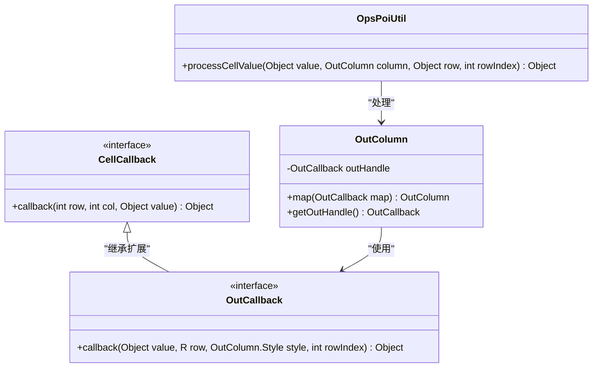
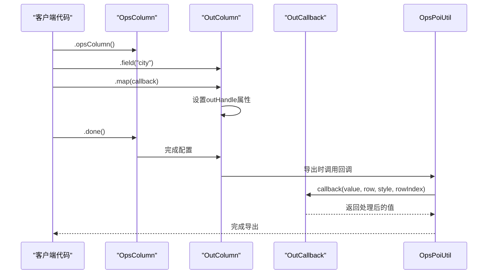
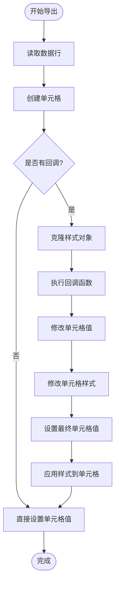
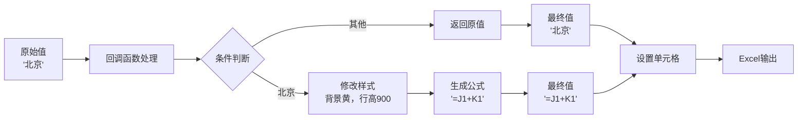

# 回调机制与map方法应用

<cite>
**本文档引用的文件**
- [CellCallback.java](file://src/main/java/com/github/stupdit1t/excel/callback/CellCallback.java)
- [OutCallback.java](file://src/main/java/com/github/stupdit1t/excel/callback/OutCallback.java)
- [ExportClass.java](file://src/test/java/excel/export/ExportClass.java)
- [OpsPoiUtil.java](file://src/main/java/com/github/stupdit1t/excel/core/OpsPoiUtil.java)
- [OutColumn.java](file://src/main/java/com/github/stupdit1t/excel/core/export/OutColumn.java)
- [OpsColumn.java](file://src/main/java/com/github/stupdit1t/excel/core/export/OpsColumn.java)
</cite>

## 目录
1. [简介](#简介)
2. [回调接口设计原理](#回调接口设计原理)
3. [map方法架构分析](#map方法架构分析)
4. [回调执行流程](#回调执行流程)
5. [参数详解与处理逻辑](#参数详解与处理逻辑)
6. [高级应用场景示例](#高级应用场景示例)
7. [性能优化建议](#性能优化建议)
8. [故障排除指南](#故障排除指南)
9. [总结](#总结)

## 简介

POI Excel库中的回调机制是一个强大而灵活的功能系统，它允许开发者在数据导出过程中对单元格值进行动态修改、样式调整甚至公式注入。本文档深入分析ExportClass.java中city字段的map回调实现，详细说明CellCallback和OutCallback函数式接口的设计原理，并展示如何利用map方法在导出过程中实现复杂的业务逻辑。

## 回调接口设计原理

### 函数式接口架构

POI Excel库采用了现代Java函数式编程思想，通过函数式接口实现了优雅的回调机制：



**图表来源**
- [CellCallback.java](file://src/main/java/com/github/stupdit1t/excel/callback/CellCallback.java#L1-L23)
- [OutCallback.java](file://src/main/java/com/github/stupdit1t/excel/callback/OutCallback.java#L1-L24)
- [OutColumn.java](file://src/main/java/com/github/stupdit1t/excel/core/export/OutColumn.java#L1-L100)

### 接口设计特点

1. **简洁性**：每个接口都只定义了一个核心方法，遵循单一职责原则
2. **灵活性**：支持Lambda表达式和方法引用，便于编写简洁的回调逻辑
3. **类型安全**：泛型设计确保编译时类型检查
4. **扩展性**：OutCallback继承自CellCallback，提供了更丰富的参数

**章节来源**
- [CellCallback.java](file://src/main/java/com/github/stupdit1t/excel/callback/CellCallback.java#L1-L23)
- [OutCallback.java](file://src/main/java/com/github/stupdit1t/excel/callback/OutCallback.java#L1-L24)

## map方法架构分析

### 方法链式调用设计

map方法采用了经典的Fluent API设计模式，提供了流畅的配置体验：



**图表来源**
- [OpsColumn.java](file://src/main/java/com/github/stupdit1t/excel/core/export/OpsColumn.java#L1-L96)
- [OutColumn.java](file://src/main/java/com/github/stupdit1t/excel/core/export/OutColumn.java#L300-L358)

### 配置存储机制

OutColumn类通过outHandle属性存储回调函数，实现了延迟执行的设计模式：

```java
// OutColumn.java 中的map方法实现
public OutColumn<R> map(OutCallback<R> map) {
    this.outHandle = map;
    return this;
}
```

这种设计的优势：
- **延迟绑定**：回调函数在实际导出时才被调用
- **配置分离**：导出配置与业务逻辑分离
- **内存效率**：避免不必要的对象创建

**章节来源**
- [OutColumn.java](file://src/main/java/com/github/stupdit1t/excel/core/export/OutColumn.java#L300-L358)

## 回调执行流程

### 数据写入前的执行时机

回调函数在数据写入Excel单元格之前执行，这是关键的设计决策：



**图表来源**
- [OpsPoiUtil.java](file://src/main/java/com/github/stupdit1t/excel/core/OpsPoiUtil.java#L320-L340)

### 执行时机的重要性

在数据写入前执行回调具有以下优势：

1. **样式优先**：可以先设置样式，再根据样式结果修改值
2. **公式支持**：可以生成动态公式表达式
3. **条件渲染**：可以根据业务规则决定是否显示或隐藏数据
4. **数据脱敏**：可以在导出前对敏感数据进行处理

**章节来源**
- [OpsPoiUtil.java](file://src/main/java/com/github/stupdit1t/excel/core/OpsPoiUtil.java#L320-L340)

## 参数详解与处理逻辑

### 参数含义深度解析

map回调函数接收四个关键参数，每个都有特定用途：

```java
Object callback(
    Object value,    // 当前单元格原始值
    R row,           // 当前行数据对象
    OutColumn.Style style, // 单元格样式对象
    int rowIndex     // 当前数据索引（从0开始）
)
```

#### value参数
- **类型**：Object
- **来源**：从数据模型中读取的原始值
- **用途**：作为基础值进行修改或转换
- **示例**：city字段的原始值"北京"、"西安"

#### row参数
- **类型**：泛型R，表示数据行类型
- **来源**：当前正在处理的数据行对象
- **用途**：访问整行数据，实现跨字段逻辑
- **示例**：ProjectEvaluate对象，包含所有字段信息

#### style参数
- **类型**：OutColumn.Style
- **来源**：单元格样式对象的克隆
- **用途**：动态修改单元格样式属性
- **可修改属性**：
  - `setBackColor(IndexedColors color)`：设置背景色
  - `setHeight(int height)`：设置行高
  - `setComment(String comment)`：设置批注
  - `setAlign(HorizontalAlignment align)`：设置水平对齐
  - `setValign(VerticalAlignment valign)`：设置垂直对齐

#### rowIndex参数
- **类型**：int
- **来源**：当前数据行的索引（从0开始）
- **用途**：生成相对引用公式或实现行相关逻辑
- **示例**：用于生成`=J1+K1`这样的公式

### 返回值处理逻辑

回调函数必须返回Object类型的值，这个值将作为最终的单元格内容：



**图表来源**
- [ExportClass.java](file://src/test/java/excel/export/ExportClass.java#L220-L235)

**章节来源**
- [OutCallback.java](file://src/main/java/com/github/stupdit1t/excel/callback/OutCallback.java#L11-L24)
- [ExportClass.java](file://src/test/java/excel/export/ExportClass.java#L220-L235)

## 高级应用场景示例

### 条件渲染示例

基于业务规则的条件渲染是最常见的应用场景：

```java
// ExportClass.java 中的city字段map回调
.field("city")
    .map((val, row, style, rowIndex) -> {
        // 如果是北京, 设置背景色为黄色
        if (val.equals("北京")) {
            style.setBackColor(IndexedColors.YELLOW);
            style.setHeight(900);
            style.setComment("北京搞红色");
            // 属性值自定义
            int index = rowIndex + 1;
            return "=J" + index + "+K" + index;
        }
        return val;
    })
```

这个示例展示了：
- **条件判断**：根据city值决定是否应用特殊样式
- **样式修改**：动态设置背景色、行高和批注
- **公式生成**：为特定值生成Excel公式
- **索引计算**：正确处理Excel单元格引用

### 数据脱敏示例

敏感数据的脱敏处理：

```java
.field("email")
    .map((val, row, style, rowIndex) -> {
        if (val != null && val.toString().contains("@")) {
            String email = val.toString();
            // 脱敏处理：john.doe@example.com -> j***.d***@example.com
            String[] parts = email.split("@");
            if (parts.length == 2) {
                String localPart = parts[0];
                String domain = parts[1];
                String maskedLocal = localPart.substring(0, 1) + 
                                   "*".repeat(localPart.length() - 2) + 
                                   localPart.substring(localPart.length() - 1);
                return maskedLocal + "@" + domain;
            }
        }
        return val;
    })
```

### 动态公式注入示例

基于行数据生成动态公式的场景：

```java
.field("amount")
    .map((val, row, style, rowIndex) -> {
        // 获取相关字段值
        Double quantity = ((ProjectEvaluate)row).getQuantity();
        Double price = ((ProjectEvaluate)row).getPrice();
        
        if (quantity != null && price != null) {
            // 生成乘法公式
            int index = rowIndex + 1; // Excel行号从1开始
            return "=B" + index + "*C" + index;
        }
        return val;
    })
```

### 多字段联动示例

利用整行数据实现跨字段逻辑：

```java
.field("status")
    .map((val, row, style, rowIndex) -> {
        // 访问整行数据
        ProjectEvaluate record = (ProjectEvaluate) row;
        
        // 根据多个字段值决定状态显示
        if (record.getIsImportant() && record.getHasPriority()) {
            style.setBackColor(IndexedColors.LIGHT_GREEN);
            return "高优先级重要";
        } else if (record.getIsImportant()) {
            style.setBackColor(IndexedColors.YELLOW);
            return "重要";
        } else if (record.getHasPriority()) {
            style.setBackColor(IndexedColors.LIGHT_BLUE);
            return "有优先级";
        }
        return val;
    })
```

### 错误处理与边界情况

完善的回调函数应该考虑各种边界情况：

```java
.field("city")
    .map((val, row, style, rowIndex) -> {
        try {
            // 空值检查
            if (val == null) {
                style.setBackColor(IndexedColors.GREY);
                return "未知城市";
            }
            
            // 类型检查
            String city = val.toString();
            if (city.isEmpty()) {
                style.setBackColor(IndexedColors.LIGHT_YELLOW);
                return "未填写";
            }
            
            // 业务规则检查
            if (city.equals("北京")) {
                style.setBackColor(IndexedColors.YELLOW);
                style.setHeight(900);
                style.setComment("重点城市标识");
                
                // 生成公式（如果适用）
                int index = rowIndex + 1;
                return "=J" + index + "+K" + index;
            }
            
            // 默认处理
            return city;
            
        } catch (Exception e) {
            // 异常处理，防止影响整个导出过程
            style.setBackColor(IndexedColors.RED);
            style.setComment("数据处理错误：" + e.getMessage());
            return "数据异常";
        }
    })
```

**章节来源**
- [ExportClass.java](file://src/test/java/excel/export/ExportClass.java#L220-L235)

## 性能优化建议

### 回调函数性能考量

虽然回调机制提供了强大的功能，但也需要注意性能影响：

1. **避免复杂计算**：在回调中避免执行耗时的数据库查询或网络请求
2. **缓存策略**：对于重复使用的计算结果，应该使用缓存
3. **批量处理**：尽量减少回调函数的调用次数
4. **内存管理**：注意不要在回调中创建大量临时对象

### 优化示例

```java
// 优化前：每次回调都重新创建Pattern对象
.field("date")
    .map((val, row, style, rowIndex) -> {
        SimpleDateFormat sdf = new SimpleDateFormat("yyyy-MM-dd"); // 每次都创建新对象
        return sdf.format(val);
    })

// 优化后：使用ThreadLocal缓存SimpleDateFormat
private static final ThreadLocal<SimpleDateFormat> DATE_FORMATTER = 
    ThreadLocal.withInitial(() -> new SimpleDateFormat("yyyy-MM-dd"));

.field("date")
    .map((val, row, style, rowIndex) -> {
        return DATE_FORMATTER.get().format(val); // 使用缓存的格式化器
    })
```

### 并发安全注意事项

在多线程环境下使用回调时需要注意：

```java
// 线程安全的回调实现
.field("city")
    .map((val, row, style, rowIndex) -> {
        // 使用线程安全的操作
        if (val != null && val.toString().equals("北京")) {
            // 创建新的样式对象，避免线程冲突
            OutColumn.Style threadSafeStyle = OutColumn.Style.clone(style);
            threadSafeStyle.setBackColor(IndexedColors.YELLOW);
            return "=J" + (rowIndex + 1) + "+K" + (rowIndex + 1);
        }
        return val;
    })
```

## 故障排除指南

### 常见问题与解决方案

#### 1. 回调函数未执行

**症状**：设置了map回调但没有生效
**可能原因**：
- OutColumn对象未正确获取
- 回调函数被其他配置覆盖
- 数据类型不匹配

**解决方案**：
```java
// 确保正确获取OutColumn对象
OutColumn<ProjectEvaluate> cityColumn = opsColumn.field("city");
cityColumn.map((val, row, style, rowIndex) -> {
    // 回调逻辑
});
```

#### 2. 样式修改不生效

**症状**：回调中修改了样式但Excel中看不到效果
**可能原因**：
- 样式对象被克隆后未正确应用
- 样式设置顺序问题

**解决方案**：
```java
.field("city")
    .map((val, row, style, rowIndex) -> {
        // 先修改样式，再返回值
        style.setBackColor(IndexedColors.YELLOW);
        style.setHeight(900);
        return val;
    })
```

#### 3. 公式生成错误

**症状**：生成的Excel公式无法正确计算
**可能原因**：
- 单元格引用格式错误
- 公式语法不符合Excel规范

**解决方案**：
```java
.field("city")
    .map((val, row, style, rowIndex) -> {
        if (val.equals("北京")) {
            int index = rowIndex + 1; // Excel行号从1开始
            return "=J" + index + "+K" + index; // 正确的公式格式
        }
        return val;
    })
```

#### 4. 内存泄漏问题

**症状**：长时间运行后出现内存不足
**可能原因**：
- 回调函数持有大数据对象引用
- 未正确释放资源

**解决方案**：
```java
.field("largeData")
    .map((val, row, style, rowIndex) -> {
        // 避免持有大型对象引用
        String processedData = processData(val.toString());
        // 及时释放不需要的大对象
        val = null;
        return processedData;
    })
```

### 调试技巧

1. **日志记录**：在回调函数中添加日志输出
```java
.field("city")
    .map((val, row, style, rowIndex) -> {
        System.out.println("Processing row " + rowIndex + ", city: " + val);
        // 回调逻辑
    })
```

2. **断点调试**：在IDE中设置断点观察变量值
3. **单元测试**：为复杂的回调逻辑编写单元测试

**章节来源**
- [OpsPoiUtil.java](file://src/main/java/com/github/stupdit1t/excel/core/OpsPoiUtil.java#L320-L340)

## 总结

POI Excel库的回调机制通过精心设计的函数式接口和map方法，为Excel导出功能提供了强大而灵活的扩展能力。通过深入理解CellCallback和OutCallback接口的设计原理，掌握map方法的执行流程和参数处理逻辑，开发者可以实现各种复杂的业务需求。

关键要点总结：

1. **设计哲学**：采用函数式编程思想，提供简洁而强大的回调机制
2. **执行时机**：在数据写入前执行，支持样式修改和公式生成
3. **参数丰富**：四个参数提供了完整的上下文信息
4. **应用场景广泛**：从简单的条件渲染到复杂的公式注入
5. **性能考虑**：需要合理设计回调函数以避免性能问题
6. **故障排除**：掌握常见问题的诊断和解决方法

通过本文档的详细分析，开发者应该能够熟练运用POI Excel库的回调机制，在实际项目中实现高质量的Excel导出功能。