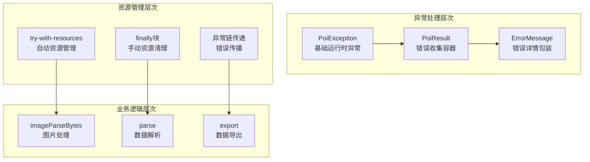
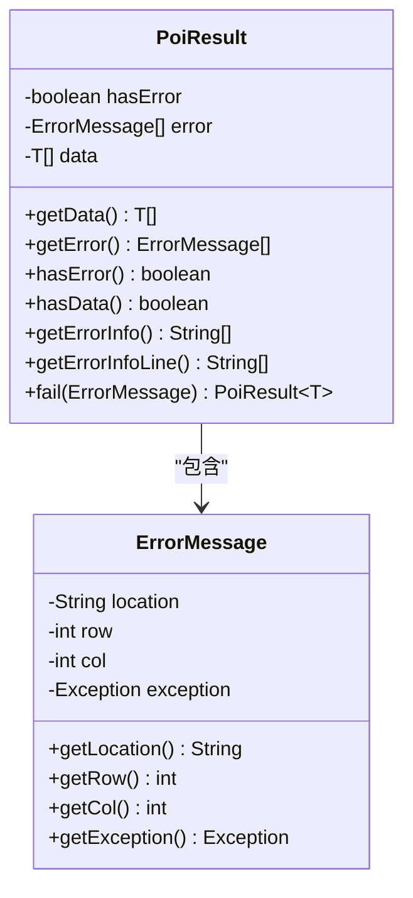
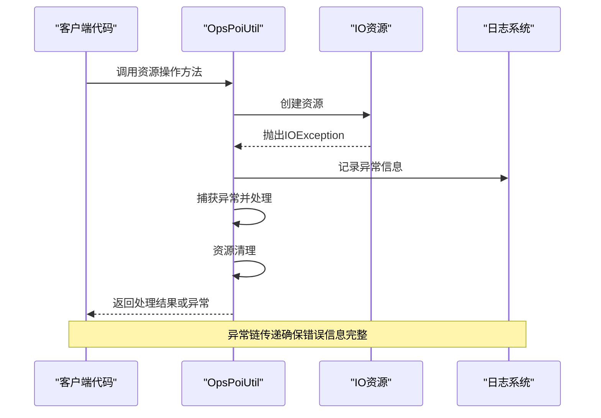
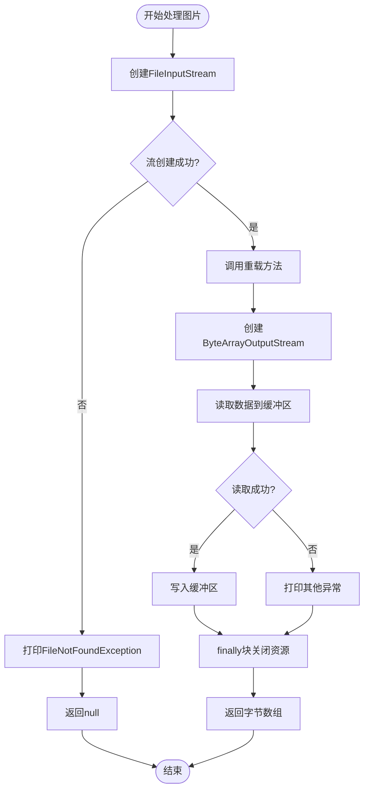
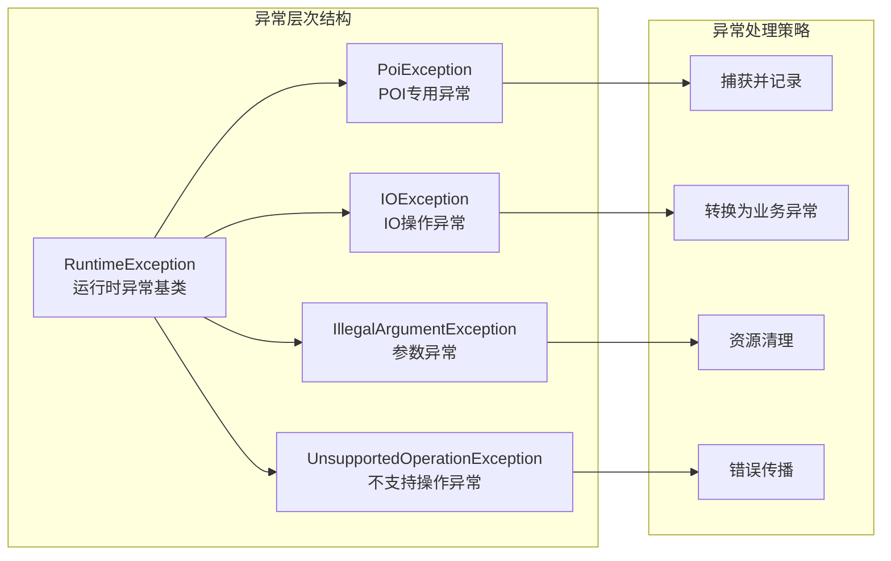
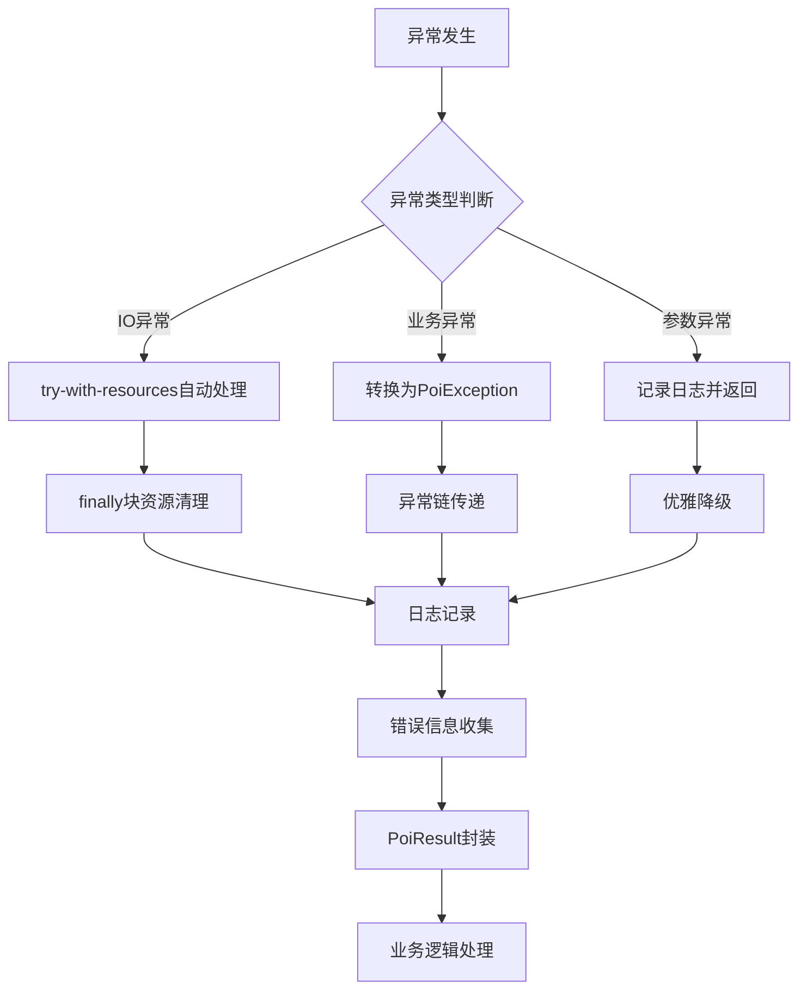

# 异常处理与资源管理

<cite>
**本文档引用的文件**
- [PoiException.java](file://src/main/java/com/github/stupdit1t/excel/common/PoiException.java)
- [PoiResult.java](file://src/main/java/com/github/stupdit1t/excel/common/PoiResult.java)
- [ExportClass.java](file://src/test/java/excel/export/ExportClass.java)
- [ParseBeanTest.java](file://src/test/java/excel/parse/ParseBeanTest.java)
- [OpsPoiUtil.java](file://src/main/java/com/github/stupdit1t/excel/core/OpsPoiUtil.java)
- [OpsSheet.java](file://src/main/java/com/github/stupdit1t/excel/core/export/OpsSheet.java)
</cite>

## 目录
1. [简介](#简介)
2. [项目结构概览](#项目结构概览)
3. [核心异常处理架构](#核心异常处理架构)
4. [资源管理最佳实践](#资源管理最佳实践)
5. [详细组件分析](#详细组件分析)
6. [异常处理模式总结](#异常处理模式总结)
7. [性能考虑](#性能考虑)
8. [故障排除指南](#故障排除指南)
9. [结论](#结论)

## 简介

本文档深入分析了POI Excel库中的异常处理模式和IO资源管理最佳实践。通过对`imageParseBytes`方法的异常处理、`PoiException`的分层设计以及`PoiResult`结果对象的错误收集机制进行详细研究，揭示了该库如何确保Excel操作的健壮性和可靠性。

该库采用了多层次的异常处理策略，包括运行时异常封装、错误信息收集、资源自动管理和异常链传递等关键技术，为复杂的Excel操作提供了完善的错误处理保障。

## 项目结构概览



**图表来源**
- [PoiException.java](file://src/main/java/com/github/stupdit1t/excel/common/PoiException.java#L1-L20)
- [PoiResult.java](file://src/main/java/com/github/stupdit1t/excel/common/PoiResult.java#L1-L159)

## 核心异常处理架构

### PoiException基础异常类

`PoiException`是一个简洁而强大的基础异常类，继承自`RuntimeException`，提供了统一的异常处理入口：

```java
public class PoiException extends RuntimeException {
    public PoiException(String message) {
        super(message);
    }
    
    public static PoiException error(String message) {
        return new PoiException(message);
    }
}
```

这种设计体现了以下优势：
- **简洁性**：最小化的异常类设计，避免过度复杂化
- **工厂方法**：提供静态工厂方法简化异常创建
- **继承关系**：继承RuntimeException实现非检查型异常
- **消息封装**：直接封装错误消息，便于快速定位问题

### PoiResult错误收集机制

`PoiResult`类实现了完整的错误收集和反馈机制：



**图表来源**
- [PoiResult.java](file://src/main/java/com/github/stupdit1t/excel/common/PoiResult.java#L15-L159)

**章节来源**
- [PoiException.java](file://src/main/java/com/github/stupdit1t/excel/common/PoiException.java#L1-L20)
- [PoiResult.java](file://src/main/java/com/github/stupdit1t/excel/common/PoiResult.java#L1-L159)

## 资源管理最佳实践

### Try-With-Resources模式的应用

在`OpsPoiUtil`类中，广泛采用了Java 7引入的try-with-resources语法来确保资源的自动关闭：

```java
// 文件导出示例
public static void export(Workbook workbook, String outPath, String password) {
    try (
            Workbook wb = workbook;
            OutputStream out = new FileOutputStream(outPath)
    ) {
        export(wb, out, password);
    } catch (IOException e) {
        LOG.error(e);
    }
}

// 文件读取示例
public static void export(Workbook workbook, OutputStream outputStream, String password) {
    try (
            Workbook wb = workbook;
            OutputStream out = outputStream
    ) {
        // 加密处理
        if (StringUtils.isNotBlank(password)) {
            if (wb instanceof HSSFWorkbook) {
                encryptWorkbook03(workbook, password);
            } else {
                // 其他版本excel加密
                EncryptionInfo info = new EncryptionInfo(EncryptionMode.standard);
                Encryptor enc = info.getEncryptor();
                enc.confirmPassword(password);
                POIFSFileSystem poifsFileSystem = new POIFSFileSystem();
                try {
                    OutputStream encOutStream = enc.getDataStream(poifsFileSystem);
                    wb.write(encOutStream);
                    encOutStream.close();
                    poifsFileSystem.writeFilesystem(out);
                    poifsFileSystem.close();
                    return;
                } catch (GeneralSecurityException e) {
                    LOG.error(e);
                }
            }
        }
        wb.write(out);
        if (wb instanceof SXSSFWorkbook) {
            // 清理临时文件
            ((SXSSFWorkbook) wb).dispose();
        }
    } catch (IOException e) {
        LOG.error(e);
    }
}
```

### Finally块资源释放模式

对于无法使用try-with-resources的情况，采用finally块确保资源释放：

```java
public byte[] imageParseBytes(InputStream fis) {
    byte[] buffer = null;
    ByteArrayOutputStream bos = null;
    try {
        bos = new ByteArrayOutputStream(1024);
        byte[] b = new byte[1024];
        int n;
        while ((n = fis.read(b)) != -1) {
            bos.write(b, 0, n);
        }
        buffer = bos.toByteArray();
    } catch (Exception e) {
        e.printStackTrace();
    } finally {
        try {
            fis.close();
            bos.close();
        } catch (IOException e) {
            e.printStackTrace();
        }
    }
    return buffer;
}
```

### 异常链传递机制

在资源管理过程中，异常链传递确保了错误信息的完整传递：



**图表来源**
- [OpsPoiUtil.java](file://src/main/java/com/github/stupdit1t/excel/core/OpsPoiUtil.java#L170-L220)
- [ExportClass.java](file://src/test/java/excel/export/ExportClass.java#L446-L469)

**章节来源**
- [OpsPoiUtil.java](file://src/main/java/com/github/stupdit1t/excel/core/OpsPoiUtil.java#L170-L220)
- [ExportClass.java](file://src/test/java/excel/export/ExportClass.java#L446-L469)

## 详细组件分析

### imageParseBytes方法的异常处理

`imageParseBytes`方法展示了典型的IO资源管理模式：



**图表来源**
- [ExportClass.java](file://src/test/java/excel/export/ExportClass.java#L446-L469)

该方法体现了以下关键实践：
- **双重异常处理**：分别处理`FileNotFoundException`和其他IO异常
- **资源安全关闭**：使用finally块确保所有资源都被正确关闭
- **优雅降级**：在异常情况下返回null而不是抛出异常
- **日志记录**：通过`printStackTrace()`记录异常信息

### ParseBeanTest中的错误处理模式

`ParseBeanTest`展示了如何在业务逻辑中集成错误处理：

```java
@Test
public void parseBean1() {
    name.set("自动映射列");
    PoiResult<ProjectEvaluate> parse = ExcelHelper.opsParse(ProjectEvaluate.class)
            .from("src/test/java/excel/parse/excel/simpleExport.xlsx")
            .opsSheet(0, 1, 1)
            .opsColumn(true).done()
            .parse();
    if (parse.hasError()) {
        // 输出验证不通过的信息
        System.out.println(parse.getErrorInfoString());
    }
    // 打印解析的数据
    System.out.println("数据行数:" + parse.getData().size());
    parse.getData().forEach(System.out::println);
}
```

这种模式的优势：
- **早期检测**：通过`hasError()`方法尽早发现错误
- **分级处理**：根据错误严重程度采取不同处理策略
- **信息丰富**：提供详细的错误信息用于调试
- **业务分离**：将错误处理与业务逻辑清晰分离

### 多层次异常分类



**图表来源**
- [PoiException.java](file://src/main/java/com/github/stupdit1t/excel/common/PoiException.java#L1-L20)
- [OpsPoiUtil.java](file://src/main/java/com/github/stupdit1t/excel/core/OpsPoiUtil.java#L673-L761)

**章节来源**
- [ExportClass.java](file://src/test/java/excel/export/ExportClass.java#L446-L469)
- [ParseBeanTest.java](file://src/test/java/excel/parse/ParseBeanTest.java#L25-L50)

## 异常处理模式总结

### 分层设计原则

该库采用了清晰的分层异常处理设计：

1. **基础设施层**：`PoiException`作为基础异常类
2. **工具层**：`OpsPoiUtil`中的具体异常处理逻辑
3. **业务层**：`PoiResult`提供的错误收集和反馈机制
4. **应用层**：具体的业务逻辑异常处理

### 异常处理最佳实践



### 关键技术要点

1. **try-with-resources**：优先使用自动资源管理
2. **finally块**：作为最后的资源清理保障
3. **异常链传递**：保持原始异常的堆栈信息
4. **错误收集**：使用`PoiResult`统一收集错误信息
5. **日志记录**：通过`LOG.error()`记录异常信息
6. **优雅降级**：在异常情况下提供合理的默认行为

**章节来源**
- [OpsPoiUtil.java](file://src/main/java/com/github/stupdit1t/excel/core/OpsPoiUtil.java#L170-L220)
- [PoiResult.java](file://src/main/java/com/github/stupdit1t/excel/common/PoiResult.java#L1-L159)

## 性能考虑

### 资源管理性能优化

1. **及时释放**：使用try-with-resources确保资源及时释放
2. **内存管理**：对于大文件操作，合理控制内存使用
3. **连接池**：在批量操作中考虑连接池的使用
4. **缓存策略**：对频繁使用的资源实施缓存机制

### 异常处理性能影响

1. **异常开销**：异常处理本身存在性能开销，应避免过度使用
2. **错误收集成本**：`PoiResult`的错误收集机制需要权衡准确性和性能
3. **日志记录**：异步日志记录可以减少异常处理的性能影响

## 故障排除指南

### 常见异常场景

1. **FileNotFoundException**
   - 检查文件路径是否正确
   - 验证文件权限设置
   - 确认文件是否存在

2. **IOException**
   - 检查磁盘空间是否充足
   - 验证文件系统状态
   - 确认网络连接（如果是网络文件）

3. **PoiException**
   - 查看具体的错误消息
   - 检查Excel文件格式是否正确
   - 验证数据类型转换是否合法

### 调试技巧

1. **启用详细日志**：配置日志级别为DEBUG或TRACE
2. **异常堆栈跟踪**：使用`printStackTrace()`获取完整堆栈信息
3. **资源状态检查**：定期检查资源的打开和关闭状态
4. **内存监控**：监控内存使用情况，避免内存泄漏

**章节来源**
- [OpsPoiUtil.java](file://src/main/java/com/github/stupdit1t/excel/core/OpsPoiUtil.java#L170-L220)
- [ExportClass.java](file://src/test/java/excel/export/ExportClass.java#L446-L469)

## 结论

通过对POI Excel库的深入分析，我们可以看到该库在异常处理和资源管理方面采用了多层次、全方位的设计策略。从简单的`PoiException`基础类到复杂的`PoiResult`错误收集机制，再到try-with-resources和finally块的资源管理，每一层都承担着特定的责任，共同构成了一个健壮可靠的Excel操作框架。

### 主要收获

1. **异常处理的层次化**：从基础异常类到业务异常处理的完整链条
2. **资源管理的最佳实践**：try-with-resources和finally块的合理运用
3. **错误收集的完整性**：`PoiResult`提供了丰富的错误信息收集能力
4. **异常链传递的完整性**：保持原始异常信息的同时提供业务语义

### 实践建议

1. **优先使用try-with-resources**：在可能的情况下优先使用自动资源管理
2. **合理使用异常**：避免过度使用异常，将其作为真正的异常情况处理
3. **完善错误收集**：使用类似`PoiResult`的机制收集和处理错误信息
4. **注重资源清理**：确保所有资源都能得到正确的清理
5. **保持异常链**：在转换异常时保持原始异常的堆栈信息

这些实践不仅适用于Excel操作，也为其他IO密集型应用程序的异常处理和资源管理提供了宝贵的参考。