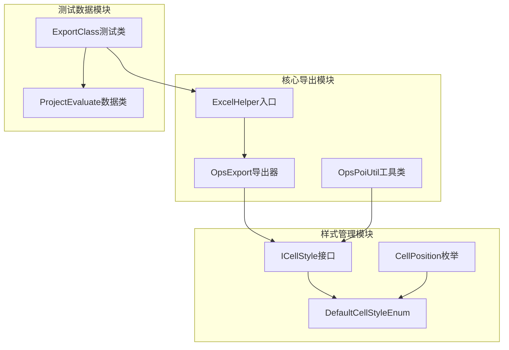
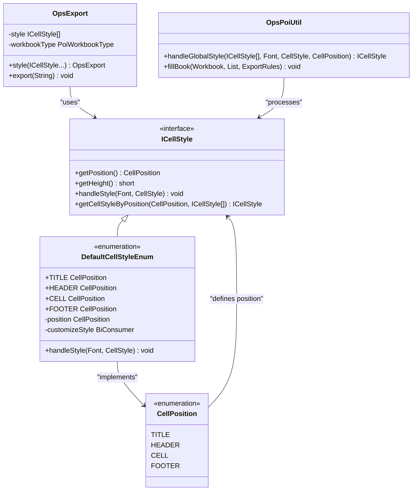
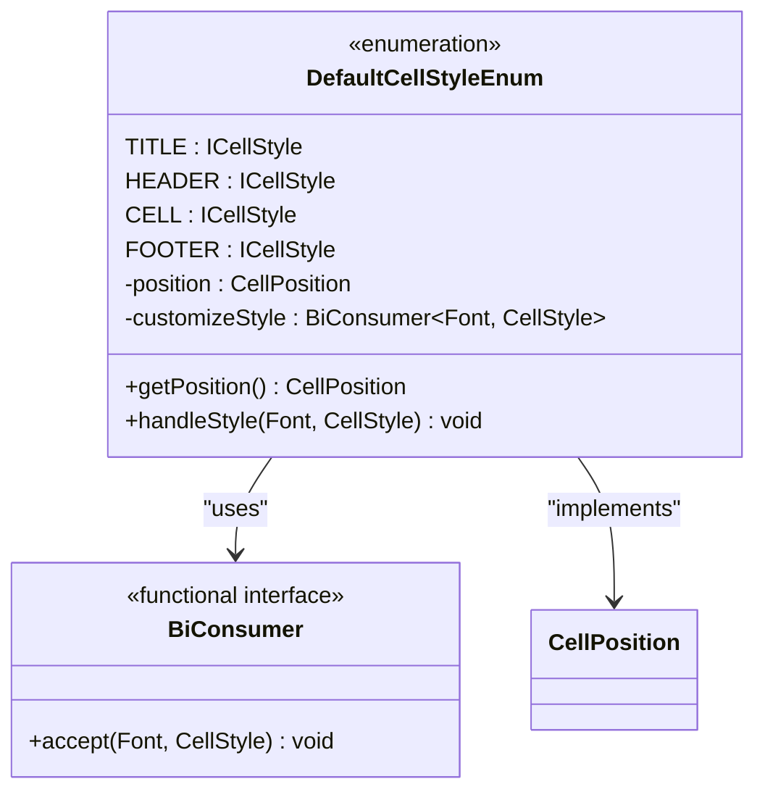
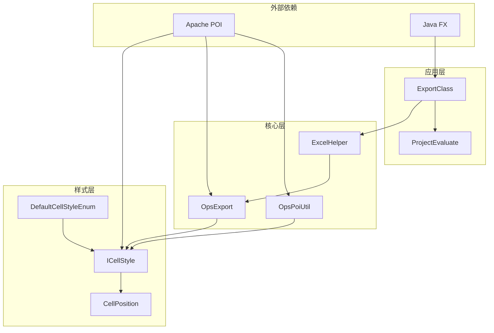

# 样式管理与ICellStyle实现

<cite>
**本文档引用的文件**
- [ICellStyle.java](file://src/main/java/com/github/stupdit1t/excel/style/ICellStyle.java)
- [CellPosition.java](file://src/main/java/com/github/stupdit1t/excel/style/CellPosition.java)
- [DefaultCellStyleEnum.java](file://src/main/java/com/github/stupdit1t/excel/style/DefaultCellStyleEnum.java)
- [ExportClass.java](file://src/test/java/excel/export/ExportClass.java)
- [OpsExport.java](file://src/main/java/com/github/stupdit1t/excel/core/export/OpsExport.java)
- [OpsPoiUtil.java](file://src/main/java/com/github/stupdit1t/excel/core/OpsPoiUtil.java)
- [ExcelHelper.java](file://src/main/java/com/github/stupdit1t/excel/core/ExcelHelper.java)
- [ProjectEvaluate.java](file://src/test/java/excel/export/data/ProjectEvaluate.java)
</cite>

## 目录
1. [简介](#简介)
2. [项目结构概览](#项目结构概览)
3. [核心组件分析](#核心组件分析)
4. [架构概览](#架构概览)
5. [详细组件分析](#详细组件分析)
6. [依赖关系分析](#依赖关系分析)
7. [性能考虑](#性能考虑)
8. [故障排除指南](#故障排除指南)
9. [结论](#结论)

## 简介

本项目是一个基于Apache POI的Excel操作库，提供了完整的样式管理系统。通过ICellStyle接口和CellPosition枚举，实现了可复用的样式类设计，支持从简单字体设置到复杂条件样式的完整解决方案。

该系统的核心设计理念是通过统一的接口管理全局样式，避免重复定义，同时提供灵活的扩展机制。通过实现ICellStyle接口，开发者可以轻松创建自定义样式，并通过ExcelHelper.style()方法实现全局样式注入。

## 项目结构概览

项目采用模块化设计，主要分为以下几个核心模块：



**图表来源**
- [ICellStyle.java](file://src/main/java/com/github/stupdit1t/excel/style/ICellStyle.java#L1-L57)
- [OpsExport.java](file://src/main/java/com/github/stupdit1t/excel/core/export/OpsExport.java#L1-L200)
- [ExcelHelper.java](file://src/main/java/com/github/stupdit1t/excel/core/ExcelHelper.java#L1-L54)

**章节来源**
- [ICellStyle.java](file://src/main/java/com/github/stupdit1t/excel/style/ICellStyle.java#L1-L57)
- [CellPosition.java](file://src/main/java/com/github/stupdit1t/excel/style/CellPosition.java#L1-L29)
- [DefaultCellStyleEnum.java](file://src/main/java/com/github/stupdit1t/excel/style/DefaultCellStyleEnum.java#L1-L114)

## 核心组件分析

### ICellStyle接口设计

ICellStyle接口是整个样式系统的核心，定义了单元格样式的标准规范：

```java
public interface ICellStyle {
    CellPosition getPosition();
    default short getHeight() { return -1; }
    void handleStyle(Font font, CellStyle cellStyle);
    
    static ICellStyle getCellStyleByPosition(CellPosition position, ICellStyle[] cellStyles) {
        // 实现样式查找逻辑
    }
}
```

该接口提供了三个关键功能：
- **位置标识**：通过getPosition()方法标识样式所属的位置
- **高度控制**：通过getHeight()方法控制行高，默认值为-1表示不干预
- **样式处理**：通过handleStyle()方法实现具体的样式设置逻辑

### CellPosition枚举体系

CellPosition枚举定义了四种基本样式位置：

```java
public enum CellPosition {
    TITLE,    // 大标题
    HEADER,   // 标题头部
    CELL,     // 单元格
    FOOTER    // 尾部
}
```

每种位置都有其特定的应用场景：
- **TITLE**：用于设置Excel文档的大标题样式，通常具有较大的字号和居中对齐
- **HEADER**：用于表头样式，包含边框、背景色等装饰性设置
- **CELL**：用于普通数据单元格的样式设置
- **FOOTER**：用于尾部汇总行的样式设置

**章节来源**
- [ICellStyle.java](file://src/main/java/com/github/stupdit1t/excel/style/ICellStyle.java#L8-L57)
- [CellPosition.java](file://src/main/java/com/github/stupdit1t/excel/style/CellPosition.java#L7-L28)

## 架构概览

系统采用分层架构设计，通过接口抽象和具体实现分离的方式，实现了高度的可扩展性和可维护性：



**图表来源**
- [ICellStyle.java](file://src/main/java/com/github/stupdit1t/excel/style/ICellStyle.java#L8-L57)
- [DefaultCellStyleEnum.java](file://src/main/java/com/github/stupdit1t/excel/style/DefaultCellStyleEnum.java#L12-L114)
- [OpsExport.java](file://src/main/java/com/github/stupdit1t/excel/core/export/OpsExport.java#L15-L200)

## 详细组件分析

### DefaultCellStyleEnum实现分析

DefaultCellStyleEnum是ICellStyle接口的默认实现，提供了四种预定义样式的具体实现：



**图表来源**
- [DefaultCellStyleEnum.java](file://src/main/java/com/github/stupdit1t/excel/style/DefaultCellStyleEnum.java#L12-L114)

#### 标题样式(TITLE)实现

```java
TITLE(CellPosition.TITLE, (font, style) -> {
    font.setFontHeightInPoints((short) 15);
    font.setBold(true);
    style.setAlignment(HorizontalAlignment.CENTER);
    style.setVerticalAlignment(VerticalAlignment.CENTER);
    style.setFont(font);
});
```

#### 表头样式(HEADER)实现

```java
HEADER(CellPosition.HEADER, (font, style) -> {
    font.setFontName("Arial");
    font.setBold(true);
    font.setFontHeightInPoints((short) 10);
    font.setColor(IndexedColors.WHITE.getIndex());
    // 设置边框和背景色
    style.setBorderRight(BorderStyle.THIN);
    style.setFillForegroundColor(IndexedColors.GREY_50_PERCENT.getIndex());
    style.setFillPattern(FillPatternType.SOLID_FOREGROUND);
    style.setFont(font);
    style.setWrapText(true);
});
```

### 全局样式注入机制

OpsExport类提供了style()方法，允许用户传入自定义样式：

```java
public OpsExport style(ICellStyle... styles) {
    this.style = styles;
    return this;
}
```

通过OpsPoiUtil的handleGlobalStyle方法，系统会根据CellPosition自动匹配相应的样式处理器：

```java
private static ICellStyle handleGlobalStyle(ICellStyle[] globalStyle, 
                                          Font font, 
                                          CellStyle cellStyle, 
                                          CellPosition cellPosition) {
    ICellStyle titleStyle = ICellStyle.getCellStyleByPosition(cellPosition, globalStyle);
    cellStyle.setFont(font);
    titleStyle.handleStyle(font, cellStyle);
    return titleStyle;
}
```

### 动态条件样式实现

ExportClass中的simpleExport2()方法展示了如何实现动态条件样式：

```java
// 条件样式示例：根据单元格值动态改变背景色
.field("city").map((val, row, style, rowIndex) -> {
    if (val.equals("北京")) {
        style.setBackColor(IndexedColors.YELLOW);
        style.setHeight(900);
        style.setComment("北京搞红色");
        int index = rowIndex + 1;
        return "=J" + index + "+K" + index;
    }
    return val;
})
```

这种实现方式允许：
- **运行时条件判断**：根据单元格值动态调整样式
- **复合样式设置**：同时设置背景色、高度、批注等多个属性
- **公式计算**：支持返回公式表达式进行动态计算

**章节来源**
- [DefaultCellStyleEnum.java](file://src/main/java/com/github/stupdit1t/excel/style/DefaultCellStyleEnum.java#L17-L114)
- [OpsExport.java](file://src/main/java/com/github/stupdit1t/excel/core/export/OpsExport.java#L130-L140)
- [OpsPoiUtil.java](file://src/main/java/com/github/stupdit1t/excel/core/OpsPoiUtil.java#L940-L945)
- [ExportClass.java](file://src/test/java/excel/export/ExportClass.java#L150-L180)

## 依赖关系分析

系统的依赖关系呈现清晰的层次结构：



**图表来源**
- [ICellStyle.java](file://src/main/java/com/github/stupdit1t/excel/style/ICellStyle.java#L1-L5)
- [OpsExport.java](file://src/main/java/com/github/stupdit1t/excel/core/export/OpsExport.java#L1-L15)
- [ExcelHelper.java](file://src/main/java/com/github/stupdit1t/excel/core/ExcelHelper.java#L1-L10)

**章节来源**
- [ICellStyle.java](file://src/main/java/com/github/stupdit1t/excel/style/ICellStyle.java#L1-L57)
- [OpsExport.java](file://src/main/java/com/github/stupdit1t/excel/core/export/OpsExport.java#L1-L200)
- [OpsPoiUtil.java](file://src/main/java/com/github/stupdit1t/excel/core/OpsPoiUtil.java#L940-L945)

## 性能考虑

### 样式缓存机制

系统通过cacheStyle和cacheFont两个Map实现样式缓存：

```java
// 存储单元格样式信息，防止重复生成
Map<String, CellStyle> cacheStyle = new HashMap<>();
// 存储单元格字体信息，防止重复生成
Map<String, Font> cacheFont = new HashMap<>();
```

这种设计的优势：
- **减少内存占用**：避免重复创建相同的样式对象
- **提高渲染速度**：直接从缓存获取已存在的样式
- **降低GC压力**：减少临时对象的创建

### 并行处理优化

对于大数据量导出，系统支持并行处理：

```java
public OpsExport parallelSheet() {
    this.parallelSheet = true;
    return this;
}
```

并行处理的优势：
- **提升处理效率**：利用多核CPU优势
- **改善用户体验**：减少等待时间
- **资源合理分配**：避免单一线程阻塞

## 故障排除指南

### 常见问题及解决方案

#### 1. 样式未生效问题

**问题描述**：自定义样式没有正确应用到Excel单元格中

**可能原因**：
- 样式位置配置错误
- handleStyle方法实现不完整
- 样式被后续操作覆盖

**解决方案**：
```java
// 确保正确实现handleStyle方法
@Override
public void handleStyle(Font font, CellStyle cellStyle) {
    // 设置字体属性
    font.setFontHeightInPoints((short) 12);
    font.setBold(true);
    
    // 设置单元格样式
    cellStyle.setAlignment(HorizontalAlignment.CENTER);
    cellStyle.setVerticalAlignment(VerticalAlignment.CENTER);
    
    // 必须设置字体到样式
    cellStyle.setFont(font);
}
```

#### 2. 样式冲突问题

**问题描述**：多个样式同时作用导致显示异常

**解决方案**：
- 使用明确的CellPosition区分不同样式
- 在handleStyle方法中优先设置关键属性
- 避免在样式中设置相互矛盾的属性

#### 3. 性能问题

**问题描述**：大量数据导出时性能下降

**解决方案**：
- 启用样式缓存机制
- 减少不必要的样式重复创建
- 使用并行处理大数据集

**章节来源**
- [OpsPoiUtil.java](file://src/main/java/com/github/stupdit1t/excel/core/OpsPoiUtil.java#L280-L300)
- [OpsExport.java](file://src/main/java/com/github/stupdit1t/excel/core/export/OpsExport.java#L145-L150)

## 结论

本项目通过ICellStyle接口和CellPosition枚举的设计，成功实现了可复用的样式管理系统。该系统具有以下特点：

### 主要优势

1. **统一接口设计**：通过ICellStyle接口统一管理所有样式，避免重复定义
2. **灵活扩展机制**：支持自定义样式实现，满足各种业务需求
3. **性能优化**：通过缓存机制和并行处理提升性能
4. **易于使用**：简洁的API设计，降低使用门槛

### 应用场景

- **企业报表导出**：标准化报表样式，提升专业度
- **数据分析报告**：动态条件样式，突出关键数据
- **多语言支持**：统一的样式管理，便于国际化
- **大数据处理**：高效的样式处理，支持海量数据导出

### 最佳实践建议

1. **合理使用预设样式**：充分利用DefaultCellStyleEnum提供的基础样式
2. **自定义样式封装**：将常用样式封装成独立类，提高复用性
3. **性能监控**：关注大数据量场景下的性能表现
4. **样式测试**：建立完善的样式测试机制，确保样式一致性

通过这套完整的样式管理系统，开发者可以轻松实现复杂的Excel样式需求，同时保持代码的可维护性和性能的最优性。