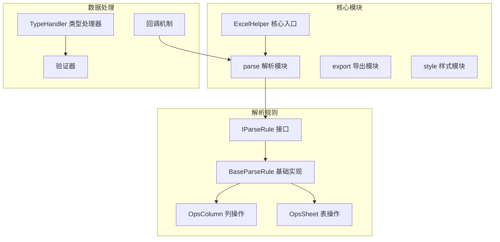
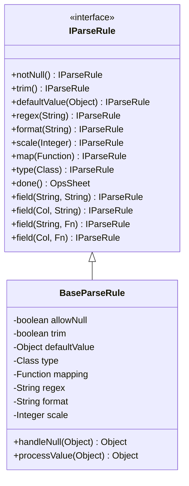
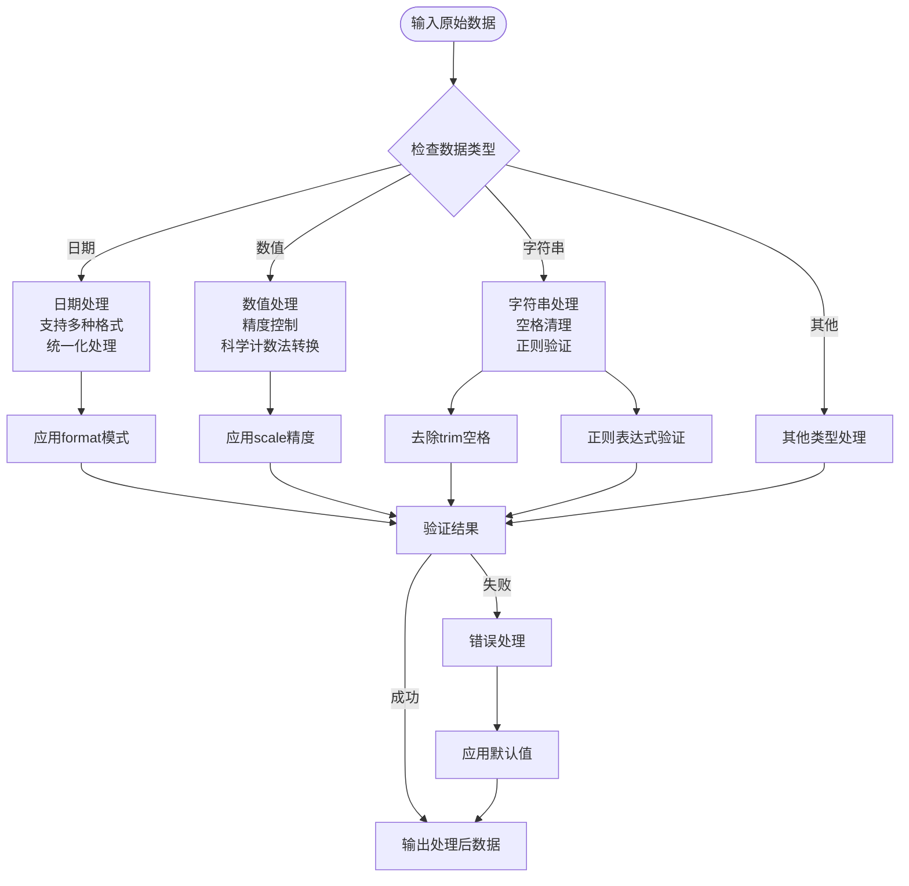
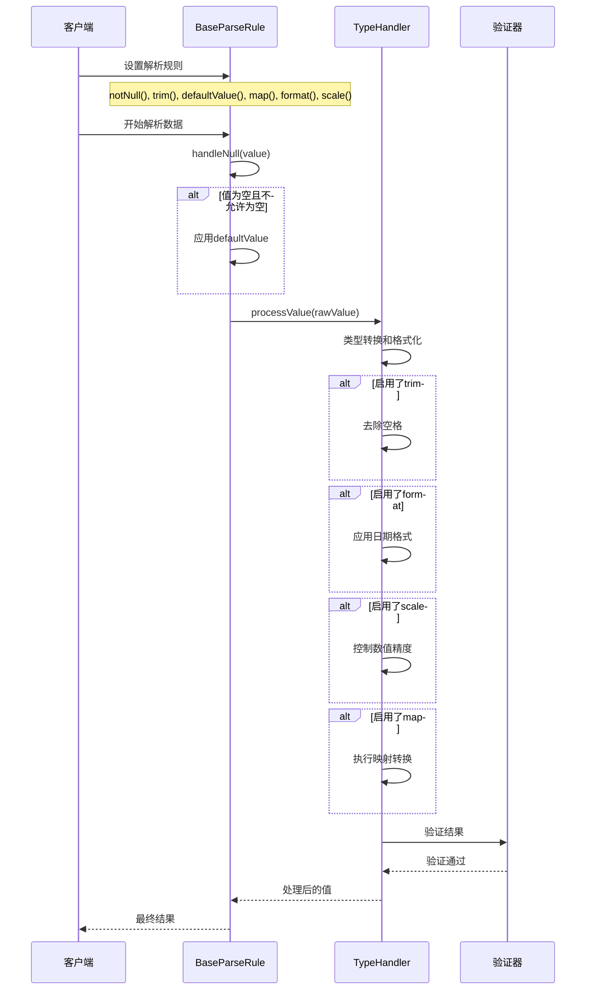
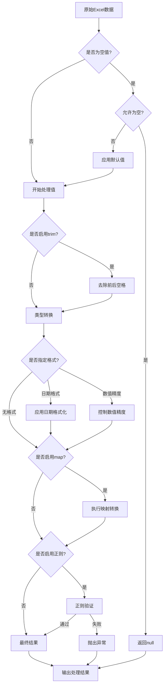

# 数据处理问题

<cite>
**本文档引用的文件**
- [ParseBeanTest.java](file://src/test/java/excel/parse/ParseBeanTest.java)
- [ParseMapTest.java](file://src/test/java/excel/parse/ParseMapTest.java)
- [ProjectEvaluate.java](file://src/test/java/excel/parse/data/ProjectEvaluate.java)
- [BaseParseRule.java](file://src/main/java/com/github/stupdit1t/excel/core/parse/BaseParseRule.java)
- [IParseRule.java](file://src/main/java/com/github/stupdit1t/excel/core/parse/IParseRule.java)
- [TypeHandler.java](file://src/main/java/com/github/stupdit1t/excel/common/TypeHandler.java)
</cite>

## 目录
1. [简介](#简介)
2. [项目结构概览](#项目结构概览)
3. [核心数据处理组件](#核心数据处理组件)
4. [常见数据处理问题及解决方案](#常见数据处理问题及解决方案)
5. [详细组件分析](#详细组件分析)
6. [性能考虑](#性能考虑)
7. [故障排除指南](#故障排除指南)
8. [结论](#结论)

## 简介

POI Excel是一个基于Apache POI开发的Excel操作框架，专门用于处理Excel数据导入过程中的各种数据质量问题。本文档系统性地整理了在Excel数据导入过程中常见的数据处理问题及其解决方案，重点关注以下五个核心问题：

1. **日期格式解析错误**：如2023/1/1被识别为日期但格式化失败
2. **数值精度丢失问题**：浮点数运算导致的小数位数不准确
3. **空值与默认值处理**：缺失值的校验和填充机制
4. **字符串前后空格干扰**：文本数据中的多余空白字符
5. **枚举或字典值映射问题**：复杂数据类型的转换处理

## 项目结构概览



**图表来源**
- [ExcelHelper.java](file://src/main/java/com/github/stupdit1t/excel/core/ExcelHelper.java)
- [IParseRule.java](file://src/main/java/com/github/stupdit1t/excel/core/parse/IParseRule.java)
- [BaseParseRule.java](file://src/main/java/com/github/stupdit1t/excel/core/parse/BaseParseRule.java)

## 核心数据处理组件

### IParseRule 接口设计

IParseRule接口定义了所有数据处理规则的核心方法，提供了完整的数据清洗和转换能力：



**图表来源**
- [IParseRule.java](file://src/main/java/com/github/stupdit1t/excel/core/parse/IParseRule.java#L1-L82)
- [BaseParseRule.java](file://src/main/java/com/github/stupdit1t/excel/core/parse/BaseParseRule.java#L1-L182)

### TypeHandler 类型处理器

TypeHandler负责各种数据类型的转换和格式化，是数据处理的核心引擎：



**图表来源**
- [TypeHandler.java](file://src/main/java/com/github/stupdit1t/excel/common/TypeHandler.java#L60-L154)

**章节来源**
- [IParseRule.java](file://src/main/java/com/github/stupdit1t/excel/core/parse/IParseRule.java#L1-L82)
- [BaseParseRule.java](file://src/main/java/com/github/stupdit1t/excel/core/parse/BaseParseRule.java#L1-L182)
- [TypeHandler.java](file://src/main/java/com/github/stupdit1t/excel/common/TypeHandler.java#L60-L154)

## 常见数据处理问题及解决方案

### 1. 日期格式解析错误

**问题描述**：
Excel中的日期格式可能不一致，如"2023/1/1"、"2023-1-1"、"2023年1月1日"等不同格式，直接解析可能导致格式化失败或数据错误。

**解决方案**：
使用`format()`方法统一日期格式，确保所有日期数据按照指定模式解析。

```java
// 示例：统一日期格式为 yyyy-MM-dd
.field(Col.C, "createTime")
.format("yyyy-MM-dd")
```

**测试场景**：
```java
@Test
public void parseBeanWithDateFormat() {
    PoiResult<ProjectEvaluate> parse = ExcelHelper.opsParse(ProjectEvaluate.class)
            .from("data.xlsx")
            .opsSheet(0, 1, 1)
            .opsColumn()
            .field(Col.C, "createTime")
            .format("yyyy-MM-dd")  // 统一日期格式
            .done()
            .parse();
}
```

**章节来源**
- [ParseBeanTest.java](file://src/test/java/excel/parse/ParseBeanTest.java#L1-L140)
- [TypeHandler.java](file://src/main/java/com/github/stupdit1t/excel/common/TypeHandler.java#L60-L92)

### 2. 数值精度丢失问题

**问题描述**：
Excel中的数值可能包含科学计数法表示（如1.23E+08），或者小数位数过多，导致精度丢失或计算错误。

**解决方案**：
使用`scale()`方法控制数值精度，确保数值按照指定的小数位数进行处理。

```java
// 示例：保留两位小数
.field(Col.H, "score")
.type(double.class)
.scale(2)
```

**测试场景**：
```java
@Test
public void parseBeanWithNumericPrecision() {
    PoiResult<ProjectEvaluate> parse = ExcelHelper.opsParse(ProjectEvaluate.class)
            .from("data.xlsx")
            .opsSheet(0, 1, 1)
            .opsColumn()
            .field(Col.H, "score")
            .type(double.class)
            .scale(2)  // 保留两位小数
            .done()
            .parse();
}
```

**章节来源**
- [ParseBeanTest.java](file://src/test/java/excel/parse/ParseBeanTest.java#L45-L55)
- [TypeHandler.java](file://src/main/java/com/github/stupdit1t/excel/common/TypeHandler.java#L75-L90)

### 3. 空值与默认值处理

**问题描述**：
Excel数据中可能存在空值，需要进行适当的校验和填充，避免程序运行时出现空指针异常。

**解决方案**：
结合使用`notNull()`和`defaultValue()`方法，确保数据完整性。

```java
// 示例：设置默认值并校验非空
.field(Col.A, "projectName")
.trim()
.notNull()
.defaultValue("未知项目")
```

**测试场景**：
```java
@Test
public void parseBeanWithNullHandling() {
    PoiResult<ProjectEvaluate> parse = ExcelHelper.opsParse(ProjectEvaluate.class)
            .from("data.xlsx")
            .opsSheet(0, 1, 1)
            .opsColumn()
            .field(Col.A, "projectName")
            .trim()
            .notNull()
            .defaultValue("默认项目名称")
            .done()
            .parse();
}
```

**章节来源**
- [ParseBeanTest.java](file://src/test/java/excel/parse/ParseBeanTest.java#L85-L105)
- [BaseParseRule.java](file://src/main/java/com/github/stupdit1t/excel/core/parse/BaseParseRule.java#L63-L128)

### 4. 字符串前后空格干扰

**问题描述**：
Excel单元格中的文本可能包含多余的前导或尾随空格，影响数据的一致性和准确性。

**解决方案**：
使用`trim()`方法自动清理字符串两端的空白字符。

```java
// 示例：自动清理空格
.field(Col.A, "projectName")
.trim()
```

**测试场景**：
```java
@Test
public void parseBeanWithTrimHandling() {
    PoiResult<ProjectEvaluate> parse = ExcelHelper.opsParse(ProjectEvaluate.class)
            .from("data.xlsx")
            .opsSheet(0, 1, 1)
            .opsColumn()
            .field(Col.A, "projectName")
            .trim()  // 清理前后空格
            .done()
            .parse();
}
```

**章节来源**
- [ParseBeanTest.java](file://src/test/java/excel/parse/ParseBeanTest.java#L85-L105)
- [TypeHandler.java](file://src/main/java/com/github/stupdit1t/excel/common/TypeHandler.java#L130-L154)

### 5. 枚举或字典值映射问题

**问题描述**：
Excel中的数据可能是文本形式的枚举值或字典键，需要转换为对应的数值或对象。

**解决方案**：
使用`map()`方法实现自定义的键值转换逻辑。

```java
// 示例：城市名称到城市ID的映射
Map<String, Integer> cityMapping = new HashMap<>();
cityMapping.put("西安", 1);
cityMapping.put("北京", 2);

.field(Col.E, "cityKey")
.notNull()
.map(cityMapping::get)
```

**测试场景**：
```java
@Test
public void parseBeanWithEnumMapping() {
    Map<String, Integer> cityMapping = new HashMap<>();
    cityMapping.put("西安", 1);
    cityMapping.put("北京", 2);
    
    PoiResult<ProjectEvaluate> parse = ExcelHelper.opsParse(ProjectEvaluate.class)
            .from("data.xlsx")
            .opsSheet(0, 1, 1)
            .opsColumn()
            .field(Col.E, "cityKey")
            .notNull()
            .map(cityMapping::get)  // 枚举值映射
            .done()
            .parse();
}
```

**章节来源**
- [ParseBeanTest.java](file://src/test/java/excel/parse/ParseBeanTest.java#L85-L105)
- [BaseParseRule.java](file://src/main/java/com/github/stupdit1t/excel/core/parse/BaseParseRule.java#L85-L95)

## 详细组件分析

### BaseParseRule 核心实现

BaseParseRule类是所有解析规则的基础实现，提供了完整的数据处理链：



**图表来源**
- [BaseParseRule.java](file://src/main/java/com/github/stupdit1t/excel/core/parse/BaseParseRule.java#L180-L250)
- [TypeHandler.java](file://src/main/java/com/github/stupdit1t/excel/common/TypeHandler.java#L60-L154)

### 数据处理流程详解



**图表来源**
- [BaseParseRule.java](file://src/main/java/com/github/stupdit1t/excel/core/parse/BaseParseRule.java#L180-L250)

**章节来源**
- [BaseParseRule.java](file://src/main/java/com/github/stupdit1t/excel/core/parse/BaseParseRule.java#L63-L250)

## 性能考虑

### 内存优化策略

1. **分批处理大数据集**：使用`parsePart()`方法进行内存友好的分批处理
2. **延迟加载**：只在需要时才解析特定列的数据
3. **缓存机制**：对重复的映射关系进行缓存

### 性能监控

```java
// 性能监控示例
@Before
public void before() {
    time.set(System.currentTimeMillis());
}

@After
public void after() {
    long diff = System.currentTimeMillis() - time.get();
    System.out.println("[ " + name.get() + " ] 耗时: " + diff);
}
```

## 故障排除指南

### 常见错误及解决方案

1. **日期格式错误**
   - 症状：日期解析失败或格式化异常
   - 解决：使用明确的format()方法指定日期格式

2. **数值精度问题**
   - 症状：数值计算结果不准确
   - 解决：使用scale()方法控制精度

3. **空值处理异常**
   - 症状：NullPointerException或数据缺失
   - 解决：合理使用notNull()和defaultValue()

4. **字符串处理问题**
   - 症状：数据前后有空白字符
   - 解决：使用trim()方法清理

5. **映射转换失败**
   - 症状：枚举值无法正确转换
   - 解决：检查映射关系和数据一致性

**章节来源**
- [ParseBeanTest.java](file://src/test/java/excel/parse/ParseBeanTest.java#L15-L35)

## 结论

POI Excel框架通过其灵活的解析规则系统，为Excel数据导入过程中的各种数据质量问题提供了全面的解决方案。通过合理使用`notNull()`、`trim()`、`defaultValue()`、`map()`、`format()`和`scale()`等方法，可以有效解决常见的数据处理问题，确保数据质量和系统稳定性。

关键要点总结：

1. **统一格式处理**：使用format()方法统一日期和数值格式
2. **精度控制**：通过scale()方法精确控制数值精度
3. **完整性保障**：结合notNull()和defaultValue()确保数据完整性
4. **数据清理**：使用trim()方法清理字符串数据
5. **灵活映射**：通过map()方法实现复杂的数据转换

这些解决方案不仅提高了数据处理的可靠性，也为后续的数据分析和业务处理奠定了坚实的基础。