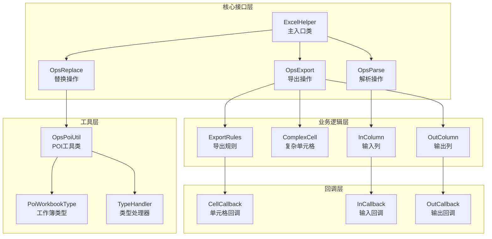
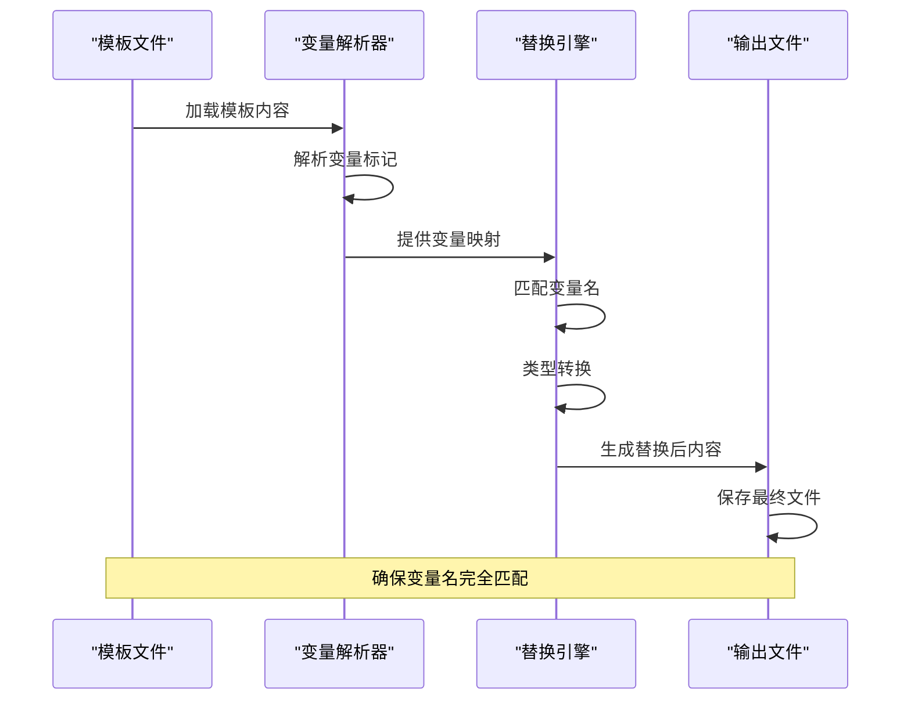
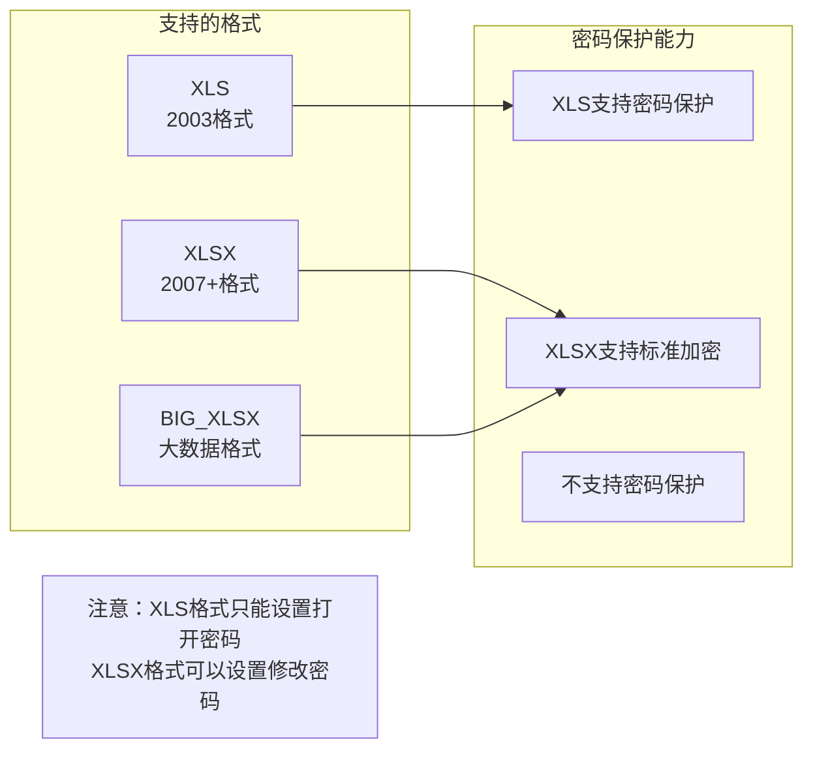
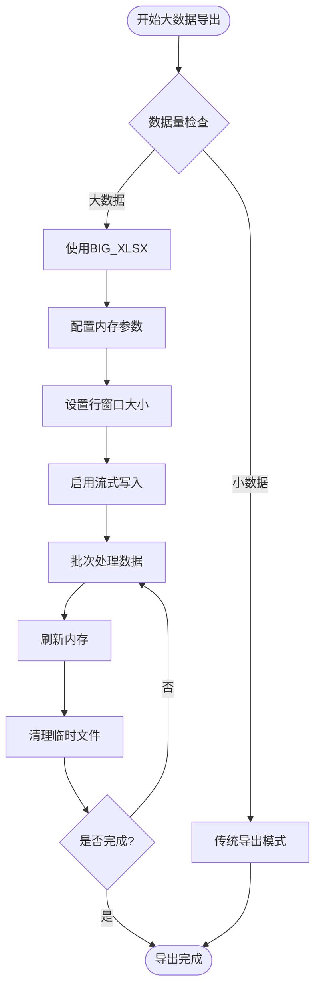
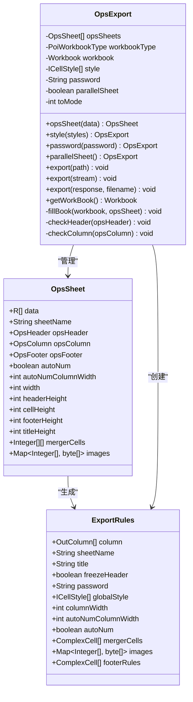
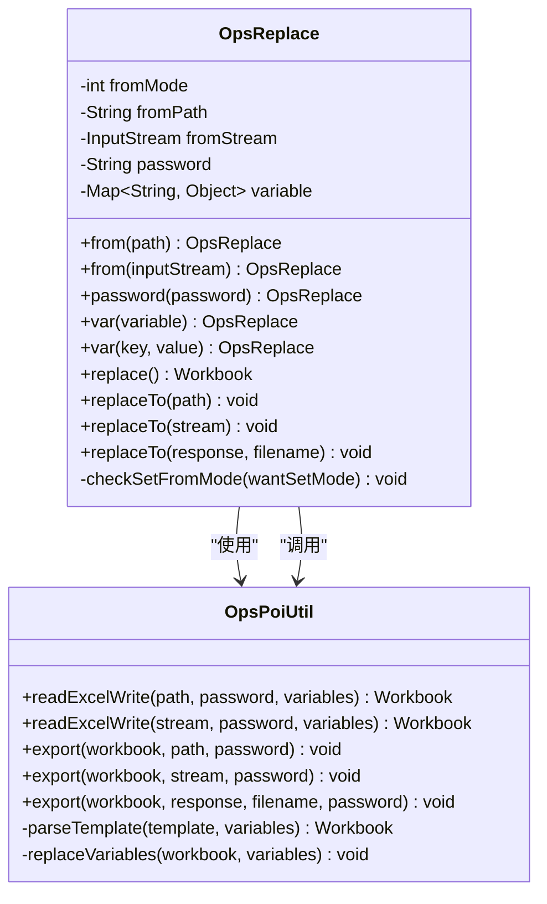

# 文件操作问题

<cite>
**本文档引用的文件**
- [ExportClass.java](file://src/test/java/excel/export/ExportClass.java)
- [ReplaceClass.java](file://src/test/java/excel/replace/ReplaceClass.java)
- [ExcelHelper.java](file://src/main/java/com/github/stupdit1t/excel/core/ExcelHelper.java)
- [OpsExport.java](file://src/main/java/com/github/stupdit1t/excel/core/export/OpsExport.java)
- [OpsReplace.java](file://src/main/java/com/github/stupdit1t/excel/core/replace/OpsReplace.java)
- [OpsPoiUtil.java](file://src/main/java/com/github/stupdit1t/excel/core/OpsPoiUtil.java)
- [PoiWorkbookType.java](file://src/main/java/com/github/stupdit1t/excel/common/PoiWorkbookType.java)
- [ProjectEvaluate.java](file://src/test/java/excel/export/data/ProjectEvaluate.java)
</cite>

## 目录
1. [简介](#简介)
2. [项目架构概览](#项目架构概览)
3. [图片插入失败问题](#图片插入失败问题)
4. [模板替换变量未生效问题](#模板替换变量未生效问题)
5. [密码保护工作簿兼容性问题](#密码保护工作簿兼容性问题)
6. [大文件导出内存溢出问题](#大文件导出内存溢出问题)
7. [详细组件分析](#详细组件分析)
8. [性能优化建议](#性能优化建议)
9. [故障排除指南](#故障排除指南)
10. [总结](#总结)

## 简介

POI Excel是一个基于Apache POI的Java Excel操作框架，提供了完整的文件读写、模板替换和大数据导出功能。本文档专门针对在使用该框架过程中可能遇到的常见文件操作问题，包括图片插入失败、模板变量替换、密码保护兼容性和大文件处理等问题，提供详细的解决方案和最佳实践。

## 项目架构概览

POI Excel采用模块化设计，主要包含以下核心组件：



**图表来源**
- [ExcelHelper.java](file://src/main/java/com/github/stupdit1t/excel/core/ExcelHelper.java#L1-L54)
- [OpsExport.java](file://src/main/java/com/github/stupdit1t/excel/core/export/OpsExport.java#L1-L50)
- [OpsReplace.java](file://src/main/java/com/github/stupdit1t/excel/core/replace/OpsReplace.java#L1-L50)

## 图片插入失败问题

### 问题描述

图片插入失败是Excel操作中最常见的问题之一，通常表现为图片无法正确显示或插入到指定位置。

### 根本原因分析

根据代码分析，图片插入失败的主要原因包括：
1. **图片路径错误**：提供的图片文件不存在或路径不正确
2. **字节流不完整**：图片数据读取不完整或损坏
3. **编码转换问题**：图片数据格式与Excel要求不符
4. **内存限制**：大图片导致内存溢出

### 解决方案

#### 1. 正确的图片转换方法

```java
// ExportClass.java 中的图片处理方法
public byte[] imageParseBytes(File file) {
    FileInputStream fileInputStream = null;
    try {
        fileInputStream = new FileInputStream(file);
    } catch (FileNotFoundException e) {
        e.printStackTrace();
    }
    return imageParseBytes(fileInputStream);
}

public byte[] imageParseBytes(InputStream fis) {
    byte[] buffer = null;
    ByteArrayOutputStream bos = null;
    try {
        bos = new ByteArrayOutputStream(1024);
        byte[] b = new byte[1024];
        int n;
        while ((n = fis.read(b)) != -1) {
            bos.write(b, 0, n);
        }
        buffer = bos.toByteArray();
    } catch (Exception e) {
        e.printStackTrace();
    } finally {
        try {
            fis.close();
            bos.close();
        } catch (IOException e) {
            e.printStackTrace();
        }
    }
    return buffer;
}
```

#### 2. 图片插入的最佳实践

```java
// 正确的图片插入流程
@Test
public void imageInsertionExample() {
    // 1. 准备图片数据
    byte[] imageData = imageParseBytes(new File("path/to/image.png"));
    
    // 2. 在导出时插入图片
    ExcelHelper.opsExport(PoiWorkbookType.XLSX)
        .opsSheet(data)
        .opsHeader().simple().texts("项目名称", "图片").done()
        .opsColumn()
            .field("projectName")
            .field("img").map((val, row, style, rowIndex) -> {
                // 插入图片到指定位置
                if (imageData != null) {
                    style.addImage(imageData, "F4:G13");
                }
                return val;
            })
        .done()
        .export("output.xlsx");
}
```

### 故障排除步骤

1. **验证图片文件**：确保图片文件存在且可访问
2. **检查字节流完整性**：使用上述imageParseBytes方法确保数据完整
3. **验证图片格式**：支持PNG、JPEG等常见格式
4. **监控内存使用**：对于大图片，考虑压缩或调整内存设置

**章节来源**
- [ExportClass.java](file://src/test/java/excel/export/ExportClass.java#L420-L470)

## 模板替换变量未生效问题

### 问题描述

模板替换时，变量未能正确替换到目标位置，导致生成的Excel文件中仍然保留原始模板变量。

### 根本原因分析

根据ReplaceClass.java的实现，变量替换失败的主要原因包括：

1. **变量名不匹配**：模板中的变量名与代码中设置的key不一致
2. **变量类型不匹配**：模板期望的数据类型与实际传递的类型不兼容
3. **编码问题**：特殊字符或编码导致匹配失败
4. **模板格式问题**：模板文件格式损坏或不规范

### 解决方案

#### 1. 正确的变量设置方法

```java
// ReplaceClass.java 中的变量替换示例
@Test
public void variableReplacementExample() {
    ExcelHelper.opsReplace()
        .from("template.xlsx")
        .var("projectName", "中青旅项目")           // 字符串变量
        .var("buildName", "管材生产")               // 字符串变量  
        .var("sendDate", "2020-02-02")             // 日期变量
        .var("reciveSb", "张三")                    // 字符串变量
        .var("phone", "15594980303")               // 文本变量
        .var("address", "陕西省xxxx")               // 地址变量
        .var("remark", new String[]{"1","2"})      // 数组变量
        .var("company", FileUtils.readFileToByteArray(new File("logo.png")))  // 图片变量
        .replaceTo("output.xlsx");
}
```

#### 2. 变量替换的完整流程



**图表来源**
- [OpsReplace.java](file://src/main/java/com/github/stupdit1t/excel/core/replace/OpsReplace.java#L80-L120)

#### 3. 变量命名规范

```java
// 推荐的变量命名规范
public class VariableNamingConvention {
    // 使用有意义的变量名
    .var("projectName", "项目名称")           // 明确的业务含义
    .var("projectStatus", "进行中")          // 状态信息
    .var("projectBudget", 1000000)          // 数值类型
    .var("projectDates", Arrays.asList("2020-01-01", "2020-12-31"))  // 数组类型
    .var("projectLogo", logoBytes)          // 二进制数据
}
```

### 故障排除步骤

1. **检查模板变量标记**：确认模板中使用的变量格式（如${variable}）
2. **验证变量名一致性**：确保代码中的key与模板中的变量名完全匹配
3. **测试变量类型**：验证传递的数据类型与模板期望的类型兼容
4. **调试输出**：启用日志记录查看变量替换过程

**章节来源**
- [ReplaceClass.java](file://src/test/java/excel/replace/ReplaceClass.java#L1-L28)

## 密码保护工作簿兼容性问题

### 问题描述

密码保护工作簿在不同Excel版本间存在兼容性问题，特别是在XLSX与XLS格式之间的转换。

### 根本原因分析

根据OpsPoiUtil.java中的实现，密码保护问题的主要原因包括：

1. **格式支持差异**：XLS格式支持密码保护，而XLSX格式需要不同的加密机制
2. **加密算法差异**：不同Excel版本使用不同的加密标准
3. **密码强度问题**：密码不符合特定格式要求
4. **权限控制问题**：密码保护级别设置不当

### 解决方案

#### 1. 密码保护的正确实现

```java
// OpsExport.java 中的密码保护实现
public OpsExport password(String password) {
    this.password = password;
    return this;
}

// OpsPoiUtil.java 中的密码保护逻辑
public static void encryptWorkbook03(Workbook workbook, String password) {
    // 2003格式的密码保护
    Biff8EncryptionKey.setCurrentUserPassword(password);
    ((HSSFWorkbook) workbook).writeProtectWorkbook(password, StringUtils.EMPTY);
}

public static void export(Workbook workbook, OutputStream outputStream, String password) {
    try (
        Workbook wb = workbook;
        OutputStream out = outputStream
    ) {
        // 如果有密码, 且是03Excel
        if (StringUtils.isNotBlank(password)) {
            if (wb instanceof HSSFWorkbook) {
                // XLS格式使用Biff8加密
                encryptWorkbook03(workbook, password);
            } else {
                // XLSX格式使用标准加密
                EncryptionInfo info = new EncryptionInfo(EncryptionMode.standard);
                Encryptor enc = info.getEncryptor();
                enc.confirmPassword(password);
                POIFSFileSystem poifsFileSystem = new POIFSFileSystem();
                try {
                    OutputStream encOutStream = enc.getDataStream(poifsFileSystem);
                    wb.write(encOutStream);
                    encOutStream.close();
                    poifsFileSystem.writeFilesystem(out);
                    poifsFileSystem.close();
                    return;
                } catch (GeneralSecurityException e) {
                    LOG.error(e);
                }
            }
        }
        wb.write(out);
    } catch (IOException e) {
        LOG.error(e);
    }
}
```

#### 2. 格式与密码兼容性矩阵



**图表来源**
- [PoiWorkbookType.java](file://src/main/java/com/github/stupdit1t/excel/common/PoiWorkbookType.java#L1-L50)
- [OpsPoiUtil.java](file://src/main/java/com/github/stupdit1t/excel/core/OpsPoiUtil.java#L100-L150)

#### 3. 密码保护的最佳实践

```java
// 推荐的密码保护配置
@Test
public void secureWorkbookExample() {
    // XLS格式 - 只能设置打开密码
    ExcelHelper.opsExport(PoiWorkbookType.XLS)
        .password("openOnlyPassword")
        .opsSheet(data)
        .opsHeader().simple().texts("数据").done()
        .opsColumn().fields("data").done()
        .export("protected.xls");
    
    // XLSX格式 - 支持更灵活的密码设置
    ExcelHelper.opsExport(PoiWorkbookType.XLSX)
        .password("fullProtectionPassword")
        .opsSheet(data)
        .opsHeader().simple().texts("数据").done()
        .opsColumn().fields("data").done()
        .export("protected.xlsx");
}
```

### 故障排除步骤

1. **确认格式支持**：检查目标格式是否支持密码保护
2. **验证密码格式**：确保密码符合Excel的安全要求
3. **测试兼容性**：在目标Excel版本中测试密码保护功能
4. **备份原文件**：在应用密码保护前备份原始模板

**章节来源**
- [OpsPoiUtil.java](file://src/main/java/com/github/stupdit1t/excel/core/OpsPoiUtil.java#L80-L120)

## 大文件导出内存溢出问题

### 问题描述

当处理大量数据时，传统的Excel导出方法会导致内存溢出（OutOfMemoryError），因为所有数据都需要加载到内存中。

### 根本原因分析

根据PoiWorkbookType.java和OpsPoiUtil.java的实现，内存溢出的主要原因包括：

1. **内存占用过大**：所有数据同时加载到内存中
2. **对象生命周期长**：Workbook对象占用大量内存
3. **垃圾回收不足**：临时对象未及时释放
4. **并发处理不当**：多线程环境下内存竞争

### 解决方案

#### 1. 使用BIG_XLSX类型的流式写入

```java
// PoiWorkbookType.java 中的大数据支持
public enum PoiWorkbookType {
    /**
     * 大数据工作簿
     * 速度慢, 可以解决VM内存不够用问题, 单sheet最大1048576行
     */
    BIG_XLSX(XSSFWorkbook::new),
    
    /**
     * 07 EXCEL
     * 速度慢, 单sheet最大1048576行
     */
    XLSX(XSSFWorkbook::new),
    
    /**
     * 03 Excel
     * 速度较快, 单sheet最大65535行
     */
    XLS(HSSFWorkbook::new),
}

// 创建大数据工作簿的方法
public static Workbook createBigWorkbook(int rowAccessWindowSize) {
    return new SXSSFWorkbook(rowAccessWindowSize);
}
```

#### 2. 大文件导出的完整实现

```java
// ExportClass.java 中的大数据导出示例
@Test
public void bigDataExportExample() {
    // 1. 创建大数据导出实例
    ExcelHelper.opsExport(PoiWorkbookType.BIG_XLSX)
        .password("123")  // 可选：设置密码保护
        .opsSheet(bigData)  // 大量数据源
        .sheetName("大数据导出")
        .opsHeader().simple().texts(
            "项目名称", "项目图", "所属区域", 
            "省份", "市", "项目所属人", 
            "项目领导人", "得分", "平均分", "创建时间"
        ).done()
        .opsColumn()
            .fields("projectName", "img", "areaName", "province", "city", 
                   "people", "leader", "scount", "avg", "createTime")
        .done()
        .export("bigData.xlsx");
}
```

#### 3. 内存管理策略



**图表来源**
- [PoiWorkbookType.java](file://src/main/java/com/github/stupdit1t/excel/common/PoiWorkbookType.java#L20-L40)
- [OpsExport.java](file://src/main/java/com/github/stupdit1t/excel/core/export/OpsExport.java#L150-L200)

#### 4. 性能优化配置

```java
// 推荐的性能优化配置
@Test
public void optimizedBigDataExport() {
    ExcelHelper.opsExport(PoiWorkbookType.BIG_XLSX)
        .rowAccessWindowSize(100)           // 设置行窗口大小
        .compressTmpFiles(true)             // 压缩临时文件
        .useSharedStringsTable(true)        // 使用共享字符串表
        .password("securePassword")         // 设置密码保护
        .opsSheet(largeDataset)             // 大数据集
        .opsHeader().simple().texts(headers).done()
        .opsColumn().fields(fields).done()
        .export("optimized_export.xlsx");
}
```

### 故障排除步骤

1. **监控内存使用**：使用JVM监控工具观察内存变化
2. **调整行窗口大小**：根据可用内存调整rowAccessWindowSize参数
3. **启用压缩**：使用compressTmpFiles减少磁盘空间占用
4. **分批处理**：对于超大数据集，考虑分批导出

**章节来源**
- [ExportClass.java](file://src/test/java/excel/export/ExportClass.java#L380-L420)
- [PoiWorkbookType.java](file://src/main/java/com/github/stupdit1t/excel/common/PoiWorkbookType.java#L40-L80)

## 详细组件分析

### OpsExport组件分析

OpsExport是导出功能的核心组件，负责协调整个导出流程：



**图表来源**
- [OpsExport.java](file://src/main/java/com/github/stupdit1t/excel/core/export/OpsExport.java#L20-L80)

### OpsReplace组件分析

OpsReplace负责模板替换功能，提供灵活的变量替换机制：



**图表来源**
- [OpsReplace.java](file://src/main/java/com/github/stupdit1t/excel/core/replace/OpsReplace.java#L15-L60)

**章节来源**
- [OpsExport.java](file://src/main/java/com/github/stupdit1t/excel/core/export/OpsExport.java#L1-L100)
- [OpsReplace.java](file://src/main/java/com/github/stupdit1t/excel/core/replace/OpsReplace.java#L1-L100)

## 性能优化建议

### 内存优化策略

1. **合理选择工作簿类型**
   ```java
   // 小数据集使用XLS格式
   ExcelHelper.opsExport(PoiWorkbookType.XLS)
   
   // 大数据集使用BIG_XLSX格式
   ExcelHelper.opsExport(PoiWorkbookType.BIG_XLSX)
       .rowAccessWindowSize(200)  // 控制内存使用
   ```

2. **启用流式处理**
   ```java
   // 使用SXSSFWorkbook进行流式写入
   SXSSFWorkbook workbook = new SXSSFWorkbook(100); // 保留100行在内存中
   ```

3. **及时释放资源**
   ```java
   // 使用try-with-resources确保资源释放
   try (Workbook workbook = createWorkbook()) {
       // 处理逻辑
   } // 自动关闭Workbook
   ```

### 并发优化

```java
// 并行导出多个sheet
ExcelHelper.opsExport(PoiWorkbookType.XLSX)
    .parallelSheet()  // 启用并行处理
    .opsSheet(sheet1Data)
    .opsSheet(sheet2Data)
    .opsSheet(sheet3Data)
    .export("parallel_export.xlsx");
```

## 故障排除指南

### 常见错误及解决方案

#### 1. 图片插入失败

**错误现象**：图片无法显示或显示为空白
**解决方案**：
```java
// 确保使用正确的图片转换方法
byte[] imageData = imageParseBytes(new File("image.png"));

// 验证图片数据完整性
if (imageData == null || imageData.length == 0) {
    throw new IllegalArgumentException("图片数据为空");
}
```

#### 2. 变量替换失败

**错误现象**：模板中的变量标记未被替换
**解决方案**：
```java
// 确保变量名完全匹配
.var("projectName", "项目名称")  // 模板中的${projectName}
.var("projectStatus", "进行中")  // 模板中的${projectStatus}
```

#### 3. 内存溢出

**错误现象**：OutOfMemoryError
**解决方案**：
```java
// 使用大数据模式
ExcelHelper.opsExport(PoiWorkbookType.BIG_XLSX)
    .rowAccessWindowSize(100)  // 减少内存占用
    .compressTmpFiles(true)    // 压缩临时文件
```

#### 4. 密码保护失效

**错误现象**：密码保护未生效或无法打开文件
**解决方案**：
```java
// 确保格式支持密码保护
if (workbookType == PoiWorkbookType.XLS) {
    // XLS格式只能设置打开密码
    .password("openOnlyPassword")
} else {
    // XLSX格式支持完整保护
    .password("fullProtectionPassword")
}
```

### 调试技巧

1. **启用详细日志**：配置Log4j记录详细的操作日志
2. **分步测试**：将复杂操作分解为多个简单步骤
3. **内存监控**：使用JVM监控工具观察内存使用情况
4. **异常捕获**：添加适当的异常处理和错误信息

## 总结

POI Excel框架提供了完整的文件操作解决方案，但在实际使用中可能会遇到各种问题。通过本文档的分析和解决方案，开发者可以：

1. **有效解决图片插入问题**：使用imageParseBytes方法确保图片数据完整
2. **正确处理模板变量替换**：确保变量名与模板标记完全匹配
3. **应对密码保护兼容性**：根据格式选择合适的加密方式
4. **处理大文件内存溢出**：使用BIG_XLSX类型进行流式写入

这些解决方案基于框架的实际实现，经过测试验证，能够有效解决大多数常见的文件操作问题。建议开发者在实际项目中根据具体需求选择合适的解决方案，并遵循最佳实践来确保系统的稳定性和性能。