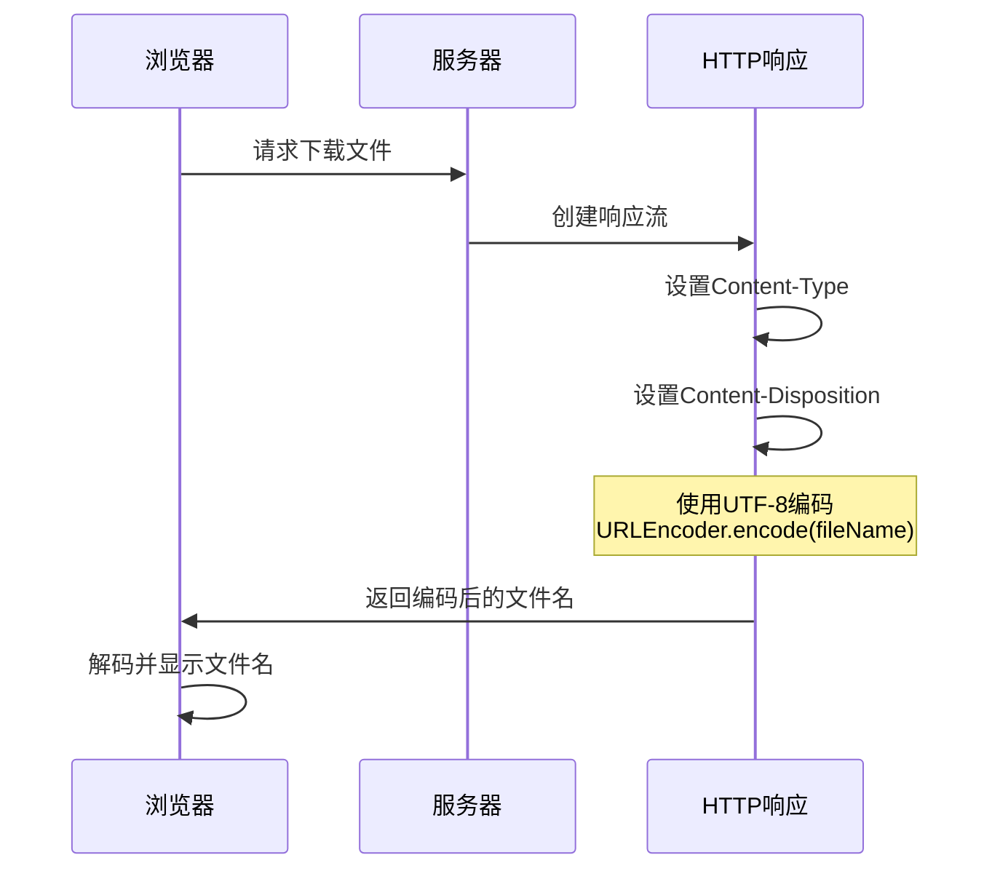
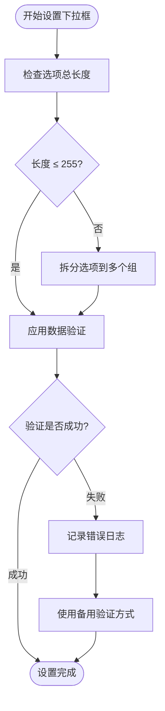
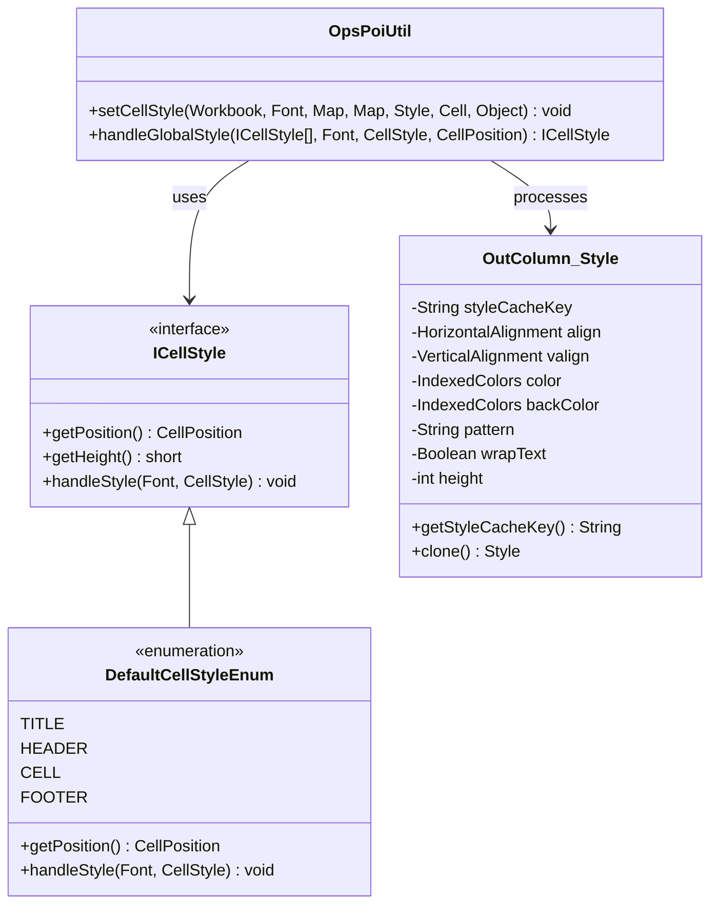
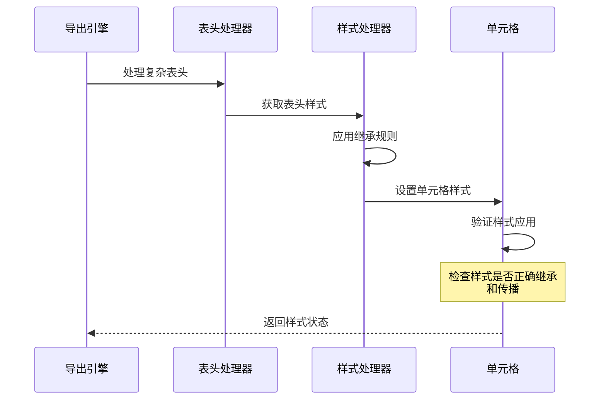
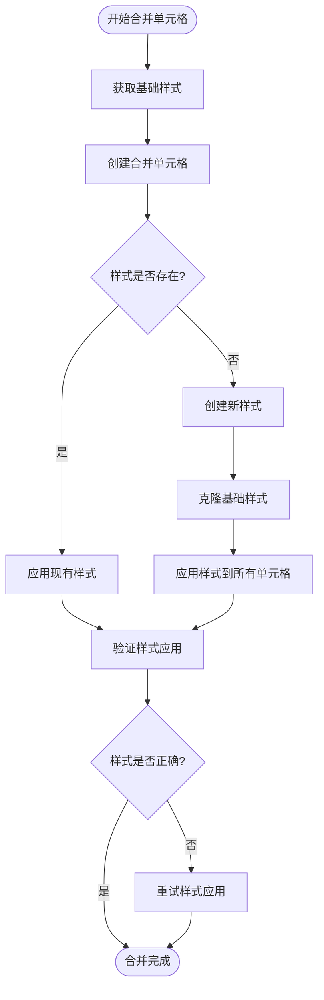

# Excel导出样式渲染问题及解决策略

<cite>
**本文档引用的文件**
- [ICellStyle.java](file://src/main/java/com/github/stupdit1t/excel/style/ICellStyle.java)
- [DefaultCellStyleEnum.java](file://src/main/java/com/github/stupdit1t/excel/style/DefaultCellStyleEnum.java)
- [OpsPoiUtil.java](file://src/main/java/com/github/stupdit1t/excel/core/OpsPoiUtil.java)
- [OpsExport.java](file://src/main/java/com/github/stupdit1t/excel/core/export/OpsExport.java)
- [OutColumn.java](file://src/main/java/com/github/stupdit1t/excel/core/export/OutColumn.java)
- [ExportClass.java](file://src/test/java/excel/export/ExportClass.java)
- [README-export.md](file://README-export.md)
</cite>

## 目录
1. [概述](#概述)
2. [常见样式渲染问题](#常见样式渲染问题)
3. [中文文件名乱码问题](#中文文件名乱码问题)
4. [下拉框数据失效问题](#下拉框数据失效问题)
5. [单元格样式不生效问题](#单元格样式不生效问题)
6. [复杂表头样式继承问题](#复杂表头样式继承问题)
7. [合并单元格样式丢失问题](#合并单元格样式丢失问题)
8. [解决方案与最佳实践](#解决方案与最佳实践)
9. [测试用例分析](#测试用例分析)
10. [总结](#总结)

## 概述

在Excel导出过程中，样式渲染是一个复杂且容易出现问题的环节。POI Excel框架提供了丰富的样式控制功能，但在实际使用中经常遇到各种样式渲染问题。本文档基于POI Excel项目的源码分析，详细说明了常见的样式渲染问题及其解决方案。

## 常见样式渲染问题

### 问题分类

1. **文件名编码问题** - 中文文件名在不同浏览器下的乱码显示
2. **数据验证问题** - 下拉框数据超出限制导致失效
3. **样式应用问题** - 单元格样式无法正确应用
4. **继承问题** - 复杂表头中样式属性的继承关系
5. **合并问题** - 合并单元格后样式丢失

## 中文文件名乱码问题

### 问题描述

当导出包含中文字符的文件名时，在某些浏览器（特别是IE和Edge）中会出现乱码现象。这是由于HTTP响应头中Content-Disposition的文件名编码不当造成的。

### 根本原因

HTTP协议要求文件名必须经过URL编码才能正确传输，否则在不同浏览器中可能会出现乱码。

### 解决方案

```java
// 正确的文件名设置方式
response.setHeader("Content-disposition", 
    "attachment; filename=" + URLEncoder.encode(fileName, StandardCharsets.UTF_8.name()));
```

### 实现原理



**图表来源**
- [OpsPoiUtil.java](file://src/main/java/com/github/stupdit1t/excel/core/OpsPoiUtil.java#L130-L132)

### 修复前后对比

**修复前（可能导致乱码）：**
```java
response.setHeader("Content-disposition", "attachment; filename=" + fileName);
```

**修复后（推荐方式）：**
```java
response.setHeader("Content-disposition", 
    "attachment; filename=" + URLEncoder.encode(fileName, StandardCharsets.UTF_8.name()));
```

**章节来源**
- [OpsPoiUtil.java](file://src/main/java/com/github/stupdit1t/excel/core/OpsPoiUtil.java#L130-L132)

## 下拉框数据失效问题

### 问题描述

Excel下拉框的数据验证存在255字符限制，当提供的选项字符串总长度超过这个限制时，下拉框将无法正常工作。

### 根本原因

Microsoft Excel对数据验证的下拉框选项有严格的字符长度限制，超过255个字符会导致验证规则失效。

### 解决方案

#### 方案一：拆分长文本选项

```java
// 错误做法：单个选项过多导致失效
.field("city")
    .dropdown("北京", "上海", "广州", "深圳", "杭州", "南京", "武汉", "成都", 
              "重庆", "天津", "西安", "大连", "青岛", "厦门", "苏州", "无锡", 
              "郑州", "长沙", "沈阳", "哈尔滨", "昆明", "南宁", "贵阳", "福州", 
              "济南", "合肥", "南昌", "石家庄", "太原", "呼和浩特", "乌鲁木齐", 
              "兰州", "西宁", "银川", "拉萨", "海口", "三亚", "香港", "澳门")

// 正确做法：拆分为多个选项组
.field("city")
    .dropdown("北京", "上海", "广州", "深圳", "杭州", "南京", "武汉", "成都")
    .dropdown("重庆", "天津", "西安", "大连", "青岛", "厦门", "苏州", "无锡")
    .dropdown("郑州", "长沙", "沈阳", "哈尔滨", "昆明", "南宁", "贵阳", "福州")
```

#### 方案二：使用外部数据源

```java
// 使用外部数据源替代内联选项
.field("city")
    .dropdownFromSheet("城市列表", "A1:A50") // 引用工作表中的数据范围
```

#### 方案三：自定义验证逻辑

```java
// 使用自定义验证规则
.field("city")
    .verifyCustom("INDIRECT(A1)", "请选择有效的城市")
```

### 实现机制



**图表来源**
- [OutColumn.java](file://src/main/java/com/github/stupdit1t/excel/core/export/OutColumn.java#L20-L30)

**章节来源**
- [OutColumn.java](file://src/main/java/com/github/stupdit1t/excel/core/export/OutColumn.java#L20-L30)

## 单元格样式不生效问题

### 问题描述

即使正确设置了样式参数，单元格仍然可能显示默认样式，而不是预期的自定义样式。

### 根本原因

样式不生效的主要原因包括：
1. 未正确调用`style()`方法
2. 未实现`ICellStyle`接口
3. 样式缓存机制导致旧样式被复用
4. 样式优先级冲突

### 解决方案

#### 1. 正确实现ICellStyle接口

```java
// 自定义样式实现
ICellStyle customStyle = new ICellStyle() {
    @Override
    public CellPosition getPosition() {
        return CellPosition.CELL;
    }
    
    @Override
    public void handleStyle(Font font, CellStyle cellStyle) {
        // 设置字体大小
        font.setFontHeightInPoints((short) 12);
        // 设置字体颜色
        font.setColor(IndexedColors.BLUE.getIndex());
        // 设置水平对齐
        cellStyle.setAlignment(HorizontalAlignment.CENTER);
        // 设置垂直对齐
        cellStyle.setVerticalAlignment(VerticalAlignment.CENTER);
        // 设置背景色
        cellStyle.setFillForegroundColor(IndexedColors.LIGHT_BLUE.getIndex());
        cellStyle.setFillPattern(FillPatternType.SOLID_FOREGROUND);
        // 设置边框
        cellStyle.setBorderTop(BorderStyle.THIN);
        cellStyle.setBorderBottom(BorderStyle.THIN);
        cellStyle.setBorderLeft(BorderStyle.THIN);
        cellStyle.setBorderRight(BorderStyle.THIN);
    }
};
```

#### 2. 确保样式正确应用

```java
// 在导出配置中正确设置样式
ExcelHelper.opsExport(PoiWorkbookType.XLSX)
    .style(customStyle) // 设置全局样式
    .opsSheet(data)
        .opsHeader()
            .simple()
            .texts("标题1", "标题2", "标题3")
            .done()
        .opsColumn()
            .field("name")
                .color(IndexedColors.BLUE) // 使用内置颜色
                .align(HorizontalAlignment.CENTER)
                .valign(VerticalAlignment.CENTER)
                .backColor(IndexedColors.LIGHT_BLUE)
                .done()
            .done()
        .done();
```

#### 3. 清除样式缓存

```java
// 在复杂场景下手动清除样式缓存
private static void clearStyleCache(Map<String, CellStyle> cacheStyle) {
    cacheStyle.clear();
}
```

### 实现原理



**图表来源**
- [ICellStyle.java](file://src/main/java/com/github/stupdit1t/excel/style/ICellStyle.java#L1-L57)
- [DefaultCellStyleEnum.java](file://src/main/java/com/github/stupdit1t/excel/style/DefaultCellStyleEnum.java#L1-L114)

**章节来源**
- [ICellStyle.java](file://src/main/java/com/github/stupdit1t/excel/style/ICellStyle.java#L1-L57)
- [DefaultCellStyleEnum.java](file://src/main/java/com/github/stupdit1t/excel/style/DefaultCellStyleEnum.java#L1-L114)

## 复杂表头样式继承问题

### 问题描述

在复杂表头中，样式属性可能无法正确继承，导致部分单元格样式不符合预期。

### 根本原因

复杂表头的样式继承涉及多个层次：
1. 全局样式 → 表头样式 → 单元格样式
2. 合并单元格的样式边界处理
3. 嵌套结构的样式传播

### 解决方案

#### 1. 明确指定样式位置

```java
// 复杂表头样式设置
ExcelHelper.opsExport(PoiWorkbookType.XLSX)
    .opsSheet(data)
        .opsHeader()
            .complex()
                .text("主标题", "A1:E1") // 主标题样式
                .text("子标题", "B2:D2") // 子标题样式
                .text("数据项", "C3:E3") // 数据项样式
                .done()
        .opsColumn()
            .field("name")
                .style((font, style) -> {
                    // 明确设置单元格样式
                    font.setFontHeightInPoints((short) 10);
                    style.setAlignment(HorizontalAlignment.LEFT);
                    style.setVerticalAlignment(VerticalAlignment.CENTER);
                })
                .done()
            .done()
        .done();
```

#### 2. 使用样式继承链

```java
// 定义样式继承链
ICellStyle headerStyle = new ICellStyle() {
    @Override
    public CellPosition getPosition() {
        return CellPosition.HEADER;
    }
    
    @Override
    public void handleStyle(Font font, CellStyle cellStyle) {
        // 基础表头样式
        font.setBold(true);
        font.setFontHeightInPoints((short) 12);
        cellStyle.setFillForegroundColor(IndexedColors.GREY_25_PERCENT.getIndex());
        cellStyle.setFillPattern(FillPatternType.SOLID_FOREGROUND);
    }
};

ICellStyle cellStyle = new ICellStyle() {
    @Override
    public CellPosition getPosition() {
        return CellPosition.CELL;
    }
    
    @Override
    public void handleStyle(Font font, CellStyle cellStyle) {
        // 基础单元格样式
        font.setFontHeightInPoints((short) 10);
        cellStyle.setBorderTop(BorderStyle.THIN);
        cellStyle.setBorderBottom(BorderStyle.THIN);
        cellStyle.setBorderLeft(BorderStyle.THIN);
        cellStyle.setBorderRight(BorderStyle.THIN);
    }
};
```

### 实现机制



**图表来源**
- [OpsPoiUtil.java](file://src/main/java/com/github/stupdit1t/excel/core/OpsPoiUtil.java#L700-L800)

**章节来源**
- [OpsPoiUtil.java](file://src/main/java/com/github/stupdit1t/excel/core/OpsPoiUtil.java#L700-L800)

## 合并单元格样式丢失问题

### 问题描述

在使用`mergerRepeat()`或自定义合并单元格后，样式信息可能丢失，导致合并后的单元格显示异常。

### 根本原因

合并单元格的样式丢失通常发生在以下场景：
1. 纵向合并时，只有第一个单元格保留样式
2. 水平合并时，样式信息未正确传递
3. 合并操作后，样式缓存未更新

### 解决方案

#### 1. 手动设置合并单元格样式

```java
// 使用回调函数设置合并后的样式
.field("city")
    .mergerRepeat()
    .map((val, row, style, rowIndex) -> {
        // 设置合并单元格的样式
        style.setBackColor(IndexedColors.YELLOW);
        style.setHeight(500);
        style.setComment("合并单元格样式");
        return val;
    })
    .done()
```

#### 2. 合并后重新应用样式

```java
// 在合并完成后重新应用样式
private void applyMergedCellStyle(Sheet sheet, int startRow, int endRow, 
                                 int startCol, int endCol, ICellStyle style) {
    for (int row = startRow; row <= endRow; row++) {
        Row r = sheet.getRow(row);
        if (r == null) {
            r = sheet.createRow(row);
        }
        for (int col = startCol; col <= endCol; col++) {
            Cell cell = r.getCell(col);
            if (cell == null) {
                cell = r.createCell(col);
            }
            // 重新应用样式
            cell.setCellStyle(style);
        }
    }
}
```

#### 3. 使用样式缓存机制

```java
// 实现样式缓存以避免重复创建
Map<String, CellStyle> mergedStyleCache = new HashMap<>();

private CellStyle getCachedMergedStyle(Workbook workbook, ICellStyle baseStyle) {
    String key = baseStyle.getPosition().toString();
    CellStyle cachedStyle = mergedStyleCache.get(key);
    if (cachedStyle == null) {
        cachedStyle = workbook.createCellStyle();
        // 复制基础样式
        cachedStyle.cloneStyleFrom(baseStyle);
        mergedStyleCache.put(key, cachedStyle);
    }
    return cachedStyle;
}
```

### 实现原理



**图表来源**
- [OpsPoiUtil.java](file://src/main/java/com/github/stupdit1t/excel/core/OpsPoiUtil.java#L600-L700)

**章节来源**
- [OpsPoiUtil.java](file://src/main/java/com/github/stupdit1t/excel/core/OpsPoiUtil.java#L600-L700)

## 解决方案与最佳实践

### 1. 样式管理最佳实践

#### 全局样式配置

```java
// 定义统一的样式配置
public class ExcelStyleConfig {
    public static ICellStyle createTitleStyle() {
        return new ICellStyle() {
            @Override
            public CellPosition getPosition() {
                return CellPosition.TITLE;
            }
            
            @Override
            public void handleStyle(Font font, CellStyle cellStyle) {
                font.setFontHeightInPoints((short) 16);
                font.setBold(true);
                font.setColor(IndexedColors.DARK_BLUE.getIndex());
                cellStyle.setAlignment(HorizontalAlignment.CENTER);
                cellStyle.setVerticalAlignment(VerticalAlignment.CENTER);
            }
        };
    }
    
    public static ICellStyle createHeaderStyle() {
        return new ICellStyle() {
            @Override
            public CellPosition getPosition() {
                return CellPosition.HEADER;
            }
            
            @Override
            public void handleStyle(Font font, CellStyle cellStyle) {
                font.setBold(true);
                font.setFontHeightInPoints((short) 12);
                cellStyle.setFillForegroundColor(IndexedColors.GREY_25_PERCENT.getIndex());
                cellStyle.setFillPattern(FillPatternType.SOLID_FOREGROUND);
                cellStyle.setBorderAll(BorderStyle.THIN);
            }
        };
    }
}
```

#### 样式缓存优化

```java
// 实现样式缓存以提高性能
public class StyleCache {
    private static final Map<String, CellStyle> styleCache = new ConcurrentHashMap<>();
    
    public static CellStyle getOrCreateStyle(Workbook workbook, ICellStyle styleDef) {
        String key = styleDef.getPosition().toString() + "_" + System.currentTimeMillis();
        
        return styleCache.computeIfAbsent(key, k -> {
            CellStyle style = workbook.createCellStyle();
            Font font = workbook.createFont();
            styleDef.handleStyle(font, style);
            return style;
        });
    }
}
```

### 2. 错误处理机制

```java
// 实现样式错误监控
public class StyleErrorHandler {
    private static final Logger logger = LoggerFactory.getLogger(StyleErrorHandler.class);
    
    public static void logStyleError(Exception e, String context) {
        logger.error("样式应用失败: {}, 错误详情: {}", context, e.getMessage(), e);
    }
    
    public static void validateStyleApplied(Cell cell, ICellStyle expectedStyle) {
        try {
            // 验证样式是否正确应用
            CellStyle actualStyle = cell.getCellStyle();
            // 进行样式验证逻辑...
        } catch (Exception e) {
            logStyleError(e, "单元格样式验证");
        }
    }
}
```

### 3. 性能优化策略

```java
// 批量样式应用优化
public class BatchStyleApplier {
    public static void applyStylesToRange(Sheet sheet, int startRow, int endRow, 
                                         int startCol, int endCol, CellStyle style) {
        for (int row = startRow; row <= endRow; row++) {
            Row r = sheet.getRow(row);
            if (r == null) {
                r = sheet.createRow(row);
            }
            for (int col = startCol; col <= endCol; col++) {
                Cell cell = r.getCell(col);
                if (cell == null) {
                    cell = r.createCell(col);
                }
                cell.setCellStyle(style);
            }
        }
    }
}
```

## 测试用例分析

### 简单导出示例

基于项目中的`simpleExport2`测试用例，我们可以看到完整的样式配置：

```java
@Test
public void simpleExport2() throws Exception {
    // 自定义全局样式
    ICellStyle titleStyle = new ICellStyle() {
        @Override
        public CellPosition getPosition() {
            return CellPosition.TITLE;
        }
        
        @Override
        public void handleStyle(Font font, CellStyle cellStyle) {
            font.setFontHeightInPoints((short) 20);
            font.setColor(IndexedColors.RED.index);
            cellStyle.setAlignment(HorizontalAlignment.LEFT);
        }
    };
    
    ExcelHelper.opsExport(PoiWorkbookType.XLSX)
        .style(titleStyle)
        .opsSheet(data)
            .autoNum()
            .height(CellPosition.CELL, 300)
            .autoNumColumnWidth(3000)
            .sheetName("简单导出")
            .opsHeader().simple()
                .title("我是大标题")
                .text("项目名称", (font, style) -> {
                    font.setColor(IndexedColors.RED.index);
                    style.setVerticalAlignment(VerticalAlignment.TOP);
                })
                .texts("项目图", "所属区域", "省份", "项目所属人", "市", "创建时间", "项目领导人", "得分", "平均分")
                .done()
            .opsColumn()
                .fields("projectName", "img", "areaName", "province", "people")
                .field("city")
                    .wrapText()
                    .dropdown("北京", "西安", "上海", "广州")
                    .mergerRepeat()
                    .height(500)
                    .comment("城市选择下拉框内容哦")
                    .width(6000)
                    .map((val, row, style, rowIndex) -> {
                        if (val.equals("北京")) {
                            style.setBackColor(IndexedColors.YELLOW);
                            style.setHeight(900);
                            style.setComment("北京搞红色");
                            int index = rowIndex + 1;
                            return "=J" + index + "+K" + index;
                        }
                        return val;
                    })
                .field("createTime")
                    .mergerRepeat("areaName")
                    .pattern("yyyy-MM-dd")
                    .align(HorizontalAlignment.LEFT)
                    .valign(VerticalAlignment.CENTER)
                    .backColor(IndexedColors.YELLOW)
                    .color(IndexedColors.GOLD)
                .done()
            .done();
}
```

### 复杂表头示例

```java
@Test
public void complexExport() {
    ExcelHelper.opsExport(PoiWorkbookType.XLSX)
        .opsSheet(data)
            .autoNum()
            .mergeCell("F4:G13")
            .addImage(imageParseBytes(new File("path/to/image.jpg")), "F4:G13")
        .opsHeader()
            .complex()
                .text("项目资源统计", "A1:K1")
                .text("序号", "2,3,A,A")
                .text("基本信息", 1, 1, 1, 4)
                .text("项目名称", "3,3,B,B")
                .text("所属区域", "3,3,C,C")
                .text("省份", "3,3,D,D")
                .text("市", "3,3,E,E")
                .text("项目所属人", "2,3,F,F")
                .text("市项目领导人", "2,3,G,G")
                .text("分值", "2,2,H,I")
                .text("得分", "3,3,H,H")
                .text("平均分", "3,3,I,I")
                .text("项目图片", "2,3,J,J")
                .text("创建时间", "2,3,K,K")
                .done()
        .opsColumn()
            .fields("projectName", "areaName", "province", "city", "people", "leader", "scount", "avg", "img", "createTime")
            .done()
        .done();
}
```

**章节来源**
- [ExportClass.java](file://src/test/java/excel/export/ExportClass.java#L188-L246)
- [ExportClass.java](file://src/test/java/excel/export/ExportClass.java#L250-L300)

## 总结

通过深入分析POI Excel项目的源码，我们发现了Excel导出过程中常见的样式渲染问题及其解决方案：

### 主要发现

1. **文件名编码问题**：必须使用`URLEncoder.encode`确保跨浏览器兼容性
2. **下拉框限制**：严格遵守255字符限制，必要时拆分选项或使用外部数据源
3. **样式应用问题**：正确实现`ICellStyle`接口并确保样式正确应用
4. **继承问题**：明确指定样式位置和继承关系
5. **合并问题**：使用回调函数或手动重新应用样式

### 最佳实践建议

1. **统一样式管理**：建立全局样式配置和缓存机制
2. **错误处理**：实现完善的错误监控和恢复机制
3. **性能优化**：批量处理样式应用，减少重复创建
4. **测试覆盖**：编写全面的样式测试用例

### 未来改进方向

1. **自动化检测**：开发样式完整性检测工具
2. **智能修复**：实现样式问题的自动修复机制
3. **可视化调试**：提供样式渲染的可视化调试界面

通过遵循这些最佳实践和解决方案，可以有效避免Excel导出过程中的样式渲染问题，提升用户体验和系统稳定性。