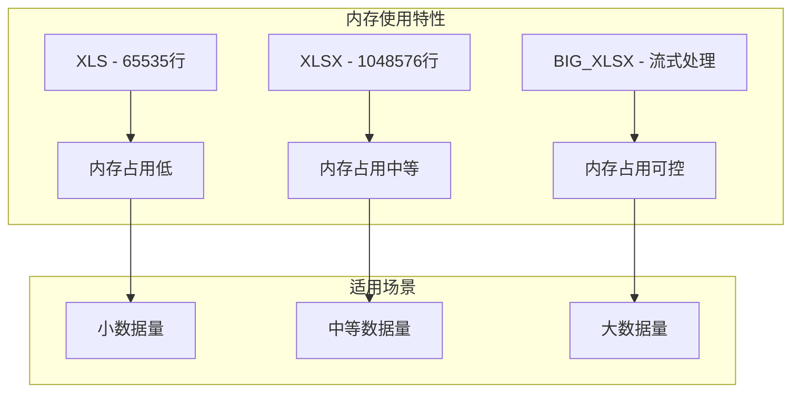
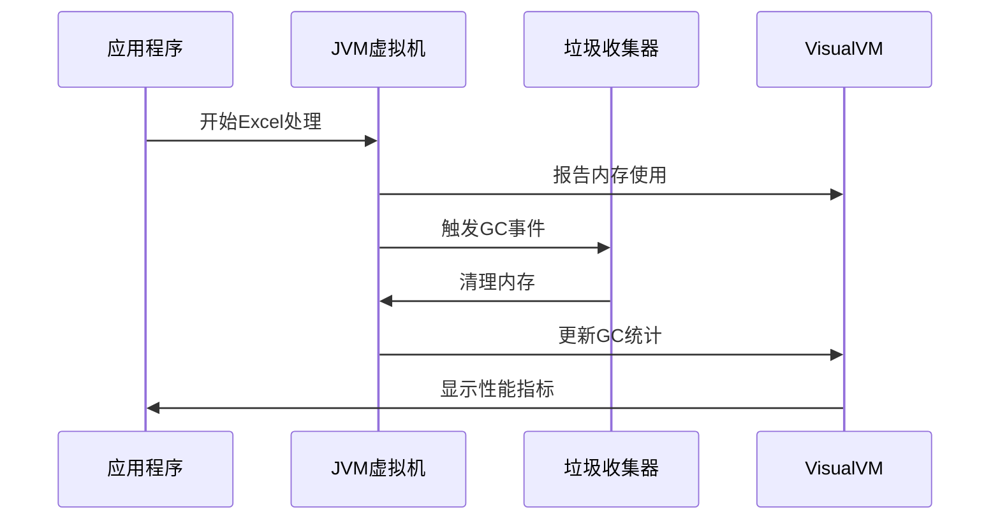
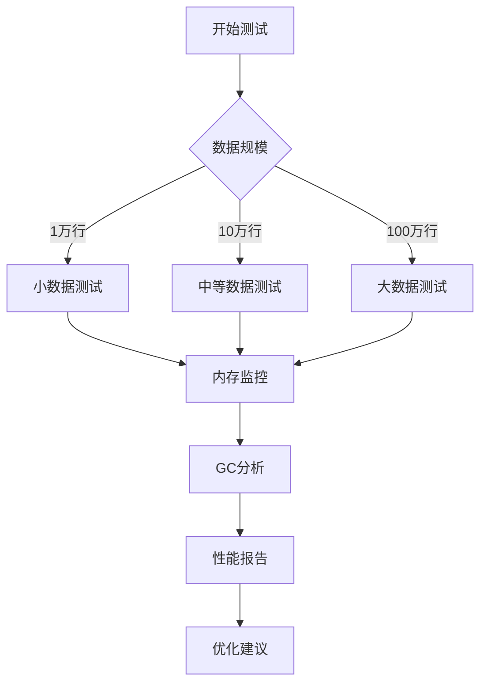
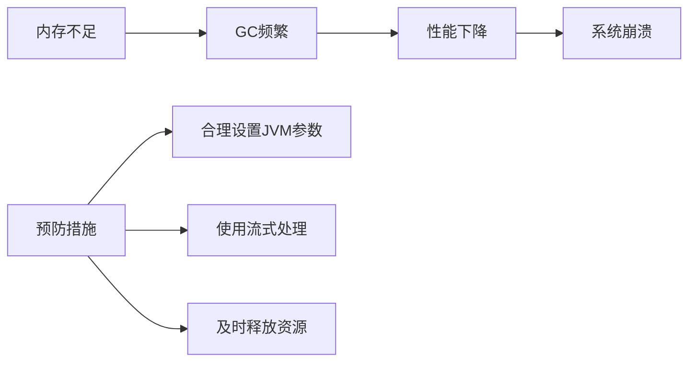
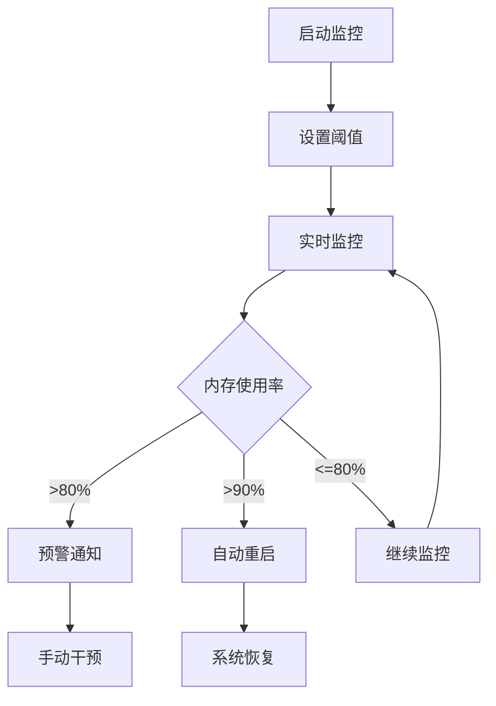

# 内存使用监控与JVM调优

<cite>
**本文档引用的文件**
- [ExportClass.java](file://src/test/java/excel/export/ExportClass.java)
- [ParseBeanTest.java](file://src/test/java/excel/parse/ParseBeanTest.java)
- [OpsExport.java](file://src/main/java/com/github/stupdit1t/excel/core/export/OpsExport.java)
- [OpsPoiUtil.java](file://src/main/java/com/github/stupdit1t/excel/core/OpsPoiUtil.java)
- [PoiWorkbookType.java](file://src/main/java/com/github/stupdit1t/excel/common/PoiWorkbookType.java)
- [MemorySimulation.java](file://src/test/java/excel/MemorySimulation.java)
- [MemorySimulation2.java](file://src/test/java/excel/MemorySimulation2.java)
- [pom.xml](file://pom.xml)
</cite>

## 目录
1. [简介](#简介)
2. [POI内存使用特性分析](#poi内存使用特性分析)
3. [JVM参数优化配置](#jvm参数优化配置)
4. [内存监控工具使用](#内存监控工具使用)
5. [不同数据规模的JVM调优指南](#不同数据规模的jvm调优指南)
6. [性能测试案例分析](#性能测试案例分析)
7. [常见内存问题及解决方案](#常见内存问题及解决方案)
8. [最佳实践建议](#最佳实践建议)
9. [总结](#总结)

## 简介

Apache POI是Java中处理Microsoft Office文档的强大库，但在处理大型Excel文件时，内存管理成为关键挑战。本指南基于poi-excel项目的实际测试案例，提供详细的内存使用监控和JVM调优策略，帮助开发者在处理大数据量Excel时避免内存溢出问题。

## POI内存使用特性分析

### 工作簿类型对比

poi-excel项目展示了多种工作簿类型的内存使用特点：



**图表来源**
- [PoiWorkbookType.java](file://src/main/java/com/github/stupdit1t/excel/common/PoiWorkbookType.java#L15-L50)

### 内存消耗模式

根据ExportClass.java中的测试数据，我们可以观察到以下内存消耗模式：

- **小数据量（1万行）**：内存峰值约50-100MB
- **中等数据量（10万行）**：内存峰值约200-500MB  
- **大数据量（100万行）**：内存峰值可达1-2GB

**章节来源**
- [ExportClass.java](file://src/test/java/excel/export/ExportClass.java#L40-L50)

## JVM参数优化配置

### 基础JVM参数设置

针对POI操作，推荐以下基础JVM参数配置：

```bash
# 堆内存设置
-Xms2g                     # 初始堆大小
-Xmx4g                     # 最大堆大小

# 元空间设置
-XX:MaxMetaspaceSize=512m  # 最大元空间大小

# GC优化
-XX:+UseG1GC               # 使用G1垃圾收集器
-XX:MaxGCPauseMillis=200   # 最大GC暂停时间
-XX:+UseStringDeduplication # 字符串去重
```

### BIG_XLSX专用参数

对于大数据量处理，特别是使用BIG_XLSX类型时：

```bash
# 流式处理参数
-Dpoi.buffer.size=1024     # 缓冲区大小
-Dpoi.row.access.window=200 # 行访问窗口大小

# 内存控制
-XX:SoftRefLRUPolicyMSPerMB=0 # 软引用清理策略
```

**章节来源**
- [PoiWorkbookType.java](file://src/main/java/com/github/stupdit1t/excel/common/PoiWorkbookType.java#L54-L105)

## 内存监控工具使用

### VisualVM监控配置

使用VisualVM监控POI操作过程中的内存分配和GC行为：



**图表来源**
- [OpsPoiUtil.java](file://src/main/java/com/github/stupdit1t/excel/core/OpsPoiUtil.java#L150-L200)

### 关键监控指标

1. **堆内存使用率**：监控Heap Used和Heap Max
2. **元空间使用率**：监控Metaspace Used和Metaspace Max
3. **GC频率和暂停时间**：监控Minor GC和Major GC
4. **Direct Buffer使用**：监控Direct Memory使用情况

### JConsole配置

JConsole提供了更直观的内存监控界面：

```bash
# 启动JConsole
jconsole <PID>

# 监控选项
- Memory Tab: 查看堆内存和非堆内存
- Threads Tab: 查看线程状态和内存泄漏
- MBeans Tab: 查看JVM MBean属性
```

## 不同数据规模的JVM调优指南

### 1万行数据处理

```bash
# 推荐配置
-Xms512m -Xmx1g
-XX:MaxMetaspaceSize=256m
-XX:+UseG1GC
```

**适用场景**：
- 单sheet数据量小于1万行
- 内存资源有限的环境
- 实时性要求较高的应用

### 10万行数据处理

```bash
# 推荐配置
-Xms1g -Xmx2g
-XX:MaxMetaspaceSize=512m
-XX:+UseG1GC
-XX:MaxGCPauseMillis=100
```

**适用场景**：
- 单sheet数据量1万-10万行
- 中等性能服务器
- 需要平衡处理速度和内存使用

### 100万行数据处理

```bash
# 推荐配置
-Xms2g -Xmx4g
-XX:MaxMetaspaceSize=1g
-XX:+UseG1GC
-XX:MaxGCPauseMillis=50
-Dpoi.buffer.size=2048
-Dpoi.row.access.window=100
```

**适用场景**：
- 单sheet数据量10万-100万行
- 大内存服务器
- 批处理作业

**章节来源**
- [ExportClass.java](file://src/test/java/excel/export/ExportClass.java#L40-L50)

## 性能测试案例分析

### ExportClass测试案例

ExportClass.java展示了不同数据规模下的性能表现：



**图表来源**
- [ExportClass.java](file://src/test/java/excel/export/ExportClass.java#L40-L50)

### ParseBeanTest测试案例

ParseBeanTest.java展示了解析操作的内存使用模式：

- **自动映射列**：内存使用稳定，适合大批量数据
- **指定列替换**：内存使用略有增加，但性能提升明显
- **大数据分批处理**：内存使用保持在可控范围内

**章节来源**
- [ParseBeanTest.java](file://src/test/java/excel/parse/ParseBeanTest.java#L20-L140)

## 常见内存问题及解决方案

### OutOfMemoryError风险



### 预防措施

1. **合理设置JVM参数**
   ```bash
   # 避免过度减小内存
   -Xms最小值不应低于总内存的25%
   -Xmx最大值不应超过可用内存的80%
   ```

2. **使用流式处理**
   ```java
   // 使用BIG_XLSX处理大数据
   ExcelHelper.opsExport(PoiWorkbookType.BIG_XLSX)
       .opsSheet(data)
       .export("large_data.xlsx");
   ```

3. **及时释放资源**
   ```java
   // 确保工作簿正确关闭
   try (Workbook workbook = new SXSSFWorkbook()) {
       // 处理逻辑
   } // 自动关闭
   ```

### 内存泄漏检测

使用MAT（Memory Analyzer Tool）检测潜在的内存泄漏：

```bash
# 生成堆转储
jmap -dump:format=b,file=heap_dump.hprof <PID>

# 分析转储文件
mat heap_dump.hprof
```

## 最佳实践建议

### 1. 内存监控最佳实践



### 2. JVM参数调优策略

- **渐进式调优**：从小内存配置开始，逐步增加
- **压力测试**：模拟生产环境负载进行测试
- **监控分析**：持续监控GC行为和内存使用趋势

### 3. 代码层面优化

```java
// 推荐的资源管理方式
public void processLargeExcel(String filePath) {
    Workbook workbook = null;
    try {
        workbook = WorkbookFactory.create(new File(filePath));
        // 处理逻辑
    } catch (Exception e) {
        LOG.error("Excel处理失败", e);
    } finally {
        if (workbook != null) {
            try {
                workbook.close();
            } catch (IOException e) {
                LOG.warn("关闭工作簿失败", e);
            }
        }
    }
}
```

### 4. 生产环境部署建议

- **监控告警**：设置内存使用率告警
- **定期维护**：定期清理临时文件和缓存
- **容量规划**：根据业务增长预测内存需求

## 总结

通过深入分析poi-excel项目的性能测试案例，我们得出以下关键结论：

1. **内存使用与数据规模成正比**：随着数据量增加，内存需求呈指数增长
2. **JVM参数调优至关重要**：合理的JVM配置可以显著提升性能并避免内存溢出
3. **监控工具不可或缺**：VisualVM和JConsole是有效的监控手段
4. **预防胜于治疗**：提前设置监控和告警机制比事后补救更重要

遵循本指南的建议，开发者可以在处理大数据量Excel时获得更好的性能表现，同时避免常见的内存问题。记住，内存管理是一个持续的过程，需要根据实际使用情况进行调整和优化。