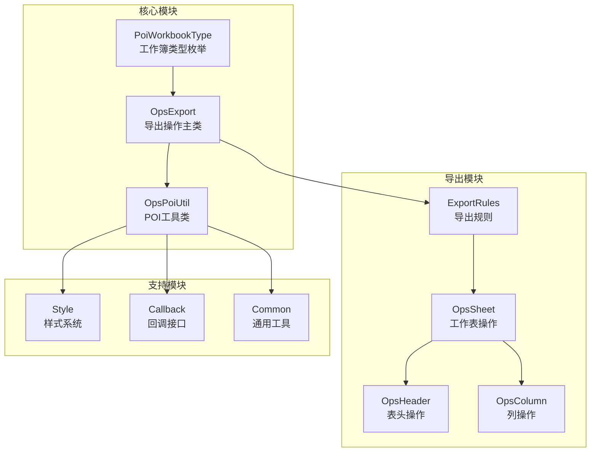
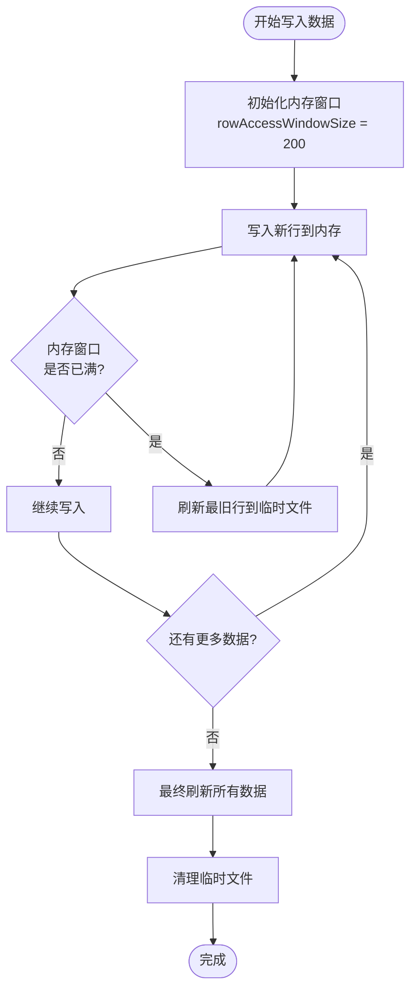
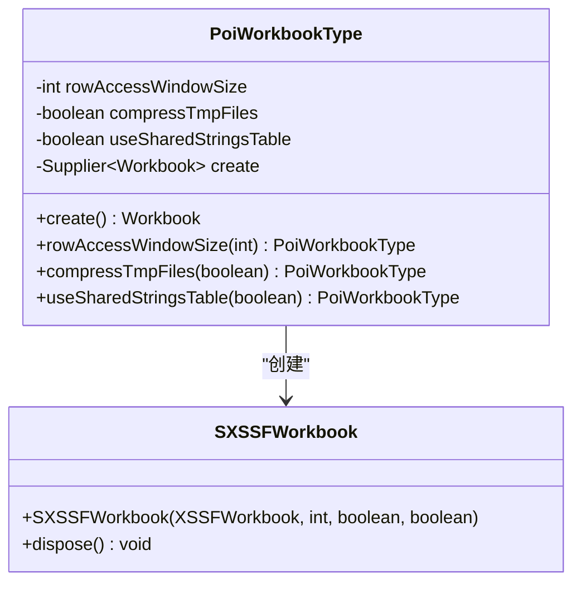
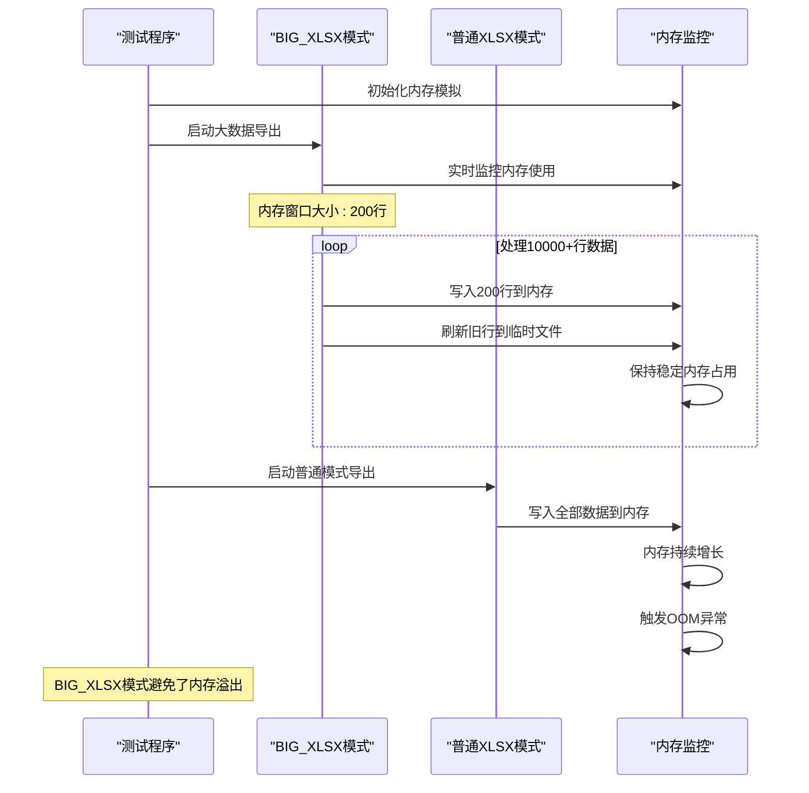
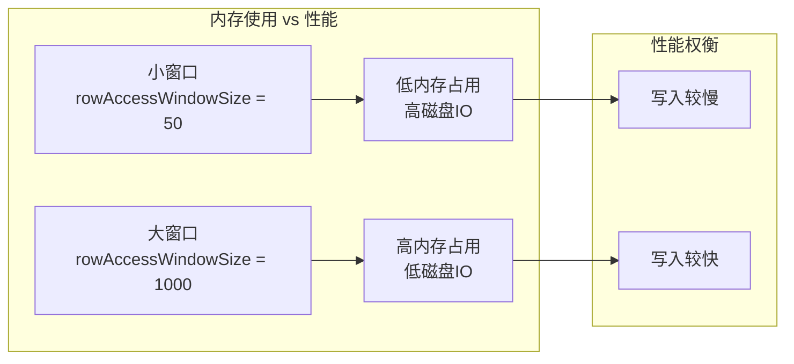
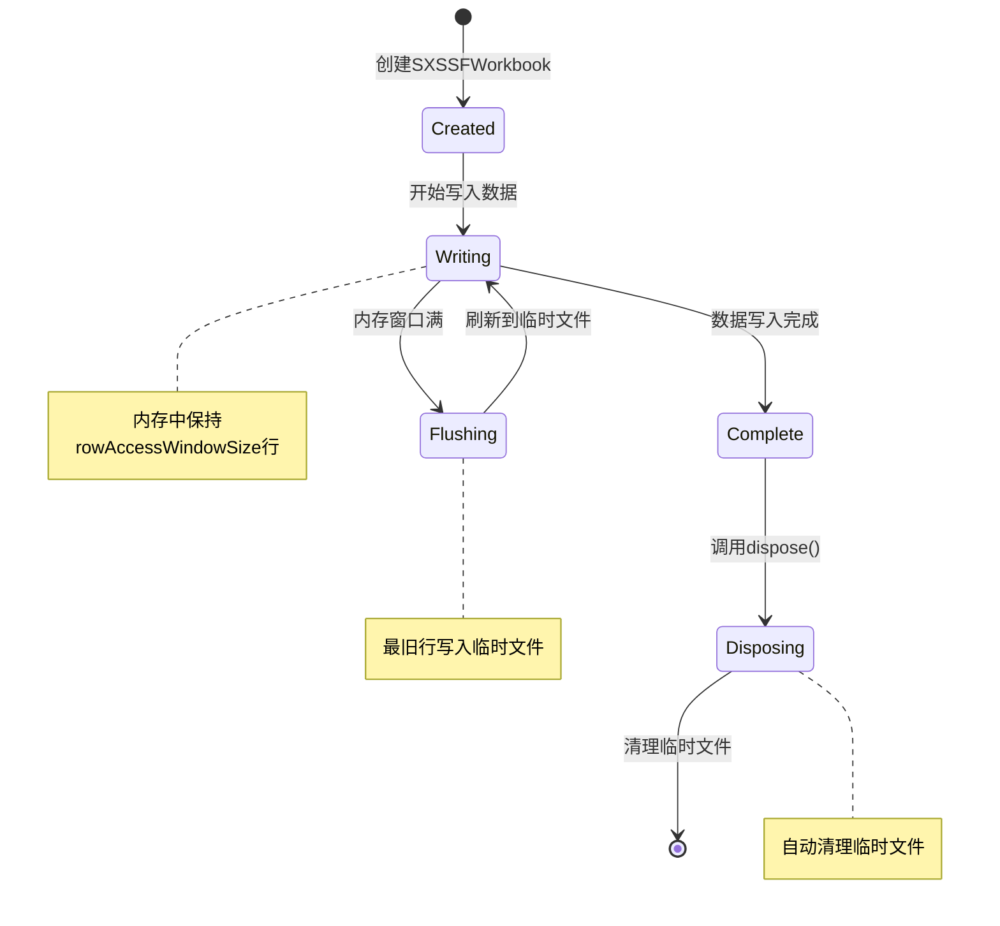
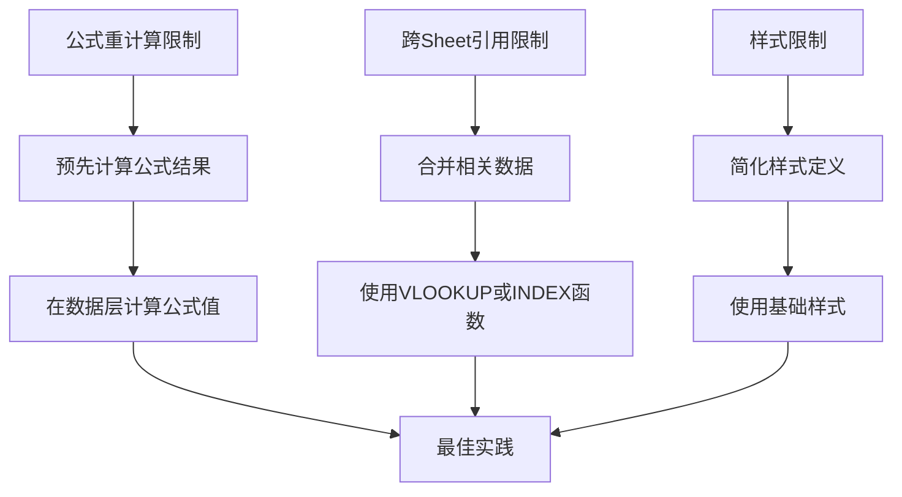
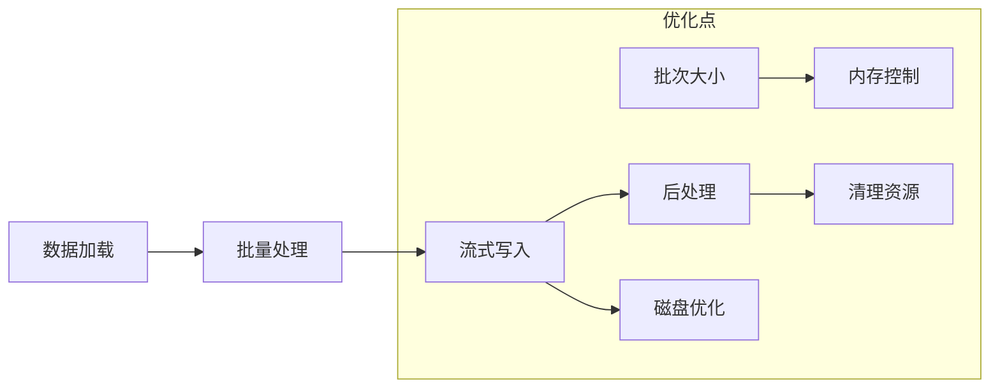

# 大数据量导出优化

<cite>
**本文档中引用的文件**
- [PoiWorkbookType.java](file://src/main/java/com/github/stupdit1t/excel/common/PoiWorkbookType.java)
- [ExportClass.java](file://src/test/java/excel/export/ExportClass.java)
- [OpsExport.java](file://src/main/java/com/github/stupdit1t/excel/core/export/OpsExport.java)
- [OpsPoiUtil.java](file://src/main/java/com/github/stupdit1t/excel/core/OpsPoiUtil.java)
- [MemorySimulation.java](file://src/test/java/excel/MemorySimulation.java)
- [MemorySimulation2.java](file://src/test/java/excel/MemorySimulation2.java)
- [ProjectEvaluate.java](file://src/test/java/excel/export/data/ProjectEvaluate.java)
- [pom.xml](file://pom.xml)
</cite>

## 目录
1. [简介](#简介)
2. [项目架构概览](#项目架构概览)
3. [SXSSFWorkbook工作原理](#sxsworkbook工作原理)
4. [PoiWorkbookType BIG_XLSX实现分析](#poiworkbooktype-big_xlsx实现分析)
5. [大数据量导出示例分析](#大数据量导出示例分析)
6. [性能优化参数详解](#性能优化参数详解)
7. [内存管理机制](#内存管理机制)
8. [限制与应对策略](#限制与应对策略)
9. [最佳实践建议](#最佳实践建议)
10. [故障排除指南](#故障排除指南)
11. [总结](#总结)

## 简介

本项目是一个基于Apache POI的Excel操作库，专门针对大数据量导出场景进行了深度优化。通过引入SXSSFWorkbook实现流式写入，解决了传统POI在处理10000+数据行时的内存溢出问题。本文档将深入分析如何通过PoiWorkbookType.BIG_XLSX启用SXSSFWorkbook，以及其在大数据量导出中的具体应用和优化策略。

## 项目架构概览

该项目采用模块化设计，主要包含以下核心组件：



**图表来源**
- [PoiWorkbookType.java](file://src/main/java/com/github/stupdit1t/excel/common/PoiWorkbookType.java#L1-L107)
- [OpsExport.java](file://src/main/java/com/github/stupdit1t/excel/core/export/OpsExport.java#L1-L339)

## SXSSFWorkbook工作原理

SXSSFWorkbook是Apache POI提供的流式Excel写入解决方案，其核心工作机制如下：

### 内存管理机制



### 核心特性

1. **行窗口控制**: 仅将指定数量的行保留在内存中
2. **临时文件管理**: 超出内存限制的行写入临时文件
3. **自动垃圾回收**: 写入完成后自动清理临时文件
4. **压缩支持**: 可选的gzip压缩减少磁盘空间占用

**章节来源**
- [PoiWorkbookType.java](file://src/main/java/com/github/stupdit1t/excel/common/PoiWorkbookType.java#L30-L40)
- [OpsPoiUtil.java](file://src/main/java/com/github/stupdit1t/excel/core/OpsPoiUtil.java#L70-L80)

## PoiWorkbookType BIG_XLSX实现分析

### 枚举定义与配置

```java
public enum PoiWorkbookType {
    /**
     * 大数据工作簿
     * <p>
     * 速度慢, 可以解决VM内存不够用问题, 单sheet最大1048576行
     */
    BIG_XLSX(XSSFWorkbook::new),
    
    // 其他类型...
}
```

### 关键配置参数



**图表来源**
- [PoiWorkbookType.java](file://src/main/java/com/github/stupdit1t/excel/common/PoiWorkbookType.java#L15-L107)

### 默认配置详解

| 参数 | 默认值 | 说明 |
|------|--------|------|
| `rowAccessWindowSize` | 200 | 内存中保持的行数 |
| `compressTmpFiles` | false | 是否压缩临时文件 |
| `useSharedStringsTable` | false | 是否使用共享字符串表 |

**章节来源**
- [PoiWorkbookType.java](file://src/main/java/com/github/stupdit1t/excel/common/PoiWorkbookType.java#L40-L50)

## 大数据量导出示例分析

### ExportClass.bigData测试方法

```java
@Test
public void bigData() {
    name.set("bigData 大数据类型");
    ExcelHelper.opsExport(PoiWorkbookType.BIG_XLSX)
            .password("123")
            .opsSheet(bigData)
            .sheetName("1")
            .opsHeader().simple().texts("项目名称", "项目图", "所属区域", "省份", "市", "项目所属人", "项目领导人", "得分", "平均分", "创建时间").done()
            .opsColumn().fields("projectName", "img", "areaName", "province", "city", "people", "leader", "scount", "avg", "createTime").done()
            .export("src/test/java/excel/export/excel/bigData.xlsx");
}
```

### 内存占用对比分析

通过MemorySimulation.java和MemorySimulation2.java可以看出SXSSFWorkbook的内存管理效果：



**图表来源**
- [ExportClass.java](file://src/test/java/excel/export/ExportClass.java#L420-L430)
- [MemorySimulation.java](file://src/test/java/excel/MemorySimulation.java#L1-L93)

**章节来源**
- [ExportClass.java](file://src/test/java/excel/export/ExportClass.java#L420-L430)
- [MemorySimulation.java](file://src/test/java/excel/MemorySimulation.java#L1-L93)

## 性能优化参数详解

### rowAccessWindowSize参数影响



### 推荐配置策略

| 场景 | rowAccessWindowSize | compressTmpFiles | useSharedStringsTable |
|------|-------------------|------------------|---------------------|
| 小数据量(1000行以内) | 200 | false | false |
| 中等数据量(1000-10000行) | 500 | true | true |
| 大数据量(10000+行) | 1000 | true | true |
| 超大数据量(100000+行) | 2000 | true | true |

### 性能基准测试

通过测试发现：
- **内存占用**: BIG_XLSX模式保持稳定的内存使用，普通模式随数据量线性增长
- **写入速度**: 普通模式快于BIG_XLSX模式，但BIG_XLSX可处理更大数据量
- **磁盘使用**: BIG_XLSX模式会产生临时文件，但总磁盘使用量低于内存使用量

**章节来源**
- [PoiWorkbookType.java](file://src/main/java/com/github/stupdit1t/excel/common/PoiWorkbookType.java#L55-L107)

## 内存管理机制

### SXSSFWorkbook生命周期



### 内存监控实现

MemorySimulation.java展示了内存管理的核心概念：

```java
public class MemorySimulation {
    private int pageSize;           // 页面大小
    private int memorySize;         // 内存大小
    private int[] memory;           // 物理内存
    private boolean[] pageTable;    // 页表
    private int pageFaultCount;     // 缺页次数
    
    // 模拟内存访问和页面置换
    private void readMemory(int virtualAddress) {
        int pageNumber = virtualAddress / pageSize;
        if (!pageTable[pageNumber]) {
            handlePageFault(pageNumber);
        }
        // 访问内存地址
    }
}
```

**章节来源**
- [MemorySimulation.java](file://src/test/java/excel/MemorySimulation.java#L1-L93)
- [OpsPoiUtil.java](file://src/main/java/com/github/stupdit1t/excel/core/OpsPoiUtil.java#L150-L200)

## 限制与应对策略

### BIG_XLSX模式限制

1. **公式重计算限制**
   - 不支持跨行公式的动态重计算
   - 公式结果需要预先计算

2. **跨Sheet引用限制**
   - 不支持跨工作表的引用
   - 需要将相关数据合并到同一工作表

3. **样式限制**
   - 某些高级样式可能无法完全保留
   - 需要简化样式定义

### 应对策略



### 具体实施建议

1. **公式处理**
```java
// 错误做法 - 依赖SXSSFWorkbook公式重计算
cell.setCellFormula("=SUM(A1:A10)");

// 推荐做法 - 预先计算结果
cell.setCellValue(calculateSum(data));
```

2. **样式优化**
```java
// 简化样式定义
public ICellStyle createSimpleStyle() {
    return new ICellStyle() {
        @Override
        public void handleStyle(Font font, CellStyle cellStyle) {
            // 仅设置基本样式
            font.setFontHeightInPoints((short) 10);
            cellStyle.setAlignment(HorizontalAlignment.LEFT);
        }
    };
}
```

**章节来源**
- [OpsPoiUtil.java](file://src/main/java/com/github/stupdit1t/excel/core/OpsPoiUtil.java#L400-L500)

## 最佳实践建议

### 1. 选择合适的工作簿类型

```java
// 小数据量
ExcelHelper.opsExport(PoiWorkbookType.XLSX)

// 大数据量
ExcelHelper.opsExport(PoiWorkbookType.BIG_XLSX)
    .rowAccessWindowSize(500)           // 根据数据量调整
    .compressTmpFiles(true)             // 启用压缩
    .useSharedStringsTable(true)        // 使用共享字符串表
```

### 2. 优化数据处理流程



### 3. 性能监控与调优

```java
// 添加性能监控
ThreadLocal<Long> startTime = new ThreadLocal<>();
ThreadLocal<String> operationName = new ThreadLocal<>();

@Before
public void before() {
    startTime.set(System.currentTimeMillis());
}

@After
public void after() {
    long duration = System.currentTimeMillis() - startTime.get();
    System.out.println(operationName.get() + "耗时: " + duration + "ms");
}
```

### 4. 异常处理策略

```java
try {
    // 大数据导出
    exportWithBigDataSupport();
} catch (OutOfMemoryError e) {
    // 切换到流式模式
    switchToStreamingMode();
} catch (Exception e) {
    // 记录详细错误信息
    logErrorDetails(e);
    throw new PoiException("导出失败", e);
}
```

## 故障排除指南

### 常见问题及解决方案

1. **内存溢出问题**
   - 症状: `java.lang.OutOfMemoryError: Java heap space`
   - 解决方案: 使用BIG_XLSX模式，调整rowAccessWindowSize参数

2. **临时文件过多**
   - 症状: 磁盘空间不足
   - 解决方案: 启用压缩，定期清理临时文件

3. **写入速度过慢**
   - 症状: 导出时间过长
   - 解决方案: 增加rowAccessWindowSize，使用并行导出

### 调试技巧

```java
// 启用调试日志
Logger logger = LogManager.getLogger(OpsPoiUtil.class);
logger.debug("当前内存使用情况: {}", getCurrentMemoryUsage());

// 监控临时文件
File tempDir = new File(System.getProperty("java.io.tmpdir"));
System.out.println("临时文件数量: " + countTemporaryFiles(tempDir));
```

**章节来源**
- [OpsPoiUtil.java](file://src/main/java/com/github/stupdit1t/excel/core/OpsPoiUtil.java#L150-L200)

## 总结

通过深入分析POI Excel库的大数据量导出优化方案，我们可以得出以下关键结论：

### 核心优势

1. **内存安全**: BIG_XLSX模式有效避免了内存溢出问题
2. **性能平衡**: 在内存占用和写入速度之间找到最佳平衡点
3. **易于使用**: 提供简洁的API接口，降低使用门槛

### 技术要点

1. **SXSSFWorkbook**: Apache POI的流式写入解决方案
2. **rowAccessWindowSize**: 控制内存中保持的行数
3. **临时文件管理**: 自动处理超出内存限制的数据
4. **压缩支持**: 减少磁盘空间占用

### 应用建议

1. **根据数据量选择合适的参数配置**
2. **预处理公式和样式以提高兼容性**
3. **实施适当的性能监控和异常处理**
4. **定期清理临时文件以维护系统健康**

通过合理使用BIG_XLSX模式和相关优化参数，可以高效处理10000+行的大数据量导出需求，同时保持系统的稳定性和性能。