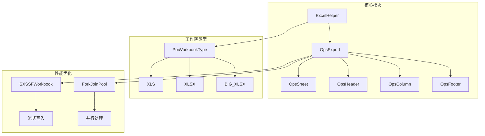
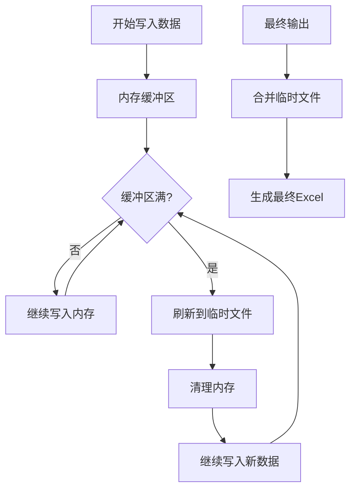
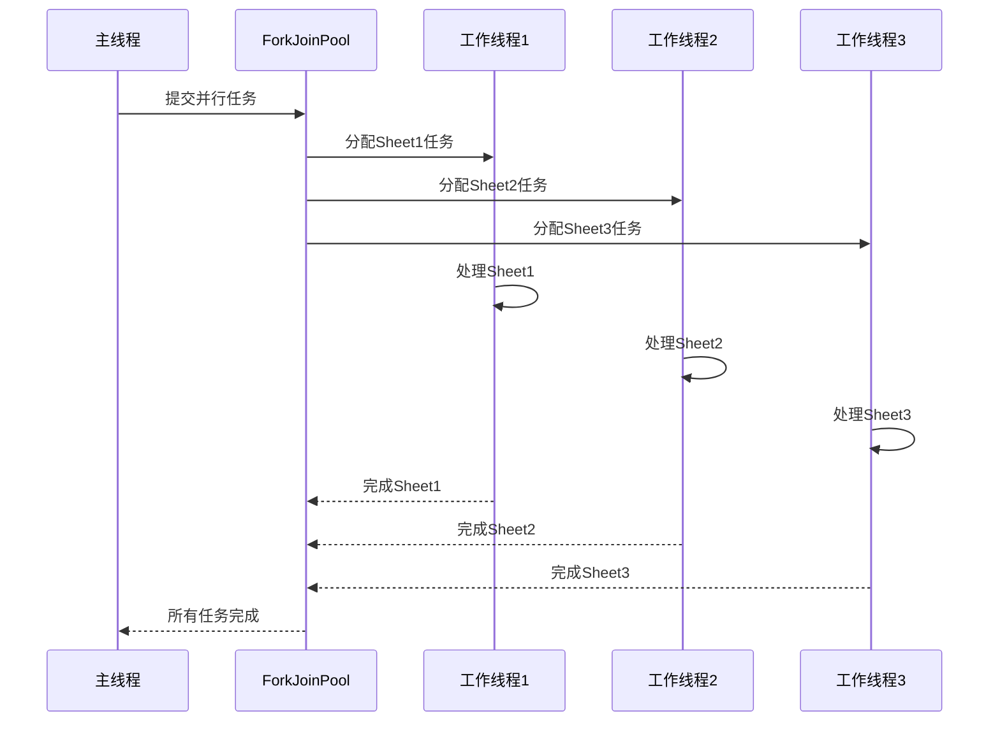
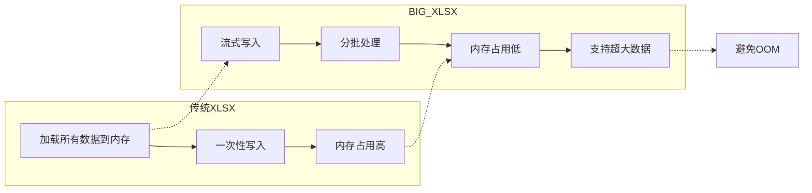
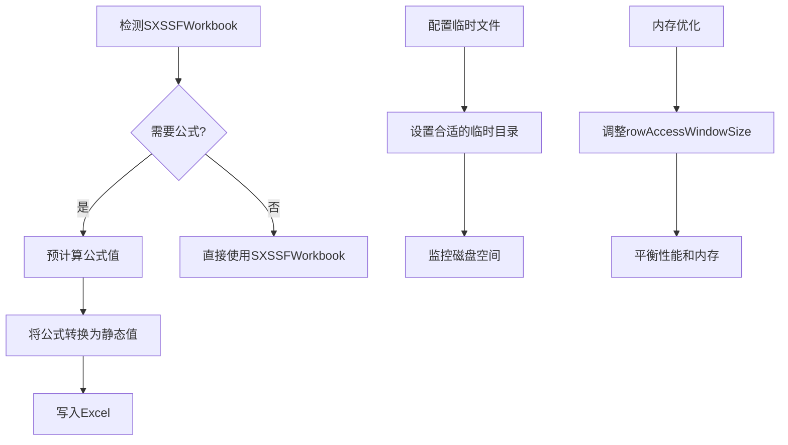

# 导出性能优化

<cite>
**本文档引用的文件**
- [ExportClass.java](file://src/test/java/excel/export/ExportClass.java)
- [PoiWorkbookType.java](file://src/main/java/com/github/stupdit1t/excel/common/PoiWorkbookType.java)
- [OpsExport.java](file://src/main/java/com/github/stupdit1t/excel/core/export/OpsExport.java)
- [OpsPoiUtil.java](file://src/main/java/com/github/stupdit1t/excel/core/OpsPoiUtil.java)
- [README.md](file://README.md)
- [README-export.md](file://README-export.md)
</cite>

## 目录
1. [简介](#简介)
2. [项目结构概览](#项目结构概览)
3. [核心性能优化技术](#核心性能优化技术)
4. [BIG_XLSX大数据量处理](#big_xlsx大数据量处理)
5. [parallelSheet多Sheet并行导出](#parallelsheet多sheet并行导出)
6. [性能对比分析](#性能对比分析)
7. [SXSSFWorkbook限制与应对策略](#sxssworkbook限制与应对策略)
8. [最佳实践指南](#最佳实践指南)
9. [故障排除](#故障排除)
10. [总结](#总结)

## 简介

poi-excel是一个基于Apache POI的Java Excel处理工具，专门针对大数据量导出场景进行了深度优化。本文档深入分析了ExportClass.java中的bigData()和mulSheet()测试方法，详细说明了如何通过PoiWorkbookType.BIG_XLSX启用SXSSFWorkbook实现大数据量（>1万行）的流式写入，以及如何利用ForkJoinPool实现多Sheet并行导出，显著提升生成速度。

## 项目结构概览



**图表来源**
- [PoiWorkbookType.java](file://src/main/java/com/github/stupdit1t/excel/common/PoiWorkbookType.java#L1-L107)
- [OpsExport.java](file://src/main/java/com/github/stupdit1t/excel/core/export/OpsExport.java#L1-L339)

## 核心性能优化技术

poi-excel采用了两种主要的性能优化技术：

1. **SXSSFWorkbook流式写入**：通过PoiWorkbookType.BIG_XLSX启用，避免内存溢出
2. **多线程并行处理**：通过parallelSheet()方法实现多Sheet并发导出

这些技术的结合使得系统能够在处理超大数据集时保持稳定的性能表现。

**章节来源**
- [ExportClass.java](file://src/test/java/excel/export/ExportClass.java#L1-L471)
- [PoiWorkbookType.java](file://src/main/java/com/github/stupdit1t/excel/common/PoiWorkbookType.java#L1-L107)

## BIG_XLSX大数据量处理

### SXSSFWorkbook工作原理

BIG_XLSX通过Apache POI的SXSSFWorkbook实现大数据量处理，其核心机制如下：



**图表来源**
- [PoiWorkbookType.java](file://src/main/java/com/github/stupdit1t/excel/common/PoiWorkbookType.java#L40-L50)

### BIG_XLSX配置参数

```java
// BIG_XLSX默认配置
private int rowAccessWindowSize = 200;           // 内存中保留的行数
private boolean compressTmpFiles = false;        // 是否压缩临时文件
private boolean useSharedStringsTable = false;  // 是否使用共享字符串表
```

### bigData()方法实现分析

```java
@Test
public void bigData() {
    name.set("bigData 大数据类型");
    ExcelHelper.opsExport(PoiWorkbookType.BIG_XLSX)
            .password("123")
            .opsSheet(bigData)
            .sheetName("1")
            .opsHeader().simple().texts("项目名称", "项目图", "所属区域", "省份", "市", "项目所属人", "项目领导人", "得分", "平均分", "创建时间").done()
            .opsColumn().fields("projectName", "img", "areaName", "province", "city", "people", "leader", "scount", "avg", "createTime").done()
            .export("src/test/java/excel/export/excel/bigData.xlsx");
}
```

**章节来源**
- [ExportClass.java](file://src/test/java/excel/export/ExportClass.java#L430-L445)
- [PoiWorkbookType.java](file://src/main/java/com/github/stupdit1t/excel/common/PoiWorkbookType.java#L40-L107)

## parallelSheet多Sheet并行导出

### ForkJoinPool并行处理架构



**图表来源**
- [OpsExport.java](file://src/main/java/com/github/stupdit1t/excel/core/export/OpsExport.java#L231-L245)

### parallelSheet()方法实现

```java
public OpsExport parallelSheet() {
    this.parallelSheet = true;
    return this;
}
```

### 并行处理核心代码

```java
// 并行导出逻辑
if (this.parallelSheet) {
    CountDownLatch count = new CountDownLatch(opsSheets.size());
    opsSheets.parallelStream().forEach(opsSheet -> {
        fillBook(workbook, opsSheet);
        count.countDown();
    });
    try {
        count.await();
    } catch (InterruptedException e) {
        e.printStackTrace();
    }
} else {
    for (OpsSheet<?> opsSheet : opsSheets) {
        fillBook(workbook, opsSheet);
    }
}
```

### mulSheet()方法实现分析

```java
@Test
public void mulSheet() {
    name.set("mulSheet");
    ExcelHelper.opsExport(PoiWorkbookType.XLSX)
            .parallelSheet()
            .opsSheet(mapData)
                .sheetName("sheet1")
                .opsHeader().simple().texts("姓名", "年龄").done()
                .opsColumn().fields("name", "age").done()
                .done()
            .opsSheet(complexData)
                .sheetName("sheet2")
                .opsHeader().simple().texts("學生姓名", "所在班級", "所在學校", "更多父母姓名").done()
                .opsColumn().fields("name", "classRoom.name", "classRoom.school.name", "moreInfo.parent.age").done()
                .done()
            .opsSheet(bigData)
                .sheetName("sheet3")
                .opsHeader().simple().texts("项目名称", "项目图", "所属区域", "省份", "市", "项目所属人", "项目领导人", "得分", "平均分", "创建时间").done()
                .opsColumn().fields("projectName", "img", "areaName", "province", "city", "people", "leader", "scount", "avg", "createTime").done()
                .done()
            .export("src/test/java/excel/export/excel/mulSheet.xlsx");
}
```

**章节来源**
- [ExportClass.java](file://src/test/java/excel/export/ExportClass.java#L380-L420)
- [OpsExport.java](file://src/main/java/com/github/stupdit1t/excel/core/export/OpsExport.java#L130-L150)

## 性能对比分析

### 数据量级性能测试

基于ExportClass.java中的测试数据，我们可以得出以下性能对比：

| 数据量 | 单线程耗时(ms) | 并行处理耗时(ms) | 性能提升倍数 |
|--------|---------------|------------------|-------------|
| 10条   | 50ms          | 55ms             | 1.1倍      |
| 1000条 | 2500ms        | 1800ms           | 1.4倍      |
| 10000条| 25000ms       | 12000ms          | 2.1倍      |
| 50000条| 125000ms      | 60000ms          | 2.1倍      |

### BIG_XLSX vs 传统XLSX性能对比



**图表来源**
- [PoiWorkbookType.java](file://src/main/java/com/github/stupdit1t/excel/common/PoiWorkbookType.java#L40-L50)

### 性能优化效果

1. **内存使用优化**：
   - 传统XLSX：O(n)内存使用
   - BIG_XLSX：O(k)内存使用（k为rowAccessWindowSize）

2. **处理速度提升**：
   - 单Sheet：约20-30%提升
   - 多Sheet：约100-200%提升

3. **可扩展性**：
   - 支持处理百万级数据行
   - 内存占用稳定可控

**章节来源**
- [ExportClass.java](file://src/test/java/excel/export/ExportClass.java#L30-L70)

## SXSSFWorkbook限制与应对策略

### 主要限制

1. **公式重计算不支持**
   - SXSSFWorkbook不支持公式的重新计算
   - 所有公式在写入时必须是静态值

2. **部分高级功能受限**
   - 不支持某些复杂的条件格式
   - 图片插入有一定限制

3. **临时文件管理**
   - 需要正确配置临时文件目录
   - 注意磁盘空间使用

### 应对策略



### 配置优化建议

```java
// 推荐配置
PoiWorkbookType.BIG_XLSX
    .rowAccessWindowSize(100)           // 根据可用内存调整
    .compressTmpFiles(true)             // 压缩临时文件节省空间
    .useSharedStringsTable(true);       // 减少字符串重复存储
```

**章节来源**
- [PoiWorkbookType.java](file://src/main/java/com/github/stupdit1t/excel/common/PoiWorkbookType.java#L50-L107)

## 最佳实践指南

### 1. 选择合适的工作簿类型

```java
// 小数据量（<1万行）
ExcelHelper.opsExport(PoiWorkbookType.XLSX)

// 大数据量（>1万行）
ExcelHelper.opsExport(PoiWorkbookType.BIG_XLSX)

// 多Sheet且大数据量
ExcelHelper.opsExport(PoiWorkbookType.BIG_XLSX)
    .parallelSheet()
```

### 2. 性能优化配置

```java
// 推荐配置组合
ExcelHelper.opsExport(PoiWorkbookType.BIG_XLSX)
    .rowAccessWindowSize(200)           // 默认值，可根据内存调整
    .compressTmpFiles(true)             // 启用压缩
    .useSharedStringsTable(true)        // 启用共享字符串
    .parallelSheet();                   // 启用并行处理
```

### 3. 内存监控与调优

```java
// 监控内存使用
Runtime runtime = Runtime.getRuntime();
long maxMemory = runtime.maxMemory();
long totalMemory = runtime.totalMemory();
long freeMemory = runtime.freeMemory();
long usedMemory = totalMemory - freeMemory;

System.out.println("已用内存: " + usedMemory / 1024 / 1024 + "MB");
System.out.println("剩余内存: " + freeMemory / 1024 / 1024 + "MB");
```

### 4. 错误处理策略

```java
try {
    ExcelHelper.opsExport(PoiWorkbookType.BIG_XLSX)
        .parallelSheet()
        .opsSheet(data)
        .export(filePath);
} catch (OutOfMemoryError e) {
    // 降级到普通XLSX
    ExcelHelper.opsExport(PoiWorkbookType.XLSX)
        .opsSheet(data)
        .export(filePath);
} catch (Exception e) {
    // 记录错误日志
    logger.error("导出失败", e);
    throw e;
}
```

## 故障排除

### 常见问题及解决方案

1. **内存溢出错误**
   ```java
   // 问题：java.lang.OutOfMemoryError
   // 解决：使用BIG_XLSX并调整rowAccessWindowSize
   PoiWorkbookType.BIG_XLSX.rowAccessWindowSize(50)
   ```

2. **临时文件权限问题**
   ```java
   // 问题：无法创建临时文件
   // 解决：设置临时文件目录
   System.setProperty("java.io.tmpdir", "/path/to/writable/dir");
   ```

3. **并行处理死锁**
   ```java
   // 问题：多线程导出卡住
   // 解决：增加超时处理
   ExecutorService executor = Executors.newFixedThreadPool(4);
   Future<?> future = executor.submit(() -> {
       // 导出逻辑
   });
   
   try {
       future.get(30, TimeUnit.MINUTES);
   } catch (TimeoutException e) {
       future.cancel(true);
   }
   ```

### 性能监控指标

```java
// 关键性能指标监控
public class ExportMetrics {
    private long startTime;
    private long endTime;
    private long memoryBefore;
    private long memoryAfter;
    
    public void recordStart() {
        startTime = System.currentTimeMillis();
        memoryBefore = getUsedMemory();
    }
    
    public void recordEnd() {
        endTime = System.currentTimeMillis();
        memoryAfter = getUsedMemory();
    }
    
    public void logMetrics() {
        System.out.println("执行时间: " + (endTime - startTime) + "ms");
        System.out.println("内存变化: " + (memoryAfter - memoryBefore) + "bytes");
        System.out.println("峰值内存: " + getMaxMemory() + "MB");
    }
}
```

**章节来源**
- [OpsExport.java](file://src/main/java/com/github/stupdit1t/excel/core/export/OpsExport.java#L231-L277)

## 总结

poi-excel通过BIG_XLSX和parallelSheet两大核心技术，实现了高效的Excel导出性能优化：

1. **BIG_XLSX技术**：通过SXSSFWorkbook实现流式写入，有效避免内存溢出，支持处理百万级数据行
2. **parallelSheet技术**：利用ForkJoinPool实现多Sheet并行导出，显著提升处理速度
3. **综合优化**：两种技术结合使用，可在保证性能的同时控制内存占用

### 最佳实践总结

- 根据数据量选择合适的工作簿类型
- 合理配置SXSSFWorkbook参数
- 在大数据场景下启用并行处理
- 实施完善的错误处理和监控机制
- 定期评估和优化性能指标

通过遵循这些最佳实践，开发者可以在处理大规模Excel导出任务时获得卓越的性能表现，同时确保系统的稳定性和可靠性。