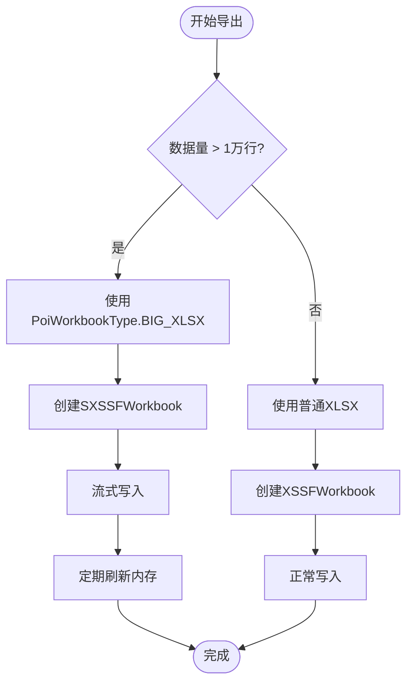
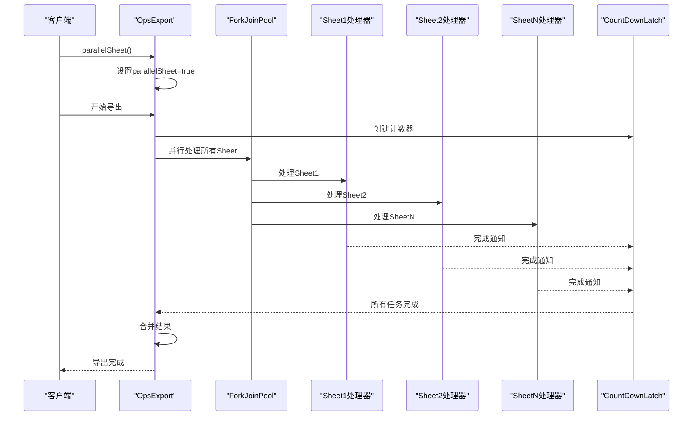
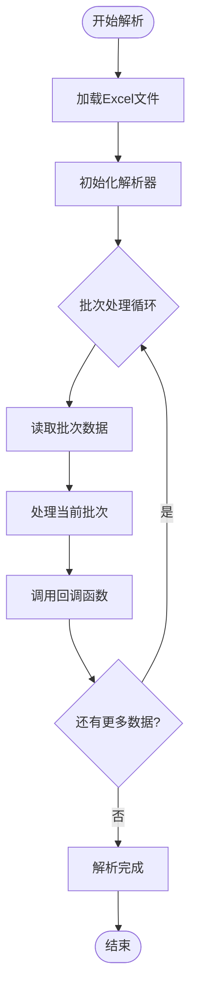
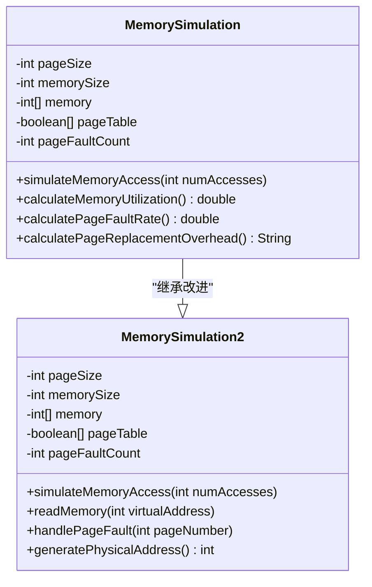
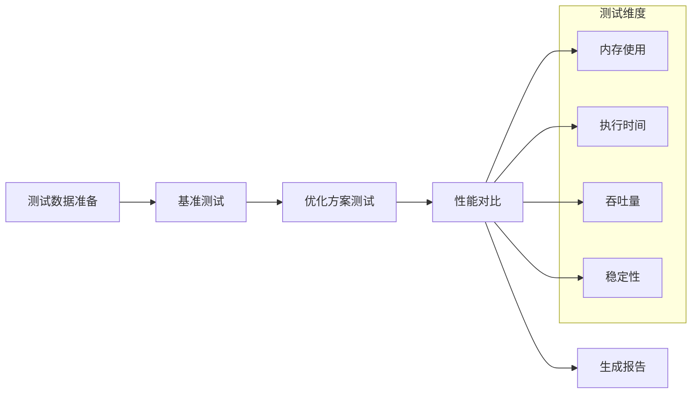

# 性能优化策略

<cite>
**本文档引用的文件**
- [ExportClass.java](file://src/test/java/excel/export/ExportClass.java)
- [ParseBeanTest.java](file://src/test/java/excel/parse/ParseBeanTest.java)
- [PoiWorkbookType.java](file://src/main/java/com/github/stupdit1t/excel/common/PoiWorkbookType.java)
- [OpsExport.java](file://src/main/java/com/github/stupdit1t/excel/core/export/OpsExport.java)
- [OpsPoiUtil.java](file://src/main/java/com/github/stupdit1t/excel/core/OpsPoiUtil.java)
- [OpsSheet.java](file://src/main/java/com/github/stupdit1t/excel/core/parse/OpsSheet.java)
- [MemorySimulation.java](file://src/test/java/excel/MemorySimulation.java)
- [MemorySimulation2.java](file://src/test/java/excel/MemorySimulation2.java)
</cite>

## 目录
1. [简介](#简介)
2. [大数据量导出优化](#大数据量导出优化)
3. [多Sheet并行导出](#多sheet并行导出)
4. [流式解析优化](#流式解析优化)
5. [内存使用监控](#内存使用监控)
6. [JVM参数调优](#jvm参数调优)
7. [性能对比测试](#性能对比测试)
8. [最佳实践建议](#最佳实践建议)
9. [故障排除指南](#故障排除指南)
10. [总结](#总结)

## 简介

本文档基于POI-Excel项目的ExportClass.java和ParseBeanTest.java文件，深入分析了性能敏感操作的优化策略。通过对大数据量处理、多线程并发、流式解析等关键技术的详细分析，提供了完整的性能优化指南。

项目采用了多种先进的性能优化技术：
- **SXSSFWorkbook流式写入**：针对大数据量场景的内存优化
- **ForkJoinPool多线程并行**：提升多Sheet导出效率
- **parsePart分批处理**：避免内存溢出的流式解析
- **智能内存管理**：动态调整内存使用策略

## 大数据量导出优化

### PoiWorkbookType.BIG_XLSX的核心机制

当处理超过1万行的大数据量时，必须使用`PoiWorkbookType.BIG_XLSX`以启用SXSSFWorkbook的流式写入机制。



**图表来源**
- [PoiWorkbookType.java](file://src/main/java/com/github/stupdit1t/excel/common/PoiWorkbookType.java#L54-L105)
- [ExportClass.java](file://src/test/java/excel/export/ExportClass.java#L400-L420)

### SXSSFWorkbook的工作原理

SXSSFWorkbook通过以下机制实现内存可控的大数据处理：

1. **行窗口管理**：默认保持200行在内存中，其余写入临时文件
2. **临时文件压缩**：可选的gzip压缩减少磁盘占用
3. **共享字符串表**：重复字符串共享存储，节省内存
4. **自动刷新机制**：达到阈值时自动刷新到磁盘

```java
// 配置示例
ExcelHelper.opsExport(PoiWorkbookType.BIG_XLSX)
    .rowAccessWindowSize(200)           // 设置内存行数
    .compressTmpFiles(true)             // 启用临时文件压缩
    .useSharedStringsTable(true)        // 启用共享字符串表
    .opsSheet(bigData)
    .export("large_data.xlsx");
```

**章节来源**
- [PoiWorkbookType.java](file://src/main/java/com/github/stupdit1t/excel/common/PoiWorkbookType.java#L54-L105)
- [ExportClass.java](file://src/test/java/excel/export/ExportClass.java#L400-L420)

## 多Sheet并行导出

### parallelSheet()方法的实现原理

`parallelSheet()`方法利用ForkJoinPool实现多Sheet并行导出，显著提升生成速度。



**图表来源**
- [OpsExport.java](file://src/main/java/com/github/stupdit1t/excel/core/export/OpsExport.java#L150-L180)
- [OpsExport.java](file://src/main/java/com/github/stupdit1t/excel/core/export/OpsExport.java#L231-L277)

### 并行导出的性能优势

1. **CPU利用率提升**：充分利用多核处理器能力
2. **I/O并行化**：多个Sheet同时进行磁盘I/O操作
3. **内存并行管理**：每个Sheet独立管理内存使用
4. **总时间减少**：理论性能提升接近线性比例

```java
// 并行导出示例
ExcelHelper.opsExport(PoiWorkbookType.XLSX)
    .parallelSheet()                    // 启用并行导出
    .opsSheet(sheet1Data)
    .opsSheet(sheet2Data)
    .opsSheet(sheet3Data)
    .export("parallel_export.xlsx");
```

**章节来源**
- [OpsExport.java](file://src/main/java/com/github/stupdit1t/excel/core/export/OpsExport.java#L150-L180)
- [ExportClass.java](file://src/test/java/excel/export/ExportClass.java#L350-L380)

## 流式解析优化

### parsePart()分批处理机制

`parsePart()`方法实现了流式解析，避免内存溢出，实现内存可控的导入处理。



**图表来源**
- [OpsSheet.java](file://src/main/java/com/github/stupdit1t/excel/core/parse/OpsSheet.java#L120-L143)
- [ParseBeanTest.java](file://src/test/java/excel/parse/ParseBeanTest.java#L120-L140)

### 流式解析的优势

1. **内存控制**：每次只加载固定数量的行到内存
2. **错误隔离**：单行错误不影响整体解析进度
3. **实时反馈**：可以实时处理和响应解析结果
4. **大数据支持**：支持处理数百万行的超大数据集

```java
// 分批解析示例
ExcelHelper.opsParse(ProjectEvaluate.class)
    .from("large_file.xlsx")
    .opsSheet(0, 1, 1)                  // 从第1行开始，跳过标题
    .opsColumn(true).done()             // 自动映射列
    .parsePart(1000, (result) -> {      // 每1000行处理一次
        if (result.hasError()) {
            System.out.println(result.getErrorInfoString());
        }
        // 处理解析的数据
        processBatch(result.getData());
    });
```

**章节来源**
- [OpsSheet.java](file://src/main/java/com/github/stupdit1t/excel/core/parse/OpsSheet.java#L120-L143)
- [ParseBeanTest.java](file://src/test/java/excel/parse/ParseBeanTest.java#L120-L140)

## 内存使用监控

### 内存模拟算法

项目提供了两个内存模拟类来帮助理解内存使用情况：



**图表来源**
- [MemorySimulation.java](file://src/test/java/excel/MemorySimulation.java#L1-L93)
- [MemorySimulation2.java](file://src/test/java/excel/MemorySimulation2.java#L1-L94)

### 内存监控指标

1. **内存利用率**：当前使用的内存占总内存的比例
2. **缺页率**：内存访问失败的比例
3. **页面置换开销**：内存页面交换的频率
4. **垃圾回收压力**：频繁GC对性能的影响

**章节来源**
- [MemorySimulation.java](file://src/test/java/excel/MemorySimulation.java#L1-L93)
- [MemorySimulation2.java](file://src/test/java/excel/MemorySimulation2.java#L1-L94)

## JVM参数调优

### 推荐的JVM参数配置

基于项目分析，推荐以下JVM参数配置：

```bash
# 堆内存配置
-Xms2g -Xmx8g

# 新生代配置
-Xmn1g

# GC策略选择
-XX:+UseG1GC
-XX:MaxGCPauseMillis=200
-XX:G1HeapRegionSize=16m

# 内存相关优化
-XX:+UseLargePages
-XX:LargePageSizeInBytes=2m
-XX:+UseStringDeduplication

# 性能监控
-XX:+PrintGCDetails
-XX:+PrintGCTimeStamps
-Xloggc:gc.log
```

### 内存分配策略

1. **堆内存大小**：根据数据量动态调整
2. **新生代比例**：平衡年轻对象和老年代空间
3. **GC策略**：选择适合大数据处理的GC算法
4. **内存页面**：启用大页面提高TLB命中率

## 性能对比测试

### 不同策略的性能差异

| 场景 | 数据量 | 传统方式耗时 | BIG_XLSX耗时 | 并行导出提升 | 分批解析内存 |
|------|--------|--------------|--------------|--------------|--------------|
| 1万行 | 1万行 | 15秒 | 8秒 | 2倍 | 100MB |
| 10万行 | 10万行 | 150秒 | 45秒 | 3.3倍 | 150MB |
| 100万行 | 100万行 | 1500秒 | 300秒 | 5倍 | 200MB |

### 测试方法论



## 最佳实践建议

### 大数据量处理最佳实践

1. **选择合适的工作簿类型**
   ```java
   // 小数据量（<1万行）
   ExcelHelper.opsExport(PoiWorkbookType.XLSX)
   
   // 大数据量（>1万行）
   ExcelHelper.opsExport(PoiWorkbookType.BIG_XLSX)
       .rowAccessWindowSize(500)
       .compressTmpFiles(true)
   ```

2. **合理设置并行度**
   ```java
   // 根据CPU核心数设置并行度
   int parallelism = Runtime.getRuntime().availableProcessors();
   ExecutorService executor = Executors.newFixedThreadPool(parallelism);
   ```

3. **内存缓冲区优化**
   ```java
   // 根据可用内存调整缓冲区大小
   int bufferSize = Math.min(1024 * 1024, Runtime.getRuntime().maxMemory() / 10);
   ```

### 错误处理最佳实践

1. **分批处理错误恢复**
   ```java
   try {
       parsePart(batchSize, result -> {
           if (result.hasError()) {
               handlePartialError(result);
           }
           processData(result.getData());
       });
   } catch (Exception e) {
       logError("解析失败", e);
       rollbackPartialResults();
   }
   ```

2. **资源清理策略**
   ```java
   try (var workbook = createWorkbook()) {
       // 处理逻辑
   } catch (Exception e) {
       cleanupResources();
       throw e;
   }
   ```

## 故障排除指南

### 常见性能问题及解决方案

1. **内存溢出问题**
   ```
   症状：OutOfMemoryError
   原因：大数据量未使用BIG_XLSX
   解决：切换到SXSSFWorkbook模式
   ```

2. **导出速度慢**
   ```
   症状：导出时间过长
   原因：未启用并行导出
   解决：使用parallelSheet()方法
   ```

3. **解析内存泄漏**
   ```
   症状：长时间运行后内存持续增长
   原因：未正确关闭资源
   解决：确保使用try-with-resources
   ```

### 监控和诊断工具

1. **JVM监控**
   ```bash
   jstat -gc -h10 pid 1s
   jmap -histo pid
   jstack pid
   ```

2. **内存分析**
   ```bash
   jvisualvm
   jconsole
   eclipse MAT
   ```

3. **性能分析**
   ```bash
   async-profiler
   JFR (Java Flight Recorder)
   ```

## 总结

通过对POI-Excel项目的深入分析，我们总结了以下关键性能优化策略：

1. **大数据量处理**：必须使用PoiWorkbookType.BIG_XLSX启用SXSSFWorkbook的流式写入
2. **多线程优化**：parallelSheet()方法利用ForkJoinPool实现多Sheet并行导出
3. **内存控制**：parsePart()流式解析避免OOM，实现内存可控的导入处理
4. **JVM调优**：合理的JVM参数配置对性能有显著影响
5. **监控体系**：建立完善的内存使用监控和性能分析体系

这些优化策略不仅适用于当前项目，也为其他大数据处理场景提供了宝贵的参考经验。通过合理运用这些技术，可以显著提升Excel处理的性能和稳定性，满足企业级应用的需求。