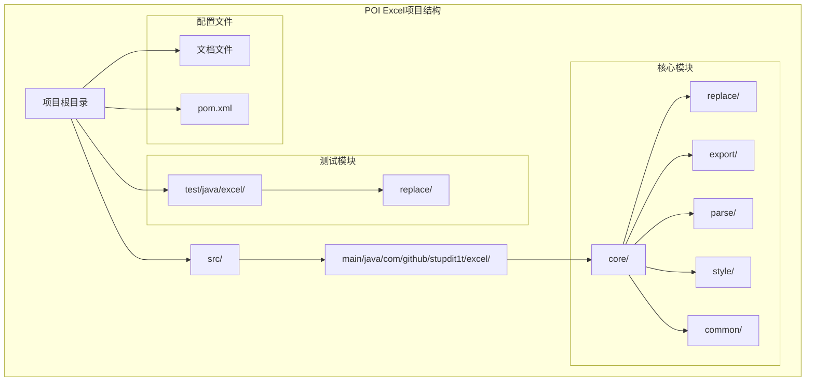
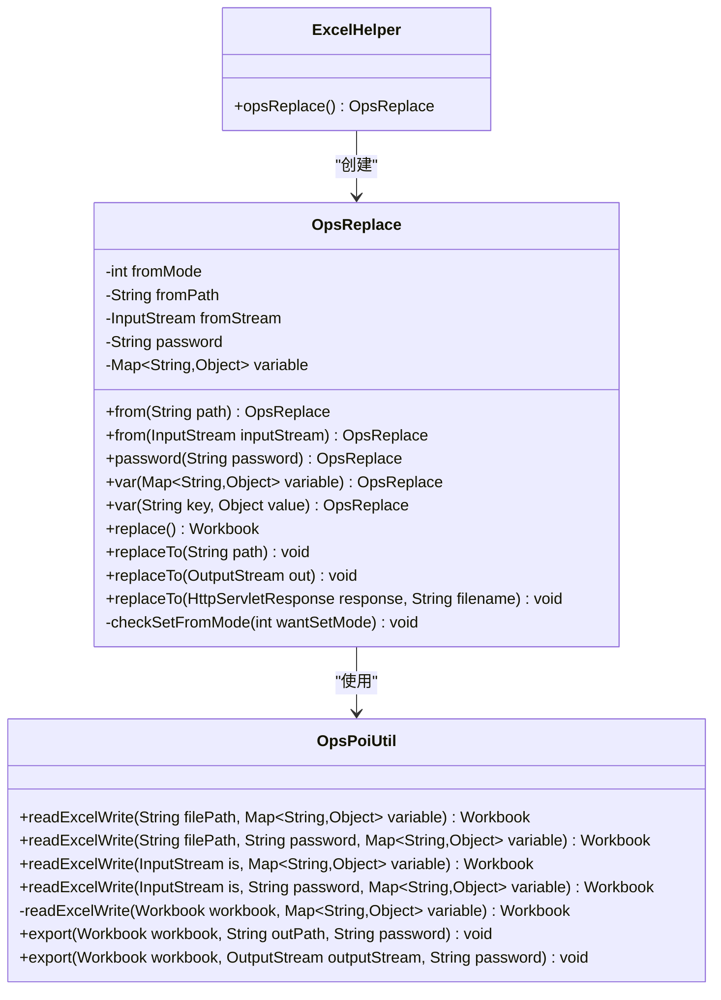
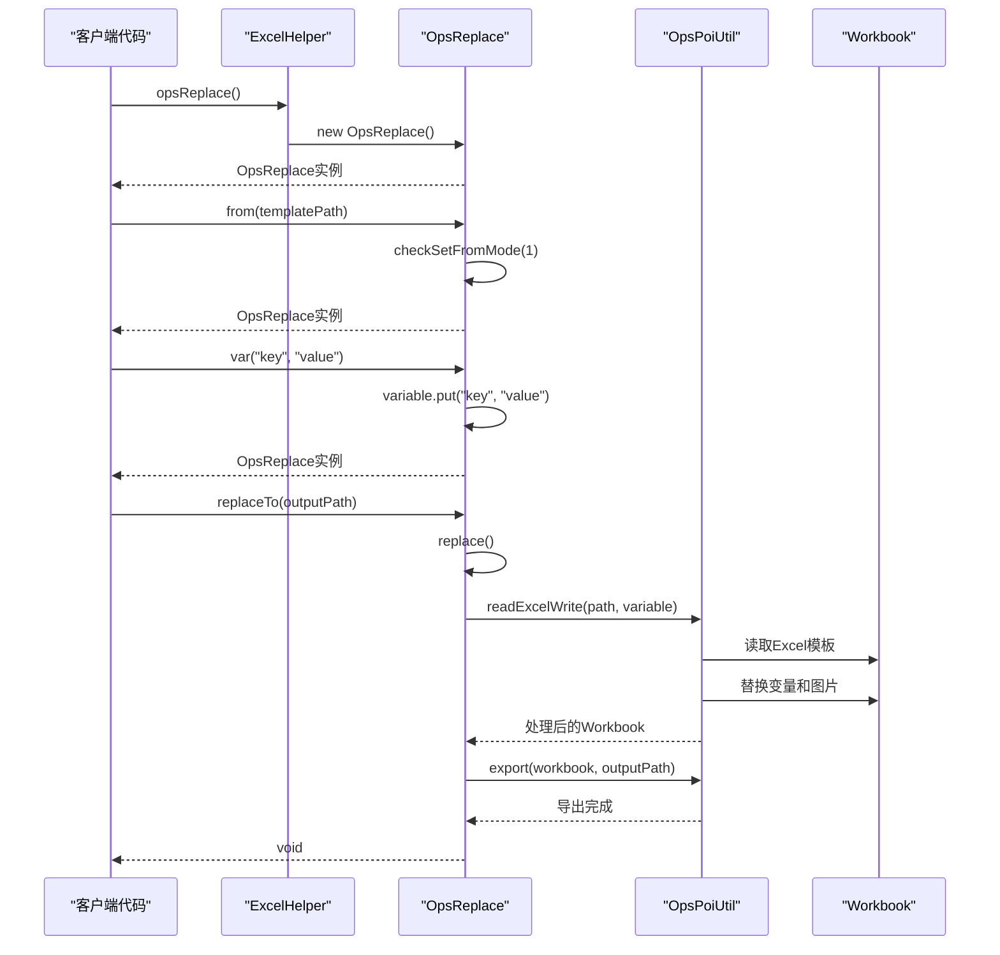
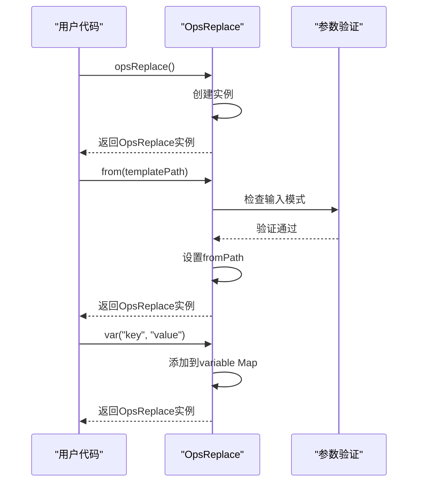
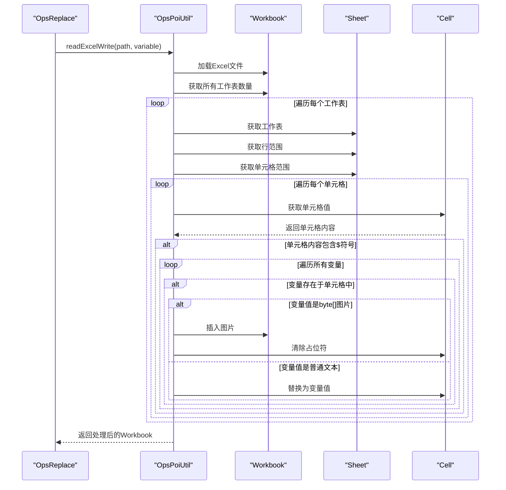
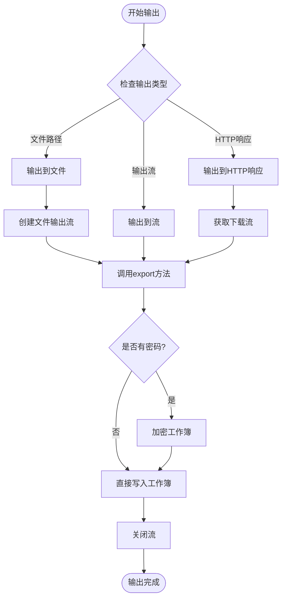

# 模板替换功能详细文档

<cite>
**本文档引用的文件**
- [OpsReplace.java](file://src/main/java/com/github/stupdit1t/excel/core/replace/OpsReplace.java)
- [OpsPoiUtil.java](file://src/main/java/com/github/stupdit1t/excel/core/OpsPoiUtil.java)
- [ExcelHelper.java](file://src/main/java/com/github/stupdit1t/excel/core/ExcelHelper.java)
- [ReplaceClass.java](file://src/test/java/excel/replace/ReplaceClass.java)
- [README-export.md](file://README-export.md)
- [README.md](file://README.md)
- [PoiCommon.java](file://src/main/java/com/github/stupdit1t/excel/common/PoiCommon.java)
</cite>

## 目录
1. [简介](#简介)
2. [项目结构概览](#项目结构概览)
3. [核心组件分析](#核心组件分析)
4. [架构概览](#架构概览)
5. [详细组件分析](#详细组件分析)
6. [工作流程详解](#工作流程详解)
7. [功能特性](#功能特性)
8. [使用示例](#使用示例)
9. [性能考虑](#性能考虑)
10. [故障排除指南](#故障排除指南)
11. [总结](#总结)

## 简介

POI Excel模板替换功能是一个基于Apache POI的Java工具，专门用于处理Excel模板中的变量替换。该功能允许用户通过简单的API调用来替换Excel模板中的占位符变量，并支持图片插入，从而实现标准化报告、合同等文档的自动化生成。

与传统的导出功能不同，模板替换功能专注于纯粹的字符串和图片替换，不涉及复杂的数据模型定义和业务逻辑处理。这种设计使得它特别适用于需要快速生成标准化文档的场景。

## 项目结构概览

POI Excel项目采用模块化的架构设计，模板替换功能位于专门的`replace`包中：



**图表来源**
- [OpsReplace.java](file://src/main/java/com/github/stupdit1t/excel/core/replace/OpsReplace.java#L1-L168)
- [ExcelHelper.java](file://src/main/java/com/github/stupdit1t/excel/core/ExcelHelper.java#L1-L52)

**章节来源**
- [README.md](file://README.md#L1-L77)

## 核心组件分析

模板替换功能的核心组件包括以下几个关键类：

### OpsReplace类

OpsReplace是模板替换功能的主要入口类，提供了流畅的API链式调用：



**图表来源**
- [OpsReplace.java](file://src/main/java/com/github/stupdit1t/excel/core/replace/OpsReplace.java#L15-L168)
- [OpsPoiUtil.java](file://src/main/java/com/github/stupdit1t/excel/core/OpsPoiUtil.java#L1154-L1221)
- [ExcelHelper.java](file://src/main/java/com/github/stupdit1t/excel/core/ExcelHelper.java#L48-L52)

**章节来源**
- [OpsReplace.java](file://src/main/java/com/github/stupdit1t/excel/core/replace/OpsReplace.java#L1-L168)
- [OpsPoiUtil.java](file://src/main/java/com/github/stupdit1t/excel/core/OpsPoiUtil.java#L1154-L1221)

## 架构概览

模板替换功能采用了经典的工厂模式和建造者模式相结合的设计：



**图表来源**
- [OpsReplace.java](file://src/main/java/com/github/stupdit1t/excel/core/replace/OpsReplace.java#L56-L167)
- [OpsPoiUtil.java](file://src/main/java/com/github/stupdit1t/excel/core/OpsPoiUtil.java#L1154-L1221)

## 详细组件分析

### OpsReplace类详细分析

OpsReplace类是模板替换功能的核心控制器，负责管理整个替换流程：

#### 核心属性

- **fromMode**: 文件来源模式（1表示路径，2表示流）
- **fromPath**: 模板文件路径
- **fromStream**: 模板文件输入流
- **password**: 模板文件密码
- **variable**: 存储所有要替换的变量键值对

#### 关键方法分析

##### 1. 输入源设置方法

```java
public OpsReplace from(String path)
public OpsReplace from(InputStream inputStream)
```

这两个方法分别用于设置模板文件的路径或输入流，通过`checkSetFromMode()`方法确保只能设置一种输入方式。

##### 2. 变量设置方法

```java
public OpsReplace var(Map<String, Object> variable)
public OpsReplace var(String key, Object value)
```

这些方法允许用户以多种方式设置替换变量：
- 批量设置：传入Map对象
- 单个设置：传入键值对

##### 3. 替换执行方法

```java
public Workbook replace()
public void replaceTo(String path)
public void replaceTo(OutputStream out)
public void replaceTo(HttpServletResponse response, String filename)
```

这些方法提供了不同的输出方式：
- `replace()`: 返回处理后的Workbook对象
- `replaceTo()`: 直接输出到文件、流或HTTP响应

**章节来源**
- [OpsReplace.java](file://src/main/java/com/github/stupdit1t/excel/core/replace/OpsReplace.java#L15-L168)

### OpsPoiUtil核心处理方法

OpsPoiUtil类中的`readExcelWrite`方法是模板替换功能的核心处理逻辑：

```mermaid
flowchart TD
Start([开始处理]) --> GetSheets["获取所有工作表"]
GetSheets --> LoopSheets["遍历每个工作表"]
LoopSheets --> GetRows["获取行范围"]
GetRows --> LoopRows["遍历每行"]
LoopRows --> GetCells["获取单元格范围"]
GetCells --> LoopCells["遍历每个单元格"]
LoopCells --> CheckCellType{"检查单元格类型"}
CheckCellType --> |字符串类型| CheckContains{"是否包含$符号?"}
CheckCellType --> |非字符串| NextCell["下一个单元格"]
CheckContains --> |否| NextCell
CheckContains --> |是| LoopVars["遍历变量集合"]
LoopVars --> CheckVar{"变量是否存在?"}
CheckVar --> |否| NextVar["下一个变量"]
CheckVar --> |是| CheckValueType{"检查变量值类型"}
CheckValueType --> |byte[]类型| InsertImage["插入图片"]
CheckValueType --> |其他类型| ReplaceText["替换文本"]
InsertImage --> ClearPlaceholder["清除占位符"]
ReplaceText --> SetCellValue["设置单元格值"]
ClearPlaceholder --> NextCell
SetCellValue --> NextCell
NextVar --> CheckMoreVars{"还有更多变量?"}
CheckMoreVars --> |是| LoopVars
CheckMoreVars --> |否| NextCell
NextCell --> MoreCells{"还有更多单元格?"}
MoreCells --> |是| LoopCells
MoreCells --> |否| NextRow["下一行"]
NextRow --> MoreRows{"还有更多行?"}
MoreRows --> |是| LoopRows
MoreRows --> |否| NextSheet["下一工作表"]
NextSheet --> MoreSheets{"还有更多工作表?"}
MoreSheets --> |是| LoopSheets
MoreSheets --> |否| ReturnWorkbook["返回处理后的Workbook"]
ReturnWorkbook --> End([结束])
```

**图表来源**
- [OpsPoiUtil.java](file://src/main/java/com/github/stupdit1t/excel/core/OpsPoiUtil.java#L1221-L1300)

**章节来源**
- [OpsPoiUtil.java](file://src/main/java/com/github/stupdit1t/excel/core/OpsPoiUtil.java#L1221-L1300)

## 工作流程详解

模板替换功能的工作流程可以分为以下几个阶段：

### 1. 初始化阶段



**图表来源**
- [OpsReplace.java](file://src/main/java/com/github/stupdit1t/excel/core/replace/OpsReplace.java#L56-L85)

### 2. 变量替换阶段

当调用`replace()`或`replaceTo()`方法时，系统会执行以下步骤：



**图表来源**
- [OpsPoiUtil.java](file://src/main/java/com/github/stupdit1t/excel/core/OpsPoiUtil.java#L1221-L1300)

### 3. 输出阶段

根据不同的输出方式，系统会执行相应的导出操作：



**图表来源**
- [OpsPoiUtil.java](file://src/main/java/com/github/stupdit1t/excel/core/OpsPoiUtil.java#L130-L180)

**章节来源**
- [OpsReplace.java](file://src/main/java/com/github/stupdit1t/excel/core/replace/OpsReplace.java#L118-L167)
- [OpsPoiUtil.java](file://src/main/java/com/github/stupdit1t/excel/core/OpsPoiUtil.java#L130-L180)

## 功能特性

### 1. 变量替换功能

模板替换功能支持两种类型的变量替换：

#### 文本变量替换
- 支持任意类型的Java对象自动转换为字符串
- 使用`${key}`语法作为占位符
- 支持公式表达式（以`=`开头）

#### 图片变量替换
- 支持byte[]类型的图片数据
- 自动识别并插入图片到指定单元格位置
- 支持XLS和XLSX格式的图片插入

### 2. 密码保护支持

```java
// 设置模板密码
OpsReplace opsReplace = ExcelHelper.opsReplace()
    .from("template.xlsx")
    .password("secret");

// 替换变量并输出
opsReplace
    .var("projectName", "项目A")
    .replaceTo("output.xlsx");
```

### 3. 多种输入方式

```java
// 从文件路径读取模板
OpsReplace opsReplace = ExcelHelper.opsReplace()
    .from("template.xlsx");

// 从输入流读取模板
try (InputStream is = new FileInputStream("template.xlsx")) {
    OpsReplace opsReplace = ExcelHelper.opsReplace()
        .from(is);
}
```

### 4. 多种输出方式

```java
// 输出到文件
opsReplace.replaceTo("output.xlsx");

// 输出到输出流
try (OutputStream os = new FileOutputStream("output.xlsx")) {
    opsReplace.replaceTo(os);
}

// 输出到HTTP响应
opsReplace.replaceTo(response, "report.xlsx");
```

**章节来源**
- [OpsReplace.java](file://src/main/java/com/github/stupdit1t/excel/core/replace/OpsReplace.java#L86-L116)
- [OpsPoiUtil.java](file://src/main/java/com/github/stupdit1t/excel/core/OpsPoiUtil.java#L1170-L1200)

## 使用示例

### 基础使用示例

以下是一个完整的模板替换使用示例：

```java
// 1. 创建OpsReplace实例
OpsReplace opsReplace = ExcelHelper.opsReplace();

// 2. 设置模板文件路径
opsReplace.from("src/test/resources/template.xlsx");

// 3. 设置替换变量
opsReplace
    .var("projectName", "中青旅")
    .var("buildName", "管材生产")
    .var("sendDate", "2020-02-02")
    .var("reciveSb", "张三")
    .var("phone", "15594980303")
    .var("address", "陕西省xxxx")
    .var("company", "社保局")
    .var("remark", "李四");

// 4. 替换并输出到文件
opsReplace.replaceTo("src/test/resources/output.xlsx");
```

### 高级使用示例

#### 图片插入示例

```java
// 读取图片文件为字节数组
byte[] companyLogo = FileUtils.readFileToByteArray(
    new File("src/test/resources/company_logo.png")
);

// 设置图片变量
opsReplace.var("companyLogo", companyLogo);

// 替换并输出
opsReplace.replaceTo("src/test/resources/output_with_image.xlsx");
```

#### 密码保护模板处理

```java
// 设置模板密码
OpsReplace opsReplace = ExcelHelper.opsReplace()
    .from("protected_template.xlsx")
    .password("template_password");

// 设置变量并输出
opsReplace
    .var("projectName", "受保护项目")
    .replaceTo("output_protected.xlsx");
```

#### 流式处理示例

```java
// 从输入流读取模板
try (InputStream templateStream = new FileInputStream("template.xlsx")) {
    OpsReplace opsReplace = ExcelHelper.opsReplace()
        .from(templateStream)
        .var("data", "动态数据")
        .var("timestamp", new Date());
    
    // 输出到HTTP响应
    opsReplace.replaceTo(response, "report.xlsx");
}
```

**章节来源**
- [ReplaceClass.java](file://src/test/java/excel/replace/ReplaceClass.java#L10-L27)
- [README-export.md](file://README-export.md#L291-L314)

## 性能考虑

### 内存优化

模板替换功能在处理大型Excel文件时采用了以下优化策略：

1. **流式处理**: 支持InputStream输入，避免一次性加载整个文件到内存
2. **延迟加载**: 只在需要时才读取和处理工作表内容
3. **资源管理**: 自动关闭输入输出流，防止资源泄漏

### 处理效率

- **变量查找**: 使用HashMap存储变量，提供O(1)的查找效率
- **单元格遍历**: 仅遍历包含特殊字符的单元格，减少不必要的处理
- **批量操作**: 支持批量设置变量，减少方法调用开销

### 适用场景

模板替换功能特别适合以下场景：

- **标准化报告生成**: 如财务报表、统计报告
- **合同文档生成**: 如劳动合同、服务协议
- **通知邮件附件**: 如活动邀请函、会议纪要
- **批量文档处理**: 如批量生成发票、收据

## 故障排除指南

### 常见问题及解决方案

#### 1. 模板文件无法读取

**问题**: 抛出文件不存在或权限不足异常

**解决方案**:
```java
// 检查文件路径是否正确
File file = new File("template.xlsx");
if (!file.exists()) {
    throw new FileNotFoundException("模板文件不存在: " + file.getAbsolutePath());
}

// 检查文件权限
if (!file.canRead()) {
    throw new SecurityException("没有读取权限: " + file.getAbsolutePath());
}
```

#### 2. 变量替换失败

**问题**: 变量未被正确替换

**解决方案**:
```java
// 确保变量名与模板中的占位符匹配
// 正确: ${projectName}
// 错误: {projectName} 或 projectName

// 检查变量值是否为null
if (variableValue == null) {
    variableValue = ""; // 使用空字符串代替null
}
```

#### 3. 图片插入失败

**问题**: 图片无法正确插入到单元格

**解决方案**:
```java
// 确保图片数据是有效的byte[]
byte[] imageData = getImageData();
if (imageData == null || imageData.length == 0) {
    throw new IllegalArgumentException("无效的图片数据");
}

// 检查图片格式是否支持
try {
    BufferedImage image = ImageIO.read(new ByteArrayInputStream(imageData));
    if (image == null) {
        throw new IllegalArgumentException("无法识别的图片格式");
    }
} catch (IOException e) {
    throw new IllegalArgumentException("图片读取失败", e);
}
```

#### 4. 密码保护模板处理

**问题**: 密码保护的模板无法打开

**解决方案**:
```java
// 确保密码正确
OpsReplace opsReplace = ExcelHelper.opsReplace()
    .from("protected_template.xlsx")
    .password("correct_password"); // 注意区分大小写

// 检查模板是否真的设置了密码保护
try {
    Workbook workbook = WorkbookFactory.create(new File("protected_template.xlsx"));
    // 如果这里不抛异常，说明模板不需要密码
} catch (EncryptedDocumentException e) {
    // 需要密码保护
}
```

**章节来源**
- [OpsReplace.java](file://src/main/java/com/github/stupdit1t/excel/core/replace/OpsReplace.java#L118-L135)
- [OpsPoiUtil.java](file://src/main/java/com/github/stupdit1t/excel/core/OpsPoiUtil.java#L1170-L1200)

## 总结

POI Excel模板替换功能是一个功能强大且易于使用的工具，它通过简洁的API设计实现了Excel模板的变量替换和图片插入功能。该功能的主要优势包括：

### 核心优势

1. **简单易用**: 采用流畅的API设计，只需几个方法调用即可完成复杂的模板替换
2. **功能全面**: 支持文本变量替换、图片插入、密码保护等多种功能
3. **灵活输出**: 支持文件、流、HTTP响应等多种输出方式
4. **高性能**: 采用流式处理和优化算法，适合处理大型Excel文件

### 适用场景

- **标准化文档生成**: 如财务报表、统计报告、合同文档
- **批量处理**: 如批量生成发票、收据、通知邮件附件
- **自动化流程**: 如与Spring Boot等框架集成，实现自动化文档生成

### 发展方向

随着企业数字化转型的深入，模板替换功能将在以下方面得到进一步发展：

1. **模板库管理**: 提供模板版本管理和共享功能
2. **条件渲染**: 支持基于条件的模板内容动态生成
3. **多语言支持**: 支持国际化模板和变量替换
4. **云端集成**: 与云存储和文档管理系统深度集成

通过本文档的详细介绍，开发者可以充分理解和掌握POI Excel模板替换功能的使用方法，从而在实际项目中高效地实现Excel文档的自动化处理。