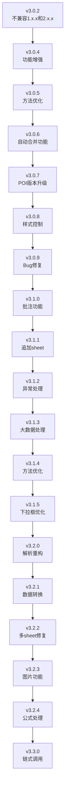
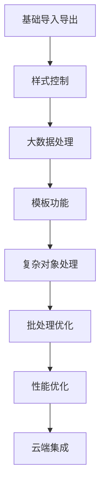

# 版本历史

<cite>
**本文档中引用的文件**
- [README-history.md](file://README-history.md)
- [README.md](file://README.md)
- [README-export.md](file://README-export.md)
- [README-import.md](file://README-import.md)
- [ExcelHelper.java](file://src/main/java/com/github/stupdit1t/excel/core/ExcelHelper.java)
</cite>

## 目录
1. [简介](#简介)
2. [版本演进概览](#版本演进概览)
3. [详细版本历史](#详细版本历史)
4. [重大版本升级指南](#重大版本升级指南)
5. [功能演进总结](#功能演进总结)
6. [未来发展方向](#未来发展方向)

## 简介

poi-excel 是一个基于 Apache POI 的 Java 工具，旨在简化新手在处理 Excel 表格时的操作。该项目通过提供简单、快速上手的方式，使新手能够轻松处理复杂的表格任务。从 v3.0.2 开始，项目经历了多次重要版本迭代，不断优化功能、提升性能，并引入新的特性。

## 版本演进概览

**图表来源**
- [README-history.md](file://README-history.md#L1-L95)

## 详细版本历史

### v3.3.0 (2023年)

**主要变更：**
- **导入导出链式调用调整**：优化了链式调用的接口设计，提升了代码可读性和使用便捷性
- **导入解析处理调整**：改进了数据解析算法，提高了处理效率和准确性
- **部分方法名调整**：统一了API命名规范，增强了接口的一致性
- **支持自动映射属性**：新增自动映射字段功能，简化了数据绑定过程

**影响评估：**
- 需要检查现有代码中的方法调用，特别是链式调用部分
- 自动映射功能可能需要重新配置数据模型

### v3.2.4 (2023年)

**主要变更：**
- **公式数字类型读取**：增强了公式的数值类型识别能力，解决了特定场景下的数据读取问题

**技术改进：**
- 改进了公式解析器的数字类型检测逻辑
- 提高了复杂公式的处理准确率

### v3.2.3 (2023年)

**主要变更：**
- **新增addImage方法**：支持自定义添加图片到指定区域，扩展了图片处理功能
- **合并单元格优化**：合并单元格操作只保留左上角单元格值，避免数据冗余

**新功能：**
- `addImage()` 方法允许开发者在指定单元格区域插入图片
- 合并单元格时自动清理多余数据，保持数据整洁

### v3.2.2 (2023年)

**主要变更：**
- **修复多sheet导出问题**：解决了填充下拉框导致sheet页不正确的问题

**技术修复：**
- 修正了多sheet环境下下拉框填充的逻辑错误
- 确保各sheet页独立性，避免相互干扰

### v3.2.1 (2023年)

**主要变更：**
- **导入解析数据增强**：新增列上map方法，支持数据转换和处理
- **模板变量替换**：读模板替换变量时支持图片替换
- **功能优化**：若干功能优化，移除了intStr()方法

**新增功能：**
- `map()` 方法可在列级别进行数据转换
- 图片替换功能增强了模板定制能力
- 移除了过时的intStr()方法，采用更优的替代方案

### v3.2.0 (2023年)

**主要变更：**
- **解析表格异常收集重构**：
  - a. 提供行级别异常输出
  - b. 单元格级别异常输出
  - c. 支持自定义异常输入
- **数字格式处理**：新增intStr()参数，解决用String接收带小数点.0的问题

**不兼容变更：**
- 异常处理机制发生重大变化，需要更新异常处理代码
- 数字格式处理方式调整，可能影响现有业务逻辑

### v3.1.5 (2023年)

**主要变更：**
- **下拉框数据优化**：xls格式下拉框不能支持太多数据，更换为引用支持更多数据
- **引用单元格BUG修复**：处理列数太多时的引用单元格问题

**技术改进：**
- 优化了xls格式的下拉框实现
- 修复了大数据量场景下的引用计算问题

### v3.1.4 (2023年)

**主要变更：**
- **回调注释完善**：为导入导出回调添加详细注释
- **field方法优化**：支持只传入列和字段，不需要title
- **SXSSFWorkbook优化**：删除临时文件，提高性能

**用户体验改进：**
- 回调函数的使用更加直观
- 字段映射配置更加简洁
- 内存使用更加高效

### v3.1.3 (2023年)

**主要变更：**
- **异常捕获增强**：解析Excel遇到未知异常时捕获至PoiResult
- **链式方法调整**：解析Excel链式方法调整，新增defaultValue
- **大数据处理**：增加大数据事件流分批导入功能

**技术亮点：**
- 提供了更完善的异常处理机制
- 支持百万级数据的分批处理，避免内存溢出
- defaultValue功能简化了默认值设置

### v3.1.2 (2023年)

**主要变更：**
- **解析回调处理**：解析回调处理步骤POI Exception
- **日期格式支持**：添加支持非1904日期的识别
- **列处理增强**：解析列添加trim方法

**功能增强：**
- 更好的POI异常处理流程
- 支持更多日期格式
- 数据清洗功能更加完善

### v3.1.1 (2023年)

**主要变更：**
- **追加sheet支持**：导出支持读取Excel追加sheet页

**新功能：**
- 允许在现有Excel文件基础上追加新的工作表
- 保持原有数据完整性的同时扩展功能

### v3.1.0 (2023年)

**主要变更：**
- **批注功能**：支持单元格级别的批注功能

**新功能：**
- 在单元格中添加批注信息
- 支持批注的样式和位置自定义

### v3.0.9 (2023年)

**主要变更：**
- **表头重复设置修复**：表头相同名字重复设置报错问题修复

**技术修复：**
- 解决了表头重复定义导致的异常
- 提高了表头定义的容错能力

### v3.0.8 (2023年)

**主要变更：**
- **样式控制增强**：导出添加设置列换行显示属性
- **全局宽度设置**：添加sheet设置全局的单元格宽度属性

**新功能：**
- 支持列级别的文本换行设置
- 提供sheet级别的全局宽度控制

### v3.0.7 (2023年)

**主要变更：**
- **POI版本升级**：从5.1.0升级到5.2.2

**技术改进：**
- 利用了Apache POI的新特性和性能优化
- 修复了旧版本中存在的已知问题

### v3.0.6 (2023年)

**主要变更：**
- **自动合并功能**：增加导出自动感知行数据合并行功能，方法为mergerRepeat

**新功能：**
- 自动识别重复数据并合并单元格
- 减少冗余数据，提高表格美观度

### v3.0.5 (2023年)

**主要变更：**
- **参数验证**：导出参数为空检验
- **方法名调整**：部分方法名调整

**质量改进：**
- 增强了参数验证机制
- 统一了API命名规范

### v3.0.4 (2023年)

**主要变更：**
- **日期格式化**：方法名修改
- **工作簿保留**：保留导出workbook，提供灵活性
- **密码保护**：支持xlsx添加密码

**新功能：**
- 更灵活的工作簿管理
- 增加了文件保护功能

### v3.0.2 (2023年)

**主要变更：**
- **链式构建类**：提供ExcelHelper链式构建类
- **代码结构优化**：优化代码结构和层次
- **样式控制**：提供更精确的单元格样式控制

**不兼容变更：**
- 与1.x.x和2.x.x版本不兼容
- 需要重新适配现有代码

**章节来源**
- [README-history.md](file://README-history.md#L1-L95)

## 重大版本升级指南

### v3.0.2 → v3.1.x 升级指南

**不兼容变更：**
1. **API接口变更**：原有的方法签名发生了重大变化
2. **异常处理机制**：异常处理方式从传统的try-catch改为PoiResult模式
3. **配置方式**：配置参数的传递方式发生了改变

**迁移步骤：**
1. 更新导入语句，使用新的ExcelHelper类
2. 替换原有的异常处理逻辑
3. 重新配置导出和导入参数
4. 测试所有功能模块

**推荐做法：**
- 逐步迁移，先从简单的导出功能开始
- 使用单元测试验证迁移后的功能
- 参考新的示例代码进行开发

### v3.2.0 → v3.3.x 升级指南

**不兼容变更：**
1. **链式调用重构**：链式调用的API发生了变化
2. **异常处理增强**：增加了更细粒度的异常处理
3. **方法命名调整**：部分方法名进行了标准化

**迁移步骤：**
1. 检查所有链式调用的语法
2. 更新异常处理代码
3. 重新命名相关方法
4. 验证数据处理逻辑

**注意事项：**
- 自动映射功能可能需要重新配置
- 需要测试大数据处理场景

## 功能演进总结

### 核心功能发展轨迹

**功能演进特点：**

1. **从简单到复杂**：从基本的导入导出功能发展到支持复杂对象和大数据处理
2. **从单一到多元**：从单一的Excel格式支持扩展到多种格式和功能
3. **从手动到自动化**：从手动配置发展到智能识别和自动处理
4. **从本地到云端**：从本地文件处理发展到云端集成和分布式处理

### 性能优化历程

**内存优化：**
- v3.1.3：引入事件驱动的大数据处理
- v3.1.4：SXSSFWorkbook格式优化
- v3.3.0：链式调用优化减少中间对象创建

**并发优化：**
- v3.1.1：支持多sheet并行处理
- v3.2.0：解析异常处理并发优化
- v3.3.0：整体并发性能提升

**格式优化：**
- v3.0.7：POI版本升级带来的性能提升
- v3.1.5：xls格式优化
- v3.2.3：图片处理性能优化

## 未来发展方向

### 技术趋势预测

1. **云原生支持**：向云端服务的深度集成
2. **AI辅助处理**：引入机器学习进行智能数据识别
3. **实时协作**：支持多人实时编辑和协作
4. **跨平台兼容**：扩展到更多平台和格式

### 功能扩展计划

1. **更多格式支持**：支持CSV、JSON等格式的导入导出
2. **高级数据分析**：内置数据分析和可视化功能
3. **自动化流程**：支持工作流自动化和任务调度
4. **安全增强**：加强数据加密和访问控制

### 社区贡献方向

1. **插件生态**：鼓励第三方插件开发
2. **模板库**：建立丰富的模板库
3. **国际化**：支持更多语言和地区
4. **文档完善**：持续改进文档和示例

**章节来源**
- [README.md](file://README.md#L1-L77)
- [ExcelHelper.java](file://src/main/java/com/github/stupdit1t/excel/core/ExcelHelper.java#L1-L54)