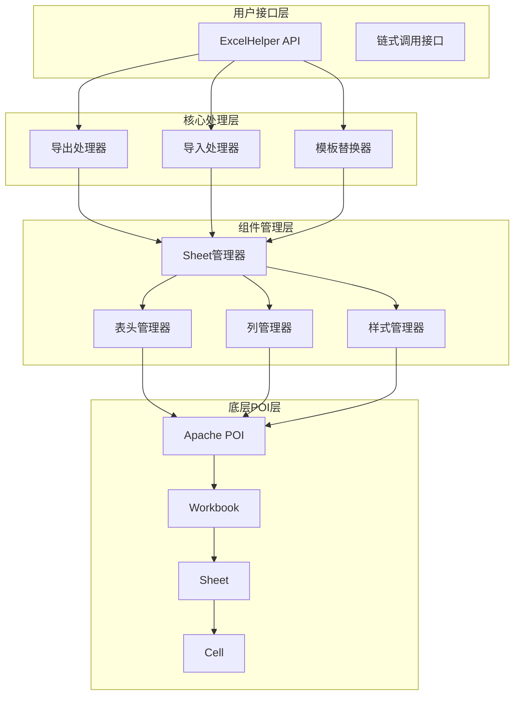
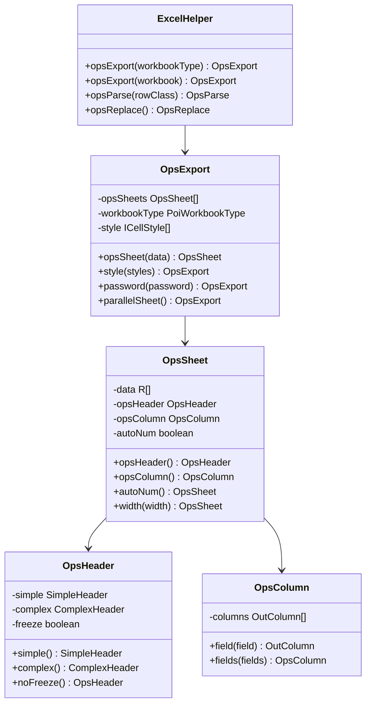
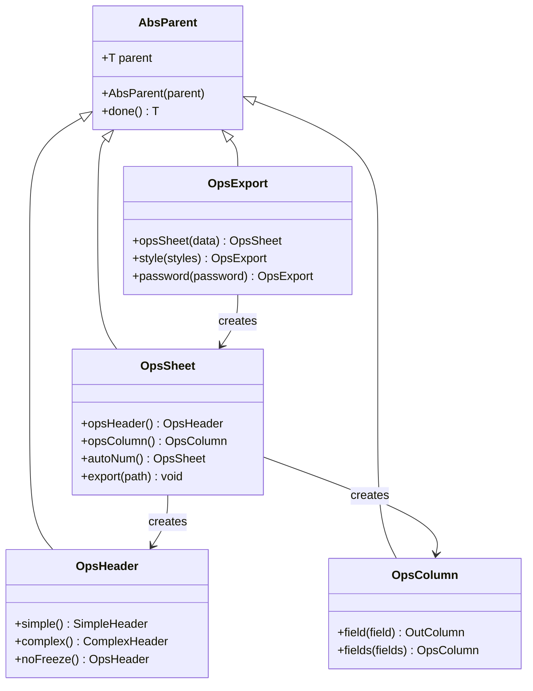
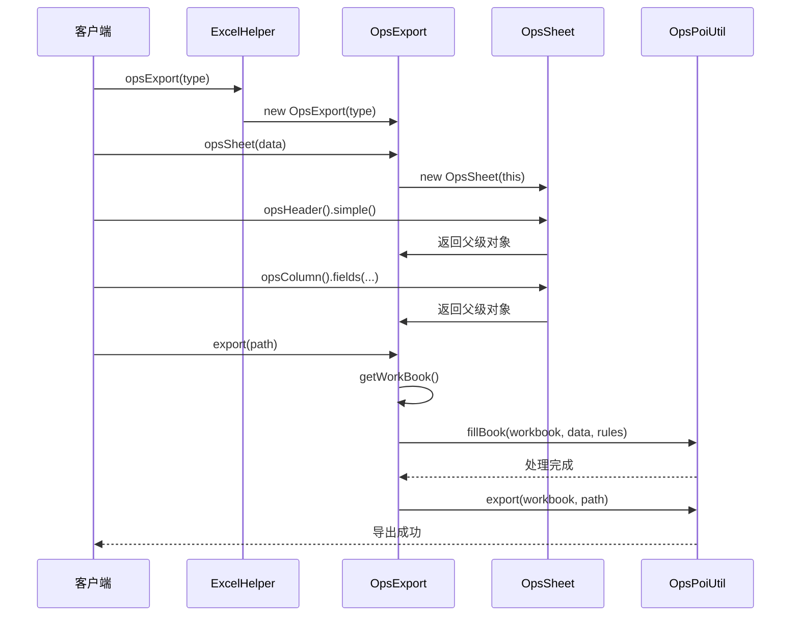

# poi-excel项目概述

<cite>
**本文档引用的文件**
- [README.md](file://README.md)
- [pom.xml](file://pom.xml)
- [ExcelHelper.java](file://src/main/java/com/github/stupdit1t/excel/core/ExcelHelper.java)
- [OpsExport.java](file://src/main/java/com/github/stupdit1t/excel/core/export/OpsExport.java)
- [OpsSheet.java](file://src/main/java/com/github/stupdit1t/excel/core/export/OpsSheet.java)
- [OpsHeader.java](file://src/main/java/com/github/stupdit1t/excel/core/export/OpsHeader.java)
- [OpsColumn.java](file://src/main/java/com/github/stupdit1t/excel/core/export/OpsColumn.java)
- [OpsParse.java](file://src/main/java/com/github/stupdit1t/excel/core/parse/OpsParse.java)
- [OpsReplace.java](file://src/main/java/com/github/stupdit1t/excel/core/replace/OpsReplace.java)
- [PoiCommon.java](file://src/main/java/com/github/stupdit1t/excel/common/PoiCommon.java)
- [AbsParent.java](file://src/main/java/com/github/stupdit1t/excel/core/AbsParent.java)
- [ExportClass.java](file://src/test/java/excel/export/ExportClass.java)
</cite>

## 目录
1. [项目简介](#项目简介)
2. [核心特性](#核心特性)
3. [技术架构](#技术架构)
4. [主要组件分析](#主要组件分析)
5. [链式调用API设计](#链式调用api设计)
6. [应用场景与最佳实践](#应用场景与最佳实践)
7. [性能特点](#性能特点)
8. [总结](#总结)

## 项目简介

poi-excel是一个基于Apache POI的Java工具库，专为简化Excel处理操作而设计。该项目致力于解决新手开发者在使用Apache POI时面临的复杂API学习成本和代码冗余问题，提供了一个简单、直观且功能强大的Excel处理解决方案。

### 核心目标

poi-excel的核心目标是：
- **降低学习门槛**：通过简洁的API设计，让新手开发者能够快速上手Excel处理
- **提高开发效率**：减少重复代码，提供开箱即用的功能模块
- **增强代码可维护性**：采用纯编码实现，避免注解侵入，提升代码复用性

### 技术定位

该项目定位为一个轻量级的Excel处理工具，专注于：
- **纯编码实现**：无需注解配置，完全基于编程方式操作
- **低侵入性**：不会影响现有业务代码结构
- **高性能**：针对大数据量场景进行了优化

**章节来源**
- [README.md](file://README.md#L1-L77)
- [pom.xml](file://pom.xml#L1-L136)

## 核心特性

### 1. 纯编码实现

poi-excel采用纯编码实现方式，这是其最重要的设计理念之一：

```java
// 纯编码方式创建Excel
ExcelHelper.opsExport(PoiWorkbookType.XLSX)
    .opsSheet(data)
    .opsHeader().simple()
        .texts("姓名", "年龄", "地址").done()
    .opsColumn()
        .fields("name", "age", "address").done()
    .export("result.xlsx");
```

**优势**：
- **无注解侵入**：不依赖任何注解，保持代码整洁
- **灵活性强**：可以根据业务需求动态调整
- **易于调试**：所有逻辑都在代码中体现，便于排查问题

### 2. 强大的导入功能

项目提供了完整的Excel导入解决方案：

```java
// 导入Excel数据到Java对象
ExcelHelper.opsParse(Student.class)
    .from("students.xlsx")
    .opsSheet(0, 1, 0)  // sheet索引、表头行数、尾部行数
    .opsColumn()
        .field("name")
        .field("age")
        .field("grade")
        .done()
    .parse();
```

**功能特性**：
- **单元格级别校验**：支持数据格式验证和错误提示
- **大数据批处理**：支持百万级数据的高效处理
- **数据转换**：自动类型转换和默认值设置
- **图片处理**：支持图片数据的导入导出

### 3. 全面的导出功能

导出功能是poi-excel的核心优势：

```java
// 复杂导出示例
ExcelHelper.opsExport(PoiWorkbookType.XLSX)
    .opsSheet(data)
    .autoNum()  // 自动生成序号
    .opsHeader().complex()
        .text("学生信息统计", "A1:D1")
        .text("基本信息", "A2:A3")
        .text("姓名", "B2:B3")
        .text("班级", "C2:C3")
        .text("成绩", "D2:E2")
        .text("语文", "D3:D3")
        .text("数学", "E3:E3")
        .done()
    .opsColumn()
        .fields("name", "className", "chineseScore", "mathScore")
        .field("name").color(IndexedColors.RED)  // 设置字体颜色
        .field("chineseScore").pattern("0.00%")  // 设置数值格式
        .done()
    .export("students.xlsx");
```

**高级功能**：
- **复杂表头支持**：支持多级表头和单元格合并
- **样式定制**：丰富的单元格样式设置选项
- **公式应用**：支持Excel公式的嵌入和计算
- **图片插入**：支持在指定位置插入图片

### 4. 模板变量替换

提供了灵活的模板变量替换功能：

```java
// 模板变量替换
ExcelHelper.opsReplace()
    .from("template.xlsx")
    .var("company", "阿里巴巴")
    .var("date", new Date())
    .var("amount", 1000000)
    .replaceTo("result.xlsx");
```

**应用场景**：
- **报表生成**：基于固定模板生成个性化报表
- **文档自动化**：批量生成带有变量的Excel文档
- **数据填充**：向模板中填充动态数据

**章节来源**
- [README.md](file://README.md#L15-L35)
- [ExcelHelper.java](file://src/main/java/com/github/stupdit1t/excel/core/ExcelHelper.java#L1-L52)

## 技术架构

### 整体架构设计

poi-excel采用了清晰的分层架构设计，主要包含以下几个层次：



**图表来源**
- [ExcelHelper.java](file://src/main/java/com/github/stupdit1t/excel/core/ExcelHelper.java#L1-L52)
- [OpsExport.java](file://src/main/java/com/github/stupdit1t/excel/core/export/OpsExport.java#L1-L50)

### 架构设计理念

#### 1. 建造者模式应用

项目广泛使用建造者模式来构建复杂的Excel操作：



**图表来源**
- [ExcelHelper.java](file://src/main/java/com/github/stupdit1t/excel/core/ExcelHelper.java#L15-L45)
- [OpsExport.java](file://src/main/java/com/github/stupdit1t/excel/core/export/OpsExport.java#L25-L80)
- [OpsSheet.java](file://src/main/java/com/github/stupdit1t/excel/core/export/OpsSheet.java#L20-L70)

#### 2. 链式调用设计

通过AbsParent抽象类实现了统一的链式调用模式：



**图表来源**
- [AbsParent.java](file://src/main/java/com/github/stupdit1t/excel/core/AbsParent.java#L1-L33)
- [OpsExport.java](file://src/main/java/com/github/stupdit1t/excel/core/export/OpsExport.java#L60-L80)

**章节来源**
- [AbsParent.java](file://src/main/java/com/github/stupdit1t/excel/core/AbsParent.java#L1-L33)
- [OpsExport.java](file://src/main/java/com/github/stupdit1t/excel/core/export/OpsExport.java#L1-L100)

## 主要组件分析

### 1. ExcelHelper - 统一入口点

ExcelHelper是整个框架的统一入口点，提供了四种主要功能：

```java
public final class ExcelHelper {
    // 导出入口
    public static OpsExport opsExport(PoiWorkbookType workbookType);
    public static OpsExport opsExport(Workbook workbook);
    
    // 导入入口
    public static <R> OpsParse<R> opsParse(Class<R> rowClass);
    
    // 模板替换入口
    public static OpsReplace opsReplace();
}
```

**设计特点**：
- **静态工厂方法**：提供简洁的API调用方式
- **类型安全**：泛型支持确保编译时类型检查
- **灵活初始化**：支持从不同类型的工作簿创建

### 2. OpsExport - 导出核心处理器

OpsExport是导出功能的核心处理器，负责协调整个导出流程：



**图表来源**
- [ExcelHelper.java](file://src/main/java/com/github/stupdit1t/excel/core/ExcelHelper.java#L20-L40)
- [OpsExport.java](file://src/main/java/com/github/stupdit1t/excel/core/export/OpsExport.java#L80-L120)

### 3. OpsSheet - Sheet管理器

OpsSheet负责管理单个工作表的所有属性和行为：

```java
public class OpsSheet<R> extends AbsParent<OpsExport> {
    // 样式和布局配置
    short titleHeight = -1;
    short headerHeight = -1;
    short cellHeight = -1;
    short footerHeight = -1;
    int width = -1;
    
    // 功能配置
    boolean autoNum;
    List<Integer[]> mergerCells;
    Map<Integer[], byte[]> images;
    
    // 数据和配置
    List<R> data;
    OpsHeader<R> opsHeader;
    OpsColumn<R> opsColumn;
    OpsFooter<R> opsFooter;
}
```

**核心功能**：
- **多输出模式支持**：支持路径输出、流输出和HTTP响应输出
- **并行处理**：支持多Sheet并行导出
- **样式管理**：统一的样式管理和继承机制

### 4. OpsHeader - 表头管理器

OpsHeader支持两种表头模式：

#### 简单表头
```java
.opsHeader().simple()
    .title("学生信息表")
    .texts("姓名", "年龄", "班级", "成绩")
    .text("姓名", (font, style) -> {
        font.setColor(IndexedColors.RED.index);
        style.setAlignment(HorizontalAlignment.CENTER);
    })
    .done()
```

#### 复杂表头
```java
.opsHeader().complex()
    .text("学生信息统计", "A1:D1")
    .text("基本信息", "A2:A3")
    .text("姓名", "B2:B3")
    .text("班级", "C2:C3")
    .text("成绩", "D2:E2")
    .text("语文", "D3:D3")
    .text("数学", "E3:E3")
    .done()
```

### 5. OpsColumn - 列管理器

OpsColumn负责定义数据列的映射关系：

```java
.opsColumn()
    .fields("name", "age", "className")  // 基础字段映射
    .field("score").pattern("0.00%")     // 格式化设置
    .field("createTime").pattern("yyyy-MM-dd")
    .field("status").dropdown("启用", "禁用")  // 下拉框
    .done()
```

**支持的列配置**：
- **字段映射**：支持对象属性和Map键的映射
- **格式化**：支持日期、数字、百分比等多种格式
- **验证**：支持数据验证规则
- **样式**：支持单元格样式定制

**章节来源**
- [OpsExport.java](file://src/main/java/com/github/stupdit1t/excel/core/export/OpsExport.java#L1-L150)
- [OpsSheet.java](file://src/main/java/com/github/stupdit1t/excel/core/export/OpsSheet.java#L1-L100)
- [OpsHeader.java](file://src/main/java/com/github/stupdit1t/excel/core/export/OpsHeader.java#L1-L100)
- [OpsColumn.java](file://src/main/java/com/github/stupdit1t/excel/core/export/OpsColumn.java#L1-L96)

## 链式调用API设计

### 设计原理

poi-excel的链式调用API设计基于以下核心原理：

#### 1. 父子关系管理

通过AbsParent抽象类建立父子关系：

```java
public abstract class AbsParent<T> {
    public T parent;  // 父级对象引用
    
    public AbsParent(T parent) {
        this.parent = parent;
    }
    
    public T done() {  // 结束当前配置，返回父级
        return parent;
    }
}
```

#### 2. 流畅的API体验

每个组件都提供流畅的API调用方式：

```java
// 导出示例
ExcelHelper.opsExport(PoiWorkbookType.XLSX)
    .opsSheet(data)              // 创建Sheet
        .opsHeader().simple()    // 创建简单表头
            .texts("姓名", "年龄", "地址")
            .done()               // 返回Sheet
        .opsColumn()             // 创建列配置
            .fields("name", "age", "address")
            .done()               // 返回Sheet
        .autoNum()               // 自动编号
        .width(2000)             // 设置列宽
        .done()                  // 返回Export
    .export("result.xlsx");     // 执行导出
```

#### 3. 类型安全的泛型设计

所有组件都使用泛型确保类型安全：

```java
public class OpsSheet<R> extends AbsParent<OpsExport> {
    private List<R> data;  // 泛型数据类型
}

public class OpsParse<R> {
    private Class<R> rowClass;  // 泛型解析类型
}
```

### API设计优势

#### 1. 可读性强
- 方法命名直观，语义明确
- 配置顺序符合业务逻辑
- 支持方法链式调用

#### 2. 灵活性高
- 支持多种配置组合
- 可以随时中断配置链
- 支持条件配置

#### 3. 错误处理友好
- 在编译期就能发现配置错误
- 提供清晰的错误提示
- 支持配置验证

**章节来源**
- [AbsParent.java](file://src/main/java/com/github/stupdit1t/excel/core/AbsParent.java#L1-L33)
- [OpsExport.java](file://src/main/java/com/github/stupdit1t/excel/core/export/OpsExport.java#L60-L100)

## 应用场景与最佳实践

### 1. Web环境集成

在Spring Boot环境中使用poi-excel：

```java
@RestController
@RequestMapping("/api/excel")
public class ExcelController {
    
    @GetMapping("/export")
    public void export(HttpServletResponse response, 
                      @RequestParam String type) {
        
        // 1. 获取数据
        List<Student> students = studentService.getAllStudents();
        
        // 2. 执行导出
        ExcelHelper.opsExport(PoiWorkbookType.XLSX)
            .opsSheet(students)
            .opsHeader().simple()
                .texts("姓名", "年龄", "班级", "成绩", "创建时间").done()
            .opsColumn()
                .fields("name", "age", "className", "score", "createTime")
                .field("score").pattern("0.00%")
                .field("createTime").pattern("yyyy-MM-dd HH:mm:ss")
                .done()
            .export(response, "学生信息.xlsx");
    }
}
```

### 2. 大数据量处理

针对大数据量场景的优化策略：

```java
// 大数据导出示例
ExcelHelper.opsExport(PoiWorkbookType.BIG_XLSX)
    .password("secure")  // 设置密码保护
    .opsSheet(largeDataset)
    .sheetName("大数据集")
    .opsHeader().simple()
        .texts("ID", "名称", "描述", "创建时间").done()
    .opsColumn()
        .fields("id", "name", "description", "createTime")
        .field("createTime").pattern("yyyy-MM-dd")
        .done()
    .export("large_dataset.xlsx");
```

### 3. 复杂报表生成

生成包含多个工作表的复杂报表：

```java
// 多Sheet报表
ExcelHelper.opsExport(PoiWorkbookType.XLSX)
    .parallelSheet()  // 并行处理多个Sheet
    .opsSheet(summaryData)
        .sheetName("汇总")
        .opsHeader().simple().texts("指标", "值").done()
        .opsColumn().fields("metric", "value").done()
        .done()
    .opsSheet(detailData)
        .sheetName("明细")
        .opsHeader().complex()
            .text("销售明细", "A1:E1")
            .text("基本信息", "A2:A3")
            .text("日期", "B2:B3")
            .text("产品", "C2:C3")
            .text("数量", "D2:D3")
            .text("金额", "E2:E3")
            .done()
        .opsColumn()
            .fields("date", "product", "quantity", "amount")
            .done()
        .done()
    .export("sales_report.xlsx");
```

### 4. 模板化报表

基于模板生成个性化报表：

```java
// 模板变量替换
public void generateReport(String templatePath, Map<String, Object> variables) {
    ExcelHelper.opsReplace()
        .from(templatePath)
        .var("company", "阿里巴巴")
        .var("period", "2024年第一季度")
        .var("totalSales", 1000000)
        .var("topProduct", "iPhone 15 Pro")
        .replaceTo("generated_report.xlsx");
}
```

### 5. 导入数据处理

完整的Excel导入流程：

```java
// Excel导入示例
public List<Student> importStudents(MultipartFile file) {
    try {
        return ExcelHelper.opsParse(Student.class)
            .from(file.getInputStream())
            .opsSheet(0, 1, 0)  // 第0个Sheet，1行表头，0行尾部
            .opsColumn()
                .field("name").required("姓名不能为空")
                .field("age").min(1).max(120).message("年龄必须在1-120岁之间")
                .field("className").verifyText("[A-Za-z0-9]+", "班级名称只能包含字母和数字")
                .field("score").pattern("0.00%").message("成绩必须是百分比格式")
                .done()
            .parse();
    } catch (Exception e) {
        throw new RuntimeException("Excel导入失败：" + e.getMessage(), e);
    }
}
```

**章节来源**
- [ExportClass.java](file://src/test/java/excel/export/ExportClass.java#L1-L100)
- [README.md](file://README.md#L40-L50)

## 性能特点

### 1. 内存优化

poi-excel针对不同数据规模提供了多种优化策略：

#### 小数据量（<1000行）
- 使用内存型Workbook（HSSFWorkbook/XSSFWorkbook）
- 适合实时交互场景

#### 中等数据量（1000-100000行）
- 自动切换到流式处理（SXSSFWorkbook）
- 内存占用可控

#### 大数据量（>100000行）
- 使用BIG_XLSX格式
- 支持流式写入，内存占用稳定

### 2. 并行处理

支持多Sheet并行导出：

```java
// 并行导出多个Sheet
ExcelHelper.opsExport(PoiWorkbookType.XLSX)
    .parallelSheet()  // 启用并行处理
    .opsSheet(sheet1Data)
        .sheetName("Sheet1")
        .done()
    .opsSheet(sheet2Data)
        .sheetName("Sheet2")
        .done()
    .opsSheet(sheet3Data)
        .sheetName("Sheet3")
        .done()
    .export("multi_sheet_report.xlsx");
```

### 3. 缓存机制

- **样式缓存**：避免重复创建样式对象
- **字段缓存**：缓存反射结果，提高运行效率
- **模板缓存**：支持模板文件的缓存复用

### 4. 性能监控

内置性能监控功能：

```java
@Test
public void performanceTest() {
    ThreadLocal<Long> time = new ThreadLocal<>();
    
    time.set(System.currentTimeMillis());
    // 执行具体操作
    long diff = System.currentTimeMillis() - time.get();
    System.out.println("耗时: " + diff + "ms");
}
```

**章节来源**
- [ExportClass.java](file://src/test/java/excel/export/ExportClass.java#L60-L80)
- [OpsExport.java](file://src/main/java/com/github/stupdit1t/excel/core/export/OpsExport.java#L150-L200)

## 总结

poi-excel作为一个基于Apache POI的Java工具库，在Excel处理领域提供了全面而优雅的解决方案。通过深入分析其架构设计和核心组件，我们可以看到该项目在以下几个方面的突出表现：

### 技术创新

1. **纯编码实现**：摒弃注解侵入，提供更灵活的编程方式
2. **链式调用API**：通过建造者模式和泛型设计，提供流畅的API体验
3. **分层架构**：清晰的分层设计，便于扩展和维护

### 核心价值

1. **降低学习成本**：简洁的API设计让新手快速上手
2. **提高开发效率**：减少重复代码，提供开箱即用的功能
3. **增强代码质量**：类型安全的设计和完善的错误处理

### 应用前景

poi-excel适用于各种需要Excel处理的场景：
- **企业报表系统**：生成复杂的统计报表
- **数据导入导出**：处理大批量数据的导入导出
- **模板化文档**：基于模板生成个性化文档
- **Web应用集成**：与Spring Boot等框架无缝集成

### 发展方向

随着企业数字化转型的深入，Excel处理需求将持续增长。poi-excel作为一款成熟的工具库，将继续在以下方面进行优化：
- **性能优化**：进一步提升大数据量处理能力
- **功能扩展**：支持更多Excel特性和格式
- **生态完善**：提供更多的集成方案和最佳实践

总的来说，poi-excel不仅解决了Apache POI使用复杂的问题，更重要的是它提供了一种新的思考方式——如何通过优秀的API设计来简化复杂的业务逻辑。这种设计理念对于整个Java生态系统都有着重要的启示意义。