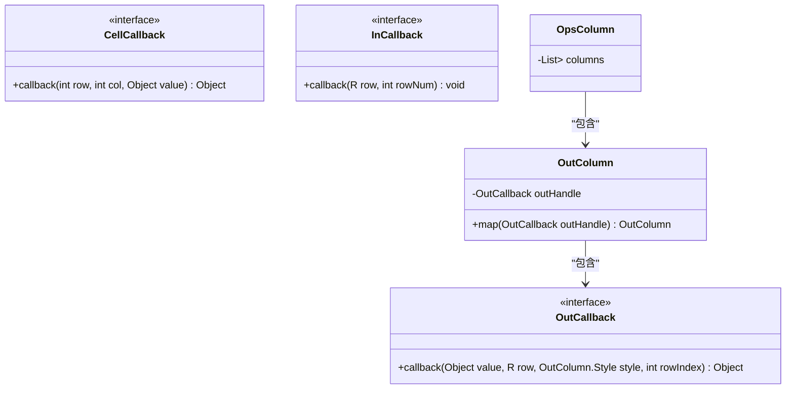
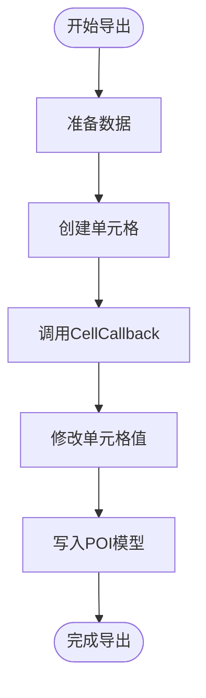
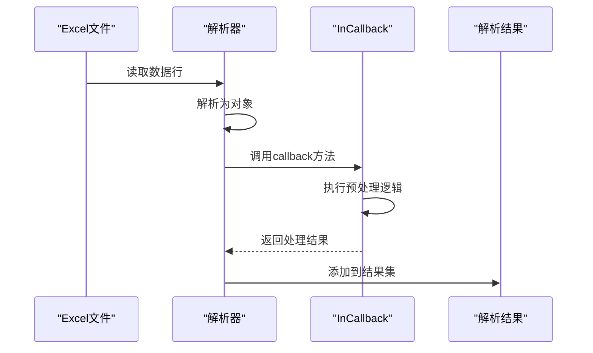
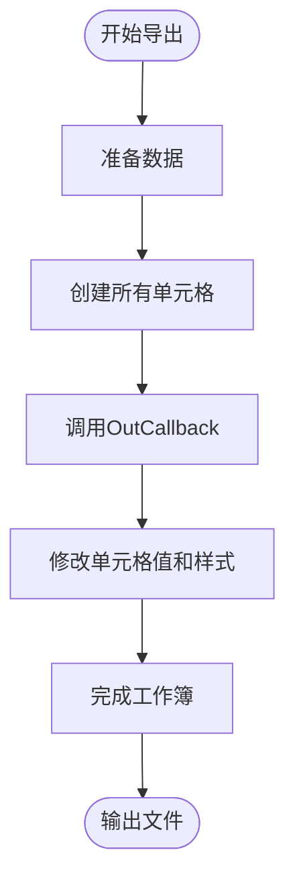
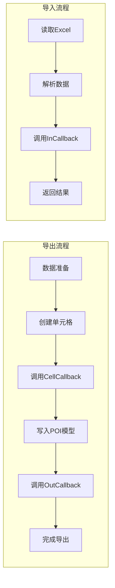

# 回调机制

<cite>
**本文档引用的文件**   
- [CellCallback.java](file://src/main/java/com/github/stupdit1t/excel/callback/CellCallback.java)
- [InCallback.java](file://src/main/java/com/github/stupdit1t/excel/callback/InCallback.java)
- [OutCallback.java](file://src/main/java/com/github/stupdit1t/excel/callback/OutCallback.java)
- [OutColumn.java](file://src/main/java/com/github/stupdit1t/excel/core/export/OutColumn.java)
- [ExportClass.java](file://src/test/java/excel/export/ExportClass.java)
- [ParseBeanTest.java](file://src/test/java/excel/parse/ParseBeanTest.java)
</cite>

## 目录
1. [简介](#简介)
2. [核心回调接口](#核心回调接口)
3. [CellCallback详解](#cellcallback详解)
4. [InCallback详解](#incallback详解)
5. [OutCallback详解](#outcallback详解)
6. [执行时机与数据流](#执行时机与数据流)
7. [性能考量](#性能考量)
8. [异常处理](#异常处理)

## 简介
本项目提供了一套灵活的Excel导入导出回调机制，通过三个核心函数式接口`CellCallback`、`InCallback`和`OutCallback`，允许开发者在数据处理的关键节点插入自定义逻辑。这些回调机制为数据脱敏、格式化、预处理和后处理提供了强大的扩展能力。

## 核心回调接口

**Diagram sources**
- [CellCallback.java](file://src/main/java/com/github/stupdit1t/excel/callback/CellCallback.java#L1-L22)
- [InCallback.java](file://src/main/java/com/github/stupdit1t/excel/callback/InCallback.java#L1-L18)
- [OutCallback.java](file://src/main/java/com/github/stupdit1t/excel/callback/OutCallback.java#L1-L25)
- [OutColumn.java](file://src/main/java/com/github/stupdit1t/excel/core/export/OutColumn.java#L1-L50)

**Section sources**
- [CellCallback.java](file://src/main/java/com/github/stupdit1t/excel/callback/CellCallback.java#L1-L22)
- [InCallback.java](file://src/main/java/com/github/stupdit1t/excel/callback/InCallback.java#L1-L18)
- [OutCallback.java](file://src/main/java/com/github/stupdit1t/excel/callback/OutCallback.java#L1-L25)

## CellCallback详解
`CellCallback`接口用于在导出过程中拦截每个单元格的值，允许在最终写入前对其进行动态修改。该回调在值写入POI模型前被调用。

**Diagram sources**
- [CellCallback.java](file://src/main/java/com/github/stupdit1t/excel/callback/CellCallback.java#L1-L22)
- [OutColumn.java](file://src/main/java/com/github/stupdit1t/excel/core/export/OutColumn.java#L1-L50)

**Section sources**
- [CellCallback.java](file://src/main/java/com/github/stupdit1t/excel/callback/CellCallback.java#L1-L22)

## InCallback详解
`InCallback`接口在导入时对原始单元格数据进行预处理，允许在解析数据后、返回结果前执行自定义逻辑。

**Diagram sources**
- [InCallback.java](file://src/main/java/com/github/stupdit1t/excel/callback/InCallback.java#L1-L18)
- [ParseBeanTest.java](file://src/test/java/excel/parse/ParseBeanTest.java#L1-L50)

**Section sources**
- [InCallback.java](file://src/main/java/com/github/stupdit1t/excel/callback/InCallback.java#L1-L18)

## OutCallback详解
`OutCallback`接口在导出完成后对Workbook进行最终操作，可用于添加水印、设置保护等场景。

**Diagram sources**
- [OutCallback.java](file://src/main/java/com/github/stupdit1t/excel/callback/OutCallback.java#L1-L25)
- [OutColumn.java](file://src/main/java/com/github/stupdit1t/excel/core/export/OutColumn.java#L1-L50)
- [ExportClass.java](file://src/test/java/excel/export/ExportClass.java#L1-L50)

**Section sources**
- [OutCallback.java](file://src/main/java/com/github/stupdit1t/excel/callback/OutCallback.java#L1-L25)

## 执行时机与数据流
回调机制的执行时机和数据流如下：

**Diagram sources**
- [CellCallback.java](file://src/main/java/com/github/stupdit1t/excel/callback/CellCallback.java#L1-L22)
- [InCallback.java](file://src/main/java/com/github/stupdit1t/excel/callback/InCallback.java#L1-L18)
- [OutCallback.java](file://src/main/java/com/github/stupdit1t/excel/callback/OutCallback.java#L1-L25)

## 性能考量
使用回调可能带来一定的性能开销，建议仅在必要时使用。对于大数据量的处理，应避免在回调中执行耗时操作。

**Section sources**
- [OutColumn.java](file://src/main/java/com/github/stupdit1t/excel/core/export/OutColumn.java#L1-L50)

## 异常处理
在回调中抛出异常可能会中断整个导入/导出流程，建议在回调实现中妥善处理异常，确保流程的稳定性。

**Section sources**
- [InCallback.java](file://src/main/java/com/github/stupdit1t/excel/callback/InCallback.java#L1-L18)