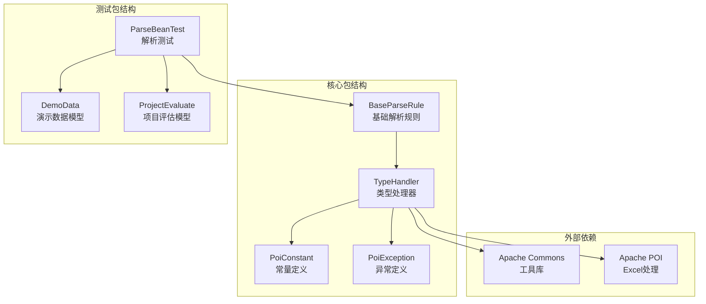
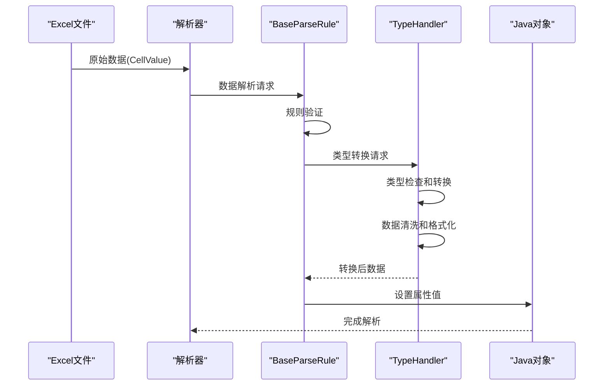
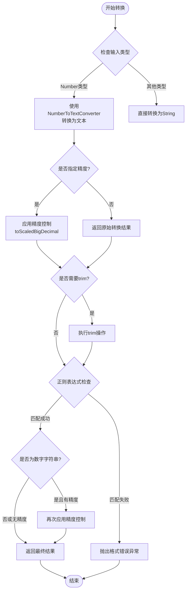
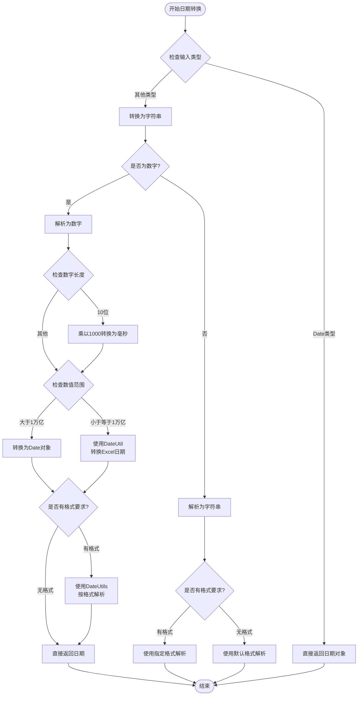
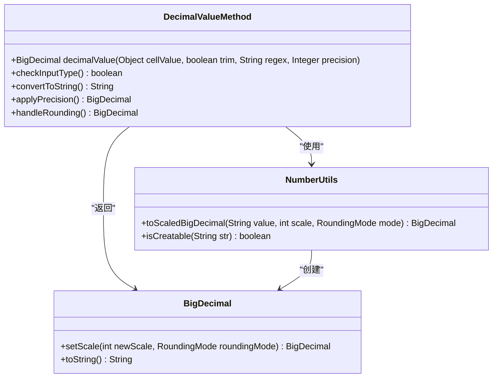
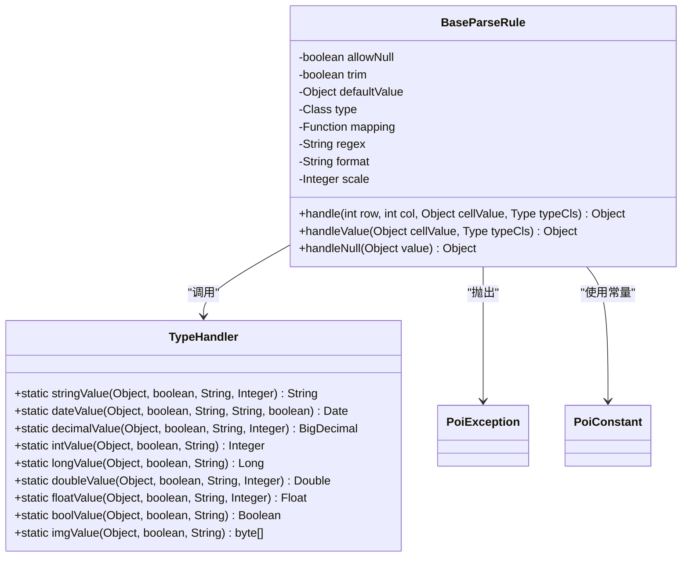
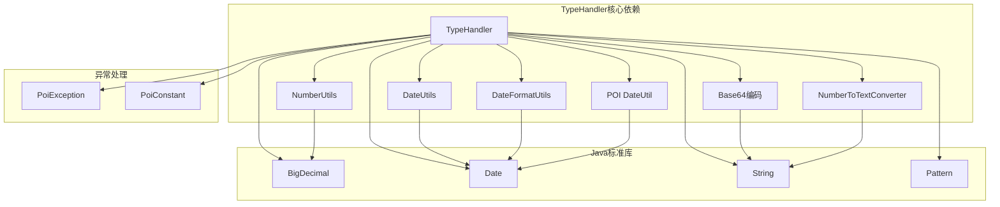

# 类型处理器

<cite>
**本文档中引用的文件**
- [TypeHandler.java](file://src/main/java/com/github/stupdit1t/excel/common/TypeHandler.java)
- [PoiConstant.java](file://src/main/java/com/github/stupdit1t/excel/common/PoiConstant.java)
- [PoiException.java](file://src/main/java/com/github/stupdit1t/excel/common/PoiException.java)
- [BaseParseRule.java](file://src/main/java/com/github/stupdit1t/excel/core/parse/BaseParseRule.java)
- [DemoData.java](file://src/test/java/excel/parse/data/DemoData.java)
- [ProjectEvaluate.java](file://src/test/java/excel/parse/data/ProjectEvaluate.java)
- [ParseBeanTest.java](file://src/test/java/excel/parse/ParseBeanTest.java)
</cite>

## 目录
1. [简介](#简介)
2. [项目结构](#项目结构)
3. [核心组件](#核心组件)
4. [架构概览](#架构概览)
5. [详细组件分析](#详细组件分析)
6. [依赖关系分析](#依赖关系分析)
7. [性能考虑](#性能考虑)
8. [故障排除指南](#故障排除指南)
9. [结论](#结论)

## 简介

TypeHandler是POI-Excel库中的核心类型转换工具类，负责将Excel中的原始Object类型安全地转换为Java中的特定类型。该类提供了丰富的静态方法，包括`stringValue()`、`dateValue()`、`decimalValue()`等，专门用于处理Excel数据导入过程中的类型转换需求。

TypeHandler的设计理念是提供统一、安全且高效的类型转换机制，确保从Excel读取的数据能够正确转换为目标Java对象类型，同时处理各种边缘情况，如科学计数法、日期格式、精度控制等复杂场景。

## 项目结构

TypeHandler位于`com.github.stupdit1t.excel.common`包中，作为整个Excel处理框架的核心组件之一。它与其他模块紧密协作，为数据解析、导出和替换功能提供类型转换支持。



**图表来源**
- [TypeHandler.java](file://src/main/java/com/github/stupdit1t/excel/common/TypeHandler.java#L1-L155)
- [BaseParseRule.java](file://src/main/java/com/github/stupdit1t/excel/core/parse/BaseParseRule.java#L1-L250)

## 核心组件

TypeHandler类提供了以下核心功能：

### 主要类型转换方法
- **基本数据类型转换**：`intValue()`、`longValue()`、`doubleValue()`、`floatValue()`、`shortValue()`、`boolValue()`
- **字符串处理**：`stringValue()`（包含科学计数法处理）
- **日期时间处理**：`dateValue()`（支持多种日期格式）
- **数值精度控制**：`decimalValue()`（支持精度和舍入模式）
- **图片处理**：`imgValue()`（Base64解码）

### 关键特性
- **类型安全**：所有转换方法都检查输入类型，避免类型转换异常
- **数据清洗**：支持trim参数去除空白字符
- **格式校验**：支持正则表达式验证
- **精度控制**：BigDecimal转换支持指定精度和舍入模式
- **错误处理**：完善的异常处理机制

**章节来源**
- [TypeHandler.java](file://src/main/java/com/github/stupdit1t/excel/common/TypeHandler.java#L1-L155)

## 架构概览

TypeHandler在整个Excel处理框架中扮演着关键角色，作为数据类型转换的桥梁，连接Excel原始数据与Java业务对象。



**图表来源**
- [BaseParseRule.java](file://src/main/java/com/github/stupdit1t/excel/core/parse/BaseParseRule.java#L150-L200)
- [TypeHandler.java](file://src/main/java/com/github/stupdit1t/excel/common/TypeHandler.java#L10-L50)

## 详细组件分析

### stringValue() 方法深度分析

`stringValue()`方法是TypeHandler中最复杂的转换方法之一，专门处理数值到字符串的转换，特别是科学计数法的处理。



**图表来源**
- [TypeHandler.java](file://src/main/java/com/github/stupdit1t/excel/common/TypeHandler.java#L130-L155)

#### 科学计数法处理逻辑

当输入是Number类型时，`stringValue()`使用Apache POI的`NumberToTextConverter`将数值转换为文本表示。这个转换会自动处理科学计数法，例如将`1.23E+08`转换为`123000000`。

```java
// 科学计数法处理示例
if (cellValue instanceof Number) {
    value = NumberToTextConverter.toText(((Number) cellValue).doubleValue());
    if (precision != null) {
        return NumberUtils.toScaledBigDecimal(value, precision, RoundingMode.HALF_UP).toString();
    }
}
```

#### 精度控制机制

精度控制通过`NumberUtils.toScaledBigDecimal()`方法实现，支持指定小数位数和舍入模式。这确保了数值转换的一致性和准确性。

**章节来源**
- [TypeHandler.java](file://src/main/java/com/github/stupdit1t/excel/common/TypeHandler.java#L130-L155)

### dateValue() 方法深度分析

`dateValue()`方法是TypeHandler中另一个重要的转换方法，专门处理日期时间类型的转换，支持多种输入格式和日期系统。



**图表来源**
- [TypeHandler.java](file://src/main/java/com/github/stupdit1t/excel/common/TypeHandler.java#L40-L65)

#### 多种日期格式支持

`dateValue()`方法支持三种主要的日期输入格式：
1. **Java Date对象**：直接返回，支持格式化输出
2. **数字时间戳**：支持Unix时间戳（秒级和毫秒级）
3. **字符串日期**：支持多种日期格式，默认使用`yyyy-MM-dd HH:mm:ss`

#### 时间戳转换逻辑

```java
// 时间戳转换示例
if (NumberUtils.isCreatable(value)) {
    BigDecimal sourceValue = new BigDecimal(value);
    long date = sourceValue.longValue();
    if (value.length() == 10) {
        date *= 1000; // 秒级时间戳转换为毫秒
    }
    if (date > 1000000000000L) {
        Date dateVal = new Date(date); // 毫秒级时间戳
        return StringUtils.isBlank(format) ? dateVal : DateUtils.parseDate(DateFormatUtils.format(dateVal, format), format);
    } else {
        return DateUtil.getJavaDate(sourceValue.doubleValue(), is1904Date); // Excel日期系统
    }
}
```

**章节来源**
- [TypeHandler.java](file://src/main/java/com/github/stupdit1t/excel/common/TypeHandler.java#L40-L65)

### decimalValue() 方法分析

`decimalValue()`方法专门处理BigDecimal类型的转换，支持精度控制和舍入模式。



**图表来源**
- [TypeHandler.java](file://src/main/java/com/github/stupdit1t/excel/common/TypeHandler.java#L25-L35)

**章节来源**
- [TypeHandler.java](file://src/main/java/com/github/stupdit1t/excel/common/TypeHandler.java#L25-L35)

### BaseParseRule集成分析

TypeHandler与BaseParseRule紧密集成，在数据解析过程中发挥关键作用。



**图表来源**
- [BaseParseRule.java](file://src/main/java/com/github/stupdit1t/excel/core/parse/BaseParseRule.java#L150-L200)
- [TypeHandler.java](file://src/main/java/com/github/stupdit1t/excel/common/TypeHandler.java#L1-L155)

**章节来源**
- [BaseParseRule.java](file://src/main/java/com/github/stupdit1t/excel/core/parse/BaseParseRule.java#L150-L200)

## 依赖关系分析

TypeHandler的依赖关系相对简单但功能完整，主要依赖于Apache Commons库和Apache POI。



**图表来源**
- [TypeHandler.java](file://src/main/java/com/github/stupdit1t/excel/common/TypeHandler.java#L1-L20)

**章节来源**
- [TypeHandler.java](file://src/main/java/com/github/stupdit1t/excel/common/TypeHandler.java#L1-L20)

## 性能考虑

TypeHandler在设计时充分考虑了性能优化：

### 内存效率
- 使用静态方法避免实例化开销
- 直接处理原始类型，减少包装类创建
- 合理使用缓存机制（如DateUtils的格式化缓存）

### 计算优化
- 早期类型检查避免不必要的转换
- 条件分支优化减少计算路径
- 精确的精度控制避免浮点运算误差

### 并发安全
- 所有方法都是线程安全的静态方法
- 不依赖任何可变状态
- 使用不可变对象如BigDecimal

## 故障排除指南

### 常见问题及解决方案

#### 1. 日期解析失败
**问题描述**：日期格式不匹配导致解析异常
**解决方案**：
```java
// 明确指定日期格式
TypeHandler.dateValue(cellValue, true, null, "yyyy/MM/dd", false);

// 或者使用默认格式
TypeHandler.dateValue(cellValue, true, null, null, false);
```

#### 2. 数字精度丢失
**问题描述**：浮点数转换时精度不准确
**解决方案**：
```java
// 指定精度和舍入模式
TypeHandler.decimalValue(cellValue, true, null, 2);
TypeHandler.doubleValue(cellValue, true, null, 2);
TypeHandler.floatValue(cellValue, true, null, 2);
```

#### 3. 科学计数法处理
**问题描述**：大数字显示为科学计数法
**解决方案**：
```java
// 使用stringValue()方法自动处理科学计数法
String result = TypeHandler.stringValue(cellValue, true, null, null);
```

#### 4. 正则表达式验证失败
**问题描述**：数据格式不符合预期
**解决方案**：
```java
// 使用正则表达式进行严格验证
String regex = "^\\d{4}-\\d{2}-\\d{2}$"; // YYYY-MM-DD格式
TypeHandler.stringValue(cellValue, true, regex, null);
```

### 错误处理最佳实践

```java
try {
    Object result = TypeHandler.handleValue(cellValue, targetType);
} catch (PoiException e) {
    // 处理格式错误
    logger.error("数据格式错误: {}", e.getMessage());
} catch (Exception e) {
    // 处理其他异常
    logger.error("类型转换失败", e);
}
```

**章节来源**
- [PoiException.java](file://src/main/java/com/github/stupdit1t/excel/common/PoiException.java#L1-L20)
- [PoiConstant.java](file://src/main/java/com/github/stupdit1t/excel/common/PoiConstant.java#L45-L50)

## 结论

TypeHandler作为POI-Excel库的核心组件，提供了强大而灵活的类型转换功能。它不仅处理了Excel数据导入过程中的各种类型转换需求，还通过精心设计的API确保了数据转换的安全性和准确性。

### 主要优势
1. **类型安全**：所有转换方法都进行严格的类型检查
2. **功能完整**：覆盖了Excel数据处理中的主要类型转换需求
3. **易于使用**：简洁的API设计，支持链式调用
4. **性能优秀**：静态方法设计，零实例化开销
5. **错误友好**：完善的异常处理和错误提示

### 扩展建议
开发者可以通过继承或组合的方式扩展TypeHandler的功能，例如：
- 添加新的数据类型支持
- 实现自定义的格式化规则
- 集成第三方数据验证库
- 支持国际化日期格式

TypeHandler的设计体现了优秀的软件工程实践，为Excel数据处理提供了坚实的基础架构支撑。