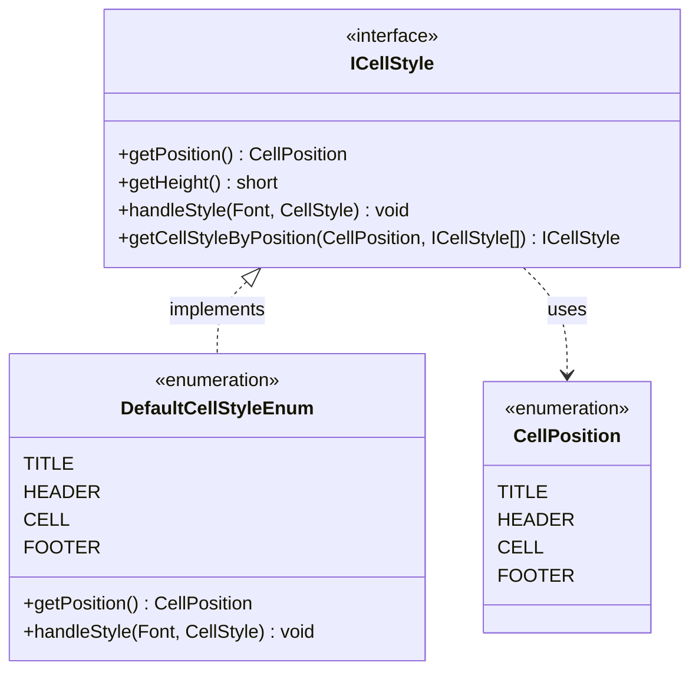
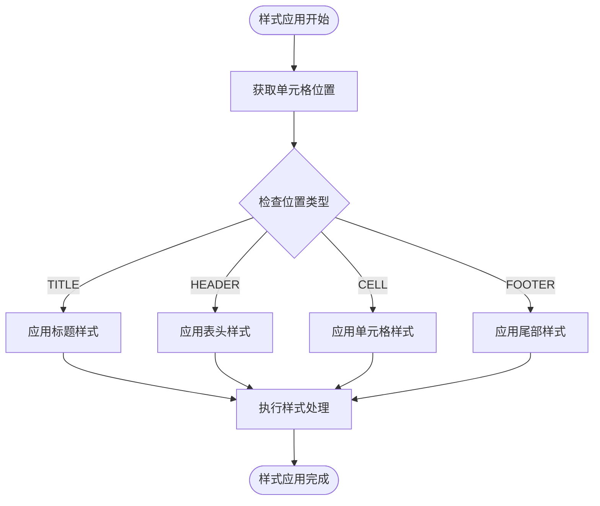
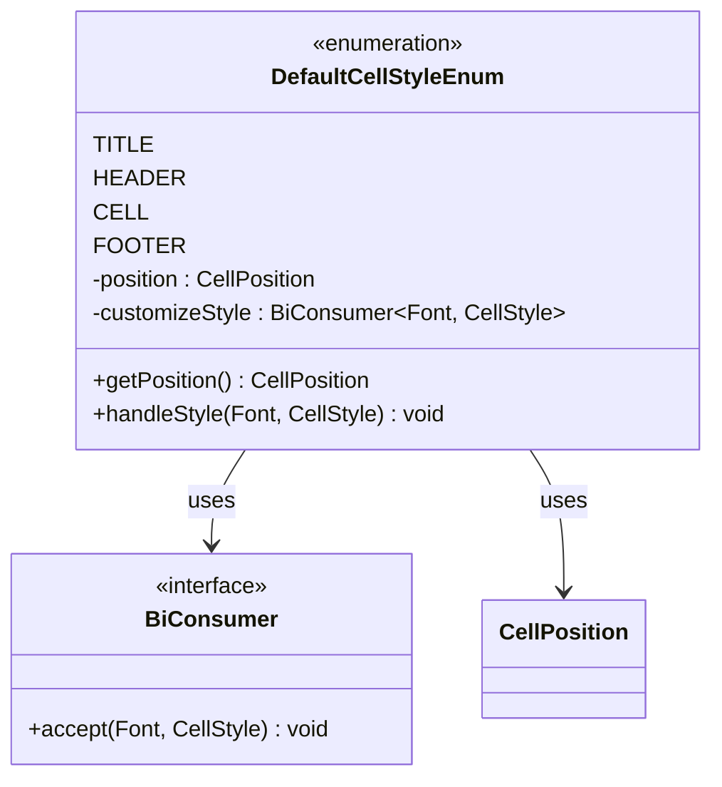
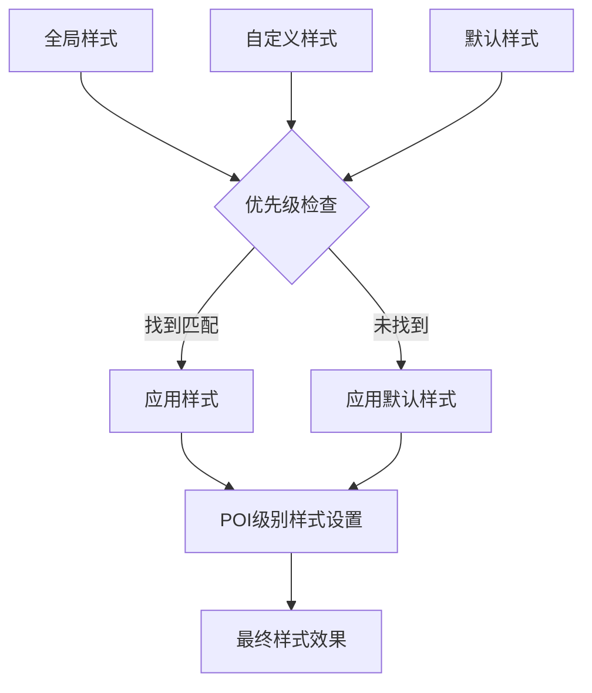

# 自定义单元格样式

<cite>
**本文档引用的文件**
- [ICellStyle.java](file://src/main/java/com/github/stupdit1t/excel/style/ICellStyle.java)
- [CellPosition.java](file://src/main/java/com/github/stupdit1t/excel/style/CellPosition.java)
- [DefaultCellStyleEnum.java](file://src/main/java/com/github/stupdit1t/excel/style/DefaultCellStyleEnum.java)
- [ExportRules.java](file://src/main/java/com/github/stupdit1t/excel/core/export/ExportRules.java)
- [ExportClass.java](file://src/test/java/excel/export/ExportClass.java)
- [OpsPoiUtil.java](file://src/main/java/com/github/stupdit1t/excel/core/OpsPoiUtil.java)
</cite>

## 目录
1. [简介](#简介)
2. [ICellStyle接口概述](#icellstyle接口概述)
3. [样式位置系统](#样式位置系统)
4. [核心方法详解](#核心方法详解)
5. [默认样式实现](#默认样式实现)
6. [自定义样式实现](#自定义样式实现)
7. [样式配置与应用](#样式配置与应用)
8. [性能优化建议](#性能优化建议)
9. [常见问题与解决方案](#常见问题与解决方案)
10. [最佳实践](#最佳实践)

## 简介

POI-Excel框架提供了一套完整的自定义单元格样式系统，通过ICellStyle接口实现了灵活的样式管理机制。该系统允许开发者精确控制Excel单元格的外观，包括字体、颜色、对齐方式、边框等POI级别的样式属性。

## ICellStyle接口概述

ICellStyle接口是整个样式系统的核心，它定义了单元格样式的标准化行为规范。



**图表来源**
- [ICellStyle.java](file://src/main/java/com/github/stupdit1t/excel/style/ICellStyle.java#L1-L55)
- [CellPosition.java](file://src/main/java/com/github/stupdit1t/excel/style/CellPosition.java#L1-L27)
- [DefaultCellStyleEnum.java](file://src/main/java/com/github/stupdit1t/excel/style/DefaultCellStyleEnum.java#L1-L112)

**章节来源**
- [ICellStyle.java](file://src/main/java/com/github/stupdit1t/excel/style/ICellStyle.java#L1-L55)

## 样式位置系统

样式位置系统通过CellPosition枚举定义了四种基本的单元格位置类型：

### 位置类型详解

1. **TITLE（大标题）**：用于设置Excel文件的主标题样式
2. **HEADER（表头）**：用于设置表格头部的样式
3. **CELL（单元格）**：用于设置普通数据单元格的样式
4. **FOOTER（尾部）**：用于设置表格底部统计信息的样式



**图表来源**
- [CellPosition.java](file://src/main/java/com/github/stupdit1t/excel/style/CellPosition.java#L7-L27)

**章节来源**
- [CellPosition.java](file://src/main/java/com/github/stupdit1t/excel/style/CellPosition.java#L1-L27)

## 核心方法详解

### getPosition()方法

getPosition()方法是ICellStyle接口的核心方法，它决定了样式应该应用到哪个位置：

```java
// 示例：实现标题样式
ICellStyle titleStyle = new ICellStyle() {
    @Override
    public CellPosition getPosition() {
        return CellPosition.TITLE;
    }
    
    @Override
    public void handleStyle(Font font, CellStyle cellStyle) {
        // 样式处理逻辑
    }
};
```

### handleStyle()方法

handleStyle()方法负责实际的样式设置逻辑，接收两个参数：
- **Font font**：当前字体对象，可以修改字体大小、颜色、加粗等属性
- **CellStyle cellStyle**：当前单元格样式对象，可以设置对齐方式、边框、背景色等

```java
@Override
public void handleStyle(Font font, CellStyle cellStyle) {
    // 设置字体属性
    font.setFontHeightInPoints((short) 15);
    font.setBold(true);
    font.setColor(IndexedColors.BLUE.getIndex());
    
    // 设置单元格样式
    cellStyle.setAlignment(HorizontalAlignment.CENTER);
    cellStyle.setVerticalAlignment(VerticalAlignment.CENTER);
    cellStyle.setFillForegroundColor(IndexedColors.YELLOW.getIndex());
    cellStyle.setFillPattern(FillPatternType.SOLID_FOREGROUND);
}
```

### getHeight()方法

getHeight()方法用于控制行高，默认返回-1表示不干预设置，返回300表示使用默认行高：

```java
@Override
public short getHeight() {
    return 300; // 设置行高为默认值的1.5倍
}
```

### getCellStyleByPosition()静态方法

这个方法提供了样式查找的内部逻辑，优先从传入的样式数组中查找，找不到则回退到默认样式：

```java
static ICellStyle getCellStyleByPosition(CellPosition position, ICellStyle[] cellStyles) {
    // 查找传入的样式
    for (ICellStyle cellStyle : cellStyles) {
        if (cellStyle.getPosition() == position) {
            return cellStyle;
        }
    }
    
    // 回退到默认样式
    ICellStyle[] defaultCellStyle = DefaultCellStyleEnum.values();
    for (ICellStyle cellStyle : defaultCellStyle) {
        if (cellStyle.getPosition() == position) {
            return cellStyle;
        }
    }
    
    throw new UnsupportedOperationException("找不到对应的样式 " + position);
}
```

**章节来源**
- [ICellStyle.java](file://src/main/java/com/github/stupdit1t/excel/style/ICellStyle.java#L1-L55)

## 默认样式实现

框架提供了默认的样式实现，通过DefaultCellStyleEnum枚举类实现：



**图表来源**
- [DefaultCellStyleEnum.java](file://src/main/java/com/github/stupdit1t/excel/style/DefaultCellStyleEnum.java#L10-L112)

### 标题样式实现

```java
TITLE(CellPosition.TITLE, (font, style) -> {
    font.setFontHeightInPoints((short) 15);
    font.setBold(true);
    style.setAlignment(HorizontalAlignment.CENTER);
    style.setVerticalAlignment(VerticalAlignment.CENTER);
    style.setFont(font);
});
```

### 表头样式实现

```java
HEADER(CellPosition.HEADER, (font, style) -> {
    font.setFontName("Arial");
    font.setBold(true);
    font.setFontHeightInPoints((short) 10);
    font.setColor(IndexedColors.WHITE.getIndex());
    style.setFillForegroundColor(IndexedColors.GREY_50_PERCENT.getIndex());
    style.setFillPattern(FillPatternType.SOLID_FOREGROUND);
    style.setBorderRight(BorderStyle.THIN);
    style.setBorderLeft(BorderStyle.THIN);
    style.setBorderTop(BorderStyle.THIN);
    style.setBorderBottom(BorderStyle.THIN);
    style.setAlignment(HorizontalAlignment.CENTER);
    style.setVerticalAlignment(VerticalAlignment.CENTER);
});
```

**章节来源**
- [DefaultCellStyleEnum.java](file://src/main/java/com/github/stupdit1t/excel/style/DefaultCellStyleEnum.java#L1-L112)

## 自定义样式实现

### 实现步骤

1. **创建实现类**：实现ICellStyle接口
2. **指定位置**：通过getPosition()方法确定应用位置
3. **设置样式**：通过handleStyle()方法自定义样式属性
4. **可选高度**：根据需要重写getHeight()方法

### 完整示例

```java
// 创建红色标题样式
ICellStyle redTitleStyle = new ICellStyle() {
    @Override
    public CellPosition getPosition() {
        return CellPosition.TITLE;
    }
    
    @Override
    public void handleStyle(Font font, CellStyle cellStyle) {
        // 设置红色字体
        font.setColor(IndexedColors.RED.getIndex());
        font.setFontHeightInPoints((short) 20);
        font.setBold(true);
        
        // 设置居中对齐
        cellStyle.setAlignment(HorizontalAlignment.CENTER);
        cellStyle.setVerticalAlignment(VerticalAlignment.CENTER);
        
        // 设置背景色
        cellStyle.setFillForegroundColor(IndexedColors.LIGHT_YELLOW.getIndex());
        cellStyle.setFillPattern(FillPatternType.SOLID_FOREGROUND);
    }
    
    @Override
    public short getHeight() {
        return 400; // 设置较高的行高
    }
};

// 创建带边框的数据单元格样式
ICellStyle borderedCellStyle = new ICellStyle() {
    @Override
    public CellPosition getPosition() {
        return CellPosition.CELL;
    }
    
    @Override
    public void handleStyle(Font font, CellStyle cellStyle) {
        // 设置字体属性
        font.setFontName("宋体");
        font.setFontHeightInPoints((short) 11);
        
        // 设置边框样式
        cellStyle.setBorderTop(BorderStyle.MEDIUM);
        cellStyle.setBorderBottom(BorderStyle.MEDIUM);
        cellStyle.setBorderLeft(BorderStyle.MEDIUM);
        cellStyle.setBorderRight(BorderStyle.MEDIUM);
        
        // 设置边框颜色
        cellStyle.setTopBorderColor(IndexedColors.BLACK.getIndex());
        cellStyle.setBottomBorderColor(IndexedColors.BLACK.getIndex());
        cellStyle.setLeftBorderColor(IndexedColors.BLACK.getIndex());
        cellStyle.setRightBorderColor(IndexedColors.BLACK.getIndex());
        
        // 设置内容居中
        cellStyle.setAlignment(HorizontalAlignment.CENTER);
        cellStyle.setVerticalAlignment(VerticalAlignment.CENTER);
        
        // 启用自动换行
        cellStyle.setWrapText(true);
    }
};
```

### 链式API应用

```java
ExcelHelper.opsExport(PoiWorkbookType.XLSX)
    .style(redTitleStyle, borderedCellStyle)  // 应用多个自定义样式
    .opsSheet(data)
        .opsHeader()
            .simple()
            .title("销售报表")
            .done()
        .opsColumn()
            .fields("productName", "quantity", "price", "total")
            .done()
        .export("sales_report.xlsx");
```

**章节来源**
- [ExportClass.java](file://src/test/java/excel/export/ExportClass.java#L159-L199)

## 样式配置与应用

### ExportRules中的样式配置

ExportRules类提供了丰富的样式配置选项：

```java
// 设置全局样式
ExportRules rules = new ExportRules(columns, headers);
rules.setGlobalStyle(customStyle1, customStyle2);

// 设置特定位置的高度
rules.setTitleHeight((short) 500);
rules.setHeaderHeight((short) 300);
rules.setCellHeight((short) 250);

// 在导出过程中应用样式
ExcelHelper.opsExport()
    .opsSheet(data)
        .style(globalStyle)
        .height(CellPosition.TITLE, 400)
        .height(CellPosition.HEADER, 300)
        .export(outputFile);
```

### 样式优先级关系



**图表来源**
- [ExportRules.java](file://src/main/java/com/github/stupdit1t/excel/core/export/ExportRules.java#L1-L597)

### 缓存机制

框架实现了样式缓存机制以提高性能：

```java
// OpsPoiUtil中的样式缓存实现
private static void setCellStyle(Workbook wb, Font cellFont, 
                                Map<String, CellStyle> cacheStyle, 
                                Map<String, Font> cacheFont, 
                                OutColumn.Style styleCustom, 
                                Cell cell, Object value) {
    String styleCacheKey = styleCustom.getStyleCacheKey();
    
    if (styleCacheKey != null) {
        CellStyle style = cacheStyle.get(styleCacheKey);
        if (style == null) {
            // 缓存不存在，重新构建样式
            style = wb.createCellStyle();
            style.cloneStyleFrom(cell.getCellStyle());
            
            // 应用自定义样式属性
            applyCustomProperties(style, styleCustom);
            
            cacheStyle.put(styleCacheKey, style);
        }
        cell.setCellStyle(style);
    }
}
```

**章节来源**
- [ExportRules.java](file://src/main/java/com/github/stupdit1t/excel/core/export/ExportRules.java#L1-L597)
- [OpsPoiUtil.java](file://src/main/java/com/github/stupdit1t/excel/core/OpsPoiUtil.java#L480-L511)

## 性能优化建议

### 避免重复创建Font对象

```java
// ❌ 不推荐：每次调用都创建新Font对象
@Override
public void handleStyle(Font font, CellStyle cellStyle) {
    Font newFont = wb.createFont(); // 重复创建会浪费资源
    newFont.setFontHeightInPoints((short) 12);
    cellStyle.setFont(newFont);
}

// ✅ 推荐：复用Font对象或使用缓存
@Override
public void handleStyle(Font font, CellStyle cellStyle) {
    font.setFontHeightInPoints((short) 12); // 修改现有Font对象
    cellStyle.setFont(font);
}
```

### 使用样式缓存

```java
// ✅ 推荐：利用框架的缓存机制
public class OptimizedCellStyle implements ICellStyle {
    private final String cacheKey;
    
    public OptimizedCellStyle(CellPosition position) {
        this.cacheKey = position.name() + "_optimized";
    }
    
    @Override
    public CellPosition getPosition() {
        return CellPosition.CELL;
    }
    
    @Override
    public void handleStyle(Font font, CellStyle cellStyle) {
        // 直接修改现有对象，避免重复创建
        font.setFontHeightInPoints((short) 11);
        cellStyle.setAlignment(HorizontalAlignment.LEFT);
    }
    
    @Override
    public String getStyleCacheKey() {
        return cacheKey; // 返回缓存键
    }
}
```

### 批量样式应用

```java
// ✅ 推荐：批量应用样式而不是逐个设置
List<ICellStyle> styles = Arrays.asList(
    titleStyle, headerStyle, cellStyle, footerStyle
);

// 在导出时一次性应用所有样式
ExcelHelper.opsExport()
    .style(styles.toArray(new ICellStyle[0]))
    .opsSheet(data)
    .export(file);
```

## 常见问题与解决方案

### 问题1：样式未生效

**原因分析**：
- 未正确返回CellStyle实例
- 样式被后续操作覆盖
- 缓存键冲突导致样式丢失

**解决方案**：
```java
// 确保正确实现handleStyle方法
@Override
public void handleStyle(Font font, CellStyle cellStyle) {
    // 必须修改传入的font和cellStyle对象
    font.setFontHeightInPoints((short) 12);
    cellStyle.setAlignment(HorizontalAlignment.CENTER);
    
    // 确保调用setFont设置字体
    cellStyle.setFont(font);
}
```

### 问题2：性能问题

**原因分析**：
- 在handleStyle中频繁创建Font对象
- 未利用样式缓存机制
- 样式计算逻辑过于复杂

**解决方案**：
```java
// 使用缓存优化
private static final Map<String, CellStyle> styleCache = new ConcurrentHashMap<>();

@Override
public void handleStyle(Font font, CellStyle cellStyle) {
    // 使用现有的Font对象，避免重复创建
    font.setFontHeightInPoints((short) 11);
    cellStyle.setAlignment(HorizontalAlignment.CENTER);
    
    // 避免复杂的计算逻辑
    // 简单直接地设置样式属性
}
```

### 问题3：样式冲突

**原因分析**：
- 多个样式同时作用于同一位置
- 默认样式与自定义样式冲突

**解决方案**：
```java
// 明确指定样式优先级
ICellStyle primaryStyle = new ICellStyle() {
    @Override
    public CellPosition getPosition() {
        return CellPosition.HEADER;
    }
    
    @Override
    public void handleStyle(Font font, CellStyle cellStyle) {
        // 清除所有默认样式
        cellStyle.setBorderTop(BorderStyle.NONE);
        cellStyle.setBorderBottom(BorderStyle.NONE);
        cellStyle.setBorderLeft(BorderStyle.NONE);
        cellStyle.setBorderRight(BorderStyle.NONE);
        
        // 应用自己的样式
        cellStyle.setBorderTop(BorderStyle.THICK);
        cellStyle.setBorderBottom(BorderStyle.THICK);
    }
};
```

### 问题4：内存泄漏

**原因分析**：
- 样式对象持有大量引用
- 缓存策略不当

**解决方案**：
```java
// 使用弱引用缓存
private static final Map<String, WeakReference<CellStyle>> weakStyleCache = 
    new WeakHashMap<>();

// 或者定期清理缓存
@Scheduled(fixedRate = 3600000) // 每小时清理一次
public void cleanupStyleCache() {
    styleCache.clear();
}
```

## 最佳实践

### 1. 样式设计原则

```java
// ✅ 推荐：遵循样式设计原则
public class BusinessReportStyle implements ICellStyle {
    private final CellPosition position;
    
    public BusinessReportStyle(CellPosition position) {
        this.position = position;
    }
    
    @Override
    public CellPosition getPosition() {
        return position;
    }
    
    @Override
    public void handleStyle(Font font, CellStyle cellStyle) {
        // 统一字体设置
        font.setFontName("Microsoft YaHei");
        font.setFontHeightInPoints((short) 10);
        
        // 统一对齐方式
        cellStyle.setAlignment(HorizontalAlignment.CENTER);
        cellStyle.setVerticalAlignment(VerticalAlignment.CENTER);
        
        // 统一边框样式
        cellStyle.setBorderTop(BorderStyle.THIN);
        cellStyle.setBorderBottom(BorderStyle.THIN);
        cellStyle.setBorderLeft(BorderStyle.THIN);
        cellStyle.setBorderRight(BorderStyle.THIN);
        
        // 根据位置设置特殊样式
        switch (position) {
            case TITLE:
                font.setBold(true);
                font.setFontHeightInPoints((short) 16);
                cellStyle.setFillForegroundColor(IndexedColors.GREY_25_PERCENT.getIndex());
                break;
            case HEADER:
                font.setBold(true);
                font.setColor(IndexedColors.WHITE.getIndex());
                cellStyle.setFillForegroundColor(IndexedColors.DARK_BLUE.getIndex());
                break;
            case CELL:
                // 默认样式，保持简洁
                break;
            case FOOTER:
                font.setBold(true);
                cellStyle.setFillForegroundColor(IndexedColors.LIGHT_GREY.getIndex());
                break;
        }
    }
    
    @Override
    public short getHeight() {
        // 根据业务需求设置合适的行高
        switch (position) {
            case TITLE: return 400;
            case HEADER: return 300;
            case FOOTER: return 300;
            default: return -1;
        }
    }
}
```

### 2. 样式工厂模式

```java
// ✅ 推荐：使用工厂模式创建样式
public class StyleFactory {
    public static ICellStyle createTitleStyle() {
        return new ICellStyle() {
            @Override
            public CellPosition getPosition() {
                return CellPosition.TITLE;
            }
            
            @Override
            public void handleStyle(Font font, CellStyle cellStyle) {
                // 标题样式实现
            }
        };
    }
    
    public static ICellStyle createHeaderStyle() {
        return new ICellStyle() {
            @Override
            public CellPosition getPosition() {
                return CellPosition.HEADER;
            }
            
            @Override
            public void handleStyle(Font font, CellStyle cellStyle) {
                // 表头样式实现
            }
        };
    }
    
    public static ICellStyle createCellStyle() {
        return new ICellStyle() {
            @Override
            public CellPosition getPosition() {
                return CellPosition.CELL;
            }
            
            @Override
            public void handleStyle(Font font, CellStyle cellStyle) {
                // 单元格样式实现
            }
        };
    }
}
```

### 3. 样式配置管理

```java
// ✅ 推荐：集中管理样式配置
public class StyleConfig {
    private static final Map<CellPosition, ICellStyle> styleMap = new EnumMap<>(CellPosition.class);
    
    static {
        // 初始化默认样式
        styleMap.put(CellPosition.TITLE, createDefaultTitleStyle());
        styleMap.put(CellPosition.HEADER, createDefaultHeaderStyle());
        styleMap.put(CellPosition.CELL, createDefaultCellStyle());
        styleMap.put(CellPosition.FOOTER, createDefaultFooterStyle());
    }
    
    public static ICellStyle getStyle(CellPosition position) {
        return styleMap.getOrDefault(position, getDefaultStyle(position));
    }
    
    public static void registerStyle(CellPosition position, ICellStyle style) {
        styleMap.put(position, style);
    }
    
    private static ICellStyle getDefaultStyle(CellPosition position) {
        return styleMap.get(position);
    }
}
```

### 4. 样式测试策略

```java
// ✅ 推荐：编写样式测试
@Test
public void testCellStyleApplication() {
    // 准备测试数据
    Workbook workbook = new XSSFWorkbook();
    Sheet sheet = workbook.createSheet();
    Row row = sheet.createRow(0);
    Cell cell = row.createCell(0);
    
    // 创建测试样式
    ICellStyle testStyle = new ICellStyle() {
        @Override
        public CellPosition getPosition() {
            return CellPosition.CELL;
        }
        
        @Override
        public void handleStyle(Font font, CellStyle cellStyle) {
            font.setFontHeightInPoints((short) 14);
            font.setBold(true);
            cellStyle.setAlignment(HorizontalAlignment.RIGHT);
        }
    };
    
    // 应用样式
    Font font = workbook.createFont();
    CellStyle cellStyle = workbook.createCellStyle();
    testStyle.handleStyle(font, cellStyle);
    
    // 验证样式效果
    assertEquals((short) 14, font.getFontHeightInPoints());
    assertEquals(true, font.getBold());
    assertEquals(HorizontalAlignment.RIGHT, cellStyle.getAlignment());
}
```

通过遵循这些最佳实践，您可以创建出既美观又高效的Excel样式系统，确保您的应用程序能够提供出色的用户体验。