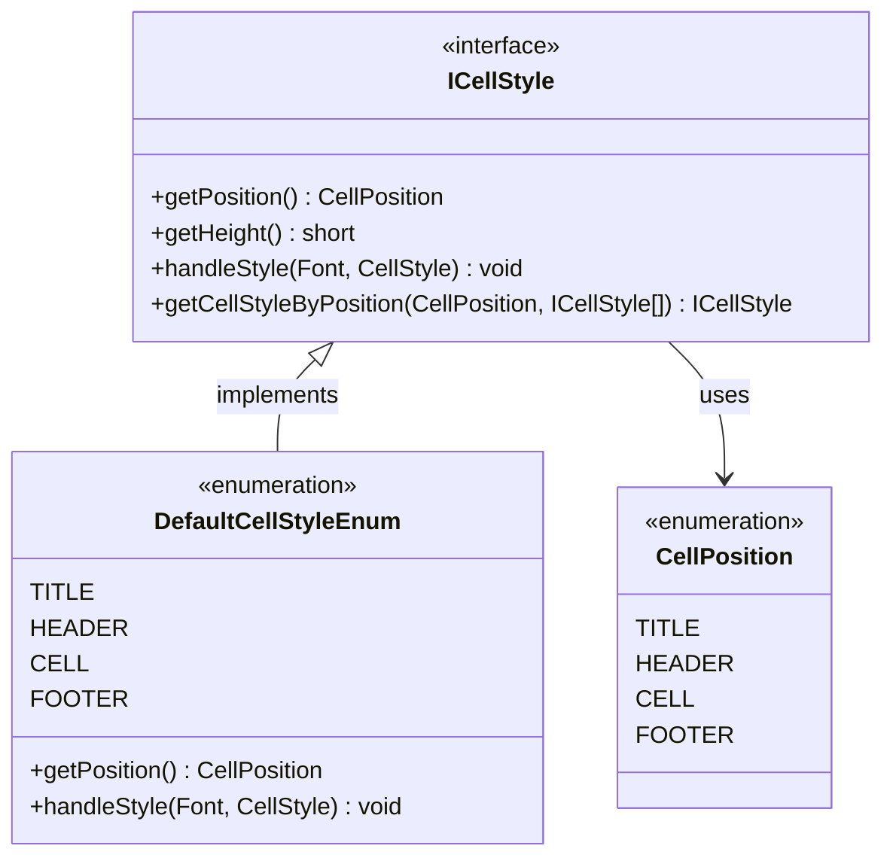
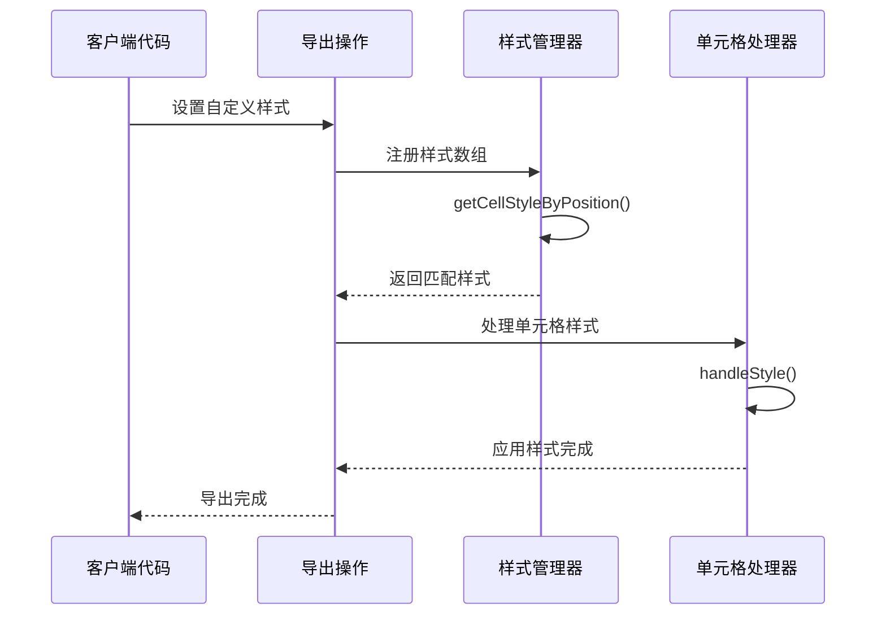
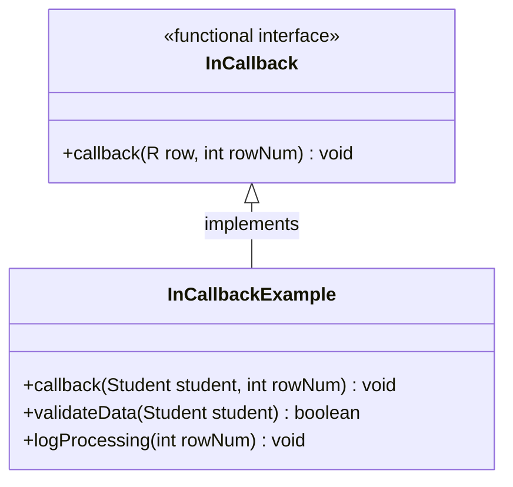
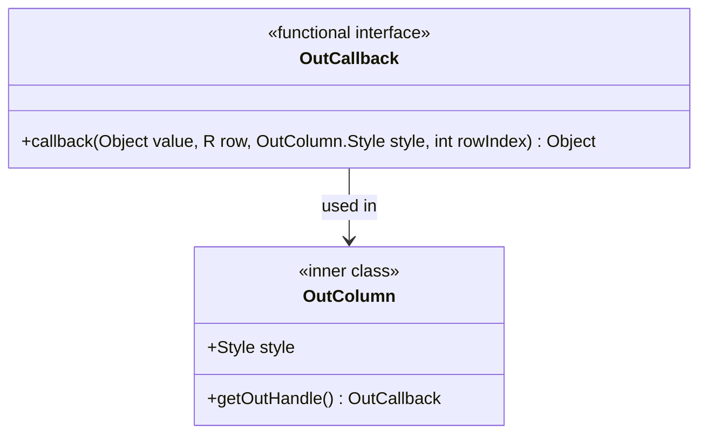
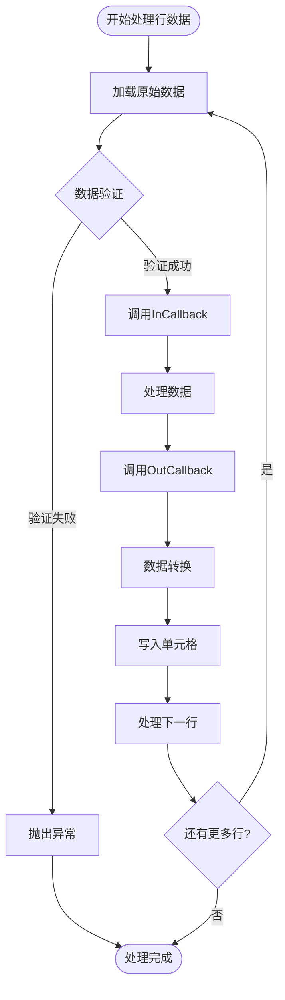
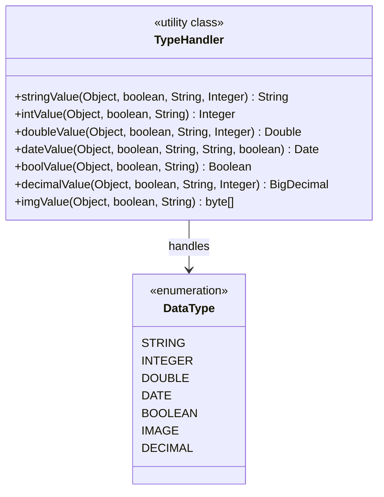
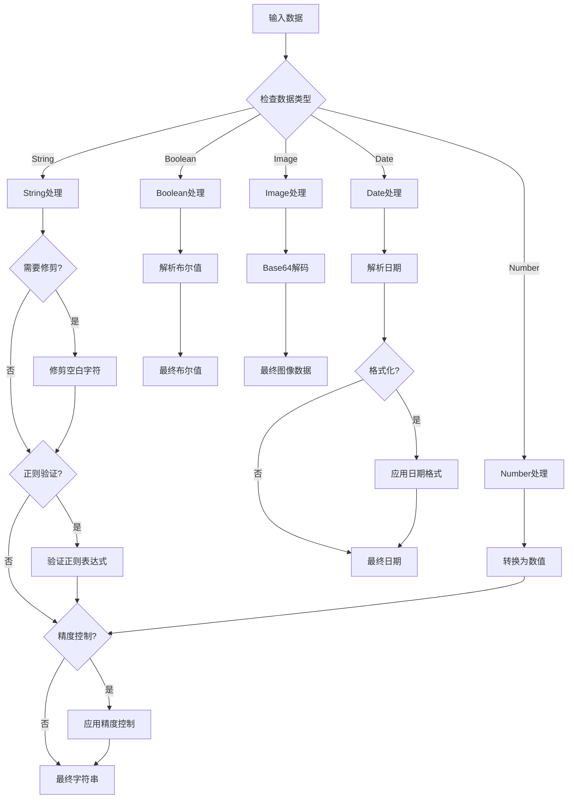
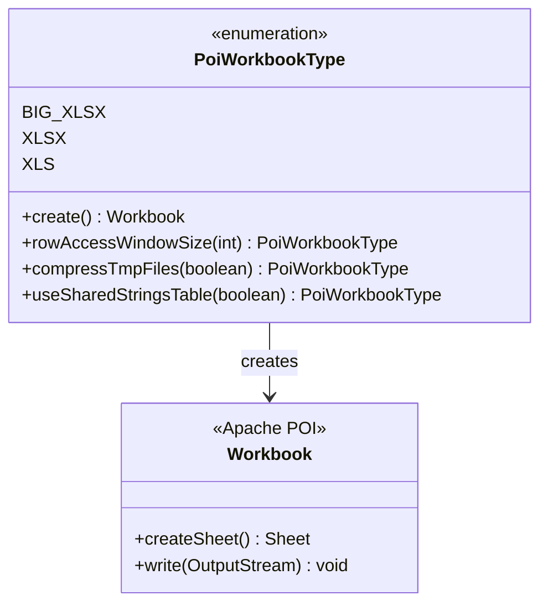
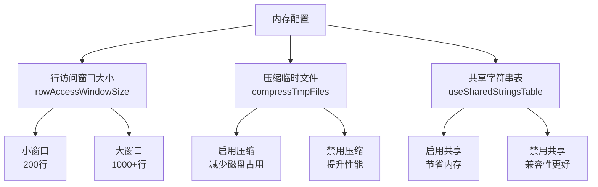
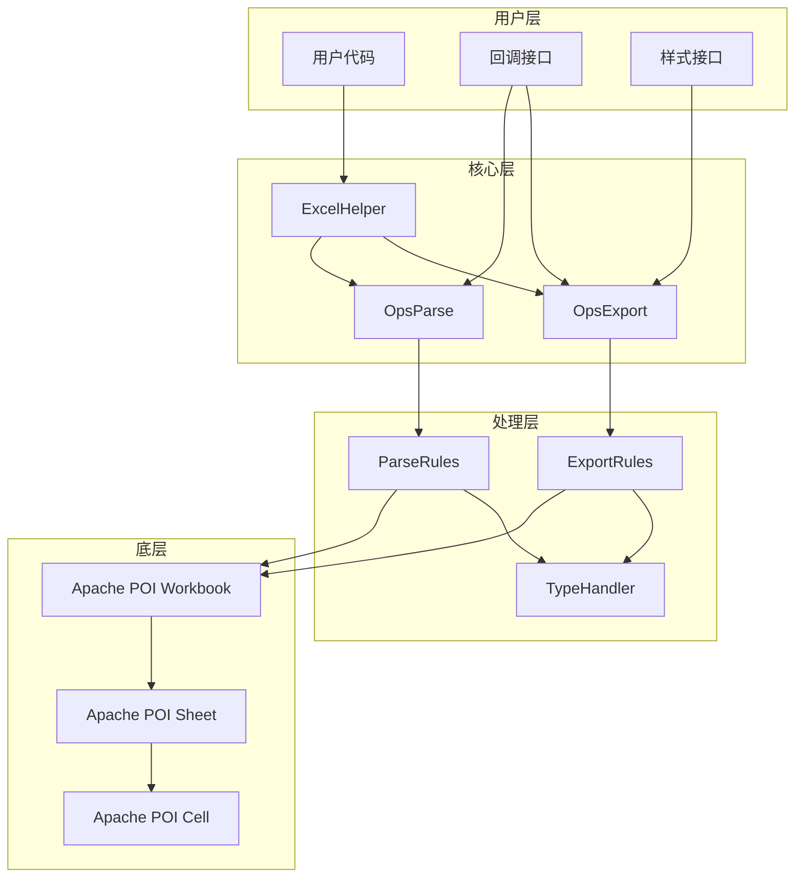

# 高级功能与扩展

<cite>
**本文档引用的文件**
- [ICellStyle.java](file://src/main/java/com/github/stupdit1t/excel/style/ICellStyle.java)
- [InCallback.java](file://src/main/java/com/github/stupdit1t/excel/callback/InCallback.java)
- [OutCallback.java](file://src/main/java/com/github/stupdit1t/excel/callback/OutCallback.java)
- [TypeHandler.java](file://src/main/java/com/github/stupdit1t/excel/common/TypeHandler.java)
- [OpsExport.java](file://src/main/java/com/github/stupdit1t/excel/core/export/OpsExport.java)
- [OpsParse.java](file://src/main/java/com/github/stupdit1t/excel/core/parse/OpsParse.java)
- [PoiWorkbookType.java](file://src/main/java/com/github/stupdit1t/excel/common/PoiWorkbookType.java)
- [DefaultCellStyleEnum.java](file://src/main/java/com/github/stupdit1t/excel/style/DefaultCellStyleEnum.java)
- [CellPosition.java](file://src/main/java/com/github/stupdit1t/excel/style/CellPosition.java)
- [ExportClass.java](file://src/test/java/excel/export/ExportClass.java)
</cite>

## 目录
1. [简介](#简介)
2. [单元格样式定制化](#单元格样式定制化)
3. [回调机制详解](#回调机制详解)
4. [类型处理器扩展](#类型处理器扩展)
5. [内存优化策略](#内存优化策略)
6. [架构设计分析](#架构设计分析)
7. [最佳实践指南](#最佳实践指南)
8. [总结](#总结)

## 简介

POI-Excel框架提供了丰富的可扩展性和定制化能力，使开发者能够根据具体业务需求灵活调整Excel处理行为。本文档深入探讨了四个核心扩展点：单元格样式定制、回调机制、类型处理器以及内存优化策略，帮助开发者充分发挥框架的潜力。

## 单元格样式定制化

### ICellStyle接口设计

ICellStyle接口是整个样式系统的核心，它定义了单元格样式的标准化接口规范：



**图表来源**
- [ICellStyle.java](file://src/main/java/com/github/stupdit1t/excel/style/ICellStyle.java#L1-L57)
- [CellPosition.java](file://src/main/java/com/github/stupdit1t/excel/style/CellPosition.java#L1-L27)
- [DefaultCellStyleEnum.java](file://src/main/java/com/github/stupdit1t/excel/style/DefaultCellStyleEnum.java#L1-L112)

### 样式位置管理

系统定义了四种基本样式位置，每种位置都有其特定的应用场景：

- **TITLE**: 大标题样式，通常用于报表的主要标题
- **HEADER**: 表头样式，用于列标题和副标题
- **CELL**: 数据单元格样式，用于普通数据内容
- **FOOTER**: 尾部样式，用于统计信息和汇总数据

### 自定义样式实现

开发者可以通过实现ICellStyle接口来创建自定义样式：

```java
// 示例：创建自定义标题样式
ICellStyle customTitleStyle = new ICellStyle() {
    @Override
    public CellPosition getPosition() {
        return CellPosition.TITLE;
    }
    
    @Override
    public void handleStyle(Font font, CellStyle cellStyle) {
        // 设置字体高度
        font.setFontHeightInPoints((short) 20);
        // 设置字体颜色为红色
        font.setColor(IndexedColors.RED.index);
        // 设置水平对齐方式为左对齐
        cellStyle.setAlignment(HorizontalAlignment.LEFT);
        // 设置垂直对齐方式
        cellStyle.setVerticalAlignment(VerticalAlignment.CENTER);
    }
};
```

### 样式应用流程



**图表来源**
- [ICellStyle.java](file://src/main/java/com/github/stupdit1t/excel/style/ICellStyle.java#L30-L57)
- [OpsExport.java](file://src/main/java/com/github/stupdit1t/excel/core/export/OpsExport.java#L80-L90)

**章节来源**
- [ICellStyle.java](file://src/main/java/com/github/stupdit1t/excel/style/ICellStyle.java#L1-L57)
- [DefaultCellStyleEnum.java](file://src/main/java/com/github/stupdit1t/excel/style/DefaultCellStyleEnum.java#L1-L112)
- [ExportClass.java](file://src/test/java/excel/export/ExportClass.java#L150-L180)

## 回调机制详解

### InCallback接口设计

InCallback接口提供了导入过程中的回调机制，允许开发者在数据处理的不同阶段插入自定义逻辑：



**图表来源**
- [InCallback.java](file://src/main/java/com/github/stupdit1t/excel/callback/InCallback.java#L1-L19)

### OutCallback接口设计

OutCallback接口则专注于导出过程，提供了更丰富的上下文信息：



**图表来源**
- [OutCallback.java](file://src/main/java/com/github/stupdit1t/excel/callback/OutCallback.java#L1-L26)

### 回调应用场景

#### 数据验证回调
```java
// 导入时的数据验证回调
InCallback<Student> validationCallback = (student, rowNum) -> {
    if (student.getName() == null || student.getName().isEmpty()) {
        throw new IllegalArgumentException("第" + rowNum + "行姓名不能为空");
    }
    // 其他验证逻辑...
};

// 使用回调
ExcelHelper.opsParse(Student.class)
    .from("data.xlsx")
    .opsSheet(0, 1, 0)
    .map(validationCallback)
    .read();
```

#### 数据转换回调
```java
// 导出时的数据转换回调
OutCallback<Student> transformCallback = (value, student, style, rowIndex) -> {
    if (value instanceof Date) {
        // 将日期格式化为特定格式
        return DateFormatUtils.format((Date) value, "yyyy-MM-dd");
    }
    return value;
};

// 使用回调
ExcelHelper.opsExport(PoiWorkbookType.XLSX)
    .opsSheet(studentList)
    .opsColumn()
    .field("createTime").callback(transformCallback)
    .done()
    .export("students.xlsx");
```

### 回调执行流程



**图表来源**
- [InCallback.java](file://src/main/java/com/github/stupdit1t/excel/callback/InCallback.java#L12-L18)
- [OutCallback.java](file://src/main/java/com/github/stupdit1t/excel/callback/OutCallback.java#L15-L25)

**章节来源**
- [InCallback.java](file://src/main/java/com/github/stupdit1t/excel/callback/InCallback.java#L1-L19)
- [OutCallback.java](file://src/main/java/com/github/stupdit1t/excel/callback/OutCallback.java#L1-L26)
- [OpsParse.java](file://src/main/java/com/github/stupdit1t/excel/core/parse/OpsParse.java#L1-L145)

## 类型处理器扩展

### TypeHandler核心功能

TypeHandler类提供了统一的数据类型转换机制，支持多种数据类型的自定义序列化和反序列化：



**图表来源**
- [TypeHandler.java](file://src/main/java/com/github/stupdit1t/excel/common/TypeHandler.java#L1-L155)

### 支持的数据类型

TypeHandler支持以下数据类型的转换：

1. **基础数据类型**: String, Integer, Double, Float, Long, Short, Boolean
2. **日期时间**: Date类型，支持多种日期格式
3. **数值类型**: BigDecimal，支持精度控制
4. **二进制数据**: 图片数据的Base64编码处理

### 自定义类型处理器

开发者可以通过继承或组合现有类型处理器来创建自定义类型处理逻辑：

```java
// 示例：自定义枚举类型处理器
public class EnumTypeHandler<T extends Enum<T>> implements TypeHandler<T> {
    
    private final Class<T> enumClass;
    
    public EnumTypeHandler(Class<T> enumClass) {
        this.enumClass = enumClass;
    }
    
    @Override
    public T deserialize(String value) {
        try {
            return Enum.valueOf(enumClass, value.toUpperCase());
        } catch (IllegalArgumentException e) {
            throw new PoiException("无效的枚举值: " + value);
        }
    }
    
    @Override
    public String serialize(T value) {
        return value.name();
    }
}
```

### 类型转换流程



**图表来源**
- [TypeHandler.java](file://src/main/java/com/github/stupdit1t/excel/common/TypeHandler.java#L10-L155)

**章节来源**
- [TypeHandler.java](file://src/main/java/com/github/stupdit1t/excel/common/TypeHandler.java#L1-L155)

## 内存优化策略

### PoiWorkbookType枚举设计

系统提供了三种不同的工作簿类型，每种都针对不同的内存使用场景进行了优化：



**图表来源**
- [PoiWorkbookType.java](file://src/main/java/com/github/stupdit1t/excel/common/PoiWorkbookType.java#L1-L107)

### 内存优化策略对比

| 工作簿类型 | 内存使用 | 适用场景 | 性能特点 |
|------------|----------|----------|----------|
| **BIG_XLSX** | 最低 | 大数据量导出 | 使用SXSSFWorkbook，内存占用最小 |
| **XLSX** | 中等 | 中等数据量 | 使用XSSFWorkbook，功能完整 |
| **XLS** | 较高 | 小数据量 | 使用HSSFWorkbook，兼容性好 |

### 并行处理机制

系统支持并行导出多个sheet，显著提升大数据量处理性能：

```java
// 并行导出配置
ExcelHelper.opsExport(PoiWorkbookType.BIG_XLSX)
    .parallelSheet()  // 启用并行处理
    .opsSheet(sheet1Data)
    .sheetName("Sheet1")
    .done()
    .opsSheet(sheet2Data)
    .sheetName("Sheet2")
    .done()
    .export("parallel_export.xlsx");
```

### 内存优化配置参数



**图表来源**
- [PoiWorkbookType.java](file://src/main/java/com/github/stupdit1t/excel/common/PoiWorkbookType.java#L20-L107)

### 内存使用监控

系统提供了内存使用监控机制，帮助开发者评估不同配置下的性能表现：

```java
// 内存监控示例
public class MemoryMonitor {
    public void monitorMemoryUsage() {
        Runtime runtime = Runtime.getRuntime();
        long maxMemory = runtime.maxMemory();
        long totalMemory = runtime.totalMemory();
        long freeMemory = runtime.freeMemory();
        
        System.out.println("最大内存: " + maxMemory / 1024 / 1024 + "MB");
        System.out.println("已分配内存: " + totalMemory / 1024 / 1024 + "MB");
        System.out.println("空闲内存: " + freeMemory / 1024 / 1024 + "MB");
    }
}
```

**章节来源**
- [PoiWorkbookType.java](file://src/main/java/com/github/stupdit1t/excel/common/PoiWorkbookType.java#L1-L107)
- [OpsExport.java](file://src/main/java/com/github/stupdit1t/excel/core/export/OpsExport.java#L80-L120)

## 架构设计分析

### 整体架构概览



### 设计模式应用

1. **Builder模式**: OpsExport和OpsParse使用构建器模式提供流畅的API
2. **Strategy模式**: ICellStyle和TypeHandler实现策略模式
3. **Template Method模式**: 基础类定义处理流程，子类实现具体逻辑
4. **Observer模式**: 回调机制实现观察者模式

### 扩展点设计原则

- **单一职责**: 每个扩展点专注于特定的功能领域
- **开放封闭**: 对扩展开放，对修改封闭
- **依赖倒置**: 依赖抽象接口而非具体实现
- **接口隔离**: 接口设计遵循最小依赖原则

## 最佳实践指南

### 样式定制最佳实践

1. **继承默认样式**: 优先继承默认样式，只覆盖需要修改的部分
2. **保持一致性**: 在同一应用中保持样式的一致性
3. **性能考虑**: 避免在样式处理中执行耗时操作

```java
// 推荐：继承默认样式
ICellStyle customHeader = new ICellStyle() {
    @Override
    public CellPosition getPosition() {
        return CellPosition.HEADER;
    }
    
    @Override
    public void handleStyle(Font font, CellStyle cellStyle) {
        // 继承默认样式
        DefaultCellStyleEnum.HEADER.handleStyle(font, cellStyle);
        // 只修改需要的部分
        cellStyle.setFillForegroundColor(IndexedColors.YELLOW.index);
    }
};
```

### 回调使用最佳实践

1. **异常处理**: 在回调中妥善处理异常，避免中断整个流程
2. **性能优化**: 避免在回调中执行复杂的计算或IO操作
3. **日志记录**: 记录回调执行过程中的关键信息

```java
// 推荐：完善的回调实现
InCallback<Student> robustCallback = (student, rowNum) -> {
    try {
        // 数据验证
        validateStudent(student, rowNum);
        
        // 数据转换
        student.setName(student.getName().toUpperCase());
        
        // 日志记录
        log.info("处理第{}行学生: {}", rowNum, student.getName());
        
    } catch (Exception e) {
        log.error("处理第{}行学生时发生错误: {}", rowNum, e.getMessage());
        throw e;
    }
};
```

### 内存优化最佳实践

1. **选择合适的工作簿类型**: 根据数据量选择最适合的工作簿类型
2. **合理配置并行度**: 并行处理时注意不要超过系统资源限制
3. **及时释放资源**: 处理完成后及时关闭工作簿和流

```java
// 推荐：合理的内存配置
try (Workbook workbook = PoiWorkbookType.BIG_XLSX
    .rowAccessWindowSize(500)
    .compressTmpFiles(true)
    .create()) {
    
    // 处理逻辑
    
} catch (IOException e) {
    log.error("工作簿处理失败", e);
}
```

## 总结

POI-Excel框架通过精心设计的扩展机制，为开发者提供了强大的定制化能力。四个核心扩展点——单元格样式定制、回调机制、类型处理器和内存优化策略——共同构成了一个完整的扩展体系。

- **ICellStyle接口**提供了灵活的样式定制能力，支持精确到每个单元格位置的样式控制
- **回调机制**在导入导出过程中提供了丰富的钩子点，允许开发者插入自定义逻辑
- **TypeHandler**实现了类型安全的数据转换，支持多种数据类型的自定义处理
- **内存优化策略**通过不同的工作簿类型和配置选项，有效应对大数据量处理挑战

这些扩展功能不仅提升了框架的灵活性和适应性，也为开发者提供了充分的定制空间，使其能够满足各种复杂的业务需求。通过合理运用这些扩展点，开发者可以构建出既高效又符合业务要求的Excel处理解决方案。