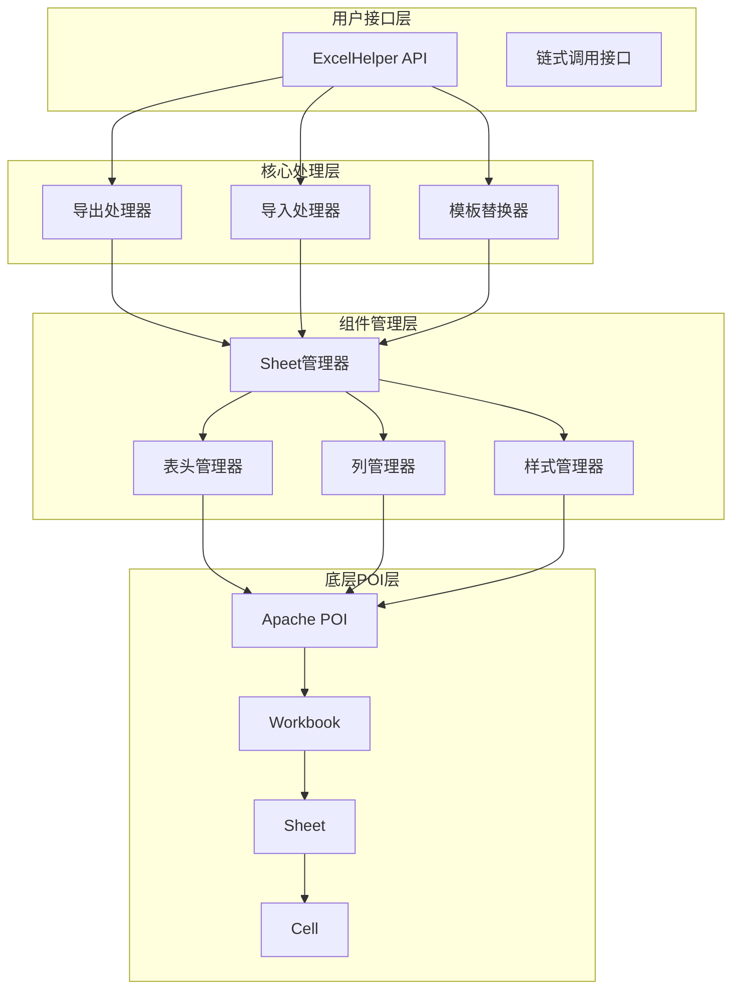

# POI-Excel SDK 使用文档

[](https://www.oracle.com/java/)
[](https://mvnrepository.com/)
[](https://www.apache.org/licenses/LICENSE-2.0)

> 🚀 一个基于 Apache POI 的 Java Excel 处理工具库，为新手提供简单、快速上手的 Excel 操作体验

## 📖 目录

- [项目简介](#项目简介)
- [快速开始](#快速开始)
- [核心功能](#核心功能)
  - [导出功能](#导出功能)
  - [导入功能](#导入功能)
  - [模板替换](#模板替换)
- [API参考](#api参考)
- [最佳实践](#最佳实践)
- [性能优化](#性能优化)
- [常见问题](#常见问题)
- [版本历史](#版本历史)

## 项目简介

POI-Excel 是一个基于 Apache POI 封装的 Java 工具库，专为简化 Excel 表格处理而设计。通过链式调用API和统一的异常处理机制，让开发者能够在几分钟内完成复杂的 Excel 操作。

### ✨ 核心特性

- **🎯 简单易用**: 链式调用API，代码更简洁
- **⚡ 性能优秀**: 支持大数据量处理和内存优化
- **🔧 功能完整**: 导出、导入、模板替换一应俱全
- **🛡️ 类型安全**: 强类型支持，编译时错误检查
- **🎨 样式丰富**: 内置多种样式，支持自定义
- **📊 复杂表头**: 支持合并单元格和多级表头
- **🔍 数据校验**: 内置数据验证和错误处理机制

### 🏗️ 技术架构



## 快速开始

### 📋 先决条件

- **JDK**: 1.8 或更高版本
- **构建工具**: Maven 或 Gradle
- **Servlet API**: 支持 Servlet 3.0+（Web应用必需）

### 📦 Maven依赖

```xml
<dependency>
    <groupId>com.github.stupdit1t</groupId>
    <artifactId>poi-excel</artifactId>
    <version>1.0.0</version>
</dependency>
```

### 🚀 5分钟上手示例

```java
import com.github.stupdit1t.excel.core.ExcelHelper;
import com.github.stupdit1t.excel.common.PoiWorkbookType;

// 学生实体类
public class Student {
    private String name;
    private Integer age;
    private String className;
    private Double score;
    
    // getter/setter省略...
}

// 导出示例
public void exportStudents(HttpServletResponse response) {
    // 1. 准备数据
    List<Student> students = Arrays.asList(
        new Student("张三", 18, "1班", 85.5),
        new Student("李四", 19, "2班", 92.0)
    );
    
    // 2. 导出Excel
    ExcelHelper.opsExport(PoiWorkbookType.XLSX)
        .opsSheet(students)
        .opsHeader().simple()
            .texts("姓名", "年龄", "班级", "成绩")
            .done()
        .opsColumn()
            .fields("name", "age", "className", "score")
            .field("score").pattern("0.00%")  // 成绩显示为百分比
            .done()
        .export(response, "学生名单.xlsx");
}

// 导入示例
public List<Student> importStudents(MultipartFile file) {
    PoiResult<Student> result = ExcelHelper.opsParse(Student.class)
        .from(file.getInputStream())
        .opsSheet(0, 1, 0)  // 第0个Sheet，1行表头，0行尾部
        .opsColumn()
            .field("name").required("姓名不能为空")
            .field("age").min(1).max(120).message("年龄必须在1-120岁之间")
            .field("className").verifyText("[A-Za-z0-9]+", "班级名称只能包含字母和数字")
            .field("score").pattern("0.00%").message("成绩必须是百分比格式")
            .done()
        .parse();
        
    if (result.hasError()) {
        throw new RuntimeException("导入失败：" + result.getErrorInfoString());
    }
    
    return result.getData();
}
```

## 核心功能

### 📤 导出功能

#### 简单导出
最基础的数据导出，适合快速生成报表：

```java
ExcelHelper.opsExport(PoiWorkbookType.XLSX)
    .opsSheet(dataList)
    .opsHeader().simple()
        .texts("列名1", "列名2", "列名3")
        .done()
    .opsColumn()
        .fields("field1", "field2", "field3")
        .done()
    .export("simple.xlsx");
```

#### 复杂表头导出
支持多级表头和单元格合并：

```java
ExcelHelper.opsExport(PoiWorkbookType.XLSX)
    .opsSheet(data)
    .opsHeader().complex()
        .text("学生信息统计", "A1:E1")
        .text("基本信息", "A2:C2")
        .text("成绩信息", "D2:E2")
        .text("姓名", "A3:A3")
        .text("年龄", "B3:B3")
        .text("班级", "C3:C3")
        .text("语文", "D3:D3")
        .text("数学", "E3:E3")
        .done()
    .opsColumn()
        .fields("name", "age", "className", "chineseScore", "mathScore")
        .field("chineseScore").pattern("0.00")
        .field("mathScore").pattern("0.00")
        .done()
    .export("complex.xlsx");
```

#### 多Sheet导出
支持同时导出多个工作表：

```java
ExcelHelper.opsExport(PoiWorkbookType.XLSX)
    .parallelSheet()  // 启用并行导出
    .opsSheet(sheet1Data)
        .sheetName("学生信息")
        .opsHeader().simple().texts("姓名", "年龄").done()
        .opsColumn().fields("name", "age").done()
        .done()
    .opsSheet(sheet2Data)
        .sheetName("成绩信息")
        .opsHeader().simple().texts("姓名", "成绩").done()
        .opsColumn().fields("name", "score").done()
        .done()
    .export("multi_sheet.xlsx");
```

#### 大数据量导出
支持百万级数据的高效导出：

```java
// 使用BIG_XLSX格式处理大数据
ExcelHelper.opsExport(PoiWorkbookType.BIG_XLSX)
    .opsSheet(largeDataList)
    .opsHeader().simple()
        .texts("字段1", "字段2", "字段3")
        .done()
    .opsColumn()
        .fields("field1", "field2", "field3")
        .done()
    .export("large_data.xlsx");
```

### 📥 导入功能

#### 自动映射导入
基于字段名自动映射Excel列：

```java
PoiResult<Student> result = ExcelHelper.opsParse(Student.class)
    .from("students.xlsx")
    .opsSheet(0, 1, 0)
    .opsColumn(true)  // 启用自动字段映射
        .done()
    .parse();
```

#### 手动指定列映射
精确控制每一列的映射关系：

```java
PoiResult<Student> result = ExcelHelper.opsParse(Student.class)
    .from(inputStream)
    .opsSheet(0, 1, 0)
    .opsColumn()
        .field(Col.A, "name")      // A列映射到name字段
        .field(Col.B, "age")       // B列映射到age字段
        .field(Col.C, "className") // C列映射到className字段
        .done()
    .parse();
```

#### 数据校验与转换
内置丰富的数据验证规则：

```java
PoiResult<Student> result = ExcelHelper.opsParse(Student.class)
    .from(inputStream)
    .opsSheet(0, 1, 0)
    .opsColumn()
        .field("name")
            .required("姓名不能为空")
            .verifyText("^[\\u4e00-\\u9fa5]{2,10}$", "姓名必须是2-10个中文字符")
        .field("age")
            .type(Integer.class)
            .min(1).max(120)
            .message("年龄必须在1-120岁之间")
        .field("email")
            .regex("^[\\w-\\.]+@([\\w-]+\\.)+[\\w-]{2,4}$", "邮箱格式不正确")
        .field("score")
            .pattern("0.00%")  // 百分比格式
            .scale(2)          // 保留2位小数
        .done()
    .parse();
```

#### 大数据分批处理
避免内存溢出的流式处理：

```java
ExcelHelper.opsParse(Student.class)
    .from("large_file.xlsx")
    .opsSheet(0, 1, 0)
    .opsColumn(true).done()
    .parsePart(1000, (students, batchIndex) -> {
        // 每1000条数据回调一次
        System.out.println("处理第" + batchIndex + "批，共" + students.size() + "条数据");
        // 执行业务逻辑，如保存到数据库
        studentService.batchSave(students);
    });
```

### 🔄 模板替换

#### 简单变量替换
基于模板文件进行变量替换：

```java
ExcelHelper.opsReplace()
    .from("template.xlsx")
    .var("projectName", "我的项目")
    .var("createDate", new Date())
    .var("totalAmount", 10000.50)
    .export("result.xlsx");
```

#### 数组数据替换
支持循环数据的模板替换：

```java
List<Student> students = getStudents();

ExcelHelper.opsReplace()
    .from("student_template.xlsx")
    .var("title", "学生名单")
    .var("students", students)  // 数组数据
    .var("totalCount", students.size())
    .export("student_report.xlsx");
```

#### 图片插入
支持在模板中插入图片：

```java
byte[] logoBytes = getCompanyLogo();

ExcelHelper.opsReplace()
    .from("template.xlsx")
    .var("companyName", "公司名称")
    .var("logo", logoBytes)  // 图片二进制数据
    .export("report_with_logo.xlsx");
```

## API参考

### ExcelHelper - 主入口类

```java
public final class ExcelHelper {
    // 导出功能入口
    public static OpsExport opsExport(PoiWorkbookType workbookType);
    public static OpsExport opsExport(Workbook workbook);
    
    // 导入功能入口
    public static <R> OpsParse<R> opsParse(Class<R> rowClass);
    
    // 模板替换入口
    public static OpsReplace opsReplace();
}
```

### PoiWorkbookType - 工作簿类型枚举

```java
public enum PoiWorkbookType {
    XLS,        // Excel 97-2003 格式（.xls）
    XLSX,       // Excel 2007+ 格式（.xlsx）
    BIG_XLSX    // 大数据量专用XLSX格式（SXSSFWorkbook）
}
```

### OpsExport - 导出操作链

```java
public class OpsExport {
    // 设置Sheet数据
    public OpsSheet opsSheet(List<?> data);
    
    // 启用并行Sheet导出
    public OpsExport parallelSheet();
    
    // 设置密码保护
    public OpsExport password(String password);
    
    // 设置全局样式
    public OpsExport style(ICellStyle... styles);
}
```

### OpsParse - 导入操作链

```java
public class OpsParse<R> {
    // 设置数据源
    public OpsParse<R> from(String path);
    public OpsParse<R> from(InputStream inputStream);
    
    // 配置Sheet
    public OpsSheet<R> opsSheet(int sheetIndex, int headerCount, int footerCount);
    public OpsSheet<R> opsSheet(String sheetName, int headerCount, int footerCount);
}
```

### OpsReplace - 模板替换操作链

```java
public class OpsReplace {
    // 设置模板文件
    public OpsReplace from(String templatePath);
    public OpsReplace from(InputStream templateStream);
    
    // 设置变量
    public OpsReplace var(String key, Object value);
    
    // 设置密码
    public OpsReplace password(String password);
}
```

## 最佳实践

### 🌐 Web集成最佳实践

#### Spring Boot Controller示例

```java
@RestController
@RequestMapping("/api/excel")
public class ExcelController {
    
    @GetMapping("/export")
    public void exportStudents(HttpServletResponse response) {
        try {
            List<Student> students = studentService.getAllStudents();
            
            ExcelHelper.opsExport(PoiWorkbookType.XLSX)
                .opsSheet(students)
                .opsHeader().simple()
                    .texts("姓名", "年龄", "班级", "成绩")
                    .done()
                .opsColumn()
                    .fields("name", "age", "className", "score")
                    .field("score").pattern("0.00%")
                    .done()
                .export(response, "学生名单.xlsx");
                
        } catch (Exception e) {
            log.error("导出失败", e);
            response.setStatus(HttpStatus.INTERNAL_SERVER_ERROR.value());
        }
    }
    
    @PostMapping("/import")
    public ResponseEntity<String> importStudents(@RequestParam("file") MultipartFile file) {
        try {
            // 验证文件类型
            if (!isValidExcelFile(file)) {
                return ResponseEntity.badRequest().body("无效的文件格式");
            }
            
            PoiResult<Student> result = ExcelHelper.opsParse(Student.class)
                .from(file.getInputStream())
                .opsSheet(0, 1, 0)
                .opsColumn(true).done()
                .parse();
                
            if (result.hasError()) {
                return ResponseEntity.badRequest().body(result.getErrorInfoString());
            }
            
            studentService.batchSave(result.getData());
            return ResponseEntity.ok("导入成功，共处理" + result.getData().size() + "条数据");
            
        } catch (Exception e) {
            log.error("导入失败", e);
            return ResponseEntity.status(HttpStatus.INTERNAL_SERVER_ERROR)
                .body("导入失败：" + e.getMessage());
        }
    }
    
    private boolean isValidExcelFile(MultipartFile file) {
        String fileName = file.getOriginalFilename();
        return fileName != null && 
               (fileName.endsWith(".xlsx") || fileName.endsWith(".xls"));
    }
}
```

#### 异常处理策略

```java
@ControllerAdvice
public class ExcelExceptionHandler {
    
    @ExceptionHandler(PoiException.class)
    public ResponseEntity<String> handlePoiException(PoiException e) {
        log.error("Excel处理异常", e);
        return ResponseEntity.status(HttpStatus.BAD_REQUEST)
            .body("Excel处理失败：" + e.getMessage());
    }
    
    @ExceptionHandler(IOException.class)
    public ResponseEntity<String> handleIOException(IOException e) {
        log.error("文件IO异常", e);
        return ResponseEntity.status(HttpStatus.INTERNAL_SERVER_ERROR)
            .body("文件处理失败");
    }
}
```

### 🎨 自定义样式

```java
// 自定义表头样式
ICellStyle customHeaderStyle = new ICellStyle() {
    @Override
    public CellPosition getPosition() {
        return CellPosition.HEADER;
    }
    
    @Override
    public void handleStyle(Font font, CellStyle cellStyle) {
        // 设置字体
        font.setBold(true);
        font.setFontName("Arial");
        font.setFontHeightInPoints((short) 12);
        
        // 设置背景色
        cellStyle.setFillForegroundColor(IndexedColors.LIGHT_BLUE.index);
        cellStyle.setFillPattern(FillPatternType.SOLID_FOREGROUND);
        
        // 设置边框
        cellStyle.setBorderTop(BorderStyle.THIN);
        cellStyle.setBorderBottom(BorderStyle.THIN);
        cellStyle.setBorderLeft(BorderStyle.THIN);
        cellStyle.setBorderRight(BorderStyle.THIN);
        
        // 设置对齐方式
        cellStyle.setAlignment(HorizontalAlignment.CENTER);
        cellStyle.setVerticalAlignment(VerticalAlignment.CENTER);
    }
};

// 使用自定义样式
ExcelHelper.opsExport(PoiWorkbookType.XLSX)
    .style(customHeaderStyle)  // 应用自定义样式
    .opsSheet(data)
    .opsHeader().simple()
        .texts("标题1", "标题2")
        .done()
    .opsColumn()
        .fields("field1", "field2")
        .done()
    .export("styled.xlsx");
```

### 🔄 回调机制应用

```java
// 导入数据处理回调
InCallback<Student> dataProcessor = (student, rowNum) -> {
    try {
        // 数据清洗
        if (student.getName() != null) {
            student.setName(student.getName().trim().toUpperCase());
        }
        
        // 数据验证
        if (student.getAge() != null && student.getAge() < 0) {
            throw new RuntimeException("第" + rowNum + "行年龄不能为负数");
        }
        
        // 数据转换
        if (student.getClassName() != null) {
            student.setClassName("班级-" + student.getClassName());
        }
        
        log.info("处理第{}行学生: {}", rowNum, student.getName());
        
    } catch (Exception e) {
        log.error("处理第{}行学生时发生错误: {}", rowNum, e.getMessage());
        throw e;
    }
};

// 使用回调
PoiResult<Student> result = ExcelHelper.opsParse(Student.class)
    .from(inputStream)
    .opsSheet(0, 1, 0)
    .map(dataProcessor)  // 应用回调
    .opsColumn(true).done()
    .parse();
```

## 性能优化

### 📊 大数据量处理策略

```java
// 根据数据量选择合适的工作簿类型
public PoiWorkbookType chooseWorkbookType(int dataSize) {
    if (dataSize < 1000) {
        return PoiWorkbookType.XLSX;     // 小数据量
    } else if (dataSize < 100000) {
        return PoiWorkbookType.XLSX;     // 中等数据量
    } else {
        return PoiWorkbookType.BIG_XLSX; // 大数据量
    }
}

// 分批导出大数据
public void exportLargeData(List<LargeData> allData, HttpServletResponse response) {
    int batchSize = 10000;
    
    ExcelHelper.opsExport(PoiWorkbookType.BIG_XLSX)
        .opsSheet(allData.subList(0, Math.min(batchSize, allData.size())))
        .opsHeader().simple()
            .texts("字段1", "字段2", "字段3")
            .done()
        .opsColumn()
            .fields("field1", "field2", "field3")
            .done()
        .export(response, "large_data.xlsx");
}
```

### 🚀 并行处理优化

```java
// 多Sheet并行导出
ExcelHelper.opsExport(PoiWorkbookType.XLSX)
    .parallelSheet()  // 启用并行处理
    .opsSheet(sheet1Data)
        .sheetName("数据1")
        .opsHeader().simple().texts("列1", "列2").done()
        .opsColumn().fields("field1", "field2").done()
        .done()
    .opsSheet(sheet2Data)
        .sheetName("数据2")
        .opsHeader().simple().texts("列3", "列4").done()
        .opsColumn().fields("field3", "field4").done()
        .done()
    .export("parallel_export.xlsx");
```

### 💾 内存使用监控

```java
// 内存使用监控示例
public void monitorMemoryUsage() {
    Runtime runtime = Runtime.getRuntime();
    
    long maxMemory = runtime.maxMemory();
    long totalMemory = runtime.totalMemory();
    long freeMemory = runtime.freeMemory();
    long usedMemory = totalMemory - freeMemory;
    
    System.out.println("最大内存: " + (maxMemory / 1024 / 1024) + " MB");
    System.out.println("已分配内存: " + (totalMemory / 1024 / 1024) + " MB");
    System.out.println("已使用内存: " + (usedMemory / 1024 / 1024) + " MB");
    System.out.println("可用内存: " + (freeMemory / 1024 / 1024) + " MB");
}

// JVM调优建议
// -Xms2g -Xmx4g -XX:+UseG1GC -XX:MaxGCPauseMillis=200
```

## 常见问题

### ❓ 数据处理问题

**Q: 导入时遇到日期格式解析错误怎么办？**

A: 使用format方法指定日期格式：

```java
.field("createTime")
    .format("yyyy-MM-dd")
    .type(Date.class)
```

**Q: 如何处理空值和默认值？**

A: 使用defaultValue和notNull方法：

```java
.field("age")
    .defaultValue(0)        // 设置默认值
    .notNull()             // 不允许为空
```

**Q: 数字精度丢失如何解决？**

A: 使用scale方法控制小数位数：

```java
.field("amount")
    .type(BigDecimal.class)
    .scale(2)              // 保留2位小数
```

### 🎨 样式渲染问题

**Q: 如何设置条件格式？**

A: 通过回调机制实现：

```java
.map((student, rowNum) -> {
    if (student.getScore() < 60) {
        // 可以在这里标记需要特殊样式的数据
        student.setRemark("不及格");
    }
})
```

**Q: 合并单元格后样式异常？**

A: 确保样式设置在合并之前：

```java
.opsHeader().complex()
    .text("标题", "A1:C1")  // 先设置内容
    .style(customStyle)    // 再设置样式
    .done()
```

### 📁 文件操作问题

**Q: 文件路径中包含中文时出现问题？**

A: 使用UTF-8编码处理文件名：

```java
String fileName = URLEncoder.encode("中文文件名.xlsx", StandardCharsets.UTF_8.name());
response.setHeader("Content-Disposition", "attachment; filename=" + fileName);
```

**Q